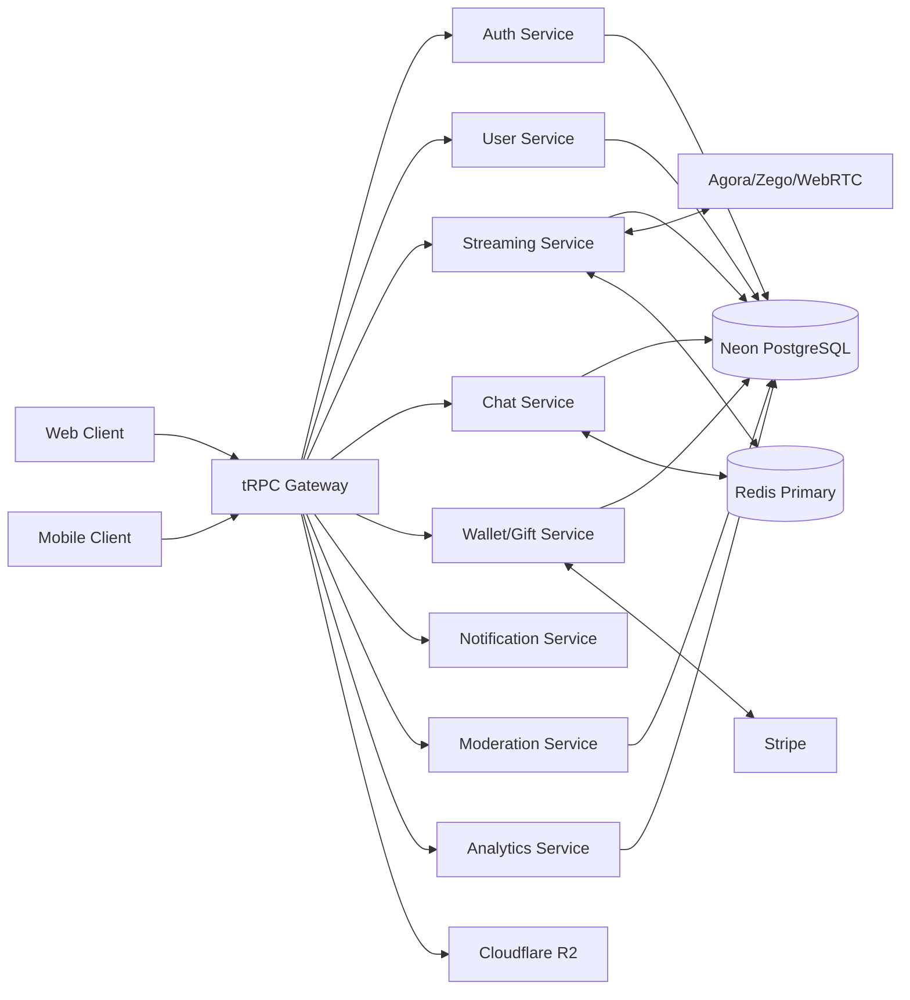
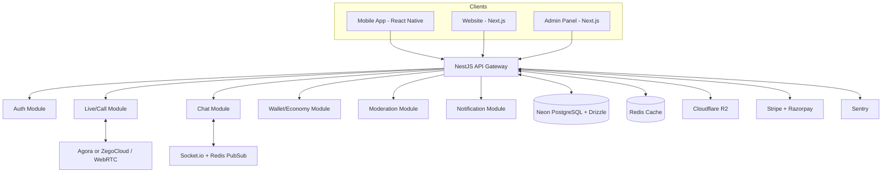
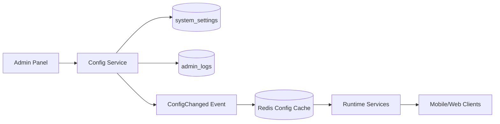
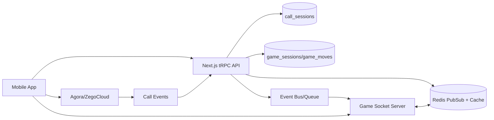
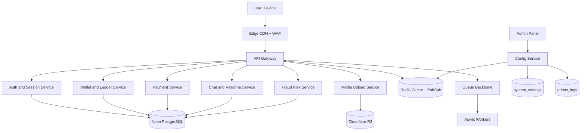
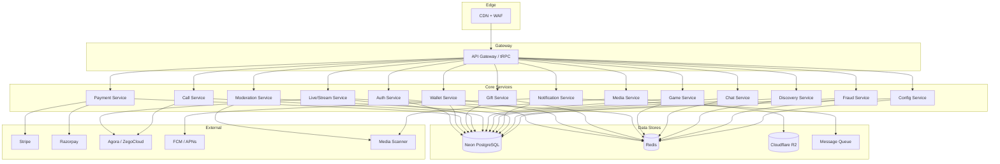
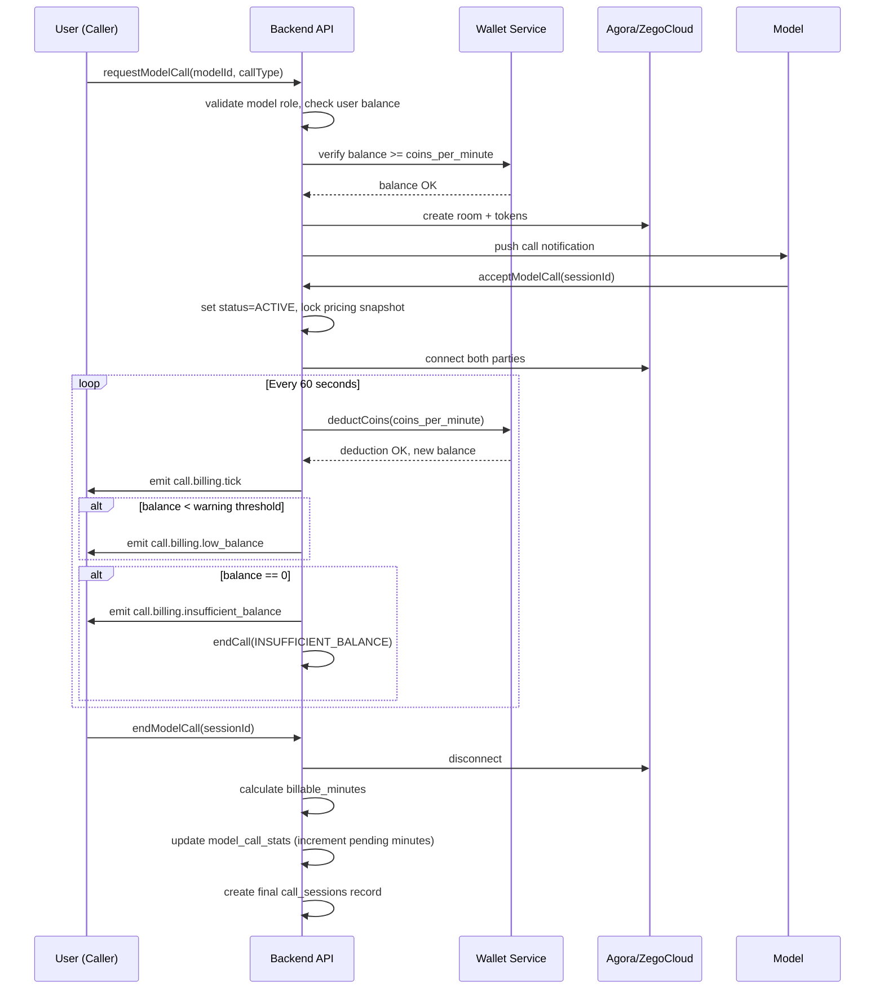
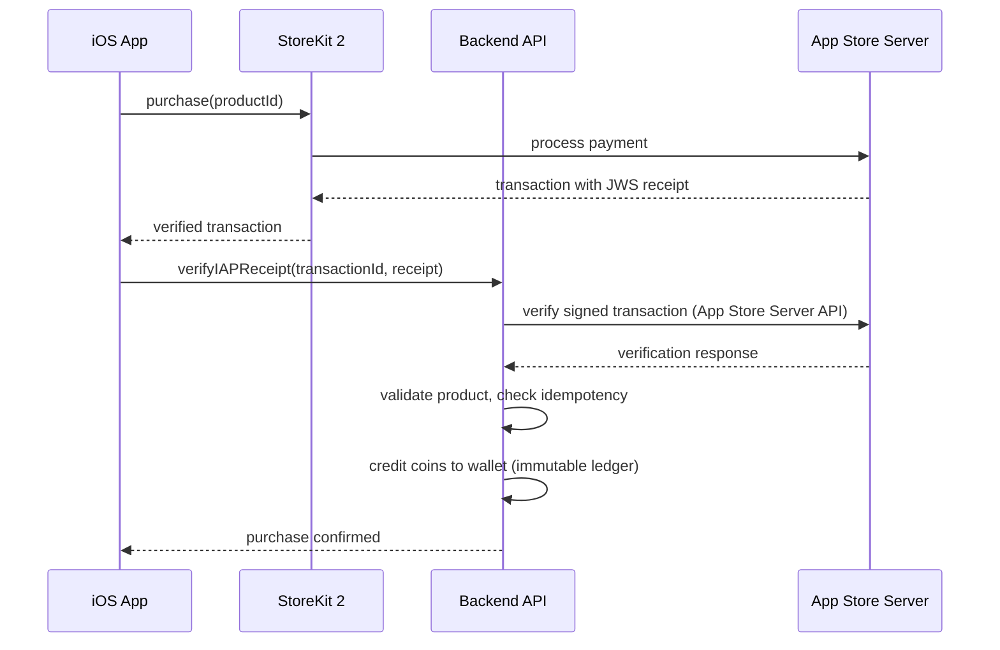
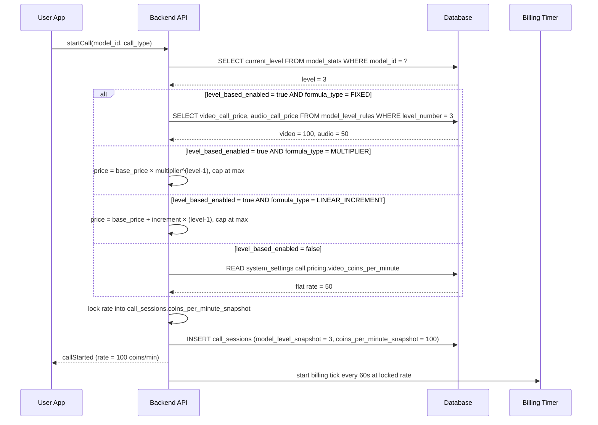

# MissUPRO — Implementation-Ready Build Plan v3

This document is the **implementation-ready build plan** for MissUPRO. Every section maps directly to code you will write. Use this in VS Code (or any IDE) to build the complete platform from project setup through production deployment.

**Platform type:** Global live interaction creator economy (StreamKar, Tango Live, TikTok Live category)
**Optimized for:** Beginner founder with limited capital, realistic path to large scale

---

## 0. How to Use This Plan (Developer Guide)

### 0.1 Who Should Read This
- **You (the developer):** Follow this document section-by-section to build MissUPRO
- **Engineering team:** Use as the single source of truth for architecture decisions
- **Reviewers:** Validates completeness of the platform design

### 0.2 How to Build From This Document
1. **Read Section 0** (this section) — set up your workspace and tools
2. **Read Sections 1–9** — understand the product, business model, and tech stack
3. **Read Section 10** — create the project structure in your workspace
4. **Follow the Phase roadmap** (Section 0.8 below) — build in order, one phase at a time
5. **Reference specific sections** as needed — each section is self-contained with schemas, APIs, and admin controls

### 0.3 Execution Rules
- Build in phases (see Section 0.8)
- Every feature must be admin-configurable via `system_settings` — no hard-coded business logic
- Mobile app is the primary product — build mobile-first
- Admin panel is web-only — never expose admin in mobile app
- Validate each phase works end-to-end before starting the next

### 0.4 Product Surface Scope
- `apps/mobile` — core user product (viewer + host/model experiences)
- `apps/web` — public website UI + admin console (moderation, finance, operations, settings)
- No admin panel access, routes, or controls in the mobile app

### 0.5 VS Code Workspace Setup

Open your terminal in VS Code and run:

```bash
# 1. Create the project root (your workspace is c:\workspace\MissUPro)
cd c:\workspace\MissUPro

# 2. Initialize the monorepo
npm init -y
npx -y turbo@latest init

# 3. Create the folder structure (Section 10)
mkdir -p apps/web apps/mobile
mkdir -p packages/api packages/db packages/ui packages/config packages/types packages/utils
mkdir -p services/streaming services/chat services/payments services/notifications services/moderation services/analytics
mkdir -p infra/docker infra/deployment infra/scripts infra/ci-cd

# 4. Initialize the web app (Next.js + TypeScript)
cd apps/web
npx -y create-next-app@latest . --typescript --tailwind --eslint --app --src-dir --no-import-alias
cd ../..

# 5. Initialize the mobile app (React Native + Expo + Expo Router)
cd apps/mobile
npx -y create-expo-app@latest . --template tabs
npx -y expo install expo-router react-native-reanimated react-native-screens react-native-safe-area-context react-native-gesture-handler expo-secure-store expo-system-ui
npm install zustand react-hook-form @hookform/resolvers zod @tanstack/react-query @clerk/clerk-expo
cd ../..

# 6. Initialize the database package (Drizzle ORM + Neon PostgreSQL)
cd packages/db
npm init -y
npm install drizzle-orm @neondatabase/serverless
npm install -D drizzle-kit
cd ../..

# 7. Initialize the API package (NestJS + tRPC + Zod)
cd packages/api
npm init -y
npm install @nestjs/common @nestjs/config @nestjs/core @nestjs/platform-express @nestjs/websockets @nestjs/jwt @trpc/server zod superjson socket.io
cd ../..

# 8. Install shared dev dependencies at root
npm install -D typescript @types/node prettier eslint turbo

# 9. Install web app runtime dependencies
cd apps/web
npm install @trpc/client @trpc/tanstack-react-query @tanstack/react-query zod react-hook-form @hookform/resolvers zustand @clerk/nextjs @sentry/nextjs stripe razorpay @aws-sdk/client-s3 @aws-sdk/s3-request-presigner
npx shadcn@latest init
cd ../..

# 10. Create Drizzle config and migration folders
cd packages/db
mkdir -p schema migrations
cd ../..
```

### 0.5.1 Neon PostgreSQL Setup

1. **Create a Neon account** at [https://neon.tech](https://neon.tech) (free tier available).
2. **Create a new project** named `missupro` — Neon auto-creates a `main` branch with a default database.
3. **Create database branches** for environment isolation:
   - `main` branch → production database
   - `staging` branch → staging environment (branched from `main`)
   - `dev` branch → local development (branched from `main`)
4. **Copy the connection string** from the Neon dashboard for each branch into the corresponding `.env` file.
5. **Connection pooling** is enabled by default on Neon (PgBouncer mode). Use the pooled connection string for the API server.
6. **Configure Drizzle** to use the Neon serverless driver:

```typescript
// packages/db/drizzle.config.ts
import { defineConfig } from 'drizzle-kit';

export default defineConfig({
  schema: './schema/*.ts',
  out: './migrations',
  dialect: 'postgresql',
  dbCredentials: {
    url: process.env.DATABASE_URL!,
  },
});
```

```typescript
// packages/db/index.ts
import { neon } from '@neondatabase/serverless';
import { drizzle } from 'drizzle-orm/neon-http';

const sql = neon(process.env.DATABASE_URL!);
export const db = drizzle({ client: sql });
```

7. **Run migrations** against Neon:
```bash
cd packages/db
npx drizzle-kit generate   # Generate SQL from schema changes
npx drizzle-kit migrate    # Apply migrations to Neon database
npx drizzle-kit studio     # Visual DB browser (connects to Neon)
```

8. **Branch workflow for safe migrations:**
   - Create a Neon branch from `main` → run migration on branch → validate → merge branch (or point production to new branch).
   - This gives zero-downtime, reversible schema changes.

### 0.6 Required Environment Variables

Create `.env` files per environment. **Never commit secrets to source code.**

```env
# .env.development (local)
DATABASE_URL=postgresql://missupro:<password>@<project-id>.neon.tech/missupro_dev?sslmode=require
REDIS_URL=redis://127.0.0.1:6379
STRIPE_SECRET_KEY=sk_test_...
STRIPE_WEBHOOK_SECRET=whsec_...
RAZORPAY_KEY_ID=rzp_test_...
RAZORPAY_KEY_SECRET=...
AGORA_APP_ID=...
AGORA_APP_CERTIFICATE=...
CLOUDFLARE_R2_ACCESS_KEY=...
CLOUDFLARE_R2_SECRET_KEY=...
CLOUDFLARE_R2_BUCKET=misspro-assets
CLOUDFLARE_R2_ENDPOINT=https://...r2.cloudflarestorage.com
SENTRY_DSN=https://...@sentry.io/...
CLERK_SECRET_KEY=sk_test_...
NEXT_PUBLIC_CLERK_PUBLISHABLE_KEY=pk_test_...
EXPO_PUBLIC_CLERK_PUBLISHABLE_KEY=pk_test_...
ADMIN_EMAIL=admin@misspro.com
APP_URL=http://localhost:3000
API_URL=http://localhost:4000
```

```env
# .env.staging / .env.production — managed via deployment secret store (Vercel env vars, Hetzner secrets, or similar)
# Same keys as above with production values
# Neon provides separate connection strings per branch (main, staging, dev) — use branch-specific DATABASE_URL
# NEVER store production secrets in files — use deployment platform env vars
```

Auth provider rule:
- use **Clerk** as the canonical auth provider for both web and mobile.
- do not split auth strategies at MVP; a single provider keeps session, redirect, and OAuth behavior predictable.

### 0.7 VS Code Extensions (Recommended)

Install these for the best development experience:
- **Prisma / Drizzle** — database schema highlighting
- **ESLint** — code quality
- **Prettier** — formatting
- **Tailwind CSS IntelliSense** — utility class completions
- **Thunder Client or REST Client** — API testing
- **React Native Tools** — mobile debugging
- **Mermaid Preview** — view architecture diagrams in this plan
- **GitLens** — version control

### 0.8 Build Phase Roadmap (Follow This Order)

Each phase lists what to build, which plan sections to reference, and which files to create. **Build strictly in this order** — each phase depends on the previous.

---

#### PHASE 1 — Core Foundation (Month 1)

> **Goal:** Authentication, user profiles, admin shell, database setup, wallet foundation

**Read first:** Sections 1–5 (business context), 9 (tech stack), 10 (monorepo), 11 (architecture)

| # | Task | Plan Sections | Code Location |
|---|---|---|---|
| 1.1 | Monorepo + project setup | 0.5, 10 | root `package.json`, `turbo.json` |
| 1.2 | Database schema (core tables) | 12, 64.1–64.5 | `packages/db/schema/`, `packages/db/migrations/` |
| 1.3 | System settings service | 44, 55.19 | `packages/api/src/config/` |
| 1.4 | Auth service (signup, login, JWT, refresh tokens) | 17.1, 50.2, 62 | `packages/api/src/auth/` |
| 1.5 | Email verification | 62 | `packages/api/src/auth/` |
| 1.6 | User service (profiles, roles, follow/unfollow) | 3.1, 64.1–64.3 | `packages/api/src/user/` |
| 1.7 | User-to-user blocking | 59 | `packages/api/src/user/` |
| 1.8 | Wallet + coin ledger (balance, immutable ledger) | 6.1–6.5, 64.4–64.5 | `packages/api/src/wallet/` |
| 1.9 | Admin auth + MFA | 55.1, 55.18 | `apps/web/src/admin/auth/` |
| 1.10 | Admin audit logging | 55.18 | `packages/api/src/admin/audit/` |
| 1.11 | Admin dashboard shell (KPI tiles) | 55.2 | `apps/web/src/admin/dashboard/` |
| 1.12 | Admin user management (list, search, suspend, ban) | 55.3 | `apps/web/src/admin/users/` |
| 1.13 | Mobile design system foundations | 18.4, 18.8 | `apps/mobile/src/theme/`, `packages/ui/` |
| 1.14 | Mobile: auth screens (signup, login, OTP) | 18.4 | `apps/mobile/src/screens/auth/` |
| 1.15 | Mobile: profile + settings screens | 18.4 | `apps/mobile/src/screens/profile/` |
| 1.16 | Push token registration | 63.1 | `packages/api/src/notifications/` |
| 1.17 | Error handling + API response standards | 52 | `packages/api/src/common/` |
| 1.18 | Health check endpoints | 66 | `packages/api/src/health/` |

**DB tables created:** `users`, `profiles`, `auth_sessions`, `wallets`, `coin_transactions`, `followers`, `system_settings`, `admin_logs`, `push_tokens`, `email_verifications`, `user_blocks`, `idempotency_keys`, `media_assets`

**Exit criteria:** Users sign up, log in, edit profile, follow others. Admin can log in with MFA, view dashboard, manage users. Wallet balance exists (zero). Mobile app has auth + profile screens.

---

#### PHASE 2 — Economy System (Month 2)

> **Goal:** Coin purchases, gift system, diamond credits, model application, daily rewards

**Read first:** Sections 6–8 (economy), 61 (IAP)

| # | Task | Plan Sections | Code Location |
|---|---|---|---|
| 2.1 | Coin packages (admin CRUD) | 64.6 | `packages/api/src/payments/` |
| 2.2 | Stripe + Razorpay integration | 6.5, 17.5 | `packages/api/src/payments/` |
| 2.3 | iOS IAP (StoreKit 2 receipt validation) | 61 | `packages/api/src/payments/iap/` |
| 2.4 | Coin purchase flow (web + mobile) | 6.1–6.2 | `apps/mobile/src/screens/wallet/` |
| 2.5 | Transaction history | 64.5 | `packages/api/src/wallet/` |
| 2.6 | Gift catalog (admin CRUD) | 6.3, 40.8–40.15, 64.7 | `packages/api/src/gifts/` |
| 2.7 | Gift animation assets | 40 | `packages/api/src/gifts/animations/` |
| 2.8 | Send gift flow (coins → diamonds) | 40.8–40.15, 64.8, 63.7, 64.8A | `packages/api/src/gifts/` |
| 2.9 | Diamond transactions ledger | 63.7 | `packages/api/src/wallet/` |
| 2.10 | Model application form | 4.2–4.3 | `packages/api/src/models/` |
| 2.11 | Admin model verification queue | 4.4, 55.4 | `apps/web/src/admin/models/` |
| 2.12 | Model role upgrade on approval | 4.5 | `packages/api/src/models/` |
| 2.13 | Daily login rewards + streak system | 6.7, 12.5 | `packages/api/src/engagement/` |
| 2.14 | Admin: coin packages management | 44.4 | `apps/web/src/admin/finance/` |
| 2.15 | Admin: gift catalog management | 40.10, 55.5.4 | `apps/web/src/admin/gifts/` |
| 2.16 | Admin: payment history + reconciliation | 55.8 | `apps/web/src/admin/finance/` |
| 2.17 | Mobile: wallet + purchase screens | 18.4 | `apps/mobile/src/screens/wallet/` |
| 2.18 | Mobile: gift panel overlay | 18.4 | `apps/mobile/src/components/gifts/` |
| 2.19 | Webhook event storage + verification | 12.11, 17.5 | `packages/api/src/payments/webhooks/` |
| 2.20 | Payment reconciliation job | 6.5 | `packages/api/src/jobs/reconciliation/` |

**DB tables created:** `coin_packages`, `gifts`, `gift_transactions`, `live_gift_events`, `gift_animations`, `diamond_transactions`, `payments`, `webhook_events`, `model_applications`, `login_streaks`

**Exit criteria:** Users buy coins (Stripe/Razorpay/IAP), send gifts in live/video/audio/chat contexts, and models receive diamonds correctly. Daily rewards work. Admin manages packages, gifts, gift economy profiles, and model applications.

---

#### PHASE 3 — Communication System (Month 3)

> **Goal:** Voice/video calls, live streaming, chat, call billing, model minute accumulation

**Read first:** Sections 14–15 (realtime + streaming), 54 (earnings), 56 (DM)

| # | Task | Plan Sections | Code Location |
|---|---|---|---|
| 3.1 | Realtime infrastructure (Socket.io + Redis Pub/Sub) | 14 | `services/chat/` |
| 3.2 | Voice/video call signaling (Agora/ZegoCloud) | 15.5 | `services/streaming/` |
| 3.3 | Call session management | 12.6 | `packages/api/src/calls/` |
| 3.4 | Per-minute call billing (tick-based deduction) | 54.2 | `packages/api/src/calls/billing/` |
| 3.5 | Low-balance warning + auto-disconnect | 54.2 | `packages/api/src/calls/billing/` |
| 3.6 | Model minute accumulation | 54.3 | `packages/api/src/calls/` |
| 3.7 | Live streaming (go live, viewer join, multi-guest) | 15.1–15.3 | `services/streaming/` |
| 3.8 | Live room chat | 14.1 | `services/chat/` |
| 3.9 | Direct messaging (DM) | 56 | `packages/api/src/dm/` |
| 3.10 | Model availability + scheduling | 58 | `packages/api/src/models/` |
| 3.11 | Model demo video upload | 63.3 | `packages/api/src/models/` |
| 3.12 | Notification system (push + in-app + email) | 32 | `services/notifications/` |
| 3.13 | Notification preferences | 12.15 | `services/notifications/` |
| 3.14 | Admin: live room moderation controls | 55.5 | `apps/web/src/admin/live/` |
| 3.15 | Admin: model minute summary + payout rates | 54.4 | `apps/web/src/admin/finance/` |
| 3.16 | Mobile: call screen (voice/video) | 18.4 | `apps/mobile/src/screens/call/` |
| 3.17 | Mobile: live stream viewer + host screens | 18.4 | `apps/mobile/src/screens/live/` |
| 3.18 | Mobile: DM inbox + conversation | 18.4 | `apps/mobile/src/screens/dm/` |
| 3.19 | Mobile: notification center | 18.4 | `apps/mobile/src/screens/notifications/` |
| 3.20 | Mobile: home feed + explore | 18.4 | `apps/mobile/src/screens/home/` |

**DB tables created:** `call_sessions`, `call_billing_ticks`, `model_call_stats`, `live_rooms`, `live_streams`, `live_viewers`, `chat_sessions`, `chat_messages`, `dm_conversations`, `dm_messages`, `notifications`, `notification_preferences`, `model_availability`, `model_demo_videos`, `chat_billing_ticks`

**Exit criteria:** Users can call models (billed per minute), watch live streams, chat in rooms, DM each other. Models accumulate call minutes. Notifications work. Mobile app has all core screens.

---

#### PHASE 4 — Creator Systems (Month 4)

> **Goal:** Model level system, dynamic call pricing, model earnings, payouts, creator analytics

**Read first:** Sections 65 (model levels + pricing), 54.4–54.9 (payouts)

| # | Task | Plan Sections | Code Location |
|---|---|---|---|
| 4.1 | Model level rules (admin CRUD) | 65.3 | `packages/api/src/levels/model/` |
| 4.2 | Model stats aggregation | 65.8 (model_stats table) | `packages/api/src/levels/model/` |
| 4.3 | Level calculation engine (batch + event-driven) | 65.6, 65.12 | `packages/api/src/levels/model/` |
| 4.4 | Dynamic call pricing (3 formulas) | 65.4, 65.5 | `packages/api/src/calls/pricing/` |
| 4.5 | Call pricing rules (admin config) | 65.8 (call_pricing_rules) | `packages/api/src/calls/pricing/` |
| 4.6 | Level badges + profile display | 65.7 | `packages/api/src/levels/model/` |
| 4.7 | Admin: model level override + price override | 65.9 | `apps/web/src/admin/models/levels/` |
| 4.8 | Admin: level distribution dashboard | 65.10 | `apps/web/src/admin/analytics/` |
| 4.9 | Admin: pricing formula configuration view | 65.10 | `apps/web/src/admin/finance/pricing/` |
| 4.10 | Withdrawal request system | 54.6 | `packages/api/src/payouts/` |
| 4.11 | Admin payout processing (approve/reject/batch) | 54.7, 55.9 | `apps/web/src/admin/finance/payouts/` |
| 4.12 | Payout records (immutable) | 12.19 | `packages/api/src/payouts/` |
| 4.13 | Creator analytics dashboard | 38 | `packages/api/src/analytics/creator/` |
| 4.14 | User level system (spend-based) | 6.10 | `packages/api/src/levels/user/` |
| 4.15 | Level rewards (bonus coins, badges) | 55.6–55.7 | `packages/api/src/levels/` |
| 4.16 | Admin: revenue analytics (per level, per gateway) | 65.13, 55.16 | `apps/web/src/admin/analytics/` |
| 4.17 | Mobile: model profile (level badge + call rate) | 18.4 | `apps/mobile/src/screens/model/` |
| 4.18 | Mobile: model dashboard (level progress, earnings) | 38 | `apps/mobile/src/screens/creator/` |
| 4.19 | Mobile: withdrawal request flow | — | `apps/mobile/src/screens/creator/` |

**DB tables created:** `model_level_rules`, `model_stats`, `model_level_history`, `call_pricing_rules`, `payout_records`, `withdraw_requests`, `levels`, `user_levels`, `level_rewards`, `host_analytics_snapshots`, `badges`, `user_badges`

**Exit criteria:** Models have levels that auto-upgrade. Call prices are dynamic. Admin can process payouts. Creator analytics work. Level badges appear on profiles.

---

#### PHASE 5 — Engagement Features (Month 5–6)

> **Goal:** Games, events, leaderboards, VIP, referrals, promotions, discovery, PK battles, banners, themes

**Read first:** Sections 46 (games), 36 (events), 35 (VIP), 34 + 60 (discovery), 57 (PK)

| # | Task | Plan Sections | Code Location |
|---|---|---|---|
| 5.1 | In-call game engine (state management) | 46 | `services/games/` |
| 5.2 | Game: Ludo | 46 | `services/games/ludo/` |
| 5.3 | Game: Chess | 46 | `services/games/chess/` |
| 5.4 | Game: Carrom | 46 | `services/games/carrom/` |
| 5.5 | Game: Sudoku | 46 | `services/games/sudoku/` |
| 5.6 | Events + competitions system | 36 | `packages/api/src/events/` |
| 5.7 | Leaderboards (configurable boards, snapshots) | 63.4–63.6 | `packages/api/src/leaderboards/` |
| 5.8 | VIP membership (tiers, subscriptions, perks) | 35 | `packages/api/src/vip/` |
| 5.9 | Referral system (invite codes, tiered rewards) | 49.2 | `packages/api/src/referrals/` |
| 5.10 | PK battles | 57 | `packages/api/src/pk/` |
| 5.11 | Promotions + campaigns | 49.6, 55.13 | `packages/api/src/campaigns/` |
| 5.12 | Banners (admin CRUD, homepage sliders) | 55.12 | `packages/api/src/cms/banners/` |
| 5.13 | Theme system (seasonal, festival themes) | 55.14 | `packages/api/src/cms/themes/` |
| 5.14 | Homepage layout control (server-driven) | 49.8, 64.33 | `packages/api/src/cms/homepage/` |
| 5.15 | Search + discovery (filters, trending, boost) | 34, 60 | `packages/api/src/discovery/` |
| 5.16 | Notification campaigns (bulk targeting) | 64.32 | `services/notifications/campaigns/` |
| 5.17 | Admin: event management | 55.10 | `apps/web/src/admin/events/` |
| 5.18 | Admin: leaderboard config | 63.4 | `apps/web/src/admin/leaderboards/` |
| 5.19 | Admin: banner + theme + homepage management | 55.12–55.14 | `apps/web/src/admin/cms/` |
| 5.20 | Admin: promotion management | 55.13 | `apps/web/src/admin/promotions/` |
| 5.21 | Admin: game session moderation | 55 | `apps/web/src/admin/games/` |
| 5.22 | Admin: notification campaign builder | 55.15 | `apps/web/src/admin/notifications/` |
| 5.23 | Mobile: game launcher in call screen | 18.4 | `apps/mobile/src/screens/call/games/` |
| 5.24 | Mobile: event cards + leaderboard screens | — | `apps/mobile/src/screens/events/` |
| 5.25 | Mobile: VIP purchase + perks display | — | `apps/mobile/src/screens/vip/` |
| 5.26 | Mobile: referral / invite friends screen | — | `apps/mobile/src/screens/referral/` |
| 5.27 | Mobile: explore + search with filters | 18.4 | `apps/mobile/src/screens/explore/` |
| 5.28 | Group audio room backend (room, participants, billing) | 67 | `packages/api/src/group-audio/` |
| 5.29 | Group audio room realtime (Agora multi-publish, Socket events) | 67.7 | `services/streaming/group-audio/` |
| 5.30 | Group audio hand-raise + speaker management | 67.6, 67.8 | `packages/api/src/group-audio/` |
| 5.31 | Group audio paid room billing (per-minute listener deductions) | 67.5 | `packages/api/src/group-audio/billing/` |
| 5.32 | Admin: group audio room management | 67.8, 67.9 | `apps/web/src/admin/group-audio/` |
| 5.33 | Mobile: group audio room screen + discovery | 67.10 | `apps/mobile/src/screens/group-audio/` |
| 5.34 | Party room backend (rooms, seats, members, themes) | 68 | `packages/api/src/party/` |
| 5.35 | Party room realtime (seat sync, voice, chat, Socket events) | 68.8 | `services/streaming/party/` |
| 5.36 | Party seat system (claim, vacate, lock, reserve, VIP priority) | 68.3, 68.7 | `packages/api/src/party/seats/` |
| 5.37 | Party activities engine (dice, raffle, gifting war, truth-or-dare) | 68.5, 68.7 | `packages/api/src/party/activities/` |
| 5.38 | Party gifting + entry fee economy | 68.6 | `packages/api/src/party/economy/` |
| 5.39 | Party theme system (admin CRUD, purchasable themes) | 68.7 | `packages/api/src/party/themes/` |
| 5.40 | Admin: party room management + theme + activity config | 68.9, 68.10 | `apps/web/src/admin/party/` |
| 5.41 | Mobile: party room screen + seat layout + activity overlays | 68.11 | `apps/mobile/src/screens/party/` |
| 5.42 | Mobile: party discovery in explore + home feed | 68.11 | `apps/mobile/src/screens/explore/` |

**DB tables created:** `game_sessions`, `game_moves`, `events`, `event_participants`, `leaderboards`, `leaderboard_entries`, `leaderboard_snapshots`, `vip_subscriptions`, `referrals`, `referral_rewards`, `pk_sessions`, `pk_scores`, `banners`, `themes`, `theme_assets`, `promotions`, `promotion_rewards`, `homepage_sections`, `ui_layout_configs`, `notification_templates`, `notification_campaigns`, `campaigns`, `campaign_participants`, `campaign_rewards`, `recommendation_configs`, `recommendation_candidates`, `recommendation_impressions`, `group_audio_rooms`, `group_audio_participants`, `group_audio_billing_ticks`, `group_audio_hand_raises`, `party_rooms`, `party_seats`, `party_members`, `party_themes`, `party_activities`, `party_activity_participants`

**Exit criteria:** Games playable in calls. Events + leaderboards operational. VIP membership active. Homepage is admin-controlled. Search with filters works. PK battles functional. Group audio rooms live with paid/free modes, hand-raise, and multi-speaker. Party rooms operational with seat system, mini-games, gifting wars, and themed rooms.

---

#### PHASE 6 — Hardening, Scale & Advanced Systems (Month 7–12)

> **Goal:** Fraud detection, content moderation, agency system, localization, performance, CI/CD, compliance, scaling

**Read first:** Sections 47–51 (security + performance), 37 (agencies), 39 (i18n), 27–29 (testing + CI + SRE), 53 (GDPR)

| # | Task | Plan Sections | Code Location |
|---|---|---|---|
| 6.1 | Fraud detection engine (rule-based scoring) | 49.5, 50.8, 33.3.1 | `services/fraud/` |
| 6.2 | Content moderation pipeline (auto + human) | 33 | `services/moderation/` |
| 6.3 | Strike system + appeal workflow | 33.4–33.5 | `services/moderation/` |
| 6.4 | CSAM detection protocol | 33.6 | `services/moderation/` |
| 6.5 | Agency system (application, roster, commissions) | 37 | `packages/api/src/agencies/` |
| 6.6 | Localization + i18n (RTL, multi-language) | 39 | `apps/mobile/src/i18n/`, `apps/web/src/i18n/` |
| 6.7 | Google Play Billing (reserved activation) | 61.10 | `packages/api/src/payments/iap/` |
| 6.8 | Account lifecycle (deletion, GDPR, cooling-off) | 53 | `packages/api/src/user/lifecycle/` |
| 6.9 | API rate limiting + security headers | 41 | `packages/api/src/middleware/` |
| 6.10 | Security hardening (secrets, dependencies, headers) | 47, 50 | across all services |
| 6.11 | Performance optimization (caching, queries, CDN) | 48 | across all services |
| 6.12 | CI/CD pipeline (lint, test, deploy, rollback) | 28 | `infra/ci-cd/` |
| 6.13 | Observability (Sentry, structured logs, alerting) | 29 | `infra/monitoring/` |
| 6.14 | Product analytics events + dashboards | 29.5 | `services/analytics/` |
| 6.15 | Quality engineering (test suite, load tests) | 27 | across all services |
| 6.16 | Disaster recovery (backups, runbooks, drills) | 29.4 | `infra/dr/` |
| 6.17 | Data governance + compliance | 30, 30.5 | `packages/api/src/compliance/` |
| 6.18 | Customer support + helpdesk integration | 23.5 | `packages/api/src/support/` |
| 6.19 | Website public pages (landing, explore, creator) | 42 | `apps/web/src/app/(public)/` |
| 6.20 | Admin: all remaining modules (agencies, fraud, search config) | 55, 63.8 | `apps/web/src/admin/` |
| 6.21 | Scaling infrastructure (Neon auto-scaling, Redis cluster) | 21 | `infra/` |
| 6.22 | Real-time presence system (online/offline status) | 66.2 | `services/presence/` |
| 6.23 | App Store compliance + distribution | 24.5 | — |
| 6.24 | Caching layer (Redis TTL strategy + cache invalidation) | 66.3 | across all services |
| 6.25 | Feature flag system (gradual rollout) | 66.4 | `packages/api/src/config/flags/` |

**DB tables created:** `fraud_flags`, `fraud_signals`, `security_events`, `security_incidents`, `media_scan_results`, `agencies`, `agency_hosts`, `analytics_events`, `account_deletion_requests`, `service_identities`

**Exit criteria:** Platform hardened for 100K+ users. Fraud detection operational. Moderation pipeline live. Full CI/CD. Monitoring active. GDPR compliant. Multi-language support. All admin modules complete.

### 0.9 Development Commands (Quick Reference)

```bash
# Start development servers
npm run dev                         # Turbo runs web and shared packages in dev mode
cd apps/web && npm run dev          # Next.js admin + website at localhost:3000
cd apps/mobile && npx expo start    # Expo Router mobile dev server
cd packages/api && npm run start:dev # NestJS API at localhost:4000

# Database operations (runs against Neon — ensure DATABASE_URL is set)
cd packages/db && npx drizzle-kit generate   # Generate migration from schema changes
cd packages/db && npx drizzle-kit migrate    # Run pending migrations against Neon
cd packages/db && npx drizzle-kit studio     # Visual DB browser (connects to Neon)

# Testing
npm run test                        # Run all tests
npm run test:e2e                    # End-to-end tests
npm run lint                        # Lint all packages

# Building for production
npm run build                       # Build all packages
cd apps/web && npm run build        # Next.js web/admin build
cd packages/api && npm run build    # NestJS API build
cd apps/mobile && eas build --platform android  # Build Android app via Expo EAS for Google Play
cd apps/mobile && eas submit --platform android # Submit Android build to Google Play
```

### 0.10 File Naming Conventions

| Type | Convention | Example |
|---|---|---|
| Schema files | `packages/db/schema/<domain>.ts` | `packages/db/schema/users.ts` |
| Migration files | `packages/db/migrations/<timestamp>_<name>.sql` | `packages/db/migrations/20260306_create_users.sql` |
| API routers | `packages/api/src/<domain>/<domain>.router.ts` | `packages/api/src/wallet/wallet.router.ts` |
| API services | `packages/api/src/<domain>/<domain>.service.ts` | `packages/api/src/wallet/wallet.service.ts` |
| Admin pages | `apps/web/src/app/admin/<module>/page.tsx` | `apps/web/src/app/admin/users/page.tsx` |
| Mobile screens | `apps/mobile/src/screens/<Screen>Screen.tsx` | `apps/mobile/src/screens/HomeScreen.tsx` |
| Shared types | `packages/types/src/<domain>.ts` | `packages/types/src/wallet.ts` |
| Utils | `packages/utils/src/<utility>.ts` | `packages/utils/src/money.ts` |

### 0.11 Key Architecture Rules (Read Before Coding)

1. **Admin-first:** Every business rule is stored in `system_settings` and editable from admin panel — zero hard-coded business logic
2. **Immutable ledger:** All wallet/payment/gift changes are append-only ledger entries — never overwrite balances directly
3. **Idempotency:** All financial operations require idempotency keys — duplicate requests return cached results
4. **Mobile-first:** Mobile app is the primary product — build and test mobile flows before web
5. **Admin is web-only:** `apps/web` contains admin panel — never import admin modules into `apps/mobile`
6. **Server-driven config:** Mobile app fetches all configurable settings from backend — never hard-code pricing, themes, or feature flags in the app bundle
7. **Audit everything:** Every admin action creates an immutable `admin_logs` entry with before/after state

---

## 1. Executive Summary

### 1.1 Vision
Create a mobile-first creator social platform where everyday users can become verified talent hosts, stream live, earn money through gifts, and build repeat audiences.

### 1.2 Core Problem
Most live apps fail new creators and small founders because:
- creator onboarding is weak
- earning rules feel opaque
- trust and safety systems are reactive
- infrastructure costs rise too early

### 1.3 Platform Promise
`Verified Talent + Transparent Earnings + Safe Community + Low-Cost Start`

### 1.4 Strategic Outcomes (12-24 Months)
- prove retention via social + gift loop
- establish host supply via model verification pipeline
- achieve healthy unit economics with positive contribution margin
- build scalable architecture baseline for regional expansion
- deliver a standout mobile UI that is attractive, fast, responsive, and smart on low and high-end devices

---

## 2. Business Strategy Core

### 2.1 Business Model
Primary revenue:
- coin package purchases

Secondary revenue:
- VIP membership
- event entry passes
- seasonal campaign sponsorships
- agency tools (later)

### 2.2 Positioning
- For viewers: "interactive live entertainment with trusted creators"
- For creators: "clear earnings, fast onboarding, reliable payouts"
- For agencies: "structured host pipeline with performance analytics"

### 2.3 Strategic Moats
- host supply moat: verified model pipeline + onboarding academy
- product moat: event and ranking loops
- operations moat: fast moderation and payout reliability
- data moat: engagement graph + creator performance intelligence

### 2.4 Founder-Level Priorities
1. stabilize stream and chat reliability
2. lock down wallet and payout correctness
3. accelerate verified model approvals
4. improve host activation and retention

---

## 3. Product Experience Overview

### 3.1 User Roles
- `USER`: viewer and participant
- `HOST`: approved creator allowed to go live
- `MODEL`: verified service provider type of host
- `ADMIN`: single platform administrator with full control over all operations, moderation, finance, settings, and configuration

### 3.2 User Flows

#### Viewer Flow
signup -> profile -> explore -> join live -> chat -> buy coins -> send gifts -> follow creators -> connect with service provider model via voice/video call -> play in-call games -> join group audio rooms -> join party rooms -> play party activities -> receive notifications

#### Host Flow
signup -> model apply -> admin approval -> go live -> receive gifts -> earn diamonds -> request withdrawal -> host group audio rooms -> host party rooms

#### Admin Flow
review applications -> approve/reject hosts -> moderate streams -> approve withdrawals -> manage gift/coin catalog

Note:
- Admin flow is executed only in the web admin console.
- Mobile app does not expose admin screens.

### 3.3 High-Value Product Loops
- Content loop: host streams -> viewer engagement -> higher ranking -> more viewers
- Monetization loop: coin purchase -> gifting -> host activity increases -> more watch time
- Social loop: follow + notifications -> repeated attendance -> stronger fan relationships
- Group social loop: join group audio / party room -> social bonding -> gifting + activities -> daily habit -> coin spend
- Party engagement loop: join party -> claim seat -> play activities (dice/raffle) -> win coins -> spend coins on gifts -> repeat

### 3.4 Platform Surface Split (Strict Rule)
- `apps/mobile`: viewer, host, and model user journeys only
- `apps/web`: website UI (public pages) + admin panel (moderation, finance, operations, settings)
- Admin authentication is blocked in mobile clients by backend policy
- Any admin deep links opened from mobile redirect to web admin domain

### 3.5 In-Call Games Experience (New)
- Supported game set (phase 1): Ludo, Carrom, Sudoku, Chess
- Games are playable only in 1:1 voice call or video call sessions
- User can play these games only with verified service provider models
- User-to-user game sessions without a verified model are blocked

### 3.6 Service Provider Demo Video Discovery
- Mobile home feed includes a `Service Provider Spotlight` strip with short demo videos from verified models.
- Spotlight cards show model identity, verified badge, talent tags, and current call availability.
- Tapping a card opens the model profile with voice/video call CTA and follow/gift entry points.
- Ranking for demo videos uses quality and trust filters (policy-safe content, profile completeness, response rate).

---

## 4. Model and Service Provider Program (Critical Upgrade)

### 4.1 Program Goal
Enable users to request becoming verified model/service provider and earn money by offering live talent services.

### 4.2 Application Form Requirements

Mandatory fields:
- legal full name
- display name
- date of birth and age confirmation
- country and city
- talent categories (at least one)
- talent description
- language(s)
- availability schedule
- government ID proof
- payout method details
- terms and policy acceptance

Optional fields:
- intro video
- social links
- portfolio highlights

Talent categories (baseline):
- singing
- dancing
- comedy
- talk show
- gaming
- board and puzzle games (ludo, carrom, sudoku, chess)
- fitness
- education
- lifestyle
- other

### 4.3 Application Lifecycle
`DRAFT -> SUBMITTED -> PENDING_REVIEW -> NEEDS_RESUBMISSION -> APPROVED | REJECTED`

### 4.4 Admin Verification Checklist
- identity match
- age eligibility
- content-policy risk check
- talent quality baseline
- payout data validity
- prior abuse/fraud signal scan

### 4.5 Approval Side Effects
- role switch to `HOST` or `MODEL`
- go-live permissions granted
- verified badge issued
- onboarding tasks assigned
- automated welcome notification

### 4.6 Rejection and Resubmission
- rejection reason required
- guidance shown to applicant
- cooldown window before resubmission
- resubmission tracked for decision analytics

### 4.7 Host Onboarding Program
Week 1:
- streaming quality setup guide
- policy training checklist
- first 3 streams challenge

Week 2:
- monetization tips (gift triggers, audience prompts)
- retention tactics (schedule consistency)

Week 3:
- event participation and PK preparation
- fan community building playbook

### 4.8 Service Provider Game Session Policy
- Only users with approved `MODEL` role can host in-call game sessions
- Game sessions require active voice or video call state
- If call disconnects, game moves are paused and session enters grace timeout
- Unsupported game types are rejected at API validation layer
- Fraud and collusion checks apply to repeated suspicious game sessions

---

## 5. Industry Analysis and Competitive Positioning

### 5.1 Market Dynamics
Live streaming market growth is driven by:
- creator monetization demand
- mobile-first behavior
- social status and gift signaling
- event-based engagement cycles

### 5.2 Competitor Snapshot

| Platform | Strength | Weakness Opportunity |
|---|---|---|
| StreamKar | strong host events and gifts | variable creator quality controls |
| Bigo Live | broad host network | onboarding quality inconsistency |
| TikTok Live | massive discovery funnel | high algorithmic competition for small creators |
| Twitch | deep communities | less optimized for service-provider style hosts |

### 5.3 Win Strategy for This Platform
- target underserved regional micro-creators
- offer faster model verification turnaround
- publish transparent payout dashboard
- build trust via visible moderation and safety standards

---

## 6. Monetization and Creator Economy

### 6.1 Economy Units
- `Coins`: purchased by users
- `Gifts`: consumed with coins
- `Diamonds`: creator earnings

### 6.2 Example Conversion System
- Example profile B (legacy/alternative):
- $1 = 100 coins
- 100 coins = 50 diamonds
- 1000 diamonds = $5 payout value
- Note: profile B is optional and can be switched via admin economy profiles. Profile A in Section 6.8/43.3 remains the primary launch recommendation.

### 6.3 Gift Catalog Example

| Gift | Coin Cost | Diamond Credit |
|---|---:|---:|
| Rose | 10 | 5 |
| Heart | 50 | 25 |
| Luxury Car | 500 | 250 |
| Castle | 5000 | 2500 |

### 6.4 Revenue Split Mechanics
Per spend event:
- gross user spend
- minus payment processing fees
- minus creator diamond payout equivalent
- remaining is platform contribution margin

### 6.5 Financial Correctness Rules
- immutable ledger entries for every wallet change
- idempotency keys for payment and gift operations
- no direct balance overwrite without ledger event
- daily reconciliation job

### 6.6 Payout Policy
- minimum withdrawal threshold
- anti-fraud holding window for high-risk accounts
- manual review for suspicious patterns
- clear payout SLA in app

### 6.7 Engagement Rewards: Daily Login & Streaks
- daily login reward:
  - default: 10 coins granted once per calendar day when the user opens the app and passes basic eligibility checks.
  - eligibility: non-banned, non-suspended accounts with a valid session.
  - limit: one daily reward per user per day, calculated in the user’s preferred time zone.
- 7-day streak reward:
  - default: 50 coins granted when the user completes 7 consecutive daily logins.
  - streak resets if the user misses a day; optional grace rules can be introduced later via configuration.
- configuration:
  - default values (10 coins daily, 50 coins for 7-day streak) are configurable from the admin panel, not hard-coded.
  - all reward coin grants are processed through the wallet/ledger system with immutable transactions.
- loop impact:
  - supports early habit-building for new users by giving small, predictable rewards.
  - increases coin availability for gifting without undermining paid packages by capping daily free rewards.
  - can be tuned regionally or by lifecycle stage as the platform grows.

### 6.8 Handwritten Founder Economy Profile (Configurable Launch Mode)
- Keep a configurable economy profile that matches the handwritten plan for launch tests:
  - `$1 = 100 coins`
  - `Gift conversion profile A`: `100 gifted coins -> 100 diamonds` (1:1 coin-to-diamond credit for gifts)
  - `Withdrawal conversion profile A`: `100 diamonds = $0.25`
- This profile enforces the rule that diamond cash value is lower than user coin spend value.
- Economy profiles are selectable by region/experiment in admin settings so the platform can compare retention and margin outcomes.

### 6.9 Per-Minute Call Billing and Model Minute Accumulation
- Users pay coins per minute during active voice/video calls with models.
- Default rates (admin-configurable): audio call = `30 coins/min`, video call = `50 coins/min`.
- Coins are deducted automatically from the user wallet each billing tick (default: every 60 seconds).
- If the user's coin balance falls below the per-minute rate, the call ends automatically.
- **Models do NOT earn diamonds from calls.** Instead, call minutes are accumulated in `model_call_stats`.
- After each call ends, the system converts `duration_seconds` into billable minutes and increments the model's audio or video minute counters.
- Admin panel defines payout rates per minute (e.g. audio = `$0.10/min`, video = `$0.20/min`) and converts accumulated minutes into payable amounts.
- Models request withdrawal manually; admin reviews, approves, and marks minutes as paid.
- Billing starts only when call state is `ACTIVE`; billing stops on `ENDED` or after grace timeout on disconnect.
- Abuse controls: long-idle call detection, repeated reconnect pattern flags, max billable minutes per session policy, and server-side duration verification.

### 6.10 Level Progression Rules (User and Model)
- `User levels` increase from cumulative coin spending activity.
- `Model levels` increase from cumulative call minutes (audio + video combined) and gift diamond earnings.
- User and model progression tracks are separate and can have different thresholds/rewards.
- Level thresholds, rewards, and reset windows are configurable in admin panel (no hard-coded constants).
- Profile UI shows current level, progress bar, and next-level requirement for both tracks where applicable.

---

## 7. Revenue Model with Scenarios

### 7.1 Formula Sheet
- `Gross Revenue = Paying Users x Avg Monthly Spend` (coins purchased)
- `Net Revenue = Gross Revenue x (1 - Payment Fee Rate)`
- `Gift Host Cost = Gross Gift Revenue x Host Diamond Share Rate` (diamond-based)
- `Call Model Payout = (Audio Minutes x Audio Rate) + (Video Minutes x Video Rate)` (minute-based; see Section 54.5)
- `Total Host Payout = Gift Host Cost + Call Model Payout`
- `Contribution Margin = Net Revenue - Total Host Payout`

### 7.2 Example Scenarios

Assumptions:
- payment fee rate: 5%
- host share: 35% of gross

| Scale | Paying Users | Avg Spend | Gross/Month | Net/Month | Host Cost | Contribution Margin |
|---|---:|---:|---:|---:|---:|---:|
| 10k users | 700 | $18 | $12,600 | $11,970 | $4,410 | $7,560 |
| 100k users | 9,000 | $20 | $180,000 | $171,000 | $63,000 | $108,000 |
| 1M users | 100,000 | $22 | $2,200,000 | $2,090,000 | $770,000 | $1,320,000 |

### 7.3 KPI Targets
- payer conversion rate
- ARPPU
- LTV/CAC ratio
- host monthly retention
- payout accuracy rate

---

## 8. Cost Strategy and Budget Controls

### 8.1 Cost Buckets
- streaming infra
- backend compute
- database
- cache
- storage + bandwidth
- moderation operations
- analytics/monitoring

### 8.2 Cost Ranges by Scale

| Scale | Monthly Cost Range |
|---|---:|
| 1,000 users | $135 - $490 |
| 10,000 users | $710 - $2,850 |
| 100,000 users | $7,750 - $28,300 |
| 1,000,000 users | $73,500 - $341,000 |

### 8.3 Cost Guardrails
- strict media upload caps
- Redis TTL for ephemeral keys
- scheduled cleanup jobs
- usage alerts across all providers
- weekly cost dashboard review

### 8.4 Student-Friendly Cost Tactics
- use free tier credits and hobby plans initially
- run manual payout ops until volume justifies automation
- launch in one region first

---

## 9. Technology Stack and Why It Fits

### 9.1 Web (Website UI + Admin Console)
- Next.js(16) App Router, TypeScript, Tailwind CSS, shadcn/ui, tRPC client, TanStack Query, React Hook Form, Zod, Zustand

Why:
- supports high-performance responsive website UI
- ideal for dense admin workflows (tables, filters, queues, audit tools)
- strong productivity for moderation, finance, and operations teams
- keeps sensitive admin operations isolated from consumer mobile app
- aligns UI, forms, validation, and state around a single modern React stack

### 9.2 Mobile (Primary Product)
- React Native + Expo SDK (latest) + Expo Router + TypeScript + Zustand + React Hook Form + Zod + TanStack Query + Clerk Expo SDK

Why:
- single codebase for iOS/Android
- easy OTA updates via EAS
- Expo Router is the current recommended navigation model for new Expo apps
- supports a Play Store-ready Android release pipeline through EAS Build and Submit
- best channel for engagement loops (watch, gift, follow, notifications)

### 9.3 Backend
- NestJS + tRPC gateway layer + Zod

Why:
- NestJS gives cleaner module boundaries for auth, wallet, gifts, calls, moderation, and admin controls
- tRPC preserves end-to-end typing speed across web and mobile clients
- it runs cleanly on a single Dockerized server and scales more predictably for realtime-heavy workloads than a serverless-first backend
- Zod enforces strict runtime validation on every input boundary.

Auth:
- Clerk is the canonical auth layer for both Next.js and Expo clients.
- keep auth centralized; do not maintain multiple auth providers at MVP.

Forms and validation:
- React Hook Form + Zod for all admin, onboarding, payment, and profile forms.

Client state:
- Zustand for local UI and session state.
- TanStack Query for server state, caching, and request lifecycle.

### 9.4 Data and Infra
- Neon PostgreSQL (serverless, managed), Drizzle ORM, Redis (self-hosted on Hetzner or Upstash), Socket.io over WebSocket, Agora preferred over ZegoCloud, Stripe and Razorpay, Cloudflare R2, Sentry

Why:
- Neon gives fully managed serverless PostgreSQL with auto-scaling, branching (dev/staging/prod from a single project), connection pooling, and zero-downtime schema migrations — ideal for a solo founder who should not manage database servers.
- Neon's free tier supports early development; paid tiers scale predictably with usage.
- best balance of cost, simplicity, and latency for a solo founder running a realtime product
- Socket.io accelerates resilient realtime fanout with ack/retry semantics.
- Agora is the recommended RTC default because it is more mature for Expo/React Native integrations and call stability.
- Dual payment rails (Stripe + Razorpay) support broader regional monetization coverage.
- Sentry gives fast error triage and release health visibility across web, mobile, and backend.

### 9.5 Deployment
- Hetzner dedicated server for web, API, Redis, and Socket.io workers; Neon PostgreSQL (managed, external); Cloudflare proxy/CDN; Cloudflare R2 (storage); Expo EAS (mobile); Google Play Console (Android distribution)

Deployment note:
- use Docker Compose or equivalent process supervision on the Hetzner server for `apps/web`, `packages/api`, Redis, workers, and reverse proxy.
- PostgreSQL is hosted on Neon (external managed service) — no local PostgreSQL container needed on Hetzner.
- Neon connection pooling (built-in PgBouncer) handles connection limits from the API server.
- this is the strongest MVP architecture for cost control, Socket.io reliability, and operational simplicity.

---

## 10. Monorepo and Code Organization

```text
apps/
  web/
  mobile/

packages/
  api/
  db/
  ui/
  config/
  types/
  utils/

services/
  streaming/
  chat/
  payments/
  notifications/
  moderation/
  analytics/

infra/
  docker/
  deployment/
  scripts/
  ci-cd/
```

### 10.1 Sharing Model
- `packages/types`: API and event contracts
- `packages/db`: schema source of truth
- `packages/api`: shared tRPC routers, procedures, server-side domain modules, and auth helpers consumed by `apps/web`
- `packages/ui`: shared design primitives for consistency
- `packages/utils`: domain helpers (money math, ids, dates)

Scope note:
- `apps/web` contains public website UI and admin panel modules.
- `packages/api` is the canonical backend service package and runs as the NestJS + tRPC API server.
- End-user product UI is implemented in `apps/mobile`.

### 10.2 Governance Rules
- no business logic in UI components
- all financial changes through service layer
- schema changes require migration + rollback plan

---

## 11. System Architecture

### 11.1 Layered Architecture
- Client: web + mobile
- API gateway: NestJS + tRPC
- Services: auth, user, streaming, chat, wallet/gifts, notifications, moderation, analytics
- Data: Neon PostgreSQL (serverless managed)
- Cache/realtime bus: Redis
- Media: RTC provider abstraction (Agora/ZegoCloud/WebRTC)
- Assets: Cloudflare R2

Scope clarification:
- Mobile client is the end-user product surface.
- Web client includes public website UI and admin-console surfaces.

### 11.2 High-Level Diagram



### 11.3 Critical Request Flows
- Start live
- Join live
- Send chat
- Send gift
- Buy coin package
- Request withdrawal
- Apply for model verification
- Start voice/video call with service provider model
- Start in-call game (Ludo/Carrom/Sudoku/Chess)
- Create group audio room
- Join group audio room (with paid billing)
- Raise hand in group audio room
- Create party room
- Join party room (with entry fee)
- Claim seat in party room
- Start party activity (dice/raffle/gifting war)

### 11.4 Engagement Reward Flow
- daily login:
  - client opens app and authenticates user.
  - engagement reward logic (within wallet/gift or a dedicated engagement service) checks last login, last reward grant, and current streak state.
  - if eligible, service issues a wallet credit transaction for the configured daily coin amount via the wallet service.
- 7-day streak:
  - same service tracks consecutive login days.
  - on reaching configured streak length, it issues a separate wallet credit for the streak reward and updates/reset streak state according to the configured rules.
- idempotency and safeguards:
  - reward procedures are idempotent per user per day and per streak period.
  - abnormal patterns (multiple accounts on same device, scripted logins) can be flagged for fraud review.

### 11.5 In-Call Game Session Flow
- User opens model profile and starts voice or video call request
- Backend validates target user has approved `MODEL` role
- Call session becomes `ACTIVE`
- User selects game from allowed game catalog (Ludo, Carrom, Sudoku, Chess)
- Backend validates call is active and creates game session linked to call session id
- Game moves are exchanged through realtime channel and persisted for recovery
- If call ends, game session ends or pauses based on configured grace period

---

## 12. Database Design (Relational Core)

### 12.1 Main Tables
- users
- models
- coins (alias for `coin_transactions` — see Section 64.5; no separate `coins` table exists)
- diamonds (alias for `diamond_transactions` — see Section 63.7; no separate `diamonds` table exists)
- profiles
- sessions (alias for `auth_sessions` — see Section 12.9; no separate `sessions` table exists)
- followers
- live_rooms
- live_streams
- live_viewers
- chat_sessions
- chat_messages
- messages
- gifts
- gift_transactions
- live_gift_events
- wallets
- coin_wallets (logical alias of `wallets` + `coin_transactions`; no separate physical table exists)
- diamond_wallets (logical alias of `wallets` + `diamond_transactions`; no separate physical table exists)
- coin_packages
- coin_transactions
- payments
- notifications
- leaderboards
- leaderboard_entries
- withdraw_requests
- admins
- admin_logs
- system_settings
- model_applications
- events
- event_participants
- badges
- user_badges
- levels
- user_levels
- calls
- call_sessions
- call_game_sessions
- game_moves
- recommendation_configs
- recommendation_candidates
- recommendation_impressions
- referrals
- referral_rewards
- fraud_flags
- fraud_signals
- campaigns
- campaign_participants
- campaign_rewards
- notification_templates
- notification_campaigns
- ui_layout_configs
- auth_sessions
- idempotency_keys
- webhook_events
- media_assets
- media_scan_results
- security_events
- security_incidents
- service_identities
- login_streaks
- notification_preferences
- vip_subscriptions
- agencies
- agency_hosts
- gift_animations
- host_analytics_snapshots
- analytics_events
- games
- game_players
- game_results
- account_deletion_requests
- model_call_stats
- payout_records
- call_billing_ticks
- banners
- themes
- theme_assets
- promotions
- promotion_rewards
- level_rewards
- homepage_sections
- push_tokens
- chat_billing_ticks
- model_demo_videos
- user_blocks
- model_availability
- pk_sessions
- pk_scores
- diamond_transactions
- email_verifications
- leaderboard_entries
- leaderboard_snapshots
- dm_conversations
- dm_messages
- model_reviews
- feature_flags
- group_audio_rooms
- group_audio_participants
- group_audio_billing_ticks
- group_audio_hand_raises
- party_rooms
- party_seats
- party_members
- party_themes
- party_activities
- party_activity_participants

### 12.5 Table: login_streaks

Purpose:
- maintain per-user state for daily login rewards and streak completion.

Columns (plan):
- id
- user_id
- current_streak_days
- last_login_date
- last_daily_reward_at
- last_streak_reward_at
- region_code
- created_at
- updated_at

### 12.2 Table: model_applications

Purpose:
- collect and process user request to become model/service provider

Columns (plan):
- id
- user_id
- legal_name
- display_name
- dob
- country
- city
- talent_categories_json
- talent_description
- languages_json
- schedule_json
- intro_video_url
- id_doc_front_url
- id_doc_back_url
- status
- reviewed_by_admin_id
- rejection_reason
- submitted_at
- reviewed_at

### 12.3 Relationship Map (Key)
- users 1:1 profiles
- users 1:N sessions
- users N:N followers edges
- users 1:1 wallets
- users 1:N model_applications
- users 1:N live_streams (as host)
- live_streams 1:N messages
- live_streams 1:N gift_transactions
- live_streams 1:N live_gift_events
- admins 1:N reviews (withdraw + model apps)
- gift_transactions 1:0..1 live_gift_events
- users 1:N call_sessions (as caller)
- users 1:N call_sessions (as model/callee)
- call_sessions 1:1 call_game_sessions
- call_game_sessions 1:N game_moves
- users 1:N notification_preferences
- users 1:N vip_subscriptions
- agencies 1:N agency_hosts
- agency_hosts N:1 users (host)
- users 1:N analytics_events
- users 1:1 account_deletion_requests
- gifts 1:1 gift_animations
- users 1:N host_analytics_snapshots (as host)
- users 1:1 model_call_stats (as model)
- users 1:N payout_records (as model)
- users 1:N group_audio_rooms (as host)
- group_audio_rooms 1:N group_audio_participants
- group_audio_rooms 1:N group_audio_billing_ticks
- group_audio_rooms 1:N group_audio_hand_raises
- users 1:N party_rooms (as host)
- party_rooms 1:N party_seats
- party_rooms 1:N party_members
- party_rooms 1:N party_activities
- party_rooms 0..1 party_themes
- party_activities 1:N party_activity_participants
- call_sessions 1:N call_billing_ticks
- withdraw_requests 1:1 payout_records
- levels 1:N level_rewards
- promotions 1:N promotion_rewards
- admins 1:N banners (created_by)
- admins 1:N themes (created_by)
- themes 1:N theme_assets
- admins 1:N promotions (created_by)
- admins 1:N homepage_sections (created_by)

### 12.4 Indexing and Constraints
- unique email and username
- composite unique on follower pairs
- index by status and timestamps for queues
- finance indexes on transaction references and created_at
- strict FK constraints to protect consistency
- unique active 1:1 call per user pair guard
- index call_game_sessions by game_type, status, created_at
- index game_moves by game_session_id and move_sequence

### 12.6 Table: call_sessions

Purpose:
- track 1:1 voice/video calls between user and service provider model with billing data.

Columns (plan):
- id
- caller_user_id
- model_user_id
- call_type (`VOICE`, `VIDEO`)
- status (`REQUESTED`, `ACTIVE`, `ENDED`, `FAILED`)
- coins_per_minute_snapshot (rate locked at call start)
- total_duration_seconds
- billable_minutes
- total_coins_spent
- started_at
- ended_at
- end_reason (`NORMAL`, `INSUFFICIENT_BALANCE`, `USER_HANGUP`, `MODEL_HANGUP`, `TIMEOUT`, `ERROR`)
- minutes_credited_to_model (boolean, marks if model_call_stats updated)
- created_at

### 12.7 Table: call_game_sessions (alias: game_sessions)

Purpose:
- track playable game sessions linked to active call sessions.

Naming note:
- This table is referred to as `call_game_sessions` in Section 12 (simplified schema) and as `game_sessions` in Section 46.8 (full games architecture with extended fields: `state_json`, `end_reason`).
- **Canonical implementation name: `game_sessions`** (Section 46.8 is the authoritative schema). All references to `call_game_sessions` should map to `game_sessions` during implementation.

Columns (plan — see Section 46.8 for canonical extended schema):
- id
- call_session_id
- user_id
- model_user_id
- game_type (`LUDO`, `CARROM`, `SUDOKU`, `CHESS`)
- status (`CREATED`, `ACTIVE`, `PAUSED`, `ENDED`)
- state_json (authoritative game state — from Section 46.8)
- winner_user_id
- started_at
- ended_at
- end_reason (from Section 46.8)
- created_at

### 12.8 Table: game_moves

Purpose:
- persist ordered game moves for sync, replay, and dispute handling.

Columns (plan):
- id
- game_session_id
- actor_user_id
- move_sequence
- move_payload_json
- created_at

### 12.9 Table: auth_sessions

Purpose:
- track device-bound sessions, refresh rotation state, and risk posture.

Columns (plan):
- id
- user_id
- device_fingerprint_hash
- refresh_token_hash
- session_status (`ACTIVE`, `REVOKED`, `EXPIRED`, `STEP_UP_REQUIRED`)
- ip_hash
- user_agent_hash
- risk_score
- last_seen_at
- expires_at
- created_at

### 12.10 Table: idempotency_keys

Purpose:
- enforce exactly-once behavior for payment, wallet, and gift operations.

Columns (plan):
- id
- idempotency_key
- operation_scope
- actor_user_id
- request_hash
- response_snapshot_json
- status (`IN_PROGRESS`, `COMPLETED`, `FAILED`)
- expires_at
- created_at

### 12.11 Table: webhook_events

Purpose:
- persist payment provider webhook events for replay protection and reconciliation.

Columns (plan):
- id
- provider (`STRIPE`, `RAZORPAY`)
- provider_event_id
- signature_valid
- payload_hash
- received_at
- processed_at
- processing_status
- failure_reason

### 12.12 Table: media_assets

Purpose:
- registry for uploaded media and signed-access policy metadata.

Columns (plan):
- id
- owner_user_id
- asset_type
- storage_key
- mime_type
- size_bytes
- visibility (`PRIVATE`, `PUBLIC`, `QUARANTINED`)
- checksum_sha256
- created_at

### 12.13 Table: media_scan_results

Purpose:
- store malware/content scan outcomes for uploaded media before publish.

Columns (plan):
- id
- media_asset_id
- scanner_name
- scan_status (`PENDING`, `PASSED`, `FAILED`)
- risk_labels_json
- scanned_at
- created_at

### 12.14 Table: security_incidents

Purpose:
- track security incident lifecycle, severity, owner, and postmortem status.

Columns (plan):
- id
- incident_type
- severity (`SEV1`, `SEV2`, `SEV3`, `SEV4`)
- status (`OPEN`, `MITIGATING`, `RESOLVED`, `POSTMORTEM_PENDING`, `CLOSED`)
- source_event_id
- owner_admin_id
- started_at
- resolved_at
- postmortem_url
- created_at

### 12.15 Table: notification_preferences

Purpose:
- store per-user notification channel and category preferences.

Columns (plan):
- id
- user_id
- channel (`PUSH`, `IN_APP`, `EMAIL`)
- category (`GIFTS`, `FOLLOWS`, `EVENTS`, `SECURITY`, `MARKETING`)
- is_enabled
- quiet_hours_start
- quiet_hours_end
- quiet_hours_timezone
- updated_at

### 12.16 Table: analytics_events

Purpose:
- append-only event store for product analytics and funnel tracking.

Columns (plan):
- id
- event_name
- user_id
- anonymous_id
- session_id
- platform
- app_version
- region
- payload_json
- created_at

### 12.17 Table: account_deletion_requests

Purpose:
- track user-initiated account deletion requests with cooling-off lifecycle.

Columns (plan):
- id
- user_id
- status (`REQUESTED`, `COOLING_OFF`, `CANCELLED`, `COMPLETED`, `LEGAL_HOLD`)
- requested_at
- cooling_off_expires_at
- completed_at
- cancelled_at
- processed_by_admin_id
- reason

### 12.18 Table: model_call_stats

Purpose:
- accumulate total and pending call minutes per model for payout calculation.

Columns (plan):
- id
- model_user_id
- audio_minutes_total
- video_minutes_total
- audio_minutes_pending (not yet paid out)
- video_minutes_pending (not yet paid out)
- audio_minutes_paid
- video_minutes_paid
- group_audio_minutes_total
- group_audio_minutes_pending
- group_audio_minutes_paid
- last_call_at
- updated_at

### 12.19 Table: payout_records

Purpose:
- immutable record of each payout processed by admin, linking minutes paid and amount.

Columns (plan):
- id
- model_user_id
- withdraw_request_id
- audio_minutes_paid
- video_minutes_paid
- audio_rate_snapshot ($/min at time of payout)
- video_rate_snapshot ($/min at time of payout)
- audio_earnings
- video_earnings
- diamond_earnings (gift-based)
- total_payout_amount
- currency
- payout_method
- status (`PENDING`, `PROCESSING`, `COMPLETED`, `FAILED`)
- approved_by_admin_id
- processed_at
- created_at

### 12.20 Table: call_billing_ticks

Purpose:
- record each per-minute coin deduction during an active call for auditability.

Columns (plan):
- id
- call_session_id
- tick_number
- coins_deducted
- user_balance_after
- tick_timestamp
- created_at

### 12.20A Table: live_gift_events

Purpose:
- persist live-room gift fanout state, display payload, and broadcast lifecycle for gifts sent during live streams.

Columns (plan):
- id
- gift_transaction_id
- live_stream_id
- live_room_id
- sender_user_id
- receiver_user_id
- display_message
- animation_key
- sound_effect_key
- combo_group_id
- combo_count_snapshot
- broadcast_event_id
- delivery_status (`QUEUED`, `PUBLISHED`, `ACK_PARTIAL`, `ACK_COMPLETE`, `EXPIRED`, `FAILED`)
- viewer_count_snapshot
- published_at
- expires_at
- metadata_json
- created_at

Notes:
- this table is required only for live stream gifting fanout where one gift must be broadcast to many viewers.
- 1:1 video calls, audio calls, and chat conversations reuse `gift_transactions` plus realtime session events and do not require a separate fanout table.

### 12.20B Logical Wallet Views: `coin_wallets` and `diamond_wallets`

Purpose:
- provide implementation clarity for teams that think in split wallets while keeping `wallets` as the only physical balance table.

Canonical rule:
- `coin_wallets` and `diamond_wallets` are logical read models or SQL views only.
- writes always go through `wallets`, `coin_transactions`, and `diamond_transactions`.
- do not create independent mutable balance tables for coins and diamonds, or ledger drift will occur.

Recommended view fields:
- `coin_wallets`: `user_id`, `coin_balance`, `lifetime_coins_purchased`, `lifetime_coins_spent`, `updated_at`
- `diamond_wallets`: `user_id`, `diamond_balance`, `lifetime_diamonds_earned`, `lifetime_diamonds_withdrawn`, `updated_at`

---

## 13. API Architecture (tRPC)

### 13.1 Routers
- authRouter
- userRouter
- liveRouter
- chatRouter
- callRouter
- gameRouter
- giftRouter
- walletRouter
- paymentRouter
- adminRouter
- modelRouter
- eventRouter
- discoveryRouter
- referralRouter
- moderationRouter
- fraudRouter
- campaignRouter
- notificationRouter
- uiConfigRouter
- securityRouter
- sreRouter
- mediaRouter
- vipRouter
- agencyRouter
- bannerRouter
- themeRouter
- promotionRouter
- analyticsRouter
- levelRouter
- homepageRouter
- groupAudioRouter
- partyRouter

### 13.2 Endpoint Planning Template
For each procedure specify:
- input/output schema (Zod)
- auth scope
- rate limit policy
- side effects
- audit logging requirement

### 13.3 Must-Have Procedures
- `modelRouter.submitApplication`
- `modelRouter.getMyApplicationStatus`
- `adminRouter.listModelApplications`
- `adminRouter.reviewModelApplication`
- `adminRouter.assignHostRole`
- `callRouter.requestModelCall`
- `callRouter.acceptModelCall`
- `callRouter.endModelCall`
- `gameRouter.startInCallGame`
- `gameRouter.submitMove`
- `gameRouter.getGameState`
- `giftRouter.getActiveCatalog`
- `giftRouter.previewSendGift`
- `giftRouter.sendGift`
- `giftRouter.listContextGiftEvents`
- `giftRouter.getGiftLeaderboard`
- `discoveryRouter.getHomeFeed`
- `discoveryRouter.getTrendingStreams`
- `adminRouter.updateRecommendationWeights`
- `referralRouter.generateInviteCode`
- `referralRouter.getReferralProgress`
- `adminRouter.upsertReferralTier`
- `moderationRouter.evaluateChatMessage`
- `adminRouter.updateModerationPolicy`
- `fraudRouter.scoreTransactionRisk`
- `adminRouter.updateFraudRules`
- `campaignRouter.getActiveCampaigns`
- `adminRouter.upsertCampaign`
- `notificationRouter.getNotificationCenter`
- `adminRouter.upsertNotificationTemplate`
- `uiConfigRouter.getHomeLayout`
- `adminRouter.publishUiLayoutVersion`
- `authRouter.revokeSession`
- `adminRouter.forceLogoutUser`
- `adminRouter.updateSessionPolicy`
- `adminRouter.updateApiRateLimitPolicy`
- `paymentRouter.verifyAndStoreWebhookEvent`
- `walletRouter.runReconciliation`
- `mediaRouter.uploadWithScan`
- `securityRouter.createIncident`
- `sreRouter.triggerFailoverDrill`
- `mediaRouter.getSignedUrl`
- `mediaRouter.quarantineAsset`
- `vipRouter.getAvailableTiers`
- `vipRouter.subscribe`
- `vipRouter.cancelSubscription`
- `vipRouter.getMySubscription`
- `adminRouter.upsertVipTier`
- `agencyRouter.applyAsAgency`
- `agencyRouter.getAgencyDashboard`
- `agencyRouter.inviteHost`
- `agencyRouter.getHostRoster`
- `adminRouter.reviewAgencyApplication`
- `adminRouter.updateAgencyCommissionTier`
- `userRouter.requestAccountDeletion`
- `adminRouter.processAccountDeletion`
- `callRouter.getBillingState`
- `walletRouter.getModelCallEarnings`
- `adminRouter.getModelMinuteSummary`
- `adminRouter.calculateModelPayout`
- `adminRouter.approveMinutePayout`
- `adminRouter.rejectMinutePayout`
- `adminRouter.updateCallPayoutRates`
- `adminRouter.getWeeklyPayoutReport`
- `adminRouter.batchProcessPayouts`
- `adminRouter.upsertGift`
- `adminRouter.toggleGiftStatus`
- `adminRouter.listGiftTransactions`
- `adminRouter.getGiftAnalytics`
- `adminRouter.updateGiftEconomyProfile`
- `bannerRouter.listBanners`
- `bannerRouter.createBanner`
- `bannerRouter.updateBanner`
- `bannerRouter.deleteBanner`
- `themeRouter.listThemes`
- `themeRouter.createTheme`
- `themeRouter.activateTheme`
- `themeRouter.deactivateTheme`
- `promotionRouter.listPromotions`
- `promotionRouter.createPromotion`
- `promotionRouter.updatePromotion`
- `promotionRouter.endPromotion`
- `levelRouter.listLevels`
- `levelRouter.createLevel`
- `levelRouter.updateLevel`
- `levelRouter.deleteLevel`
- `levelRouter.listLevelRewards`
- `levelRouter.upsertLevelReward`
- `levelRouter.deleteLevelReward`
- `homepageRouter.getHomepageLayout`
- `homepageRouter.updateHomepageLayout`
- `homepageRouter.upsertHomepageSection`
- `analyticsRouter.getEngagementMetrics`
- `analyticsRouter.getRevenueAnalytics`
- `analyticsRouter.getUserPaymentHistory`
- `analyticsRouter.getModelEarningsReport`

### 13.4 Admin Full-Control Procedure Groups
- User management: list, search, verify, suspend, ban, restore, role update
- Host/model management: approve applications, revoke host access, talent category updates
- Live operations: force stop stream, mute host/guest, lock room chat, region-level room controls
- Catalog management: gifts CRUD, coin packages CRUD, campaign pricing windows
- Finance operations: approve/reject withdrawals, adjust ledger with reason and audit link
- Trust and safety: review reports, shadow ban, content takedown, strike policy actions
- Platform settings: feature flags, regional toggles, notification templates, legal policy updates
- Analytics and exports: KPI dashboards, downloadable CSV reports, cohort retention snapshots

---

## 14. Realtime System Design

### 14.1 Core Realtime Features
- chat messages
- viewer join/leave
- live reactions
- gift animations
- viewer count updates
- voice/video call signaling
- in-call game moves and state sync

### 14.2 Event Pipeline
client event -> Socket.io gateway -> validation -> Redis Pub/Sub -> fanout to room nodes -> persistence (if required)

### 14.3 Reliability Controls
- idempotent event keys for critical events
- ack + retry for sendGift confirmations
- reconnect message sync by last_message_id

### 14.4 Gift, Call, and In-Call Games Realtime Events
- `gift.sent`
- `gift.delivery.ack`
- `gift.combo.updated`
- `gift.overlay.expired`
- `call.requested`
- `call.accepted`
- `call.ended`
- `game.session.started`
- `game.move.submitted`
- `game.state.synced`
- `game.session.paused`
- `game.session.ended`
- `group_audio.room.created`
- `group_audio.room.started`
- `group_audio.room.ended`
- `group_audio.participant.joined`
- `group_audio.participant.left`
- `group_audio.participant.role_changed`
- `group_audio.hand_raise.requested`
- `group_audio.hand_raise.resolved`
- `group_audio.gift.sent`
- `group_audio.billing.warning`
- `group_audio.reaction`
- `party.room.opened`
- `party.room.closed`
- `party.member.joined`
- `party.member.left`
- `party.seat.claimed`
- `party.seat.vacated`
- `party.gift.sent`
- `party.gift.room_wide`
- `party.activity.started`
- `party.activity.update`
- `party.activity.ended`
- `party.chat.message`
- `party.reaction`
- `party.host.changed`

---

## 15. Live Streaming Pipeline (RTC Provider Abstraction)

### 15.1 Host Start Flow
1. validate host/model role
2. verify no conflicting active session
3. generate room and publish token
4. host publishes tracks
5. set stream status to `LIVE`

### 15.2 Viewer Join Flow
1. create subscribe token
2. join room as subscriber
3. subscribe to adaptive bitrate tracks

### 15.3 Multi-Guest Design
- host controls guest slots
- guests receive temporary publish rights
- moderation can remove or mute guests instantly

### 15.4 PK Battles
- create PK session linking two hosts
- timed competition window
- score from gift value events
- end state commit and winner announcement

### 15.5 Voice and Video Call Flow (User <-> Service Provider Model)
1. user sends call request to approved model account
2. backend verifies model role and eligibility
3. signaling channel creates call session
4. model accepts and call state becomes `ACTIVE`
5. session metadata and timing are persisted for audit and billing use

### 15.6 In-Call Games Flow
1. during active call, user selects game: Ludo/Carrom/Sudoku/Chess
2. backend validates active call and model-only pairing rule
3. game session starts and move channel is established
4. moves are validated by game engine rules and persisted in sequence
5. when call ends, game is paused or ended per policy and result is stored

---

## 16. Admin Panel Master Plan

### 16.0 Admin Control Principle (Requested)
The admin panel is the operational control center of the platform.

Rules:
- admin must be able to update every platform-managed entity from the admin panel
- no direct database edits for normal operations
- every admin change must be traceable with audit logs
- critical actions require confirmation and reason capture
- admin panel is web-only and excluded from the mobile app
- every feature, pricing rule, economy parameter, reward rule, level rule, moderation policy, and content layout must be configurable from admin without redeploy.
- all runtime configuration changes must flow through a versioned configuration service backed by `system_settings` and cache invalidation.

### 16.1 Modules
- dashboard
- users
- hosts/models
- live room moderation
- gifts
- coin packages
- withdrawals
- reports
- analytics
- settings

### 16.1.1 Extended Modules (Full Management Coverage)
- events and competitions
- group audio rooms
- party rooms and party themes
- party activity configuration
- badges and levels
- agencies and creator groups
- notification campaigns
- moderation rules engine
- system configuration and feature flags
- audit logs and admin activity
- content and asset management

### 16.2 Model Verification Workspace
- pending queue with SLA sorting
- full talent profile review card
- approve/reject/resubmit actions
- decision reason required
- auto role update and notification

### 16.3 Admin Role
- `ADMIN`: single platform administrator with full control over every module
- no separate moderator, ops, or finance roles — one admin controls the entire platform
- admin account protected by mandatory MFA and secure session management
- all admin actions logged in immutable audit trail

### 16.4 Audit Policy
Every sensitive admin action creates immutable audit row:
- who acted
- target entity
- before/after snapshot
- timestamp

### 16.5 Admin Features List (Detailed)

| Area | Feature | What Admin Can Do | Notes |
|---|---|---|---|
| Dashboard | KPI control center | monitor DAU, live rooms, revenue, alerts, pending approvals | real-time tiles + trends |
| Users | Account lifecycle | verify, suspend, ban, restore, role change, profile edits | requires reason for destructive actions |
| Hosts/Models | Talent operations | approve/reject model applications, assign talent tags, revoke host access | includes SLA queue views |
| Live Rooms | Stream moderation | force stop stream, mute user, block room, manage guest slots | emergency actions prioritized |
| Chat Moderation | Message safety | keyword rules, auto-mute rules, user strike actions | policy-driven workflow |
| Gifts | Catalog management | create/edit gifts, pricing, supported contexts, animation/sound mapping, activation toggle, schedule limited-time gifts | includes seasonal gifts, economy profile assignment, and gift analytics |
| Coin Packages | Pricing ops | create/edit package values, discounts, regional pricing | start/end schedule support |
| Wallet Ops | Financial support | manual adjustment request approval, dispute review, ledger notes | append-only adjustment logic |
| Payments | Payment control | inspect Stripe status, reconcile failed intents, trigger retry workflow | no raw payment spoofing allowed |
| Withdrawals | Payout queue | approve/reject/hold requests, risk flags, payout status update | finance role scoped |
| Reports | Abuse handling | triage reports, assign severity, enforce penalties | linked to moderation logs |
| Call Games | In-call game controls | configure allowed game list, enable/disable game modes, review disputes and suspicious sessions | limited to user <-> verified model calls |
| Group Audio | Room management | view/force-end rooms, mute users, ban from feature, configure pricing + slot limits, analytics | paid + free room controls |
| Parties | Party room management | view/force-close rooms, ban from feature, configure seat limits, entry fees, activity rules | full lifecycle control |
| Party Themes | Theme management | create/edit/deactivate themes, set pricing for premium themes, seasonal scheduling | R2 asset management |
| Party Activities | Activity controls | configure dice/raffle/war rules, entry fees, platform fee %, enable/disable activity types | revenue + fairness tuning |
| Events | Campaign management | create event, rules, rewards, publish/unpublish | leaderboard tie-ins |
| Leaderboards | Ranking management | set board rules, refresh windows, freeze periods | anti-cheat checkpoints |
| Badges/Levels | Progression system | define XP rules, badge criteria, seasonal resets | versioned rule configs |
| Agencies | Partner operations | onboard agencies, map hosts, review performance | commission logic support |
| Notifications | Communications | push/in-app templates, audience segmentation, send scheduling | A/B testing optional |
| Assets | Media management | upload/manage gift assets, banners, moderation evidence | stored in R2 |
| Settings | Platform controls | feature flags, region toggles, policy text updates | admin full control |
| Banners & Layout | Homepage management | upload banners, promotional sliders, featured models, trending creators | admin full control |
| Themes | App appearance | festival themes, seasonal themes, colors, backgrounds, icons | admin full control |
| Promotions | Campaign management | coin bonus offers, event campaigns, seasonal promotions | admin full control |
| Levels & Rewards | Progression system | create/edit levels, define rewards (bonus coins, badges, gifts) | admin full control |
| Analytics | Engagement and revenue | DAU, session time, calls/day, revenue by gateway/country | admin full control |
| Audit Logs | Compliance | view immutable action history and filters by actor/action/date | export for compliance |

### 16.6 Engagement Reward Settings
- configuration surface:
  - daily login reward coins (default: 10).
  - streak length (default: 7 days).
  - streak completion reward coins (default: 50).
  - economy profile controls (`coin->diamond` gift ratio profiles, `diamond->$` payout conversion profiles).
  - per-minute call earning rate cards by call type, region, and creator tier.
  - level progression controls for both user spend levels and model diamond-earning levels.
  - optional per-region overrides for rewards and eligibility.
- operational rules:
  - all changes require ADMIN authentication and MFA verification.
  - changes are applied via backend configuration service, not by editing code or database rows directly.
- auditability:
  - every change records: admin actor, before/after values, reason, and timestamp in the audit log.
  - high-risk changes (large reward increases, removal of caps) may require dual approval similar to other financial operations.
- safety rails:
  - global caps on maximum free coins per user per day and per region per day.
  - monitoring alerts if free reward issuance exceeds expected thresholds (ties into observability and fraud monitoring sections).

### 16.7 Admin Panel UI Layout Design

#### 16.7.1 Information Architecture
- Top bar: environment badge, global search, alerts, profile menu
- Left sidebar: dashboard, operations, finance, trust-safety, growth, system
- Main content area: table/list + detail drawer + action panel
- Right utility panel: quick actions, recent alerts, SLA timers

#### 16.7.2 Core Layout Pattern
- List-detail layout for queue-driven workflows
- Sticky filters at top of list pages
- Bulk actions toolbar for moderation and approvals
- Inline status badges with color-coded states
- Confirmation modal for critical actions

#### 16.7.3 Page Layout Blueprints

Dashboard layout:
- Row 1: KPI cards (live rooms, active users, revenue, pending approvals)
- Row 2: charts (hourly traffic, gift volume, moderation incidents)
- Row 3: priority queues (model approvals, withdrawals, abuse reports)

Users page layout:
- Left: searchable user table
- Right: user profile drawer (history, actions, notes, penalties)
- Footer actions: suspend, ban, restore, role change

Hosts/Models page layout:
- Tabs: `Pending`, `Approved`, `Rejected`, `Needs Resubmission`
- Detail panel: talent form, docs, verification checklist, decision actions

Live rooms layout:
- Live room grid/table with health and violation flags
- Stream detail panel with emergency controls

Call games moderation layout:
- Active call-game session table with game type and risk flags
- Session detail panel with move timeline and dispute actions

Finance layout:
- Withdraw queue table with risk score and payout method
- Payment reconciliation panel with failed/intended statuses

Reports and moderation layout:
- Case inbox by severity and SLA
- Evidence viewer and action timeline

Settings layout:
- Feature flags matrix
- Regional controls
- Policy editor with version history

#### 16.7.4 UX Rules for Admin Panel
- every critical action needs: `reason`, `confirmation`, `audit log`
- keep `Approve` and `Reject` actions visible without extra navigation
- use keyboard shortcuts for high-volume queue processing
- default sorting by SLA urgency and risk severity

#### 16.7.5 Responsive Behavior
- desktop-first for operations
- tablet mode: collapsible sidebar + stacked list/detail
- mobile admin access: read-focused with restricted critical actions

### 16.8 Single-Admin Access Matrix

| Module | Admin Capabilities |
|---|---|
| Users | view, search, filter, view profile, view wallet, view purchases, view call history, block, suspend, restore |
| Hosts/Models | view all, approve, suspend, view profile, view call minutes, view earnings, view pending payout |
| Live Rooms | mute, force stop, block room, manage guest slots |
| Gifts/Coin Packages | full CRUD, pricing, supported contexts, limited-time scheduling, animation mapping, economy profile controls, analytics |
| Payments | view user payment history, filter by user/date/gateway, reconcile, inspect provider status |
| Withdrawals | view requests, approve, reject, mark completed, view model minutes and calculated payout |
| Levels & Rewards | create/update/delete levels, define unlock thresholds, configure reward types and values |
| Reports/Moderation | triage reports, assign severity, enforce penalties, content takedown |
| Events/Leaderboards | create/publish events, set rules, manage rewards, leaderboard controls |
| Promotions | create/edit campaigns, set start/end dates, define reward rules |
| Revenue Analytics | view total revenue, coin revenue, call revenue, gift revenue, filter by date/gateway/country |
| Engagement Analytics | view DAU, session time, calls/day, game usage, gift activity, filter by date/region/segment |
| Banners & Layout | upload banners, create sliders, highlight featured models and trending creators |
| Themes | configure app colors, backgrounds, icons, festival and seasonal themes |
| Settings/Feature Flags | full control over all platform configuration |
| Audit Logs | view full action history, filter by actor/action/date, export for compliance |
| Group Audio Rooms | view all rooms, force-end, mute users, ban from feature, configure paid/free room settings, view analytics |
| Party Rooms | view all rooms, force-close, ban users, configure seat/audience limits, manage themes, configure activities |
| Party Themes | full CRUD, pricing, seasonal scheduling, asset management |
| Party Activities | configure dice/raffle/gifting war rules, entry fees, platform fees, enable/disable activities |

Single-admin model rules:
- one admin role controls the entire platform — no role subdivision required
- admin account protected by mandatory MFA
- all critical actions require confirmation and reason capture
- all actions create immutable audit log entries

---

## 17. Security and Trust Architecture

### 17.1 Auth
- implemented with Clerk across web and mobile, backed by database roles and server-side authorization checks
- short-lived access JWT
- refresh token sessions stored server-side
- device/session revocation

### 17.2 Authorization
- role-based access middleware
- procedure-level policy checks
- admin action permissions matrix

### 17.3 Fraud Prevention
- transaction velocity checks
- abnormal gift patterns
- payout risk scoring
- manual review queue

### 17.4 Abuse Prevention
- chat spam throttles
- keyword and behavior filters
- report and escalation workflow

### 17.5 Payment Security
- Stripe webhook signature verification
- replay protection and idempotency
- never trust client-only payment success signals

---

## 18. Mobile UI and Layout Blueprint (Detailed Focus)

### 18.1 Product Surface Rule
- Mobile app includes only user, host, and model experiences.
- Admin panel is website-only and excluded from mobile navigation, routes, and builds.

### 18.2 Mobile Design Goals
- Attractive: distinct visual identity, strong hierarchy, polished motion
- Fast: low-latency interactions, skeleton states, smooth 60fps transitions
- Responsive: adaptive layouts across small phones to tablets
- Smart: context-aware surfaces and personalized content ordering

### 18.3 Mobile Information Architecture

Bottom navigation (viewer mode):
- Home
- Explore
- Live
- Wallet
- Profile

Host quick actions:
- persistent `Go Live` floating action button for approved hosts
- creator analytics shortcut in profile
- stream setup wizard entry point

Model onboarding entry points:
- profile CTA: `Become a Model`
- wallet upsell card for creators not yet approved

### 18.4 Core Screen Layouts

Home feed layout:
- top bar: logo, search icon, notifications icon
- section 1: live now carousel (horizontal)
- section 2: recommended streams (vertical cards)
- section 3: category chips (sticky on scroll)
- section 4: trending creators strip
- section 5: active group audio rooms strip (horizontal, showing live rooms with speaker count)
- section 6: active party rooms strip (horizontal, showing parties with seat occupancy and theme preview)

Explore layout:
- search input pinned at top
- category chips with quick filter states
- two-column adaptive card grid (phones) / three-column (tablets)
- sort control: trending, rising, nearby, new

Live room layout:
- video canvas full width with safe-area handling
- right overlay rail: reactions, share, gift shortcut
- bottom interaction dock: chat input, quick gifts, viewer count
- collapsible panels: leaderboard, top gifters, event status
- adaptive controls for portrait and landscape orientation

Voice/video call with model layout:
- top bar: model identity, verified badge, call timer, network quality indicator
- center stage: remote video (or avatar for voice call)
- bottom dock: mute, speaker, camera toggle, end call
- game launcher: quick actions for Ludo, Carrom, Sudoku, Chess (enabled only if model role validated)

In-call game overlay layout:
- game board area as primary focus with draggable/minimizable call preview
- turn indicator, timer, and move history strip
- chat shortcut for in-call conversation context
- reconnect banner and state recovery on temporary network loss

Wallet/recharge layout:
- available balance card
- coin package grid with highlighted recommended pack
- payment method sheet and one-tap recharge flow
- transaction history list with status filters

Profile layout:
- hero: avatar, level badge, follow stats
- tabs: posts/highlights, streams, gifts, about
- creator status card: apply/pending/approved model state
- settings entry for language, notification, privacy preferences

Group audio room screen layout:
- top bar: room title, topic tag, listener count, duration timer
- speaker stage: circular avatars in grid (up to 8), active speaker highlight with audio level indicator
- host badge and co-host badge on relevant avatars
- hand raise queue overlay for host
- bottom dock: raise hand / mute self, gift, reaction, leave
- participant list sheet with role indicators

Party room screen layout:
- top bar: room name, theme indicator, member count, timer
- center stage: seat arrangement (circle/grid) with avatars, level/VIP badges, active speaker glow
- empty seats with "Tap to Sit" prompt; locked seats with lock icon
- host crown badge, co-host star badge
- bottom dock: chat input, gift, reaction, activity, leave
- right panel: member list, session gifting leaderboard
- activity overlay: dice animation, raffle wheel, gifting war scoreboard
- themed background behind seat layout

### 18.5 Responsive and Adaptive Rules
- use 4-pt spacing scale and breakpoint buckets: `compact`, `regular`, `expanded`
- compact: single-column with condensed controls
- regular: standard phone layout with persistent bottom tabs
- expanded (tablet/foldable): dual-pane for feed/detail where beneficial
- enforce touch targets >= 44px and text scaling support for accessibility

### 18.6 Performance-First UI Rules
- first contentful paint target under 2.5s on median Android
- feed uses paginated fetching + image thumbnail placeholders
- aggressive list virtualization for chat and feed lists
- prefetch next stream metadata while user watches current stream
- animation budget: avoid heavy overdraw and limit simultaneous effects
- cache strategy: stale-while-revalidate for profile and feed modules

### 18.7 Smart UI Behaviors
- context-aware CTA: show `Go Live` only for approved hosts/models
- dynamic feed ranking based on follow graph + watch history + region
- wallet suggestions based on gifting intent and spending history
- adaptive notification cards: prioritize followed hosts currently live
- empty states personalized by role and lifecycle stage

### 18.8 Visual System for Attractive UI
- define design tokens: color, spacing, radius, shadow, motion duration
- gradient accents for live and gifting surfaces
- tiered emphasis system: neutral, attention, premium
- animation language:
- page transitions: subtle slide/fade
- gift events: expressive overlays with capped frequency
- onboarding: staged reveal of key actions

### 18.9 Mobile Component Library
- stream card variants: compact, featured, sponsored
- chat bubble variants: viewer, host, system, moderation
- gift pill variants: standard, premium, combo
- status badges: verified, vip, live, new
- sheets and dialogs: payment confirmation, report user, leave stream

### 18.10 Mobile UX Quality Checklist
- no blocking spinner longer than 400ms without skeleton fallback
- all critical actions have optimistic UI + rollback handling
- network loss handling includes offline banners and retry patterns
- keyboard-safe layouts for chat and forms
- one-handed usability verified for primary actions

### 18.11 Explicit Exclusion: No Mobile Admin Panel
- no admin tab in mobile navigation
- no admin routes shipped in mobile app bundle
- no admin privileges exposed through mobile API clients
- admin users operate through secure web admin domain only

---

## 19. Development Roadmap (Execution-Ready)

### 19.1 Phase Plan
Month 1:
- monorepo setup
- auth/profile/follow baseline
- mobile design system foundations (tokens, typography, spacing, components)

Month 2:
- streaming integration
- realtime chat
- mobile layout optimization for low-end and high-end devices

Month 3 (MVP launch):
- coins, gifts, wallet ledger
- model application + admin verification
- basic moderation and withdrawal queue
- explicit mobile scope validation (no admin routes in app)

Month 4-6:
- leaderboards
- events
- notifications
- anti-fraud improvements

Month 7-12:
- PK battles
- multi-guest optimization
- scale readiness and regional prep

### 19.2 Definition of Done per Feature
- product acceptance criteria met
- security checks passed
- monitoring dashboard added
- rollback plan documented

---

## 20. Growth Strategy (Go-To-Market)

### 20.1 Supply Side (Creators)
- recruit 100 seed creators by city clusters
- fast-track verified model approvals
- onboarding incentives for first 30 days

### 20.2 Demand Side (Viewers)
- referral coins for invites
- daily tasks and watch streak rewards
- event-driven campaigns

### 20.3 Agency Strategy
- partner with small local agencies first
- provide host performance dashboard
- run agency competitions

### 20.4 Retention Metrics to Track
- D1/D7/D30 retention
- average watch minutes
- live sessions per user per week
- repeat payer percentage
- daily login reward participation rate
- 7-day streak completion rate

---

## 21. Scaling Strategy (0 to 1M+ Users)

### 21.1 Stage-Based Scaling
- 0-50k: modular monolith
- 50k-250k: split chat and analytics workers
- 250k-1M: multi-region RTC and Neon read replicas
- 1M+: domain microservices + mature SRE

### 21.2 Infrastructure Upgrades by Stage
- load balancer and autoscale policies
- Redis sharding and cluster topology
- queue-based async architecture
- partitioning of high-volume tables

### 21.3 Operational SLOs
- stream join success rate
- chat latency p95
- gift transaction success rate
- payout processing turnaround

---

## 22. Financial Model (5-Year Planning)

### 22.1 Example Projection (Illustrative)

| Year | Active Users | Revenue | Cost | Net |
|---|---:|---:|---:|---:|
| 1 | 25,000 | $220,000 | $140,000 | $80,000 |
| 2 | 100,000 | $1,400,000 | $780,000 | $620,000 |
| 3 | 300,000 | $5,200,000 | $2,600,000 | $2,600,000 |
| 4 | 700,000 | $14,000,000 | $6,700,000 | $7,300,000 |
| 5 | 1,500,000 | $32,000,000 | $14,500,000 | $17,500,000 |

### 22.2 Sensitivity Modes
- conservative: lower payer conversion + higher infra costs
- base: expected growth assumptions
- aggressive: strong creator network effects

---

## 23. Operational Playbooks

### 23.1 Incident Response
- stream outage playbook
- payment webhook backlog playbook
- spam/fraud spike playbook

### 23.2 Support and Moderation
- ticket severity matrix
- escalation paths
- SLA for reports and payouts

### 23.3 Compliance Foundations
- age verification policy
- KYC-lite process for payouts
- retention policy for sensitive documents

## 23.5 Customer Support and Helpdesk Integration Plan

### 23.5.1 Support Channels
- in-app: support center entry in profile/settings with ticket creation, status view, and basic FAQ search.
- email: dedicated support address for users and creators, automatically ingested into the helpdesk tool.
- social escalation: official handles monitored for high-visibility issues, with policy to move sensitive cases into in-app or email flows.

### 23.5.2 Helpdesk Stack and Routing
- tool: start with a mainstream SaaS helpdesk (for example: Zendesk/Freshdesk) connected via API.
- ticket sources: in-app forms, email, app store reviews (manually logged), and admin-created tickets.
- routing:
  - trust & safety cases → moderation queues (linked to reports module).
  - payout and wallet cases → finance/withdrawals queues.
  - general product issues → ops/product support queues.

### 23.5.3 Ticket Taxonomy and Severity
- categories: account/login, profile, wallet/coins, gifts, payouts, model application, abuse/report, technical bug, feature request.
- severities:
  - S1: live outage, payment failures, security breaches.
  - S2: payout delays, repeated gift failures, widespread app crashes.
  - S3: individual account issues, minor UI bugs, clarification questions.
  - S4: feature requests and feedback.
- each ticket stores: user_id, role (viewer/host/model/agency), platform, locale, affected stream/payment/report IDs where applicable.

### 23.5.4 Workflows for Key Case Types
- refunds and payment issues:
  - verify Stripe or payment provider status.
  - reconcile ledger and wallet history.
  - apply adjustments only via wallet/finance tools with full audit logging.
- payout issues:
  - cross-check withdrawal queue, KYC status, and risk flags.
  - escalate to finance admin for manual approval/denial.
  - communicate clear reason and expected resolution time to host.
- policy appeals:
  - link to moderation evidence and strike history.
  - escalate to specialized moderation queue with SLA.
  - record outcome in both audit logs and strike system, and notify user.

### 23.5.5 Support KPIs and Feedback Loop
- KPIs:
  - first response time by severity and user role.
  - time to resolution.
  - CSAT/feedback score per ticket.
  - re-open rate and repeat contact rate.
- feedback integration:
  - recurring issues tagged and summarized monthly for product and ops.
  - top pain points reviewed alongside KPI dashboards (Section 25) to inform roadmap and process updates.

---

## 24. Launch Plan for Solo Founder

### 24.1 90-Day Build and Launch
Days 1-30:
- auth, profile, follow, basic watch pages

Days 31-60:
- live streaming + chat
- wallet + gift transaction base

Days 61-90:
- model verification workflow
- admin operations and payout request queue
- soft launch in one region

### 24.2 First 100 Host Plan
- local creator outreach
- verified badge incentive
- weekly challenge payouts

### 24.3 First 1,000 Paying Users Plan
- coin pack promo events
- referral campaign
- top fan leaderboard rewards

## 24.5 App Store and Distribution Strategy Plan

### 24.5.1 Store Listing Strategy
- platforms: publish on Google Play and Apple App Store; consider alternative Android stores later for specific regions.
- assets:
  - localized screenshots and preview videos highlighting live rooms, gifting, and model program.
  - clear value proposition for viewers, hosts, and agencies.
  - trust elements: safety commitments, moderation, and payout transparency.
- ASO:
  - keyword research around live streaming, talent, and gifting in priority regions.
  - localized titles, subtitles, and descriptions for Phase 1 languages (Section 39).

### 24.5.2 Release Channels and Rollout
- internal/testing:
  - internal test and small closed alpha via TestFlight/Play internal testing.
  - Android builds generated through Expo EAS Build and distributed through Google Play internal testing tracks.
  - use crash/error reporting and analytics (Sections 27–29) to validate stability.
- beta:
  - closed beta with first 100–300 creators and power viewers in the initial region.
  - staged rollout: start with low percentage of store audience, ramp up as metrics are healthy.
- production:
  - Android releases submitted through Expo EAS Submit into Google Play Console production or staged rollout tracks.
  - versioned releases with changelogs aligned to roadmap phases (Section 19 and 24).
  - phased rollout controls to pause or roll back if critical issues appear.

### 24.5.3 Reviews, Ratings, and Store KPIs
- KPIs:
  - store page view → install conversion rate.
  - install → signup → first watch/gift conversion.
  - rating distribution and review volume by locale.
- review handling:
  - in-app prompts for rating only after positive milestones (for example, successful gift, completed stream).
  - respond to negative reviews with clear, non-defensive answers and pointers to support (Section 23.5).
  - feed recurring review themes back into product, ops, and policy planning.

### 24.5.4 Store Policy Compliance
- payments:
  - follow in-app purchase rules for coins and VIP where required by platform.
  - avoid bypassing store billing flows on mobile clients in restricted contexts.
- content:
  - align with store content policies for user-generated content and live video.
  - ensure age gating and NSFW restrictions are clearly implemented and documented.
- privacy and permissions:
  - minimal required permissions for camera/mic, notifications, and storage.
  - privacy policy and terms kept in sync with data governance (Section 30) and store submissions.
- Android platform specifics:
  - configure Play App Signing, Play Integrity, and Data Safety form entries before launch.
  - keep package name, SHA certificates, and auth redirect URIs stable across Clerk, Firebase/APNs equivalents, and Google Play services.

### 24.5.5 Distribution Experiments
- pre-registration and launch:
  - pre-register or waitlist campaigns for initial regions before full launch.
  - coordinate store featuring requests with marketing pushes.
- growth loops:
  - deep links from web (Section 42) and notifications (Section 32) to specific creators/events in the app.
  - referral programs driving users directly to store pages or in-app invite flows.

---

## 25. KPI Dashboard (Minimum)

Business KPIs:
- DAU, MAU
- payer conversion
- ARPPU
- LTV/CAC

Product KPIs:
- avg watch time
- streams per host per week
- gifts per active stream
- daily login reward uptake and resulting gifting lift
- voice/video call session start rate with service provider models
- in-call game session start rate (Ludo/Carrom/Sudoku/Chess)
- game completion rate and average session duration

Trust/Safety KPIs:
- report response SLA
- fraud flag rate
- withdrawal rejection rate

Model Program KPIs:
- applications submitted per week
- approval rate
- time-to-approval
- approved host activation rate

---

## 26. Risk Register and Mitigation

| Risk | Impact | Mitigation |
|---|---|---|
| Payment fraud | high | webhook verification + velocity controls |
| Toxic content | high | moderation queue + policy enforcement |
| High infra burn | high | bitrate controls + cost alerts + staged scaling |
| Low host retention | medium | onboarding academy + incentives |
| Slow approvals | medium | SLA + reviewer tooling |

---

## 27. Quality Engineering and Testing Plan (Missing Plan Added)

### 27.1 Testing Pyramid
- Unit tests for business logic (wallet math, role checks, conversion rules)
- Integration tests for tRPC routes and DB interactions
- End-to-end tests for critical user journeys (signup, live join, gift send, withdrawal)

### 27.2 Critical Test Scenarios
- gift send idempotency under retries
- concurrent wallet debits during high traffic
- withdrawal approval and payout state transitions
- model application status transitions and role updates
- force-stop live room moderation effect propagation

### 27.3 Load and Resilience Testing
- chat fanout load tests
- stream join surge tests
- payment webhook burst handling
- Redis outage fallback behavior

### 27.4 Release Quality Gates
- block release if financial reconciliation tests fail
- block release if auth/authorization policy tests fail
- smoke tests on staging before production deploy

---

## 28. CI/CD and Release Plan (Missing Plan Added)

### 28.1 CI Pipeline
- lint and typecheck
- unit and integration tests
- migration safety checks
- security scanning for dependencies

### 28.2 CD Strategy
- environment flow: dev -> staging -> production
- web deploy via Docker build and rolling release on Hetzner behind reverse proxy
- backend/service deploy via Docker or PM2 on Hetzner with staged rollout and health checks
- database migrations run against Neon via `drizzle-kit migrate` using Neon branch connection strings
- mobile release via Expo EAS channels

### 28.3 Deployment Guardrails
- feature flags for risky features
- automatic rollback on health-check failures
- database migrations with rollback scripts
- release checklist signed by owner/admin

---

## 29. Observability, SRE, and Disaster Recovery (Missing Plan Added)

### 29.1 Observability Baseline
- centralized structured logs
- metrics dashboards for API, chat, streaming, payments
- tracing for critical cross-service requests

### 29.2 Alerting
- stream join success rate drop alert
- payment webhook failure rate alert
- withdrawal queue backlog alert
- moderation SLA breach alert

### 29.3 SLO Targets
- API availability: 99.9%
- chat delivery p95 latency target
- gift transaction success target
- payout processing SLA target

### 29.4 Disaster Recovery
- Neon handles automated daily backups with point-in-time restore (PITR) — no manual backup jobs required
- Redis cache warmup strategy
- runbooks for provider outage (Agora/Zego/Stripe/Neon/Hetzner)
- RTO and RPO objectives documented per subsystem
- Neon branching used for pre-migration testing (create branch → run migration → validate → merge to main)

## 29.5 Product Analytics and Event Schema Plan

### 29.5.1 Analytics Goals
- activation: measure how many new users reach first watch, first follow, first gift, and first stream (for hosts) within defined time windows.
- retention: track cohort-based D1/D7/D30 retention for viewers, hosts, and paying users.
- monetization: monitor conversion to payer, ARPPU, and gift funnel drop-off (view -> join -> gift).
- trust and safety: quantify report volume, SLA compliance, and strike rates by segment.

### 29.5.2 Event Taxonomy Principles
- naming convention: `domain_action_version` (for example: `auth_login_v1`, `live_join_room_v1`, `gift_send_v2`).
- every event includes: `event_id`, `user_id` (if authenticated), `anonymous_id` (for pre-auth), `timestamp`, `platform`, `app_version`, `session_id`, `region`.
- domain-specific fields live under nested payload keys (for example: `live`, `gift`, `wallet`).
- versioning rule: any breaking change to payload shape increments the `_v` suffix and keeps old version for a deprecation window.

### 29.5.3 Core Event Families (MVP)
- auth and account: signup, login, logout, password reset, profile_complete.
- navigation and discovery: home_view, explore_view, search_performed, stream_card_clicked.
- live engagement: live_join_room, live_leave_room, live_watch_duration_bucketed, follow_host, unfollow_host.
- gifting and economy: gift_send, gift_combo, coin_package_view, coin_purchase_initiated, coin_purchase_succeeded, coin_purchase_failed.
- wallet and payouts: wallet_balance_view, withdrawal_request_created, withdrawal_request_updated.
- model and agency program: model_application_submitted, model_application_decided, agency_invite_clicked, agency_host_linked.
- moderation and trust: user_report_submitted, report_resolved, strike_applied, strike_reversed.
- notifications and campaigns: notification_sent, notification_opened, deep_link_opened, campaign_impression.
  - engagement rewards: reward_daily_login_granted, reward_daily_login_skipped_ineligible, reward_streak_progress, reward_streak_completed.

### 29.5.4 Storage and Tooling
- raw events: appended to `analytics_events` table in Neon PostgreSQL with JSONB payload and essential indexed columns (event_name, user_id, created_at).
- aggregation: nightly jobs materialize key funnels and cohorts into summary tables (for example: `funnel_gift_first_time`, `cohort_retention_daily`).
- dashboarding: start with lightweight BI (Metabase/Superset) reading from Neon (use read-only connection string or read replica compute endpoint); upgrade to external warehouse (BigQuery/Redshift/Snowflake) when volume or query complexity justifies it.
- privacy: PII never stored inside event payload JSON; only foreign keys reference user/profile records.

### 29.5.5 Governance and Ownership
- metric owners: each KPI in Sections 7, 19, 20, 21, and 25 has a clearly assigned owner (product, growth, ops, or engineering).
- event change process: new events or field changes require a short design doc, review by analytics owner, and versioned contract update in `packages/types`.
- deprecation: unused events are marked deprecated, monitored for residual traffic, then removed after a fixed sunset period.
- documentation: maintain an `EVENTS.md` in the monorepo listing all event names, payload fields, and intended use so new contributors avoid metric drift.
---

## 30. Data Governance and Compliance Plan (Missing Plan Added)

### 30.1 Data Classification
- public profile data
- sensitive personal data (KYC/docs)
- financial transaction data
- moderation evidence data

### 30.2 Retention and Deletion
- define retention windows by data type
- secure deletion workflow for expired KYC docs
- legal hold process for disputes/investigations

### 30.3 Privacy and Access Controls
- role-scoped access to sensitive fields
- document access watermarking in admin panel
- audit trail for sensitive data view/download

### 30.4 Compliance Foundations
- age gate + identity checks for monetized creators
- payout verification policy and sanctions checks
- policy versioning and consent capture logs

## 30.5 Community and Policy Governance Plan

### 30.5.1 Ownership and Roles
- policy owners: trust & safety lead (or founder initially) owns community guidelines, enforcement tiers, and strike rules.
- legal/compliance reviewer: reviews high-risk policy changes (payments, KYC, age, CSAM, regional laws).
- advisory council: small group of top creators and agencies consulted regularly on proposed changes and their impact.

### 30.5.2 Policy Lifecycle
- lifecycle stages: `DRAFT -> REVIEW -> APPROVED -> PUBLISHED -> RETIRED`.
- every change has:
  - version number and effective date.
  - mapped impact on moderation rules (Section 33) and admin tools (Section 16).
  - communication plan for hosts, agencies, and viewers.
- breaking changes (for example, new restricted behaviors or payout rule changes) require minimum notice period before enforcement, except in emergency legal/safety cases.

### 30.5.3 Community Guidelines Structure
- sections:
  - safety and prohibited content.
  - monetization rules and payout eligibility.
  - behavior expectations for hosts, viewers, and agencies.
  - appeals and dispute resolution.
- guidelines written in plain language with clear examples, localized in top languages (Section 39).

### 30.5.4 Enforcement Transparency
- enforcement messages:
  - clearly state what rule was violated.
  - show strike level, penalty duration, and next steps.
  - link to relevant policy page and appeal form when applicable.
- periodic transparency report:
  - aggregate counts of reports, actions, and appeals outcomes.
  - shared internally and optionally summarized externally once scale justifies.

### 30.5.5 Feedback and Evolution
- creator feedback loop: quarterly review with selected hosts/agencies to gather feedback on policy clarity and impact.
- data-driven updates: use moderation KPIs (Section 25 and 33) and support data (Section 23.5) to refine guidelines.
- policy experiment framework: test limited-scope rule changes in specific regions or categories before global rollout when risk allows.

---

## 32. Notification System Design

### 32.1 Notification Channels
- In-app: rendered in notification center and badge counters
- Push: Firebase Cloud Messaging (FCM) for Android, APNs for iOS
- Email: transactional emails via SendGrid or Resend for critical events

### 32.2 Notification Types

| Type | Trigger | Channel |
|---|---|---|
| New follower | user follows creator | in-app + push |
| Live started | followed host goes live | in-app + push |
| Gift received | viewer sends gift | in-app only |
| Diamond earned | gift credited | in-app only |
| Withdrawal approved/rejected | admin action | in-app + push + email |
| Model application update | admin review decision | in-app + push + email |
| New message follower live | stream chat context | in-app |
| Event starting soon | user enrolled in event | in-app + push |
| Security alert | new login device | in-app + email |
| System announcement | admin broadcast | in-app + push |
| Streak reminder | user close to 7-day streak completion | push (optional) + in-app |

### 32.3 Notification Service Architecture
- Notification producer: emitting service publishes event to notification queue (Redis or message queue)
- Notification worker: consumes events, looks up user preferences, routes to correct channels
- FCM/APNs adapter: handles retry and token refresh
- Email adapter: handles templating, retries, delivery status tracking

### 32.4 User Preference Management
- per-channel toggles (push on/off, email on/off)
- per-category toggles (gifts, follows, events)
- quiet hours configuration
- stored in `notification_preferences` table

### 32.5 Token Management
- device push tokens stored per user per device
- token refresh on app open
- expired token cleanup job (weekly)
- multi-device fanout for paid users if flagged

### 32.6 Reliability Controls
- idempotency key per notification dispatch
- retry up to 3 times on delivery failure
- dead letter queue for permanently failed notifications
- delivery success rate dashboard (target: 95%+)

---

## 33. Content Moderation Technical Pipeline

### 33.1 Moderation Layers
1. Pre-publish automated checks (text and image scanning)
2. Real-time stream monitoring hooks
3. Report-based human review queue
4. Admin-initiated enforcement actions
5. Appeal workflow for penalized users

### 33.2 Automated Detection Tools
- Chat: keyword blocklist + regex rules engine + optional ML toxicity scoring
- Images: profile photos and gift thumbnails scanned via moderation API (e.g. AWS Rekognition or Sightengine)
- Streams: periodic screenshot capture for review triggers (not full AI scan at MVP scale)

### 33.3 Content Policy Rule Engine
- configurable rules stored in DB (no code deploy needed)
- rule types: keyword match, pattern match, velocity match, account age gate
- admin creates/edits rules from admin panel (moderation rules module)
- rules versioned with effective date

### 33.3.1 Reward Abuse and Fraud Signals
- abnormal patterns around daily login and streak rewards (for example, many new accounts from same device or IP collecting rewards) can:
  - increment fraud risk scores for affected accounts.
  - trigger additional verification steps or temporary suspensions from reward eligibility.
- the reward system emits events and metrics that feed into existing fraud detection and moderation workflows, without blocking legitimate users.

### 33.4 Strike System Design
- Strike 1: warning notification, no restriction
- Strike 2: chat mute (24 hours)
- Strike 3: temporary stream ban (7 days)
- Strike 4: permanent ban, account flagged for manual review
- Strikes per-domain: chat strikes and stream strikes tracked separately

### 33.5 Appeal Workflow
- user submits appeal via in-app form with reason
- appeal routes to moderation queue with raised priority
- admin reviews evidence and original incident
- outcome: strike reversal or penalty confirmed
- outcome notified to user within defined SLA

### 33.6 CSAM and Severe Violations Protocol
- any CSAM detection triggers immediate account suspension
- evidence preserved and escalated to compliance team
- not reversible through normal appeal flow
- legal reporting obligation documented in compliance policy

### 33.7 Evidence Capture and Storage
- screenshot evidence stored in R2 with private access
- evidence linked to report and admin action records
- watermarked download only via admin panel
- retention window defined in data governance plan

---

## 34. Search and Discovery System

### 34.1 Discovery Surfaces
- Home feed: ranked active streams for viewers
- Explore page: category-filtered discovery with trending sorts
- Search: text query over streams, users, hosts, events
- Notifications-driven discovery: "hosts you follow are live"

### 34.2 Home Feed Ranking Signals
- followed creators live status (highest priority)
- active viewer count
- recent gift activity (engagement signal)
- host trust score (verified badge, streak, quality score)
- content category affinity per viewer based on past watch history

### 34.3 Explore Page Structure
- tabs by category (All, Singing, Gaming, Comedy, Fitness, etc.)
- sub-sort: Trending Now, Rising, New Hosts
- featured slots (admin-curated promoted rooms)
- infinite scroll with cursor pagination

### 34.4 Search Design
- search index over: display_name, talent_description, categories
- search built initially via Neon PostgreSQL full-text search (tsvector)
- upgrade path: Typesense or Elasticsearch at 100k+ user scale
- search results ranked by: host status, viewer count, verified badge

### 34.5 Trending Calculation
- trending score = (gift_volume_last_1h * 2) + (viewer_joins_last_1h) + (active_viewer_count)
- recalculated every 5 minutes via background job
- trending score stored in `live_streams.trending_score` column
- separate trending board for events

### 34.6 Personalization (Later Stage)
- Phase 1: global ranking + category filtering
- Phase 2: per-viewer affinity model based on watch history, gifts sent, categories
- Phase 3: collaborative filtering recommendations using engagement graph

---

## 35. VIP Membership and Subscription System

### 35.1 VIP Program Goals
- increase viewer ARPPU
- create aspirational status mechanics
- unlock premium features for paying users

### 35.2 VIP Tier Design

| Tier | Monthly Price | Benefits |
|---|---|---|
| VIP Bronze | $4.99 | VIP badge, 5% coin bonus on purchase, priority chat color |
| VIP Silver | $9.99 | Silver badge, 10% coin bonus, exclusive silver sticker pack, unlock private room access |
| VIP Gold | $19.99 | Gold badge, 15% coin bonus, exclusive gold gift effects, VIP gifting leaderboard slot |
| VIP Diamond | $49.99 | Diamond badge, 20% coin bonus, custom profile frame, personal gifting effects, direct host intro access |

### 35.3 Subscription Billing Flow
1. User selects VIP tier
2. Stripe subscription created with monthly billing cycle
3. Webhook confirms payment and activates VIP tier
4. Subscription record stored in `vip_subscriptions` table
5. Badge and perks activated immediately

### 35.4 Table: vip_subscriptions
Columns:
- id
- user_id
- tier
- stripe_subscription_id
- status (ACTIVE, PAST_DUE, CANCELLED, EXPIRED)
- current_period_start
- current_period_end
- cancelled_at

### 35.5 VIP Perks Implementation Notes
- coin bonus applied at coin purchase moment (not retroactive)
- badge rendered from user's active VIP tier field
- exclusive stickers unlocked by tier lookup in gift catalog
- private room access: room creation requires VIP Silver and above

### 35.6 Cancellation and Grace Period
- cancellation deactivates auto-renewal but keeps perks until period end
- expired VIP removes badge and locked features gracefully
- 3-day re-subscribe grace window with no interruption notice

---

## 36. Events and Competitions Technical Design

### 36.1 Event Types
- Solo ranking events: top host by gift value in time window
- Team events: crews compete, combined gift scores count
- Viewer events: top gifter leaderboard in an event period
- Mission events: complete tasks (stream X hours, get Y gifts) for badge rewards
- PK tournaments: bracket-based battles between approved hosts

### 36.2 Event Lifecycle
`DRAFT -> PUBLISHED -> ACTIVE -> ENDED -> ARCHIVED`

Admin creates event -> sets rules, rewards, eligibility, start/end time -> publishes -> system opens participation on start time -> auto-closes and runs reward distribution on end time.

### 36.3 Table: events
Key columns:
- id
- event_type
- title
- description
- rules_json
- reward_pool_json
- eligibility_criteria_json
- start_at
- end_at
- status
- created_by_admin_id

### 36.4 Participation and Scoring
- `event_participants` table tracks enrollment and running score
- score update triggered on every qualifying `gift_transaction` event
- leaderboard snapshot cached in Redis, refreshed every 60 seconds
- final score reconciled from DB at event end (not Redis cache)

### 36.5 Reward Distribution Engine
- triggered by scheduled job at event end time
- reads final participant scores from DB
- ranks participants
- distributes rewards: coins, diamonds, badges, special effects
- all distributions recorded in `wallet_transactions` and `user_badges` tables
- anti-cheat gate: flag unusually large final-minute score spikes for manual review

### 36.6 Anti-Cheat Controls
- velocity check on gift accumulation during event windows
- no self-gifting from linked accounts (same payment method check)
- manual review flag for score anomalies above 3 standard deviations
- freeze period in final 5 minutes of event to prevent last-second manipulation

---

## 37. Agency System Design

### 37.1 Agency Program Goals
- leverage existing local talent agencies to accelerate host supply
- provide structured host management tools for agencies
- align commission incentives with platform growth

### 37.2 Agency Lifecycle
`APPLICATION -> REVIEW -> APPROVED -> ACTIVE | SUSPENDED`

### 37.3 Agency Portal Features
- agency dashboard: total hosts managed, combined earnings, monthly performance
- host roster: approved hosts under agency, individual stats, status
- invite new hosts: generate agency-scoped model application links
- earnings and commission reports: downloadable CSV by month
- agency leaderboard: top agencies by gift volume

### 37.4 Commission Model

| Host Tier | Host Diamond Share | Agency Commission | Platform Margin |
|---|---:|---:|---:|
| Standard Host | 35% | 5% | 60% |
| Agency Host Level 1 | 33% | 7% (to agency) | 60% |
| Agency Host Level 2 | 31% | 9% (to agency) | 60% |
| Top Agency Partner | 30% | 10% (to agency) | 60% |

Agency commission paid from host diamond share, not from platform margin.

### 37.5 Table: agencies
Key columns:
- id
- agency_name
- contact_name
- contact_email
- country
- status
- commission_tier
- approved_by_admin_id
- created_at

### 37.6 Table: agency_hosts
Key columns:
- id
- agency_id
- user_id (host)
- assigned_at
- status (ACTIVE, REMOVED)

### 37.7 Admin Controls for Agencies
- approve/reject agency applications
- adjust commission tier
- suspend agency (all hosted hosts notified)
- view combined earnings and audit
- reassign hosts to different agency

---

## 38. Creator Analytics Dashboard

### 38.1 Purpose
Give approved hosts self-serve visibility into their earnings, stream performance, and audience engagement so they can optimize their content strategy.

### 38.2 Dashboard Sections

#### Earnings Overview
- total diamonds earned (lifetime, this month, last month)
- pending withdrawal balance
- payout history table
- coin-to-diamond conversion breakdown per stream

#### Stream Performance
- streams per week/month chart
- average viewers per stream
- peak concurrent viewers
- average stream duration
- streams ranked by gift income

#### Audience Insights
- top gifters (anonymized tier view unless user opts in)
- follower growth over time
- returning viewer ratio
- geographic distribution (country/city level)

#### Gift Analytics
- most-gifted gift types
- gift volume by hour of day
- gift income trend over 30 and 90 days

### 38.3 Data Source
- analytics computed from `gift_transactions`, `live_viewers`, `followers`, `withdraw_requests`
- nightly aggregation job writes to `host_analytics_snapshots` table
- dashboard reads from snapshots for fast load (no live query on raw tables)

### 38.4 Table: host_analytics_snapshots
Key columns:
- id
- host_user_id
- snapshot_date
- total_diamonds_earned
- total_streams
- total_watch_minutes
- unique_viewers
- total_gifts_received
- top_gift_type
- follower_delta

### 38.5 Creator Dashboard Access Rules
- visible only to HOST and MODEL role users
- host sees only their own data
- agency admin can view their roster's data in aggregate
- platform admin sees all (via admin analytics module)

---

## 39. Localization and Internationalization Plan

### 39.1 Why Localization Matters
The platform targets multi-regional audiences (South Asia, MENA, Southeast Asia, global). Localization is a key trust and retention driver for non-English users.

### 39.2 i18n Architecture
- all UI strings externalized into locale JSON files
- locale keys enforced via TypeScript typing on web (next-intl or i18next)
- React Native: react-i18next for mobile
- server-side translated strings for push notification templates

### 39.3 Supported Locale Plan

| Phase | Languages |
|---|---|
| Phase 1 | English (en), Hindi (hi), Arabic (ar) |
| Phase 2 | Urdu (ur), Bengali (bn), Indonesian (id) |
| Phase 3 | Tagalog (tl), Turkish (tr), French (fr), Portuguese (pt) |

### 39.4 RTL (Right-to-Left) Support
- Arabic and Urdu require RTL layout
- TailwindCSS with `dir="rtl"` and logical CSS properties
- flip icon directions, chat bubbles, and navigation on RTL switch
- test with device language set to Arabic on both iOS and Android

### 39.5 Currency and Number Formatting
- display coin prices using user's locale number format
- currency shown in USD by default; regional display formatting via Intl.NumberFormat
- no multi-currency payment at Phase 1 (USD billing only via Stripe)
- regional price hints displayed where helpful

### 39.6 Time Zone Handling
- all DB timestamps stored as UTC
- event start/end displayed in user's local time zone
- user profile stores preferred_timezone
- push notifications use user time zone for quiet hours

### 39.7 Translation Workflow
- initial translations done by founder + community contributors
- string freeze 2 weeks before release
- locale files version-controlled in monorepo
- missing key fallback to English to prevent blank UI

---

## 40. Gift Animation and Visual Effects System

### 40.1 Purpose
Gift animations are a core emotional driver of the gifting economy. They must be fast, visually rewarding, and scalable across web and mobile.

### 40.2 Gift Effect Tiers

| Tier | Coin Range | Effect Type |
|---|---|---|
| Micro | 1-50 | Simple emoji float animation (CSS/React Native Animated) |
| Standard | 51-500 | Animated gift card with lottie JSON animation |
| Premium | 501-2000 | Full-screen overlay animation with particle effects |
| Legendary | 2001+ | Full-screen takeover with audio + special visual + combo counter |

### 40.3 Animation Asset Pipeline
- micro and standard: Lottie JSON files stored in Cloudflare R2
- premium and legendary: video sprite or Lottie sequences with audio
- admin uploads animation assets via admin panel (Assets module)
- asset metadata stored in `gift_animations` table linked to `gifts` table

### 40.4 Table: gift_animations
Key columns:
- id
- gift_id
- animation_url (R2 path)
- preview_thumbnail_url
- duration_ms
- effect_tier
- platform (WEB, MOBILE, ALL)
- is_active

### 40.5 Rendering Architecture
- gift event received via Socket.io by viewer clients
- client looks up animation config from local cache (refreshed on room join)
- renders animation in overlay layer above video stream
- animations queue if multiple gifts arrive simultaneously (max queue depth: 3)
- overflow gifts shown as floating emoji fallback

### 40.6 Combo and Streak Mechanics
- consecutive identical gifts within 10 seconds trigger combo multiplier display
- combo count shown as x2, x3... overlay on animation
- combo multiplier sends bonus notification to host (visual only, not financial)
- streak broken if 10-second window passes without same gift

### 40.7 Gift Leaderboard Overlay
- top 3 gifters shown as persistent mini-overlay on stream screen
- updated every 30 seconds from Redis gift_rank sorted set
- viewers can tap gifter names to see their profile

### 40.8 Universal Gift Economy System

Purpose:
- define one canonical gifting system that works across live video streaming, personal video calls, audio calls, and chat conversations.

Supported contexts:
- `LIVE_STREAM`
- `VIDEO_CALL`
- `VOICE_CALL`
- `CHAT_CONVERSATION`

Example launch catalog:

| Gift | Coin Price | Default Diamond Credit | Notes |
|---|---:|---:|---|
| Rose | 100 | 100 | baseline micro gift |
| Heart | 250 | 250 | common romantic gift |
| Kiss | 300 | 300 | expressive social gift |
| Gold Ring | 1,000 | 1,000 | premium mid-tier gift |
| Diamond Ring | 2,500 | 2,500 | premium gift with stronger animation |
| Super Bike | 5,000 | 5,000 | high-value animated gift |
| Super Car | 10,000 | 10,000 | legendary broadcast gift |

Canonical business rules:
- gifts always debit the sender's coin wallet through `coin_transactions`.
- gifts always credit the receiver's diamond wallet through `diamond_transactions`.
- `gift_transactions` is the immutable business event connecting both ledgers.
- live streams use `live_gift_events` to persist broadcast fanout state.
- call and chat contexts use the same gift ledger path, but realtime fanout is limited to session participants.
- all pricing, conversion, availability, and limited-time schedules are admin-controlled through `system_settings` and gift catalog records.

### 40.9 Gift Sending Workflow

Universal workflow:
1. client loads active gift catalog scoped by region, role, and context.
2. user selects gift and sends request with idempotency key and target context metadata.
3. Gift Service validates sender session, context status, gift availability window, and receiver eligibility.
4. Wallet Service atomically debits sender coins using optimistic lock on `wallets.version`.
5. Gift Service creates `gift_transactions` with price and economy snapshots.
6. Diamond ledger credits the model via `diamond_transactions` and updates `wallets.diamond_balance`.
7. Realtime publisher emits gift event to the target room/session.
8. clients render animation, sender name, combo state, and optional sound effect.
9. analytics and ranking consumers process the immutable gift event asynchronously.

Context-specific behavior:
- live stream: broadcast to all viewers, host, and moderation observers; write `live_gift_events`.
- video call: send to caller and model only; overlay floats above call UI.
- voice call: render avatar-stage animation and optional haptic/sound feedback.
- chat conversation: append a gift system message in the thread and trigger inline animation chip.

Failure handling:
- if coin debit fails, no gift transaction is created.
- if realtime delivery fails after ledger success, gift remains financially successful and delivery retry job replays from `gift_transactions` or `live_gift_events`.
- duplicate requests with same idempotency key must return the original gift result.

### 40.10 Admin Control Plane for Gifts

Admin capabilities:
- create, edit, activate, deactivate, and soft-delete gifts.
- upload icon, animation asset, preview thumbnail, and optional sound effect.
- define supported contexts per gift.
- set coin price and effective diamond credit.
- schedule limited-time gifts with `start_at` and `end_at`.
- assign region scope and season tags.
- bulk reprice gifts from an economy profile.
- preview gift rendering in live, call, and chat simulators before publish.

Required admin views:
- catalog grid with filters: status, context, effect tier, region, season, limited-time.
- gift detail drawer with before/after diff preview.
- economy profile editor for coin-to-diamond conversion, platform commission, and payout value.
- gift analytics dashboard with revenue, send volume, combo rate, and top receivers.

Sample settings keys:
- `gifts.catalog.default_region`
- `gifts.contexts.live.enabled`
- `gifts.contexts.video_call.enabled`
- `gifts.contexts.voice_call.enabled`
- `gifts.contexts.chat.enabled`
- `gifts.combo.window_seconds`
- `gifts.live.overlay.max_queue_depth`
- `gifts.economy.default_coin_to_diamond_ratio`
- `gifts.economy.platform_commission_bps`
- `gifts.economy.diamond_value_usd_per_100`

### 40.11 Coin-to-Diamond Conversion and Commission Model

Primary accounting model:
- user spend unit: `coins`
- creator earning unit: `diamonds`
- payout cash unit: fiat currency

Admin-configurable values:
- coin-to-diamond conversion ratio for gifts
- platform commission rate
- payout value of diamonds
- region-specific economy profiles
- per-gift override if a seasonal or promotional gift should pay a different diamond credit

Recommended launch profile:
- `100 coins gifted -> 100 diamonds credited`
- `platform_commission_bps = 7500` on gross user spend value before fees
- `100 diamonds = $0.25` withdrawal value

Accounting formulas:
- `diamonds_awarded = gifted_coins * coin_to_diamond_ratio`
- `gross_user_spend_value = gifted_coins / coins_per_usd`
- `model_payout_value = diamonds_awarded / 100 * diamond_value_usd_per_100`
- `platform_commission_value = gross_user_spend_value - model_payout_value - payment_fee_value`

Snapshot rule:
- every `gift_transactions` row stores the effective price, diamond credit, commission basis points, payout value, and economy profile key used at send time.
- admin changes affect only future gift sends unless an explicit backfill job is run.

### 40.12 Database Design for Universal Gifting

Canonical storage design:
- `wallets` is the single balance table for both coins and diamonds.
- `coin_wallets` and `diamond_wallets` are logical views only for reporting or adapter compatibility.
- `gifts` defines the catalog.
- `gift_transactions` stores immutable financial gift events across all contexts.
- `live_gift_events` stores live-stream fanout payloads and delivery state.
- `gift_animations` stores asset metadata and rendering hints.

Required invariants:
- no balance mutation without corresponding ledger entry.
- no gift send without idempotency key.
- sender and receiver snapshots captured to preserve auditability.
- context record must exist and be active at send time.
- receiver must be the host/model attached to the context unless admin-configured system gifts are introduced later.

### 40.13 Real-Time Gift Animation Architecture

Recommended stack:
- WebSocket transport
- Socket.io room abstraction
- Redis Pub/Sub adapter for horizontal scale

Live stream fanout path:
1. API receives `giftRouter.sendGift` request.
2. Gift Service commits ledger records.
3. `live_gift_events` row is created with delivery payload.
4. publisher writes `gift.sent` to Redis Pub/Sub with stream room key.
5. every Socket.io node subscribed to the stream room fans out to connected viewers.
6. clients ack receipt for best-effort delivery metrics.
7. aggregator updates combo state and top-gifter cache.

1:1 session fanout path:
1. Gift Service commits the same ledger path.
2. publisher emits to `call:{id}` or `chat:{id}` room only.
3. both participants render animation immediately.
4. chat context also persists a derived system message pointing to `gift_transaction_id`.

Delivery and UX rules:
- live gift payload includes `sender_display_name`, `gift_name`, `gift_icon`, `animation_key`, `combo_count`, `coins_spent`, `diamonds_awarded`.
- default copy format: `<sender> sent a <gift_name>`.
- sound effects are optional and controlled by client setting plus gift asset metadata.
- room reconnect should restore the last N unexpired live gift events from cache or `live_gift_events`.

### 40.14 API Contract for Universal Gifting

Runtime APIs:
- `giftRouter.getActiveCatalog(input: { contextType, regionCode, receiverUserId? })`
- `giftRouter.previewSendGift(input: { giftId, contextType, contextId, receiverUserId })`
- `giftRouter.sendGift(input: { giftId, contextType, contextId, receiverUserId, comboIntent?, idempotencyKey })`
- `giftRouter.listContextGiftEvents(input: { contextType, contextId, cursor? })`
- `giftRouter.getGiftLeaderboard(input: { contextType, contextId, window })`

Admin APIs:
- `adminRouter.upsertGift(input: gift_definition)`
- `adminRouter.toggleGiftStatus(input: { giftId, isActive, reason })`
- `adminRouter.updateGiftEconomyProfile(input: { regionCode?, coinToDiamondRatio, platformCommissionBps, diamondValueUsdPer100, reason })`
- `adminRouter.listGiftTransactions(input: { from, to, giftId?, modelUserId?, senderUserId?, contextType? })`
- `adminRouter.getGiftAnalytics(input: { from, to, groupBy, giftId?, modelUserId?, regionCode? })`

Validation rules:
- reject sends when sender coin balance is insufficient.
- reject gifts disabled for requested context.
- reject calls/chats that are not currently active or do not belong to the receiver model.
- rate limit gift sends per user and per context to reduce spam and fraud.

### 40.15 Gift Analytics, Fraud Controls, and Operations

Admin analytics must include:
- total gifts sent
- total coin revenue from gifts
- total diamonds distributed
- most popular gifts
- top gifting users
- top earning models from gifts
- gift revenue split by live, video call, audio call, and chat contexts

Required filters:
- date range
- gift type
- model
- sender
- context type
- region
- revenue band

Fraud controls:
- velocity rules on repeated high-value gifts from same account, IP cluster, or payment fingerprint.
- self-gifting and linked-account checks.
- anomaly flags for sudden gift spikes in low-viewer rooms.
- review queue for manual clawback decisioning; clawbacks must be append-only adjustments, never destructive deletes.

Operational jobs:
- retry failed live gift event publications.
- recompute gift leaderboards from `gift_transactions`.
- archive expired limited-time gifts.
- reconcile aggregate stream gift totals against ledger source of truth.

---

## 41. API Rate Limiting and Security Hardening Plan

### 41.1 Rate Limiting Strategy
- IP-based rate limits: applied at reverse proxy/CDN edge layer
- User-based rate limits: enforced in tRPC middleware per authenticated session
- Endpoint-category limits: different limits for read vs write vs financial endpoints

### 41.2 Rate Limit Tiers by Endpoint Category

| Category | Limit | Window |
|---|---|---|
| Auth (login/signup) | 10 requests | per minute per IP |
| Profile reads | 120 requests | per minute per user |
| Chat message send | 30 messages | per minute per user |
| Gift send | 60 gifts | per minute per user |
| Coin purchase | 5 requests | per minute per user |
| Withdrawal request | 3 requests | per hour per user |
| Admin API | 300 requests | per minute per admin |
| Webhook ingress | 500 requests | per minute per source IP |

### 41.3 DDoS and Bot Protection
- Cloudflare in front of all web traffic (DDoS mitigation)
- bot challenge on suspicious IP patterns at edge
- honeypot form fields on auth screens to detect bots
- CAPTCHA added to coin purchase and withdrawal forms at high-risk signals

### 41.4 Input Validation Hardening
- all inputs parsed and validated by Zod schemas at tRPC boundary
- HTML/script stripping on any user-generated text fields
- file upload type and size validation before R2 write
- URL allowlisting for external links in profiles (no arbitrary redirects)

### 41.5 Secrets and Credential Management
- all secrets stored in deployment-managed environment variables, Hetzner host secret stores, or equivalent secret managers (never in code)
- Neon connection strings stored as deployment secrets; use branch-specific URLs per environment
- secrets rotated quarterly or immediately on suspected exposure
- no secrets in logs, error messages, or client responses
- Stripe webhook signatures verified on every webhook call

### 41.6 Security Headers
- Content-Security-Policy to prevent XSS
- X-Frame-Options: DENY (clickjacking protection)
- Strict-Transport-Security with long max-age
- Referrer-Policy: strict-origin-when-cross-origin
- Permissions-Policy to restrict camera/microphone to streaming pages only

### 41.7 Dependency and Supply Chain Security
- automated dependency vulnerability scanning in CI (e.g. npm audit)
- lock files committed to prevent supply chain drift
- no wildcard dependency version ranges in production packages
- security patch SLA: critical in 24h, high in 72h, medium in 2 weeks

---

## 42. Website UI and Layout Blueprint

### 42.1 Website Scope
- Website has two UI surfaces:
- Public website UI: brand, discovery preview, creator onboarding entry, trust pages
- Admin console UI: operations, moderation, finance, and platform controls
- Mobile app remains the primary product for daily viewing, gifting, and host activity

### 42.2 Website Design Goals
- Attractive: premium visual identity with clear typography and strong hierarchy
- Fast: optimized loading for landing and discovery pages
- Responsive: seamless layouts from small mobile browsers to desktop ultrawide
- Smart: personalized sections, contextual CTAs, and locale-aware content

### 42.3 Public Website Information Architecture
Top navigation:
- Home
- Explore
- Creators
- Events
- Become a Model
- Help/Trust
- Download App

Footer:
- About
- Safety
- Privacy
- Terms
- Community Guidelines
- Contact

### 42.4 Public Website Page Layouts

Home page layout:
- hero section: headline, value proposition, `Download App` CTA
- social proof strip: active users, hosts, gifts sent
- featured live previews: card rail with status badges
- creator onboarding CTA block: `Become a Model`
- trust and safety section

Explore page layout:
- top search and category filters
- responsive stream preview grid
- trending and rising tabs
- sticky right rail on desktop for featured events

Creator profile preview layout:
- header with avatar, badges, category tags
- stream highlights and clips
- follow/watch prompts that deep-link to app

Become a model page layout:
- step-by-step requirements
- eligibility checklist
- apply CTA that opens mobile/web form flow
- FAQ accordion

### 42.5 Responsive Rules for Website UI
- breakpoints: `xs`, `sm`, `md`, `lg`, `xl`
- mobile browser: single-column flow with sticky bottom CTA
- tablet: 2-column content blocks where suitable
- desktop: 12-column grid with constrained reading width
- keep CLS low with reserved media dimensions and skeleton placeholders

### 42.6 Website Performance Plan
- image optimization with modern formats and responsive `srcset`
- route-level code splitting and lazy loading for heavy sections
- edge caching for public content and CDN for static assets
- target Core Web Vitals: LCP < 2.5s, INP < 200ms, CLS < 0.1
- preconnect to API and media origins for key routes

### 42.7 Smart UX Behaviors on Website
- locale and region-aware content modules
- personalized creator recommendations for signed-in users
- dynamic CTA logic:
- not installed app -> show `Download App`
- approved host -> show `Go Live in App`
- pending model -> show `Application Status`

### 42.8 Visual System for Website
- shared design tokens with mobile for brand consistency
- layered backgrounds and subtle gradients (non-flat feel)
- motion guidelines:
- staggered reveals on first viewport entry
- restrained hover/focus transitions
- maintain reduced-motion accessibility support

### 42.9 Admin Console UI Boundary
- admin console remains website-only
- admin routes are under isolated path/domain (example: `/admin` or `admin.domain.com`)
- separate auth guard and stricter session policies for admin users
- no admin rendering in mobile app bundles

### 42.10 Website UI Quality Checklist
- lighthouse checks on key public pages before release
- keyboard navigation and accessibility labels complete
- contrast ratios meet WCAG AA
- i18n checks for longer strings and RTL compatibility
- analytics events instrumented for CTA and funnel tracking

---

## 31. Plan Index and Section Directory

This is the complete build plan for MissUPRO. Sections are grouped by implementation domain for easy navigation. Follow the **Phase Roadmap in Section 0.8** for correct build order.

### 31.1 Quick Reference by Domain

**Foundation and Context (Read First):**
| Domain | Sections |
|---|---|
| Developer setup + build phases | 0 |
| Business strategy + positioning | 1, 2, 5 |
| Product experience + user flows | 3 |
| Technology stack | 9, 43.12 |
| Monorepo + code organization | 10 |
| System architecture | 11, 43.2 |

**Database and API Layer:**
| Domain | Sections |
|---|---|
| Database design (relational core) | 12 |
| Core table definitions | 64 |
| Missing table definitions (gap closure) | 63 |
| API architecture (tRPC) | 13 |
| Error handling + API response standards | 52 |
| Realtime system design (Socket.io) | 14 |

**Authentication and Users:**
| Domain | Sections |
|---|---|
| Auth, sessions, JWT | 17.1, 50.2 |
| Email verification | 62 |
| User profiles + social graph | 64.1–64.3 |
| User-to-user blocking | 59 |
| Account lifecycle + GDPR deletion | 53 |

**Economy System:**
| Domain | Sections |
|---|---|
| Monetization + creator economy overview | 6, 7, 8 |
| Coin packages + wallets | 64.4–64.6 |
| Gifts + gift animations | 6.3, 40, 40.8–40.15, 64.7–64.8A |
| Diamond system | 63.7 |
| iOS/Google Play IAP | 61 |
| Daily login rewards + streaks | 6.7, 12.5 |

**Model and Service Provider System:**
| Domain | Sections |
|---|---|
| Model application + verification | 4 |
| Model availability + scheduling | 58 |
| Model demo videos | 63.3 |
| Model discovery + search filters | 60 |

**Call System:**
| Domain | Sections |
|---|---|
| Voice/video call flow | 15.5 |
| Per-minute call billing | 54.2 |
| Model minute accumulation | 54.3 |
| Call billing ticks | 12.20 |
| Call sessions schema | 12.6 |

**Model Level and Pricing System:**
| Domain | Sections |
|---|---|
| Level calculation + requirements | 65.1–65.3 |
| Dynamic call pricing (3 formulas) | 65.4–65.5 |
| Automatic level updates | 65.6 |
| Level benefits | 65.7 |
| Level database schema | 65.8 |
| Level/pricing APIs | 65.9 |
| Level admin panel UI | 65.10 |
| Level system settings | 65.11 |
| Level upgrade logic | 65.12 |
| Level analytics queries | 65.13 |

**Model Earnings and Payouts:**
| Domain | Sections |
|---|---|
| Minute-based earnings architecture | 54 |
| Payout records | 12.19 |
| Withdrawal system | 54.6–54.7 |
| Creator analytics dashboard | 38 |

**Live Streaming:**
| Domain | Sections |
|---|---|
| Live streaming pipeline (RTC) | 15 |
| PK battles | 57 |
| Stream moderation | 55.5 |

**Group Audio Calls:**
| Domain | Sections |
|---|---|
| Group audio call architecture | 67 |
| Group audio room types + billing | 67.4–67.5 |
| Group audio database tables | 67.6 |
| Group audio realtime events | 67.7 |
| Group audio APIs | 67.8 |
| Group audio admin settings | 67.9 |
| Group audio mobile UI | 67.10 |

**Party Rooms:**
| Domain | Sections |
|---|---|
| Party room architecture | 68 |
| Party room types + seat system | 68.2–68.3 |
| Party activities + mini-games | 68.5 |
| Party economy (gifts, entry fees, activities) | 68.6 |
| Party database tables | 68.7 |
| Party realtime events | 68.8 |
| Party APIs | 68.9 |
| Party admin settings | 68.10 |
| Party mobile UI | 68.11 |

**Messaging:**
| Domain | Sections |
|---|---|
| Direct messaging | 56 |
| In-stream chat (free + paid) | 45 |
| Chat billing | 63.2 |

**Games:**
| Domain | Sections |
|---|---|
| Multiplayer in-call games | 46 |
| Game sessions schema | 12.7, 12.8 |

**Engagement and Growth:**
| Domain | Sections |
|---|---|
| User + model level progression | 6.10 |
| Events + competitions | 36 |
| Leaderboards | 63.4–63.6 |
| VIP membership | 35 |
| Referral system | 49.2 |
| Promotions + campaigns | 49.6 |
| Search + discovery + trending | 34, 60 |
| Group audio rooms (engagement) | 67 |
| Party rooms (social engagement) | 68 |

**Content Management:**
| Domain | Sections |
|---|---|
| Banners | 55.12 |
| Themes | 55.14 |
| Homepage layout (server-driven UI) | 49.8, 64.33 |
| Notification system | 32 |
| Notification campaigns | 64.32 |

**Admin Panel:**
| Domain | Sections |
|---|---|
| Admin panel master plan | 16 |
| Admin-first control plane | 44 |
| Single-admin control system (complete) | 55 |
| Admin panel modules for new sections | 63.8 |
| System settings keys | 55.19, 65.11 |

**Security and Compliance:**
| Domain | Sections |
|---|---|
| Security + trust architecture | 17 |
| Security excellence program | 47 |
| Security + performance upgrade | 50 |
| API rate limiting + hardening | 41 |
| Content moderation pipeline | 33 |
| Fraud detection | 49.5 |
| Data governance + compliance | 30, 30.5 |

**Performance and Infrastructure:**
| Domain | Sections |
|---|---|
| Performance excellence program | 48 |
| Scaling strategy (0 to 1M+) | 21, 43.8 |
| CI/CD + releases | 28 |
| Observability + SRE + DR | 29 |
| Quality engineering + testing | 27 |
| Product analytics + events | 29.5 |
| Missing infrastructure systems | 66 |

**UI and Design:**
| Domain | Sections |
|---|---|
| Mobile UI blueprint | 18 |
| Website UI blueprint | 42 |
| Localization + i18n | 39 |

**Business and Operations:**
| Domain | Sections |
|---|---|
| Financial model (5-year) | 22 |
| Growth strategy (GTM) | 20 |
| Operational playbooks | 23 |
| Customer support | 23.5 |
| Launch plan | 24 |
| App Store strategy | 24.5 |
| KPI dashboard | 25 |
| Risk register | 26 |
| Agency system | 37 |

**Addendums and Gap Closures:**
| Domain | Sections |
|---|---|
| Complete startup blueprint addendum | 43 |
| System architecture upgrade | 49 |
| Gap closure addendum | 51 |
| Development roadmap | 19 |

### 31.2 Platform Surface Rules

- mobile app is the core user product (viewer + host/model experiences)
- admin panel is website-only and excluded from mobile app
- all business behavior is admin-configurable through `system_settings` with no redeploy required
- every feature section includes: database schema, API endpoints, admin controls, and mobile components

---

## 43. Complete Startup Blueprint Addendum (Prompt-Exact for MissUPRO)

This addendum is the canonical, execution-level expansion for engineering, product, operations, and investor review. Where any conflict exists, this section takes precedence.

### 43.1 Platform Overview (Canonical)

MissUPRO is a global creator marketplace where users interact with verified service provider models through:
- live streaming
- 1:1 video calls
- 1:1 voice calls
- in-call games
- gifting and social follow loops

User capabilities:
- browse models
- watch streams
- start voice/video calls
- send gifts
- play approved games during call
- follow creators

Service provider model capabilities:
- create profile
- upload demo videos
- go live
- accept video/voice calls
- receive gifts
- earn diamonds (from gifts)
- accumulate call minutes (from calls)
- request withdrawals

### 43.2 End-to-End Architecture Diagram



### 43.3 Business Model and Unit Economics (Canonical)

Economy constants (profile A):
- `1 USD = 100 Coins`
- `100 Coins gifted = 100 Diamonds credited`
- `100 Diamonds = 0.25 USD withdrawal value`

Implication:
- Gross spend value on 100 coins = `$1.00`
- Model payout liability on 100 diamonds = `$0.25`
- Gross platform share before payment fees = `$0.75` (75%)

Commission table (profile A):

| Component | Value on $1 spend | Share |
|---|---:|---:|
| Model payout liability | $0.25 | 25% |
| Platform gross commission | $0.75 | 75% |

Recommended fee-aware contribution model:
- assume payment processing blended fee = `5%` of gross
- net contribution margin = `75% - 5% = 70%`

Revenue optimization strategy:
- dynamic coin packs with anchor pricing (`$0.99`, `$4.99`, `$9.99`, `$19.99`, `$49.99`)
- bonus coin ladders to increase ARPPU without changing base FX table
- event-based spend multipliers (limited windows)
- VIP subscriptions to stabilize recurring revenue
- localized payment methods (Stripe globally, Razorpay in India-focused regions)

### 43.4 Economy Calculation Example (Required Scenario)

Given:
- `10,000` paying users
- each spends `$20` monthly

Gift track calculations (diamond-based):
- total revenue (gross) = `10,000 x 20 = $200,000`
- model payout (25% equivalent) = `$50,000`
- payment fees (5%) = `$10,000`
- platform contribution profit = `$200,000 - $50,000 - $10,000 = $140,000`

Formula sheet (gift track):
- `Gross = PayingUsers x AvgSpend`
- `ModelPayout = Gross x 0.25`
- `PaymentFees = Gross x FeeRate`
- `PlatformProfit = Gross - ModelPayout - PaymentFees`

Note: this example covers the gift diamond track only. Call-based model earnings use a separate minute-based payout system (see Section 54.5, 54.14 for complete call revenue model with examples).

### 43.5 Feature Design Compendium (1-23)

1. Landing page:
- conversion-first layout: value proposition, trust, creator proof, app download CTA.
- localized SEO pages by country/language and creator category.

2. Authentication system:
- email/phone OTP + social login.
- JWT access + refresh sessions + device-level revocation.

3. User dashboard:
- follows, watch history, wallet balance, rewards, recent calls.

4. Model profile:
- hero card, demo reels, rate card, verification badges, call availability.

5. Home feed algorithm:
- ranking = followed-live boost + quality score + engagement velocity + region affinity.

6. Live streaming system:
- low-latency room join, adaptive bitrate, host controls, live moderation hooks.

7. Video call system:
- 1:1 call lifecycle, prepaid/session metering, reconnect grace state.

8. Voice call system:
- lightweight audio mode, lower bandwidth fallback, identical ledger billing path.

9. Digital gift system:
- gift catalog, combo windows, realtime animation queue, immutable gift ledger.

10. Coin purchase system:
- Stripe/Razorpay intents, webhook verification, idempotent balance credit.

11. Earnings system (dual-track):
- gift credits: diamonds credited to model wallet from gifts.
- call minutes: audio/video minutes accumulated in `model_call_stats`, converted to payout by admin rates.

12. Withdraw system:
- threshold checks, fraud scoring, hold/release workflow, payout audit trail.

13. Model verification system:
- KYC intake, risk checks, SLA queue, approve/reject/resubmit lifecycle.

14. Level system:
- user level from spend; model level from earnings; configurable thresholds/rewards.

15. Daily rewards:
- one reward/day with timezone-safe idempotency.

16. Weekly rewards:
- 7-day streak reward and configurable anti-abuse caps.

17. Games during call:
- Ludo, Carrom, Sudoku, Chess; allowed only in active user-model calls.

18. VIP membership:
- recurring subscription tiers with perks and coin bonus multipliers.

19. Referral system:
- invite code graph, anti-self-referral logic, staged reward unlocks.

20. Push notifications:
- FCM/APNs + in-app center, category preferences, quiet hours.

21. Chat system:
- room chat + DM policies, profanity filters, strike hooks, message sync.

22. Follow system:
- follow graph powering feed ranking and live alerts.

23. Leaderboard system:
- gift value rankings by stream/day/week/event with anti-cheat controls.

### 43.6 Admin Dashboard (Operational Command Center)

Core control groups:
- user management: verify/suspend/ban/restore/search.
- model management: KYC review, role grants, profile compliance.
- coin economy: package pricing, bonuses, regional overrides.
- diamond conversion: payout ratio profile controls and rollouts.
- gifts configuration: catalog CRUD, pricing, animation mapping.
- call pricing: per-minute voice/video rate cards by region/tier.
- moderation: reports, strikes, evidence, emergency room actions.
- reports and analytics: DAU, ARPPU, retention, fraud dashboards.
- withdrawals: review/approve/hold/reject and payout reconciliation.
- fraud detection: anomaly queues, velocity alerts, linked-account analysis.

### 43.7 Required Database Schema Pack (Canonical Table Names)

Required tables:
- `users`
- `models`
- `transactions`
- `gifts`
- `live_streams`
- `calls`
- `payments`
- `withdraw_requests`
- `admin_logs`

Supporting economy and social tables:
- `wallets`, `coin_transactions`, `diamond_transactions`, `follows`, `messages`, `notifications`, `levels`, `user_levels`, `model_levels`

Relationship summary:
- `users 1:1 wallets`
- `users 1:N transactions`
- `users 1:1 models` (nullable until verified)
- `models 1:N live_streams`
- `users N:N follows`
- `users 1:N calls` (as caller)
- `models 1:N calls` (as callee)
- `live_streams 1:N transactions` (gift spend events)
- `payments 1:N transactions`
- `withdraw_requests N:1 users`
- `admin_logs N:1 admins` and `admin_logs` reference target entities

### 43.8 Scalability Path to 10M Users

100k users:
- modular monolith + Redis caching + CDN for media/static assets.
- Neon PostgreSQL auto-scaling + read replica compute endpoint.

1M users:
- split services: realtime, wallet, notifications, moderation workers.
- message queues (Kafka/RabbitMQ/SQS) for async jobs.
- regional edge routing and autoscaling node pools.

10M users:
- domain microservices with clear bounded contexts.
- multi-region active-active for API and RTC edge routing.
- sharded high-write datasets (messages/events), global object storage strategy.
- advanced load balancing (geo + L7), regional failover and disaster playbooks.

Infrastructure controls:
- CDN for stream previews, thumbnails, and web assets.
- load balancing at edge and cluster ingress.
- multi-tier caching (edge cache, Redis object cache, query cache).
- queues for payments, notifications, analytics ETL, moderation pipelines.

### 43.9 Security and Trust Baseline

Payment security:
- webhook signatures, idempotency keys, replay protection, PCI-aware design.

User privacy:
- PII minimization, encrypted sensitive fields, role-scoped access and audits.

Anti-fraud:
- velocity and anomaly scoring for wallet, gifts, withdrawals, referrals.

Content moderation:
- automated pre-filters + human review + appeal workflow + evidence retention.

Age verification:
- mandatory checks for monetized creators, hard gate for underage accounts.

### 43.10 Engagement and Retention Engine

Daily rewards:
- predictable habit loop with coin grant caps and abuse detection.

Streak rewards:
- 7-day loop with reminder nudges and configurable grace policies.

Gamification:
- levels, badges, VIP perks, call-game achievements.

Ranking competitions:
- daily/weekly leaderboards and event tournaments with transparent rules.

Seasonal events:
- limited-time campaigns, themed gifts, and milestone rewards.

### 43.11 Development Roadmap (Phase-Based)

Phase 1 - MVP (0-4 months):
- auth, profiles, follow graph, live rooms, chat, coins, gifts, wallet ledger, model verification, admin core.

Phase 2 - Growth (5-9 months):
- voice/video calls, per-minute billing, games during calls, VIP, referrals, richer analytics, anti-fraud scoring.

Phase 3 - Scale (10-18 months):
- multi-region architecture, service decomposition, advanced recommendation, agency tooling, enterprise-grade observability.

Milestone gate rule:
- each phase exit requires finance reconciliation pass, security checklist pass, and stability SLO pass.

### 43.12 Technical Stack Rationale Matrix (Requested)

| Layer | Technology | Why it fits MissUPRO |
|---|---|---|
| Web frontend | Next.js + Tailwind + shadcn/ui | fast iteration, SEO landing pages, high-quality admin UI components |
| Mobile frontend | React Native (or Flutter alternate) | single codebase speed with strong realtime and media SDK support |
| Backend | NestJS + tRPC + Zod | stronger modularity for wallet, payments, moderation, and realtime-heavy domain services while preserving end-to-end type safety |
| Database | Neon PostgreSQL (serverless) | relational correctness for money, permissions, and audits; managed service with branching, auto-scaling, and PITR |
| ORM | Drizzle ORM + `@neondatabase/serverless` | type-safe schema, migration control, and native Neon serverless driver for optimal connection handling |", "oldString": "| ORM | Drizzle ORM | type-safe schema and migration control |
| Cache | Redis | low-latency state, rate limits, pub/sub fanout |
| Realtime | WebSocket / Socket.io | resilient event delivery and room semantics |
| Calls/RTC | Agora or ZegoCloud or WebRTC | quality, latency, and global availability trade-offs by stage |
| Storage | Cloudflare R2 | cost-effective media/object storage |
| Payments | Stripe / Razorpay | global + regional payment coverage |
| Error tracking | Sentry | cross-platform crash/error tracing and release health |

---

## 44. Admin-First Dynamic Control Plane Architecture (A to Z)

This section defines the mandatory system architecture rule for MissUPRO:
- all product behavior is configuration-driven.
- admin panel is the complete control center for all platform features.
- no code redeploy is required for normal business changes.

### 44.1 Control Plane and Data Plane Split

Control plane (admin-driven configuration):
- configuration service (versioned settings)
- policy engine (moderation, limits, eligibility)
- pricing engine (coins, gifts, calls, conversion)
- campaign engine (banners, events, promotions)
- feature flag engine

Data plane (runtime execution):
- mobile/web clients
- API services (auth, wallet, gifts, calls, live, chat, rewards)
- realtime delivery
- payment and payout processing

Runtime rule:
- data plane reads effective config from Redis-backed config cache.
- cache refresh is event-driven on admin publish.
- settings are versioned, audited, and rollback-capable.



### 44.2 Mandatory Admin Modules (1-20)

1. Dashboard analytics
2. User management
3. Model management
4. Coin economy management
5. Diamond economy management
6. Gift management system
7. Call pricing configuration
8. Live streaming controls
9. Game configuration
10. Reward system configuration
11. Level system configuration
12. Referral system configuration
13. Withdrawal management
14. Payment gateway settings
15. Content moderation tools
16. Reports and analytics
17. Notification system
18. Banner management
19. Feature toggle system
20. App configuration system

Each module must support:
- draft and publish state
- effective time scheduling
- region overrides
- role-based approval workflow for high-risk changes
- full before/after audit logging

### 44.3 Gift Management System (Dynamic)

Admin capabilities:
- create gifts
- upload icon/animation assets
- set coin price
- set diamond credit ratio
- enable/disable gifts
- schedule limited-time gifts
- create seasonal gift catalogs

Gift entity config model:
- `gift_id`, `name`, `coin_price`, `diamond_credit`, `asset_url`, `is_active`, `start_at`, `end_at`, `season_tag`, `region_scope`

### 44.4 Coin Economy Control (Dynamic Packages)

Admin-configurable packages:
- `$1 = 100 coins`
- `$5 = 550 coins`
- `$10 = 1200 coins`

Admin actions:
- add/edit/remove packages
- update pricing
- update bonus coins
- run promo windows and coupon multipliers

Operational safeguards:
- package changes require versioning and optional staged rollout.
- package deactivation cannot break active checkout sessions.

### 44.5 Diamond Conversion Control (Gifts Only)

Diamonds are earned by models exclusively from gifts. Call earnings use the separate minute-based system (Section 54).

Admin controls:
- change diamond to USD conversion rate
- set platform commission
- set model payout percentage
- set region-specific payout profiles

Example profile:
- `100 diamonds = $0.25`

Payout formula:
- `PayoutUSD = Diamonds / conversion_divisor * conversion_value`

Note: model withdrawals combine gift-based diamond earnings and minute-based call earnings into a single payout request. Admin reviews both components.

### 44.6 Call Pricing and Minute-Based Earning Control

User-side call pricing (admin controls):
- voice call price per minute (default: `30 coins/min`)
- video call price per minute (default: `50 coins/min`)
- live streaming entry cost
- optional minimum session fee
- surge/event multipliers

Model-side minute payout rates (admin controls):
- audio call payout per minute (default: `$0.10/min`)
- video call payout per minute (default: `$0.20/min`)
- minimum withdrawal amount
- weekly payout cycle schedule
- manual payout approval toggle

Example:
- voice: `30 coins/min` charged to user, `$0.10/min` credited to model
- video: `50 coins/min` charged to user, `$0.20/min` credited to model

Runtime billing rule:
- prices are read from effective config at call start and locked into call session pricing snapshot.
- coin deduction happens per billing tick; minute accumulation happens after call ends.
- if user coin balance is insufficient, call auto-terminates.

### 44.7 Reward System Control

Admin-configurable reward engines:
- daily rewards
- weekly rewards
- login streak bonuses
- event rewards
- referral completion bonuses

Example config table:

| Reward Type | Key | Value |
|---|---|---:|
| Daily Login Day 1 | `daily.day1` | 10 coins |
| Daily Login Day 7 | `daily.day7` | 100 coins |
| Weekly Completion | `weekly.complete` | 200 coins |

### 44.8 Level System Control

User level source:
- cumulative coin spend

Model level source:
- cumulative diamonds earned

Configurable thresholds example:
- user L1: `100 coins spent`
- user L2: `1000 coins spent`
- user L3: `5000 coins spent`

Admin controls:
- add level tiers
- set threshold values
- assign unlock perks
- activate seasonal resets

### 44.9 Withdraw System Control

Admin-configurable rules:
- minimum withdraw amount
- allowed payout methods (PayPal, bank transfer, crypto, Payoneer)
- processing fees
- risk hold windows
- approval routing rules
- weekly payout cycle (default: every 7 days, configurable)

Workflow:
- model opens wallet dashboard showing accumulated call minutes and pending payout
- model clicks `Request Withdrawal`
- system calculates payout: `(pending_audio_minutes × audio_rate) + (pending_video_minutes × video_rate) + (diamond_balance × diamond_rate)`
- request enters queue -> automated fraud/risk checks -> admin review -> approve/hold/reject
- on approval: payout executed, minutes marked as `PAID`, payout record created with audit trail
- if model does not request withdrawal, minutes continue accumulating

Admin payout dashboard:
- total minutes per model (audio/video breakdown)
- pending payout amount calculated in real-time
- weekly earnings summary per model
- batch approve/reject controls for efficient processing

### 44.10 Content Moderation and Safety Controls

Admin tooling:
- user ban/suspend
- model suspension
- report triage
- AI moderation policy thresholds
- chat keyword filtering
- content pre-approval policy

Policy config examples:
- banned keyword dictionaries by locale
- spam velocity limits
- auto-mute durations
- escalation severity matrix

### 44.11 App Configuration System (CMS + Runtime)

Admin-configurable surfaces:
- homepage layout blocks
- featured models
- banners and announcements
- promotions and event campaigns
- onboarding copy and cards

Delivery model:
- clients render layout from server-driven JSON config.
- fallback defaults are bundled for outage safety.

### 44.12 System Settings Model (Single Source of Truth)

`system_settings` table design:
- `id`
- `namespace` (economy, rewards, levels, calls, moderation, app_ui, payments)
- `key`
- `value_json`
- `version`
- `region_code` (nullable)
- `environment` (dev/staging/prod)
- `is_active`
- `effective_from`
- `effective_to`
- `updated_by_admin_id`
- `updated_at`

Rules:
- no hard-coded business constants in runtime services.
- all services query effective settings through config service SDK.

### 44.13 API Structure (Config-Driven)

Public/runtime APIs:
- `wallet.getCoinPackages`
- `gift.getActiveCatalog`
- `call.getRateCard`
- `rewards.getRules`
- `levels.getProgressionRules`
- `app.getHomeLayoutConfig`

Admin config APIs:
- `admin.settings.upsert`
- `admin.settings.publishVersion`
- `admin.settings.rollbackVersion`
- `admin.economy.updateCoinPackages`
- `admin.economy.updateDiamondConversion`
- `admin.callRates.update`
- `admin.gifts.upsert`

### 44.14 Monetization Strategy (Configurable and Testable)

Primary levers:
- coin package pricing
- gift pricing ladders
- call rate cards
- commission splits
- VIP subscription perks
- limited-time campaigns

Experimentation:
- A/B testing by region or cohort on config versions
- guardrail metrics: payer conversion, ARPPU, refund rate, fraud rate

### 44.15 Scalability Blueprint (100k -> 1M -> 10M)

100k users:
- modular monolith, Redis cache, CDN media, single region.

1M users:
- split wallet, realtime, and moderation workers.
- websocket horizontal scaling via Redis adapter.
- queue-backed async workers for payouts and notifications.

10M users:
- microservices by domain (auth, wallet, gifts, calls, live, moderation, config).
- multi-region active-active ingress.
- global CDN and media edge optimization.
- distributed message queues and partitioned event streams.

### 44.16 Development Roadmap (Admin-First Delivery)

Phase 1 - Config Foundation (8-10 weeks):
- admin auth/RBAC
- `system_settings` + config service
- coin/gift/call pricing modules
- audit logs and publish/rollback

Phase 2 - Economy and Retention (10-12 weeks):
- rewards/levels/referrals/VIP controls
- withdrawal and payout settings
- experiment framework and guardrails

Phase 3 - Scale and Intelligence (12-16 weeks):
- advanced moderation AI controls
- server-driven UI and campaign orchestration
- multi-region scaling and control-plane hardening

Exit criteria per phase:
- no-redeploy admin change verification tests
- config propagation under SLA
- rollback drills successful in staging and production game-day

---

## 45. Complete Architecture Update: Inactivity, Free Chat, and Realtime Messaging

This section is a focused implementation blueprint for the latest MissUPRO requirements.

### 45.1 Core Principle: Admin Controls Everything

Non-negotiable rule:
- all business parameters must be configurable from admin panel without redeploy.

Config classes controlled by admin:
- chat pricing and free chat limits
- inactivity campaign rules and messaging
- coin packages and bonuses
- diamond conversion and commission
- call and stream pricing
- rewards, withdrawals, and moderation thresholds

### 45.2 Platform Scope (Operational)

Users:
- browse models
- chat (text, emoji, voice messages)
- voice and video calls
- send gifts and buy coins
- follow models and watch live streams

Models:
- profile and demo videos
- accept chats/calls
- go live
- receive gifts (diamonds)
- request withdrawals

### 45.3 Feature 1: Inactive User Auto Notification

Objective:
- re-engage users automatically when inactivity is detected.

Default campaign logic (configurable):
- day 1 inactivity: reminder notification
- day 3 inactivity: engagement notification
- day 7 inactivity: special reward notification

Example message:
- `We miss you! Come back and get free coins.`

System design:
- scheduler worker runs inactivity queries every hour.
- users segmented by `last_active_at` and campaign eligibility.
- notification jobs queued for push delivery (FCM/APNs).
- dedup keys prevent duplicate sends in the same campaign window.

Admin controls:
- change inactivity day thresholds
- edit message templates per locale
- enable/disable campaign rules
- schedule campaign windows and quiet hours
- set reward payload for comeback campaigns

Required settings keys (examples):
- `engagement.inactive.day1.enabled`
- `engagement.inactive.day1.threshold_hours`
- `engagement.inactive.day1.template_id`
- `engagement.inactive.day7.reward_coin_amount`

### 45.4 Feature 2: Daily Free Chat System

Objective:
- provide a daily free chat allowance, then monetize continuation.

Default policy (configurable):
- free chat allowance: `5 minutes/day` per user
- paid rate after free quota: `10 coins/min`
- reset cycle: every 24 hours or local-midnight policy (admin-selectable)

Runtime flow:
1. user starts chat session with model
2. chat meter checks daily free balance
3. first quota window is free
4. after quota consumed, wallet debit per minute begins
5. session events write immutable usage and billing records

Admin controls:
- set free minutes/day
- set paid chat rate per minute
- enable/disable free chat globally or by region
- choose reset timing mode and timezone basis

Required settings keys (examples):
- `chat.free.enabled`
- `chat.free.minutes_per_day`
- `chat.paid.coins_per_minute`
- `chat.free.reset_mode`

### 45.5 Feature 3: Realtime Chat System

Supported features:
- text messages
- emojis
- voice notes
- typing indicator
- read receipts

Architecture:
- Socket.io channels per chat session
- Redis pub/sub adapter for horizontal scale
- PostgreSQL persistence for message history and read state
- Cloudflare R2 for voice message media objects

Admin controls:
- chat price and free duration rules
- daily message limits and anti-spam caps
- permission policies (who can chat with whom)
- attachment/voice-note limits

### 45.6 Feature 4: Coin Economy

Default value anchor:
- `$1 = 100 coins`

Admin controls:
- package CRUD (amount, price, bonus)
- promotional windows and segmented offers
- region-specific package catalogs

### 45.7 Feature 5: Model Earnings (Dual-Track)

Track A — Gift Diamonds:
- `100 coins gifted -> 100 diamonds`
- `100 diamonds = $0.25`
- standard diamond conversion for gift-based earnings

Track B — Call Minutes:
- models do NOT earn diamonds from calls
- call minutes accumulated in `model_call_stats`
- admin defines payout rate per minute (audio/video separately)
- example: audio `$0.10/min`, video `$0.20/min`
- payout calculated on withdrawal request

Admin controls:
- diamond conversion rate profiles (gifts)
- call minute payout rates (audio/video)
- platform commission and payout percentages
- withdrawal risk holds and method-level fees
- weekly payout cycle configuration

### 45.8 Feature 6: Admin Control Center Modules

Mandatory modules:
- dashboard analytics
- user management
- model management
- coin economy management
- diamond economy management
- gift system management
- chat pricing control
- call pricing control
- free chat system settings
- notification campaigns
- reward systems
- withdrawal management
- content moderation
- reports and analytics
- app configuration

Common module capabilities:
- draft/publish
- effective schedule
- region override
- audit log trail
- rollback previous version

### 45.9 Feature 7: Database Schema Pack (Required)

Required primary tables:
- `users`
- `models`
- `coins`
- `diamonds`
- `transactions`
- `chat_sessions`
- `chat_messages`
- `calls`
- `gifts`
- `notifications`
- `withdraw_requests`
- `system_settings`
- `admin_logs`

Relationship blueprint:
- `users 1:N chat_sessions`
- `chat_sessions 1:N chat_messages`
- `users 1:N calls`
- `users 1:N transactions`
- `models 1:N calls`
- `models 1:N gifts_received` (through transactions)

`system_settings` critical rule:
- every configurable parameter must be represented as a settings key with versioned `value_json`.

### 45.10 API Structure (Config and Runtime)

Admin config APIs:
- `admin.settings.upsert`
- `admin.settings.publish`
- `admin.settings.rollback`
- `admin.chatPolicy.update`
- `admin.inactiveCampaign.update`
- `admin.coinPackages.update`

Runtime APIs:
- `chat.startSession`
- `chat.sendMessage`
- `chat.sendVoiceNote`
- `chat.updateReadState`
- `chat.getSessionBillingState`
- `notifications.getCampaignBanner`

### 45.11 Coin Economy Calculation Example

Given:
- 10,000 paying users
- average spend = $20/month

Model:
- gross revenue = `10,000 x 20 = $200,000`
- payout at 25% equivalent = `$50,000`
- payment fees at 5% = `$10,000`
- platform contribution = `$140,000`

### 45.12 User Engagement Strategy

Retention levers:
- inactivity auto campaigns (day 1/day 3/day 7)
- free daily chat quota
- streak rewards and comeback offers
- personalized push by followed model activity

Success KPIs:
- reactivation rate by inactivity segment
- chat conversion after free quota exhaustion
- D7 and D30 retention
- ARPPU and payer conversion uplift

### 45.13 Development Roadmap (Execution)

Phase A (4-6 weeks):
- settings service, admin campaign module, inactivity scheduler, push templates

Phase B (5-7 weeks):
- free chat meter, chat billing integration, realtime chat features (typing/read/voice)

Phase C (6-8 weeks):
- advanced segmentation, A/B config experiments, scale hardening and observability

Definition of done:
- all listed feature toggles and parameters editable from admin
- changes propagate without redeploy
- rollback path validated in staging

---

## 46. Multiplayer In-Call Games Architecture (Chess, Ludo, Carrom, Sudoku)

This section defines the production architecture for running multiplayer games during active voice/video calls on MissUPRO.

### 46.1 Scope and Core Requirement

Supported games:
- Chess
- Ludo
- Carrom
- Sudoku

Primary requirement:
- games run simultaneously while a voice call or video call is active.

Example user journey:
1. user starts voice/video call with model
2. user taps `Play Game`
3. game opens in overlay or split-screen mode
4. call continues in background while game state sync remains realtime

### 46.2 Product Rules

Session prerequisites:
- only active `call_session_id` can start a game session
- game participants must match active call participants
- each game session is linked to exactly one call session

Policy controls (admin configurable):
- whether game continues after call end
- whether game auto-ends when call ends
- grace timeout before force-ending game after disconnect

### 46.3 UI/UX Modes During Call

Mode A: Voice Call + Game
- top area: game board (primary)
- bottom corner: compact voice status widget (mute/speaker/timer/network)

Mode B: Video Call + Game
- game board: primary canvas (about 80% visual priority)
- floating windows: user + model video previews (about 20%, draggable)
- quick controls: minimize video, swap camera, end call, report

Interaction rules:
- call controls remain accessible during gameplay
- game pause banner shown on network degradation or call reconnect
- reconnect restores both call and latest game state snapshot

### 46.4 Parallel Call + Game System Architecture

Design principle:
- call service and game service run independently but are linked by session IDs.

Call stack:
- Agora or ZegoCloud for RTC media transport

Game stack:
- TypeScript multiplayer service using Socket.io with shared Zod contracts

Linking contract:
- `call_session_id` is validated by game service before game start
- game service stores `game_session_id` with participant and call linkage
- call lifecycle events are published to game service (ended/disconnected/reconnected)



### 46.5 Realtime Synchronization Model

Realtime transport:
- WebSocket + Socket.io rooms
- one room per `game_session_id`
- Redis adapter for cross-node fanout

Move pipeline:
1. client sends move with sequence number + checksum
2. server validates turn + rule legality + clock constraints
3. server commits move to DB and updates Redis state
4. server broadcasts authoritative state delta to both players
5. clients ack last applied sequence

Consistency and recovery:
- authoritative server state (never client-authoritative)
- optimistic UI optional, but corrected on authoritative diff
- snapshot + move-log replay for reconnect
- idempotency key per move to prevent duplicates

### 46.6 Game Session Linking and Lifecycle

Shared linkage model:
- `call_session_id`
- `game_session_id`
- `players[]`
- `game_state`

Lifecycle states:
- `CREATED`
- `ACTIVE`
- `PAUSED`
- `ENDED`
- `ABANDONED`

Call end behavior (admin policy):
- `CONTINUE_ALLOWED`: game continues for configured timeout
- `AUTO_END_IMMEDIATE`: game ends when call ends
- `PAUSE_THEN_END`: pause first, auto-end after grace period

### 46.7 Admin Panel Game Control Center

Admin controls:
- enable/disable each game type
- allow/block games during voice calls
- allow/block games during video calls
- configure game timers and turn clocks
- configure optional entry coin cost per game
- configure max duration limits per game
- configure call-end policy (continue/auto-end/pause)

Required admin settings keys (examples):
- `games.chess.enabled`
- `games.ludo.enabled`
- `games.carrom.enabled`
- `games.allowed_in_voice_calls`
- `games.allowed_in_video_calls`
- `games.entry_cost.coins`
- `games.max_duration_seconds`
- `games.call_end_policy`
- `games.sudoku.enabled`
- `games.sudoku.difficulty` (values: `EASY`, `MEDIUM`, `HARD`)

Admin analytics dashboard:
- games played during calls
- average game duration
- completion rate
- drop-off by minute bucket
- call-to-game conversion rate
- ARPPU impact from entry fees and gift lift during games

### 46.8 Database Schema (Multiplayer + Call Linking)

Required tables:
- `games`
- `game_sessions`
- `game_players`
- `game_moves`
- `game_results`
- `call_sessions`

`games`:
- id
- game_type (`CHESS`, `LUDO`, `CARROM`, `SUDOKU`)
- is_enabled
- default_timer_seconds
- max_duration_seconds
- created_at

`game_sessions`:
- id
- call_session_id
- game_type
- status
- state_json
- started_at
- ended_at
- end_reason

`game_players`:
- id
- game_session_id
- user_id
- role_or_seat
- joined_at
- left_at

`game_moves`:
- id
- game_session_id
- actor_user_id
- move_sequence
- move_payload_json
- move_hash
- created_at

`game_results`:
- id
- game_session_id
- winner_user_id
- result_type (`WIN`, `LOSS`, `DRAW`, `ABANDONED`)
- duration_seconds
- reward_payload_json
- created_at

Minimum indexes:
- `game_sessions(call_session_id, status, started_at)`
- `game_moves(game_session_id, move_sequence)` unique
- `game_players(game_session_id, user_id)` unique

### 46.9 API and Socket Contract

HTTP/tRPC endpoints:
- `game.startInCallSession`
- `game.getSessionState`
- `game.pauseSession`
- `game.endSession`
- `admin.games.updateConfig`

Socket events:
- `game.join`
- `game.move.submit`
- `game.state.delta`
- `game.pause`
- `game.resume`
- `game.end`
- `game.error`

Validation rules:
- reject moves when call not active unless policy allows continuation
- reject out-of-turn or illegal moves
- enforce server clock and max duration

### 46.10 Scalability Plan (Concurrent Multiplayer)

Target: 100k concurrent players
- stateless game gateway nodes behind L4/L7 load balancer
- Redis pub/sub adapter for Socket.io room sync
- partition sessions by `game_session_id` hash
- DB writes batched with durable queue for non-critical analytics events

Target: 1M concurrent players
- distributed regional game clusters
- sticky routing by `game_session_id` affinity
- Redis cluster/sharding + local read caches
- event streaming backbone (Kafka or equivalent) for telemetry and anti-cheat
- backpressure and rate limits on move frequency

Performance SLOs:
- move propagation p95 < 150 ms intra-region
- reconnect state restore < 2 seconds
- game session creation success > 99.9%

### 46.11 Security, Fair Play, and Abuse Controls

Security:
- signed socket tokens scoped to session and expiry
- anti-replay move nonce
- encrypted transport (TLS)

Fair play:
- authoritative server validation for all moves
- anomaly detection for impossible move patterns and timing abuse
- dispute replay via persisted move log

Abuse controls:
- block game start for suspended users
- per-user/session rate limits on events
- moderation override to force-end abusive sessions

### 46.12 Tech Stack Mapping (Implementation)

Frontend:
- React Native (or Flutter) + Canvas/WebGL game renderer

Backend:
- TypeScript game orchestration service with shared tRPC/Zod contracts

Realtime:
- WebSocket/Socket.io + Redis adapter

RTC:
- Agora or ZegoCloud for voice/video media

Persistence:
- Neon PostgreSQL for authoritative session/move/result data
- Redis for transient state and fanout

Storage:
- Cloudflare R2 for voice notes/assets/replay exports

Payments:
- Stripe/Razorpay for entry fee purchase and coin packs

### 46.13 Development Roadmap (Games During Calls)

Phase 1 (4-6 weeks):
- session linking (`call_session_id` <-> `game_session_id`)
- chess MVP with authoritative move engine
- voice call + game overlay mode

Phase 2 (5-7 weeks):
- ludo, carrom, and sudoku engines
- video call floating-window mode
- admin game controls and analytics widgets

Phase 3 (6-8 weeks):
- scale hardening for 100k+ concurrency
- anti-cheat and dispute tooling
- regional rollout and SLO tuning

### 46.14 Per-Game Server Validation Rules

Chess:
- legal move validation: piece movement rules, captures, castling, en passant, promotion.
- check and checkmate detection after every move.
- draw detection: stalemate, threefold repetition, fifty-move rule, insufficient material.
- time control enforcement: per-move clock (Fischer increment optional, admin-configured).

Ludo:
- server-generated dice rolls (cryptographically fair random).
- move validation: only movable pieces based on roll value and board state.
- capture detection and return-to-home logic.
- safe-zone enforcement (pieces on safe squares cannot be captured).
- win condition: first player to move all 4 pieces to finish.

Carrom:
- turn-based flick validation: angle, force within allowed ranges.
- server-side physics engine (simplified 2D collision model) for authoritative pocket detection.
- foul detection: queen cover rule, no pocket on break, striker pocket.
- scoring: pocket values validated against remaining pieces.
- win condition: all pieces of one player pocketed with queen covered.

Sudoku:
- collaborative or competitive mode (admin-configurable).
- puzzle generation: server generates valid Sudoku grids with unique solutions at configured difficulty.
- difficulty levels: `EASY` (35+ given digits), `MEDIUM` (28-34 given), `HARD` (22-27 given).
- move validation: placed digit must not conflict with row, column, or 3x3 box constraints.
- hint system: optional hint allowance per game (configurable, default: 3 hints).
- completion detection: all 81 cells filled correctly.
- competitive scoring: time-to-complete comparison between players.
- state: 9x9 grid JSON with `given` flags and `player_entries`.

Definition of done:
- games playable during active calls without dropping call session
- realtime sync meets latency SLO
- admin can fully configure game behavior without redeploy

---

## 47. Security Excellence Program (Target: 100/100)

This section defines an enterprise-grade security program to push MissUPRO toward a practical 100/100 security maturity target.

### 47.1 Security Maturity Scorecard

Scoring domains (10 points each):
- identity and access security
- application security
- infrastructure and cloud security
- data protection and privacy
- payment and fintech security
- fraud and abuse defenses
- supply chain security
- detection and response
- resilience and recovery
- governance and compliance

Release gate rule:
- production release blocked unless score >= 90 and all critical controls pass.

### 47.2 Zero-Trust Access Architecture

Controls:
- mandatory MFA for all admin accounts.
- RBAC + ABAC for sensitive actions.
- short-lived tokens and rotating refresh sessions.
- conditional access by device trust, location, and risk signals.
- just-in-time privileged access for high-risk operations.

### 47.3 Data Protection and Privacy Hardening

Controls:
- encryption in transit (TLS 1.3) and at rest (database and object storage).
- field-level encryption for KYC, payout, and PII-critical columns.
- tokenization of sensitive references used in logs/events.
- row-level security for multi-tenant style admin/read contexts.
- strict data minimization and purpose-based retention policies.

### 47.4 Payment and Wallet Security Hardening

Controls:
- idempotency for all wallet and payment state changes.
- webhook signature verification and replay blocking.
- immutable ledger with reconciliation and anomaly alarms.
- dual-approval workflow for manual financial adjustments.
- anti-money-laundering style risk checks for withdrawals.

### 47.5 AppSec and API Security

Controls:
- secure SDLC with mandatory threat modeling per feature.
- SAST, DAST, and dependency scanning in CI.
- API schema validation for every endpoint and event.
- WAF, bot protection, and adaptive rate limits.
- signed socket tokens and per-event authorization checks.

### 47.6 Supply Chain and Secrets Security

Controls:
- SBOM generation per release.
- dependency pinning and provenance checks.
- secret scanning in repos and CI artifacts.
- centralized secrets manager with automatic rotation.
- key compromise runbook and emergency rotation drill.

### 47.7 Detection, Response, and Red Teaming

Controls:
- SIEM pipeline with high-signal security detections.
- incident severity matrix with on-call ownership.
- 24x7 alerting for auth, payments, and privilege misuse.
- quarterly penetration tests and annual red-team exercises.
- tabletop incidents for payment fraud, account takeover, and data leakage.

### 47.8 Security Testing and Compliance Cadence

Cadence:
- every PR: static checks and secret scans.
- every release: dynamic API tests + authz regression tests.
- monthly: configuration audits and access reviews.
- quarterly: penetration test and dependency risk review.
- yearly: external compliance and control certification assessment.

### 47.9 Security KPIs and Hard Gates

KPIs:
- critical vulnerability MTTR < 24h.
- high vulnerability MTTR < 72h.
- unauthorized access incidents = 0 tolerance.
- payment reconciliation mismatch rate < 0.01%.
- admin sensitive-action audit coverage = 100%.

Hard gates:
- block release on unresolved critical vulnerability.
- block release if authz tests or ledger reconciliation tests fail.

---

## 48. Performance Excellence Program (Target: 100/100)

This section defines a full-stack performance program for MissUPRO with measurable targets and automated guardrails.

### 48.1 Performance Maturity Scorecard

Scoring domains (10 points each):
- mobile UX performance
- web performance
- API performance
- realtime latency
- database efficiency
- caching efficiency
- media/RTC performance
- background job throughput
- scalability and elasticity
- observability and performance governance

Release gate rule:
- production release blocked unless score >= 90 and critical p95/p99 budgets pass.

### 48.2 End-to-End Performance Budgets

User-facing budgets:
- mobile app cold start p95 < 2.5s.
- key screen interaction latency p95 < 100ms.
- API response p95 < 200ms for standard reads.
- API response p95 < 350ms for write paths.
- chat message delivery p95 < 120ms intra-region.
- in-call game move propagation p95 < 150ms intra-region.

Reliability budgets:
- crash-free sessions >= 99.8%.
- realtime connection success >= 99.9%.
- gift transaction success >= 99.95%.

### 48.3 Database and Query Optimization Plan

Controls:
- query budget policy per endpoint.
- mandatory EXPLAIN/ANALYZE for heavy queries.
- composite indexes for hottest filters and joins.
- read replicas for analytical and dashboard queries.
- partition high-volume tables (messages, events, moves) by time/tenant region.

### 48.4 Caching and Edge Delivery Strategy

Controls:
- Redis for hot session/config/state keys with TTL policy.
- edge caching for static and media-heavy content.
- cache-aside with stampede protection.
- precompute and materialize ranking feeds and leaderboard views.
- aggressive invalidation events on admin config publish.

### 48.5 Realtime and Socket Scaling

Controls:
- Socket.io horizontal scale via Redis adapter.
- session affinity by room/game session id.
- backpressure controls and event rate limits.
- reconnect resume tokens and last-sequence replay.
- region-aware routing to nearest realtime cluster.

### 48.6 RTC and Media Performance Plan

Controls:
- adaptive bitrate and codec profile tuning by network class.
- fallback from video to voice on poor bandwidth.
- jitter and packet-loss monitoring with dynamic quality downgrade.
- preflight call quality check before connecting.
- provider failover runbook for RTC degradation.

### 48.7 Workload, Capacity, and Autoscaling

Capacity targets:
- support 100k and 1M concurrent users with tested playbooks.

Controls:
- autoscaling based on CPU, memory, socket count, and queue lag.
- queue depth and processing SLA alerts.
- reserved capacity for financial and realtime critical paths.
- regional surge playbooks for campaign/event spikes.

### 48.8 Performance Testing Program

Test suite:
- API load tests (steady + burst).
- websocket fanout tests.
- multiplayer move synchronization stress tests.
- database failover and cache outage chaos tests.
- synthetic end-to-end user journeys under load.

Cadence:
- weekly baseline load test.
- pre-release stress test.
- quarterly peak simulation at 2x expected event traffic.

### 48.9 Observability and Tuning Governance

Observability:
- RED metrics (rate, errors, duration) by service.
- p50/p95/p99 dashboards per endpoint/event.
- distributed tracing for high-latency flows.
- SLO burn-rate alerts for fast and slow windows.

Governance:
- weekly performance review with top regressions.
- regression rollback policy for any breached critical SLO.
- performance ownership mapped to each service domain.

### 48.10 Performance KPIs and Hard Gates

KPIs:
- API p95 within budget >= 99% of time.
- chat and move latency p95 within target >= 99% of time.
- cache hit ratio >= 90% on configured hot paths.
- DB slow-query rate reduced month-over-month.

Hard gates:
- block release when p95/p99 regression exceeds defined threshold.
- block release when load-test pass criteria are not met.

---

## 49. Complete System Architecture Upgrade (Admin-First Missing Systems)

This section is the implementation-grade upgrade for the missing core systems. It is mandatory and follows the control-plane rule: all business behavior is admin-configurable through `system_settings` with no redeploy required for business changes.

### 49.1 Canonical Architecture Upgrade (Control Plane + Runtime)

Control plane components:
- admin console modules (web-only, Next.js + Tailwind + shadcn/ui)
- config service implemented in NestJS with versioned publish and rollback
- policy compiler (builds effective runtime policies per region/cohort)
- config cache distributor (Redis pub/sub invalidation)

Runtime components:
- mobile app (React Native) and public website (Next.js)
- NestJS API gateway and shared domain service modules
- realtime sockets (Socket.io + Redis adapter)
- Neon PostgreSQL authoritative data store
- Redis state/cache/queues
- Cloudflare R2 asset store
- Stripe and Razorpay payments

Runtime resolution rule:
- each request resolves effective config by `namespace + key + region + user_segment + effective_time`.
- resolved config includes `version` and is attached to decision logs for auditability.

### 49.2 Recommendation and Discovery System

Objective:
- deliver personalized and region-aware ranking for streams and models.

Scoring model (default):
- `score = w1*viewer_count + w2*gift_volume + w3*watch_time + w4*follow_relationship + w5*watch_history_affinity + w6*location_relevance`

Default weights:
- `w1=0.30`
- `w2=0.25`
- `w3=0.15`
- `w4=0.10`
- `w5=0.10`
- `w6=0.10`

Admin controls:
- ranking weights by region/segment
- featured stream pinning and boost multipliers
- trending window size (`15m`, `1h`, `24h`)
- cold-start strategy (new host boost)
- policy exclusions (suspended/risky accounts excluded)

Serving pipeline:
- candidate generation from follow graph + live inventory + regional pools
- feature enrichment from Redis counters and recent behavior aggregates
- scoring with configurable weights from `system_settings`
- post-rank filters (policy, language, region, age gate)
- impression logging for feedback loop

### 49.3 Referral System (Viral and Fraud-Aware)

Flow:
- inviter generates code/link
- invitee signs up with attribution window
- invitee completes unlock condition (for example first coin purchase)
- reward granted to inviter through immutable wallet ledger

Tier model (admin-configurable):
- tier 1: invite 1 qualified user -> 20 coins
- tier 2: invite 10 qualified users -> 100 coins
- tier 3: invite 50 qualified users -> VIP badge

Admin controls:
- reward units (coins, badge, VIP days)
- unlock conditions (first purchase amount, KYC completion, retention day)
- per-user/per-day/per-campaign limits
- anti-abuse cooldowns and hold windows

Safety controls:
- self-referral detection
- payment instrument overlap detection
- device and IP cluster checks before reward release
- pending rewards ledger status (`PENDING`, `APPROVED`, `REJECTED`)

### 49.4 AI Content Moderation System

Detection scope:
- spam and flood behavior
- toxic and abusive chat
- inappropriate images and profile assets
- suspicious coordination patterns

Pipeline:
- rule engine pre-filter (keyword/regex/velocity)
- AI model/API scoring layer (toxicity and safety classes)
- image scan service for uploads and sampled frames
- risk aggregator assigns action outcome

Automated actions (configurable):
- allow
- soft-block + warning
- auto-mute for duration
- strike increment
- queue for human moderator review

Admin controls:
- keyword dictionaries by locale
- sensitivity thresholds by content class
- auto-mute duration matrix
- strike ladder and escalation thresholds
- false-positive review queues

### 49.5 Fraud Detection System

Fraud vectors:
- fake gifting loops
- multi-account abuse
- abnormal wallet and withdrawal patterns
- suspicious referral farms

Signal families:
- device fingerprint similarity
- IP and ASN clustering
- transaction velocity spikes
- graph-based circular gifting
- behavior anomalies versus cohort baseline

Decision model:
- weighted risk score (0-100)
- action policy by threshold (flag, hold, block, escalate)

Admin controls:
- risk score thresholds by transaction type
- trigger rules and cooldowns
- withdrawal risk limits and manual-review routing
- allowlist/denylist controls

### 49.6 Campaign and Event Orchestration System

Campaign types:
- bonus coin multipliers
- gift multipliers
- seasonal events and competitions
- segmented reactivation campaigns

Execution model:
- campaign has lifecycle `DRAFT -> SCHEDULED -> ACTIVE -> PAUSED -> ENDED`
- eligibility engine evaluates user segment membership at runtime
- reward engine writes all grants to ledger with campaign reference

Admin controls:
- start/end schedule with timezone policy
- multiplier and cap rules
- segment definitions (region, level, payer state, recency)
- conflict policy when campaigns overlap

### 49.7 Advanced Notification Intelligence System

Notification classes:
- inactivity nudges
- followed creator live alerts
- reward and referral reminders
- campaign and event announcements
- risk and security alerts

Decision engine:
- trigger evaluation from events and schedules
- template rendering with locale and personalization
- quiet-hour and frequency-cap checks
- channel routing (push/in-app/email)

Admin controls:
- template versions and localization
- send schedules and audience segments
- journey sequencing (day1/day3/day7 style flows)
- cap rules and suppression logic

### 49.8 Server-Driven UI System

Objective:
- make home and promotional surfaces fully configurable from admin.

Configurable surfaces:
- homepage section order
- featured creators and stream rails
- banners and promo cards
- event and campaign widgets
- contextual CTAs by user state

Render model:
- client fetches signed layout JSON from `uiConfigRouter.getHomeLayout`
- component registry renders approved component types only
- fallback static layout used on config fetch failure

Admin controls:
- section templates and placement
- per-region and per-segment variants
- publish scheduling and staged rollout
- instant rollback to previous version

### 49.9 Database Schema Additions (Required and Extended)

Required tables (explicit):
- `recommendation_configs`
- `referrals`
- `referral_rewards`
- `fraud_flags`
- `campaigns`
- `campaign_participants`
- `notification_templates`
- `system_settings`

Recommended supporting tables:
- `recommendation_candidates`
- `recommendation_impressions`
- `fraud_signals`
- `campaign_rewards`
- `notification_campaigns`
- `ui_layout_configs`

Table definitions (minimum):

`recommendation_configs`
- id
- scope_type (`GLOBAL`, `REGION`, `SEGMENT`)
- scope_value
- weights_json
- trending_window_minutes
- featured_boost_multiplier
- status
- version
- effective_from
- effective_to
- updated_by_admin_id
- updated_at

`referrals`
- id
- inviter_user_id
- invitee_user_id
- referral_code
- attribution_source
- status (`PENDING`, `QUALIFIED`, `REWARDED`, `REJECTED`)
- qualified_at
- created_at

`referral_rewards`
- id
- referral_id
- inviter_user_id
- reward_type (`COINS`, `BADGE`, `VIP_DAYS`)
- reward_value_json
- ledger_txn_id
- status (`PENDING`, `APPROVED`, `REJECTED`)
- rejection_reason
- created_at
- approved_at

`fraud_flags`
- id
- entity_type (`USER`, `TRANSACTION`, `WITHDRAWAL`, `REFERRAL`)
- entity_id
- risk_score
- risk_level (`LOW`, `MEDIUM`, `HIGH`, `CRITICAL`)
- signals_json
- action_taken
- status (`OPEN`, `UNDER_REVIEW`, `RESOLVED`, `FALSE_POSITIVE`)
- created_at
- resolved_at

`campaigns`
- id
- campaign_type
- name
- segment_rule_json
- reward_rule_json
- start_at
- end_at
- status
- budget_limit_json
- created_by_admin_id
- created_at

`campaign_participants`
- id
- campaign_id
- user_id
- enrollment_status
- progress_json
- reward_status
- joined_at
- updated_at

`notification_templates`
- id
- template_key
- locale
- channel (`PUSH`, `IN_APP`, `EMAIL`)
- title_template
- body_template
- variables_json
- version
- is_active
- updated_by_admin_id
- updated_at

`system_settings` (canonical)
- id
- namespace
- key
- value_json
- environment
- region_code
- segment_code
- version
- status (`DRAFT`, `PUBLISHED`, `ROLLED_BACK`)
- effective_from
- effective_to
- updated_by_admin_id
- change_reason
- updated_at

Critical indexes:
- `system_settings(namespace, key, environment, region_code, segment_code, status, effective_from)`
- `referrals(inviter_user_id, status, created_at)`
- `fraud_flags(entity_type, entity_id, status, risk_score)`
- `campaigns(status, start_at, end_at)`
- `notification_templates(template_key, locale, channel, version)` unique

### 49.10 Admin Panel Control Modules (New and Upgraded)

Required modules:
- discovery control center
- referral and growth control center
- AI moderation policy center
- fraud and risk operations center
- campaigns orchestration center
- notification journey builder
- UI layout studio (server-driven)

Module capabilities:
- draft and publish
- scheduled activation
- region and segment overrides
- version diff viewer
- rollback and blast-radius guardrails
- mandatory reason + audit log

### 49.11 API Structure Upgrade

Public/runtime APIs:
- `discovery.getHomeFeed`
- `discovery.getModelRecommendations`
- `discovery.getTrending`
- `referral.getInviteCode`
- `referral.getProgress`
- `campaign.getActiveForUser`
- `notification.getCenter`
- `ui.getLayoutConfig`

Admin APIs:
- `admin.recommendation.upsertConfig`
- `admin.recommendation.publishConfig`
- `admin.referral.upsertTier`
- `admin.referral.updateUnlockPolicy`
- `admin.moderation.upsertPolicy`
- `admin.fraud.upsertRules`
- `admin.campaign.upsert`
- `admin.campaign.publish`
- `admin.notification.upsertTemplate`
- `admin.notification.upsertJourney`
- `admin.ui.upsertLayout`
- `admin.ui.publishLayout`

Realtime events:
- `discovery.trending.updated`
- `campaign.user.qualified`
- `notification.dispatch.requested`
- `fraud.flag.created`
- `ui.layout.updated`

### 49.12 Configuration Engine Design (System Settings as Single Source)

Resolution order:
- exact match: environment + region + segment + key
- fallback: environment + region + key
- fallback: environment + key (global)

Publish lifecycle:
- author draft
- validate schema and guardrails
- approval workflow (if high risk)
- publish version
- cache invalidation event
- runtime adoption with propagation SLA

Required guarantees:
- strongly typed config schemas per namespace
- runtime validation before use
- immutable version history
- one-click rollback
- blast radius preview before publish

Example keys:
- `discovery.weights.default`
- `discovery.trending.window_minutes`
- `referral.tier.rules`
- `moderation.chat.sensitivity`
- `fraud.withdrawal.risk_threshold`
- `campaign.multiplier.coin_bonus`
- `notifications.inactive.day3.template_id`
- `ui.home.layout.version_pointer`

### 49.13 Scaling Strategy for New Systems

100k users:
- monolith domains with dedicated workers for recommendation refresh, campaign jobs, fraud scoring, and notifications.
- Redis-backed ranking caches and queue consumers.

1M users:
- split discovery, fraud, and notification workers into isolated deploy groups.
- online feature store cache for recommendation features.
- stream processing for fraud and campaign qualification events.

10M users:
- dedicated recommendation service with ANN/candidate retrieval acceleration.
- graph analytics pipeline for referral and gifting fraud rings.
- multi-region notification dispatch and policy-localization services.
- control-plane sharding by namespace with global publish coordinator.

SLOs:
- feed generation p95 < 250ms
- fraud scoring p95 < 120ms for synchronous checks
- campaign qualification latency < 60s for async flows
- config publish propagation p95 < 5s

### 49.14 Development Roadmap (Implementation-Ready)

Phase 1 (6-8 weeks): control-plane and schema foundation
- create required tables and migrations
- implement config SDK and versioned publish/rollback
- ship admin modules for recommendation, referral, moderation, fraud rule editing
- expose runtime config resolution in core services

Phase 2 (8-10 weeks): feature engines and runtime integration
- recommendation service and trending jobs
- referral qualification and reward engine
- AI moderation and fraud scoring pipelines
- campaign orchestration and advanced notification journeys
- server-driven UI delivery and fallback handling

Phase 3 (6-8 weeks): hardening, scale, and governance
- A/B experimentation on ranking and campaigns
- fraud model calibration and false-positive reduction
- performance tuning and regional rollout
- runbooks, game-days, and release gate automation

Definition of done:
- every business rule in new systems is editable in admin panel
- all configurable values are persisted in `system_settings` with versions
- publish/rollback works without redeploy
- audit logs cover all admin changes and runtime decision versions
- SLOs and security/performance gates pass in staging and production readiness tests

### 49.15 Technology Requirements Compliance (Explicit)

Frontend:
- Next.js for public website and admin console
- React Native for mobile client
- TailwindCSS for utility styling
- shadcn/ui for admin UI primitives

Backend:
- Next.js App Router server modules and tRPC control-plane APIs

Database:
- Neon PostgreSQL as source of truth for transactional and configuration data

Cache and queues:
- Redis for config cache, realtime adapters, counters, and job pipelines

Realtime:
- WebSocket/Socket.io for chat, alerts, and low-latency state fanout

Storage:
- Cloudflare R2 for media, moderation evidence, and asset bundles

Payments:
- Stripe and Razorpay with webhook-driven idempotent settlement

---

## 50. Security and Performance Architecture Upgrade (Enterprise + Admin-First)

This section is the authoritative upgrade for security, reliability, and performance. All controls must remain admin-configurable through the control plane and persisted in `system_settings`.

### 50.1 Security-First Reference Architecture

Core principle:
- secure-by-default runtime behavior with policy-over-code controls.

Architecture layers:
- edge: CDN, WAF, DDoS protection, IP reputation checks
- gateway: auth verification, request validation, rate limiting, replay protection
- domain services: wallet, payments, chat, calls, games, moderation, fraud
- data: Neon PostgreSQL + Redis + queue backbone + Cloudflare R2
- control plane: admin policy modules + config service + audit logs



### 50.2 Authentication Security

Controls:
- short-lived JWT access tokens (5-15 minutes)
- refresh token rotation with one-time-use refresh IDs
- device-bound session records with fingerprint hash
- risk-based login anomaly detection (geo-velocity, ASN change, device drift)

Session model:
- `auth_sessions` stores per-device metadata, current refresh token hash, risk state, and revocation status.
- token refresh invalidates previous refresh token atomically.

Admin-configurable keys (`system_settings`):
- `auth.access_ttl_seconds`
- `auth.refresh_ttl_seconds`
- `auth.max_concurrent_sessions`
- `auth.force_logout.on_password_change`
- `auth.login_anomaly.geo_velocity_kmph`

Runtime enforcement:
- deny token reuse on rotated refresh token.
- mark suspicious logins as `STEP_UP_REQUIRED` (MFA or challenge).
- support force logout by user, role, region, or risk class.

### 50.3 API Security

Controls:
- endpoint-specific rate limits (IP + user + token scope)
- strict request schema validation (Zod) at gateway
- IP throttling with reputation scoring and burst caps
- replay protection with signed nonce + timestamp windows for sensitive routes

Admin-configurable keys:
- `api.rate_limit.<route>.requests`
- `api.rate_limit.<route>.window_seconds`
- `api.ip_throttle.max_burst`
- `api.suspicious_traffic.threshold`
- `api.replay.max_clock_skew_seconds`

Implementation pattern:
- Redis sliding window counters for rate limits.
- security middleware chain: auth -> schema -> replay -> rate-limit -> authorization.

### 50.4 Payment Security

Controls:
- webhook signature verification for Stripe/Razorpay
- idempotency keys for purchase intents and webhook handlers
- duplicate purchase blocking with payment reference uniqueness
- payment fraud scoring before wallet credit

Admin-configurable keys:
- `payments.max_amount_per_txn`
- `payments.max_daily_amount_per_user`
- `payments.risk_score.auto_hold_threshold`
- `payments.risk_score.auto_block_threshold`
- `payments.webhook.retry_limit`

Anti-fraud examples:
- repeated small purchases from linked devices
- rapid failed-successful pattern bursts
- mismatched region/payment instrument anomalies

### 50.5 Wallet Security

Non-negotiable rules:
- immutable append-only ledger
- atomic balance updates within DB transaction boundary
- reconciliation jobs compare wallet snapshots vs ledger sums

Double-spend protection:
- per-operation idempotency keys
- serializable or explicit row-locking on wallet rows
- deterministic operation ordering by ledger sequence

Admin-configurable keys:
- `wallet.max_debit_per_minute`
- `wallet.reconciliation.cron`
- `wallet.reconciliation.mismatch_alert_threshold`
- `wallet.manual_adjustment.requires_dual_approval`

### 50.6 Admin Panel Security

Security controls:
- RBAC by action and resource scope
- mandatory MFA for all admin roles
- optional IP allowlists per admin role and environment
- immutable audit logs for every sensitive action

Role model:
- `ADMIN`: single platform administrator with full control over all operations, moderation, finance, settings, and configuration
- no separate sub-roles — one admin controls the entire platform
- role protected by mandatory MFA and secure session management

Admin-configurable keys:
- `admin.mfa.required`
- `admin.session_ttl_seconds`
- `admin.ip_allowlist.enabled`
- `admin.ip_allowlist.values`
- `admin.high_risk_action.dual_approval_required`

### 50.7 Media Upload and Access Security

Upload pipeline:
- validate MIME and extension allowlist
- enforce file size and dimension caps
- malware scan before publish state
- quarantine failed assets for manual review

Access model (R2):
- private bucket by default
- short-lived signed URLs for read/download
- upload tokens scoped by user, file type, and expiry

Admin-configurable keys:
- `media.upload.allowed_mime_types`
- `media.upload.max_size_mb`
- `media.scan.malware.required`
- `media.signed_url.ttl_seconds`

### 50.8 Fraud Detection and Risk Orchestration

Detection coverage:
- fake gifting loops
- multi-account clusters on same device fingerprint
- abnormal wallet or payout behavior
- suspicious referral rings

Signals:
- device fingerprint graph
- IP/ASN clustering
- transaction velocity windows
- behavior anomaly detection versus cohort baselines

Risk actions:
- soft flag -> watchlist
- hard flag -> withdrawal hold
- critical flag -> temporary account lock + manual review

Admin-configurable keys:
- `fraud.risk.threshold_low`
- `fraud.risk.threshold_high`
- `fraud.auto_flag.enabled`
- `fraud.withdrawal.hold_threshold`
- `fraud.device_cluster.max_accounts`

### 50.9 Reliability and Resilience Controls

Resilience patterns:
- circuit breakers for third-party dependencies
- timeout and retry budgets with jitter
- bulkhead isolation for critical services (wallet/payments/realtime)
- graceful degradation modes (for example: reduced recommendation personalization)

Reliability controls configurable in admin:
- `reliability.retry.max_attempts`
- `reliability.timeout.ms.<service>`
- `reliability.circuit_breaker.error_rate_threshold`
- `reliability.degrade_mode.enabled`

### 50.10 Caching Architecture (Redis)

Primary use cases:
- live stream metadata cache
- user profile read cache
- ranking lists and trending boards
- leaderboards and event counters

Cache strategy:
- cache-aside for profile and metadata reads
- write-through/update for rapidly changing counters
- version-stamped keys for safe invalidation after config publish

Admin-configurable keys:
- `cache.ttl.stream_metadata_seconds`
- `cache.ttl.user_profile_seconds`
- `cache.ttl.ranking_seconds`
- `cache.invalidation.on_config_publish`

### 50.11 Realtime Performance Architecture

Technologies:
- WebSocket/Socket.io + Redis Pub/Sub adapter

Performance controls:
- room-based fanout with session affinity
- backpressure and max queue depth controls
- event coalescing for viewer count updates
- ordered sequence + ack for game moves and gifts

Realtime SLOs:
- chat delivery p95 < 120ms intra-region
- game move propagation p95 < 150ms intra-region
- gift event delivery success > 99.95%

Admin-configurable keys:
- `realtime.max_events_per_second_per_room`
- `realtime.backpressure.drop_policy`
- `realtime.reconnect.max_attempts`

### 50.12 Media Performance Architecture

Controls:
- adaptive bitrate streaming profiles by network class
- regional edge routing and nearest POP selection
- CDN for thumbnails, clips, static overlays, and public assets
- RTC provider abstraction with failover runbook (LiveKit/Agora/ZegoCloud)

Admin-configurable keys:
- `media.abr.profile_set`
- `media.edge.region_priority`
- `media.provider.failover.enabled`
- `media.cdn.cache_ttl_seconds`

### 50.13 Database Performance and Scaling

Optimization strategy:
- composite indexes for top filter/join patterns
- query budget and slow-query enforcement
- read replicas for read-heavy modules
- Neon auto-scaling handles compute scaling; use Neon read replicas (read-only compute endpoints) for analytics and dashboards
- partition high-volume transactional tables by time/region

Scaling path:
- 100k concurrent: Neon auto-scaling + read replicas (read-only compute endpoints) + partitioned events
- 1M concurrent: workload split, hot-table partitioning, targeted sharding
- 10M concurrent: distributed sharding for messages/events/ledger archives

High-volume candidates:
- chat messages
- recommendation impressions
- ledger transactions
- fraud signals
- notification events

### 50.14 Queue-Based Architecture

Queue use cases:
- notification dispatch
- analytics processing
- fraud scoring pipelines
- payment reconciliation jobs
- media scan jobs

Backbone options:
- Kafka, RabbitMQ, or SQS based on stage and team maturity

Queue design rules:
- idempotent consumers
- dead-letter queues per domain
- retry with exponential backoff
- visibility timeout and poison-message handling

Admin-configurable keys:
- `queue.<domain>.retry_limit`
- `queue.<domain>.dlq_enabled`
- `queue.<domain>.max_inflight`

### 50.15 Observability and SRE Stack

Monitoring stack:
- metrics: Prometheus + Grafana
- tracing: OpenTelemetry + trace backend
- error tracking: Sentry
- logs: centralized structured logging pipeline

Golden signals:
- latency, traffic, errors, saturation per service
- queue lag and consumer throughput
- fraud decision latency and false-positive rates
- payment webhook success and reconciliation drift

SLO governance:
- service SLO dashboards with burn-rate alerts
- incident severity matrix with runbooks
- release gates tied to p95/p99 and error budgets

### 50.16 Admin Security and Performance Control Matrix

Admin must be able to configure:
- rate limits and suspicious traffic thresholds
- fraud risk thresholds and auto-flag rules
- authentication/session policies
- moderation policies and escalation thresholds
- notification campaigns and dispatch caps
- cache TTL and invalidation behavior
- realtime throughput safety limits

All such controls are persisted in `system_settings` with:
- versioning
- region overrides
- scheduled activation
- approval workflow for high-risk changes

### 50.17 Production Rollout Roadmap

Phase 1 (6-8 weeks): baseline hardening
- auth/session security controls
- API and payment security middleware
- immutable wallet ledger and reconciliation
- admin MFA/RBAC/IP allowlist and audit hardening

Phase 2 (8-10 weeks): scale + detection
- fraud graph and anomaly pipelines
- queue backbone rollout and async domain workers
- realtime and media performance optimization
- caching policy automation

Phase 3 (8-12 weeks): enterprise operations
- advanced observability and SLO gates
- multi-region failover drills
- control-plane safe rollout/rollback automation
- red-team, chaos, and peak load certification

Definition of done:
- security-critical controls enforced and tested
- performance SLOs validated under staged load
- admin-first configurability verified end-to-end
- every runtime policy mapped to `system_settings`
- rollback and incident runbooks validated in game-days

---

## 51. Final Gap Closure Addendum (Detailed Review Completion)

This section closes remaining implementation gaps discovered in full-plan review so engineering teams can move from architecture to delivery without ambiguity.

### 51.1 Service-to-Service Security (Missing Operational Detail)

Controls:
- mTLS between internal services (gateway, wallet, payment, fraud, moderation).
- workload identity per service (no shared static credentials).
- least-privilege service authorization policy by endpoint/action.

Admin-configurable keys:
- `security.mtls.required`
- `security.service_auth.policy_version`
- `security.service_token.ttl_seconds`

### 51.2 Cryptographic Key and Secret Governance

Controls:
- KMS-backed envelope encryption for PII and payout-sensitive fields.
- key versioning and rotation schedule enforcement.
- emergency key revoke-and-rotate runbook.

Admin-configurable keys:
- `security.kms.key_alias.active`
- `security.kms.rotation_days`
- `security.secrets.rotation.max_age_days`

### 51.3 Canonical Idempotency and Financial Integrity Contract

Rules:
- all wallet/payment/gift/call-billing writes require idempotency key.
- key scope includes actor + operation + payload hash.
- duplicate keys return prior authoritative response, never re-execute side effects.

Implementation checkpoints:
- mandatory middleware for idempotency on high-risk routes.
- immutable ledger sequence must be gap-free and monotonic per wallet.
- reconciliation mismatch opens `security_incidents` record automatically.

### 51.4 Disaster Recovery and Business Continuity (Quantified)

Targets:
- tier 0 services (auth, wallet, payment): `RTO <= 15 min`, `RPO <= 1 min`.
- tier 1 services (chat, notifications, discovery): `RTO <= 60 min`, `RPO <= 15 min`.
- tier 2 services (analytics backfill): `RTO <= 24 h`, `RPO <= 24 h`.

Operational requirements:
- quarterly failover game-days with pass/fail scorecard.
- monthly restore drill from backup snapshots.
- region evacuation procedure documented and tested.

Admin-configurable keys:
- `dr.failover.enabled`
- `dr.rto.target_minutes.<tier>`
- `dr.rpo.target_minutes.<tier>`

### 51.5 Admission Control and Load Shedding

Controls:
- priority classes for critical flows (auth, wallet, payment webhooks).
- overload protection with queue-depth and latency based shedding.
- non-critical feature degradation under stress (secondary recommendations, low-priority notifications).

Admin-configurable keys:
- `reliability.load_shed.enabled`
- `reliability.load_shed.latency_threshold_ms`
- `reliability.priority_class.policy`

### 51.6 Data Lifecycle and Compliance Automation

Controls:
- automated TTL deletion workflows for expired sensitive artifacts.
- legal-hold override flags for disputes/investigations.
- cryptographic erase for revoked media artifacts where required.

Admin-configurable keys:
- `data.retention.kyc_days`
- `data.retention.moderation_evidence_days`
- `data.legal_hold.override_enabled`

### 51.7 Observability Upgrade: Business + Security Correlation

Requirements:
- correlate auth anomalies, payment risk flags, and wallet deltas in one investigation timeline.
- trace IDs must propagate across API, queue workers, and webhook processors.
- anomaly score explanations logged for auditability and model tuning.

Admin-configurable keys:
- `observability.trace.sample_rate`
- `observability.security_timeline.enabled`
- `observability.fraud_explainability.enabled`

### 51.8 Production Readiness Hard Gates (Final)

Security gates:
- zero unresolved critical vulnerabilities.
- admin MFA coverage = 100%.
- webhook signature validation coverage = 100%.

Reliability and performance gates:
- p95 and p99 budgets pass for API, chat, wallet, and call signaling.
- queue lag and DLQ rate within defined error budgets.
- DR drill pass rate meets minimum target across last two cycles.

Admin-first governance gates:
- each runtime business/security policy maps to `system_settings` key.
- every policy change has version, reason, actor, approval record, and rollback path.
- no production business-rule change requires code redeploy.

---

## 52. Error Handling, API Response Standards, and Deep Linking

### 52.1 API Response Envelope

All tRPC responses follow a consistent envelope:
- success responses carry `data` payload.
- error responses carry `error` object with structured fields.

Error object structure:
- `code`: machine-readable error code (e.g. `INSUFFICIENT_BALANCE`, `MODEL_NOT_APPROVED`, `RATE_LIMIT_EXCEEDED`)
- `message`: human-readable description (never leak internal details)
- `details`: optional array of field-level validation errors
- `traceId`: correlation ID for debugging in logs and support tickets

### 52.2 Error Code Taxonomy

| Domain | Example Codes |
|---|---|
| Auth | `AUTH_INVALID_CREDENTIALS`, `AUTH_SESSION_EXPIRED`, `AUTH_MFA_REQUIRED`, `AUTH_DEVICE_BLOCKED` |
| Wallet | `WALLET_INSUFFICIENT_BALANCE`, `WALLET_DEBIT_LIMIT_EXCEEDED`, `WALLET_RECONCILIATION_MISMATCH` |
| Payment | `PAYMENT_INTENT_FAILED`, `PAYMENT_WEBHOOK_SIGNATURE_INVALID`, `PAYMENT_DUPLICATE_PURCHASE` |
| Gift | `GIFT_NOT_ACTIVE`, `GIFT_SELF_SEND_BLOCKED`, `GIFT_COMBO_EXPIRED` |
| Call | `CALL_MODEL_UNAVAILABLE`, `CALL_ALREADY_ACTIVE`, `CALL_BALANCE_TOO_LOW` |
| Game | `GAME_NOT_IN_CALL`, `GAME_INVALID_MOVE`, `GAME_SESSION_ENDED` |
| Moderation | `MOD_USER_SUSPENDED`, `MOD_CONTENT_BLOCKED`, `MOD_STRIKE_LIMIT_REACHED` |
| Admin | `ADMIN_PERMISSION_DENIED`, `ADMIN_DUAL_APPROVAL_REQUIRED`, `ADMIN_CONFIG_VALIDATION_FAILED` |
| General | `RATE_LIMIT_EXCEEDED`, `VALIDATION_ERROR`, `INTERNAL_ERROR`, `NOT_FOUND` |

### 52.3 Error Handling Rules

Backend rules:
- never expose stack traces, SQL queries, or internal service names in error responses.
- log full error context server-side with trace ID for correlation.
- validate all inputs at the tRPC boundary via Zod; return structured validation errors.
- use typed error classes per domain (e.g. `WalletError`, `PaymentError`) that map to error codes.
- financial operation failures must be idempotent-safe (no partial state changes).

Client rules:
- map error codes to user-friendly UI messages using localized string keys.
- display inline field errors for validation failures.
- show retry affordance for transient errors (`INTERNAL_ERROR`, network failures).
- redirect to appropriate flow for auth errors (e.g. re-login, MFA challenge).

### 52.4 HTTP Status Code Mapping (tRPC Transport)

| tRPC Code | HTTP Status | Use Case |
|---|---:|---|
| `BAD_REQUEST` | 400 | input validation failures |
| `UNAUTHORIZED` | 401 | missing or invalid authentication |
| `FORBIDDEN` | 403 | insufficient permissions or role |
| `NOT_FOUND` | 404 | entity does not exist |
| `CONFLICT` | 409 | duplicate operation or state conflict |
| `TOO_MANY_REQUESTS` | 429 | rate limit exceeded |
| `INTERNAL_SERVER_ERROR` | 500 | unhandled server error |

### 52.5 Deep Linking Architecture

Purpose:
- enable external sources (push notifications, emails, web pages, social shares, referrals) to open specific screens in the mobile app.

Deep link types:
- universal links (iOS) + app links (Android): `https://app.misspro.com/...`
- custom scheme fallback: `misspro://...`

Supported deep link routes:

| Route | Target Screen | Parameters |
|---|---|---|
| `/live/:roomId` | join live stream | `roomId` |
| `/profile/:userId` | user/model profile | `userId` |
| `/call/:modelId` | start call with model | `modelId`, `callType` |
| `/event/:eventId` | event detail | `eventId` |
| `/wallet/recharge` | coin purchase | optional `packageId` |
| `/referral/:code` | referral signup | `code` |
| `/vip` | VIP subscription | optional `tier` |
| `/notification/:id` | notification detail | `notificationId` |

Implementation:
- Expo Router deep link config in mobile app.
- web landing pages at matching paths that detect app install and redirect or show app download CTA.
- deferred deep linking for referral codes: link survives app install flow.
- all deep links validate auth state and redirect to login if unauthenticated.
- admin can configure promo deep links in campaign and notification templates.

### 52.6 Deep Link Security

Controls:
- validate all deep link parameters server-side before rendering target screen.
- prevent open redirect by allowlisting internal routes only.
- rate limit deep link resolution to prevent abuse.
- referral code deep links enforce anti-fraud checks before reward attribution.

---

## 53. Account Lifecycle, GDPR Compliance, and Environment Management

### 53.1 Account Deletion and Right-to-Delete

User-initiated deletion flow:
1. user requests account deletion from profile settings.
2. system enters `DELETION_REQUESTED` state with configurable cooling-off period (default: 30 days).
3. during cooling-off, user can cancel deletion and restore account.
4. after cooling-off expires, scheduled job permanently deletes or anonymizes personal data.

Data handling on deletion:
- PII fields (name, email, phone, profile photo, KYC docs): permanently deleted or replaced with anonymized placeholders.
- financial records (ledger entries, payment transactions, withdrawal history): retained with anonymized user reference for audit and legal compliance.
- content (chat messages, stream metadata): anonymized or deleted per retention policy.
- follow graph: edges removed.
- active sessions: revoked immediately on deletion request.

Admin controls:
- view pending deletion requests.
- extend cooling-off period for investigation.
- override deletion for legal hold cases.
- audit log for all deletion actions.

Admin-configurable keys:
- `account.deletion.cooling_off_days`
- `account.deletion.legal_hold_override_enabled`
- `account.deletion.notify_user_before_days`

### 53.2 Account Suspension and Recovery

Suspension types:
- `TEMPORARY`: auto-lifting after configured duration, user notified with reason and end date.
- `PERMANENT`: requires admin review for reinstatement.
- `FRAUD_HOLD`: wallet and payout frozen, pending investigation.

Recovery flow:
- user submits appeal via in-app support or email.
- appeal routes to moderation queue with evidence.
- admin reviews and decides: reinstate, extend, or confirm permanent ban.
- outcome notified to user with reason.

### 53.3 GDPR and Privacy Compliance Controls

Data subject rights implementation:
- **Right to access**: user can download their data export (profile, transactions, activity) from settings.
- **Right to rectification**: user can edit profile fields; admin can correct records on request.
- **Right to erasure**: covered by account deletion flow (53.1).
- **Right to data portability**: data export in machine-readable JSON format.
- **Right to restrict processing**: user can disable optional data processing (analytics, recommendations) via privacy settings.

Consent management:
- explicit consent capture for marketing notifications and analytics tracking.
- consent records stored with version, timestamp, and source.
- consent withdrawal stops relevant processing immediately.

Data Processing Records:
- maintain a processing activity register documenting: purpose, lawful basis, data categories, retention periods, and third-party sharing.
- review register annually or on material product changes.

### 53.4 Data Export and Portability

Export contents:
- profile information
- wallet and transaction history
- gift send/receive history
- follow list
- notification preferences
- call and stream session history (metadata only)
- consent records

Export delivery:
- user requests export from settings.
- backend generates export asynchronously and notifies user when ready.
- export file available for download for 72 hours via signed URL.
- rate limit: one export request per user per 7 days.

### 53.5 Environment Management

Environment tiers:
- `development`: local and CI environments for active development.
- `staging`: pre-production environment mirroring production configuration.
- `production`: live user-facing environment.

Environment rules:
- secrets and credentials are environment-specific; never shared across tiers.
- database schemas are migrated in order: dev -> staging -> production.
- feature flags can gate features per environment.
- `system_settings` entries are scoped by `environment` column.

Configuration management:
- environment variables managed via deployment secret stores (Vercel, Hetzner secrets, or equivalent).
- Neon branch-specific connection strings per environment (dev branch, staging branch, main/production branch).
- no secrets in source code, logs, or client bundles.
- infrastructure-as-code for repeatable environment provisioning.

Data isolation:
- production data never copied to lower environments without anonymization.
- staging uses synthetic seed data mirroring production volume patterns.
- development uses minimal seed data for fast iteration.

### 53.6 Database Migration Strategy

Tooling:
- Drizzle ORM migration system for schema changes.
- migrations version-controlled in `packages/db/migrations/`.

Migration rules:
- every schema change requires a migration file with up and down operations.
- destructive changes (column drops, table drops) require a two-phase approach:
  - phase 1: stop writing to column/table, deploy code changes.
  - phase 2: run migration to remove column/table after verification period.
- migrations tested in CI against a fresh database and against a snapshot of the current production schema.
- migration execution requires explicit approval for production.

Rollback protocol:
- every migration has a tested rollback script.
- rollback scripts are validated in staging before any production migration.
- post-migration health checks verify application correctness.

### 53.7 On-Call and Incident Management

On-call model:
- primary and secondary on-call rotation for engineering.
- coverage: 24/7 for tier 0 services (auth, wallet, payments); business hours for tier 2.
- escalation ladder: primary -> secondary -> engineering lead -> CTO.

Incident workflow:
1. alert fires from monitoring (Sentry, Prometheus, queue alerts).
2. on-call acknowledges within SLA (5 min for SEV1, 15 min for SEV2).
3. incident channel created for coordination.
4. mitigation actions executed per runbook.
5. incident resolved and postmortem scheduled.
6. postmortem completed within 5 business days with action items tracked.

Runbook inventory (minimum):
- payment webhook backlog clearance.
- wallet reconciliation mismatch investigation.
- chat/realtime latency spike diagnosis.
- RTC regional outage failover.
- database connection pool exhaustion.
- Redis cluster node failure recovery.
- admin panel auth outage.

### 53.8 Service Dependency Map



### 53.9 Dependency Criticality Matrix

| Service | Tier | Depends On | Impact if Down |
|---|---|---|---|
| Auth | 0 | Neon PostgreSQL, Redis | all authenticated operations blocked |
| Wallet | 0 | Neon PostgreSQL, Redis | gifting, purchases, payouts blocked |
| Payment | 0 | Neon PostgreSQL, Stripe/Razorpay | coin purchases blocked |
| Chat | 1 | Neon PostgreSQL, Redis | messaging degraded, live room chat down |
| Live/Stream | 1 | Neon PostgreSQL, Redis, RTC Provider | live streaming unavailable |
| Call | 1 | Neon PostgreSQL, RTC Provider | voice/video calls unavailable |
| Game | 2 | Neon PostgreSQL, Redis, Call Service | in-call games unavailable |
| Discovery | 1 | Neon PostgreSQL, Redis | home feed and trending degraded |
| Notification | 1 | Neon PostgreSQL, MQ, FCM/APNs | push and in-app alerts delayed |
| Moderation | 1 | Neon PostgreSQL, Media Scanner | content review delayed |
| Fraud | 1 | Neon PostgreSQL, Redis | risk scoring delayed, increased exposure |
| Config | 0 | Neon PostgreSQL, Redis | config changes blocked; runtime reads from cache |
| Media | 2 | Cloudflare R2, Media Scanner | uploads blocked; existing assets served from CDN |

---

## 54. Minute-Based Model Earnings System (Complete Architecture)

This section is the authoritative, implementation-grade specification for the minute-based model earnings system. It supersedes any prior diamond-based call earning references. All controls are admin-configurable through `system_settings`.

### 54.1 System Overview

Core principle:
- **Models do NOT earn diamonds from calls.**
- Models earn by accumulating call minutes (audio and video tracked separately).
- Admin panel defines payout rates per minute and processes payouts.
- Gift-based diamond earnings remain a separate, parallel earning track.

Dual earning tracks:

| Track | Source | Unit | Conversion |
|---|---|---|---|
| Gift earnings | viewers send gifts | diamonds | admin-configured diamond-to-USD rate |
| Call earnings | users pay for call minutes | minutes | admin-configured $/minute rate (audio and video separate) |

### 54.2 Call Charging System (User Side)

Users pay coins per minute during active calls with models.

Default rates (admin-configurable):

| Call Type | Coins Per Minute |
|---|---:|
| Audio call | 30 |
| Video call | 50 |

Billing flow:
1. user initiates call with model.
2. backend reads effective `call.pricing.audio_coins_per_minute` or `call.pricing.video_coins_per_minute` from config and locks rate into `call_sessions.coins_per_minute_snapshot`.
3. call enters `ACTIVE` state; billing timer starts.
4. every 60 seconds (billing tick), system deducts `coins_per_minute_snapshot` from user wallet.
5. each deduction creates an immutable `call_billing_ticks` record and a `coin_transactions` ledger entry.
6. before each tick, system checks user balance:
   - if `balance >= coins_per_minute_snapshot`: deduct and continue.
   - if `balance < coins_per_minute_snapshot`: emit `call.balance_warning` event to client.
   - if `balance == 0`: end call with `end_reason = INSUFFICIENT_BALANCE`.
7. on call end, system calculates `total_duration_seconds`, `billable_minutes`, and `total_coins_spent`.

Low-balance warning:
- when user balance drops below `2x coins_per_minute_snapshot`, client shows warning overlay.
- configurable via `call.billing.low_balance_warning_multiplier`.

Auto-extend prompt:
- optionally, client can show quick-recharge CTA during call to prevent disconnection.

### 54.3 Model Minute Accumulation System

After each call ends with `status = ENDED`:

1. system calculates `billable_minutes = ceil(total_duration_seconds / 60)`.
2. system updates `model_call_stats` for the model:
   - if `call_type = VOICE`: increment `audio_minutes_total` and `audio_minutes_pending` by `billable_minutes`.
   - if `call_type = VIDEO`: increment `video_minutes_total` and `video_minutes_pending` by `billable_minutes`.
3. system sets `call_sessions.minutes_credited_to_model = true`.
4. operation is idempotent: if `minutes_credited_to_model` is already true, skip increment.

Rounding policy:
- partial minutes are rounded up to the next full minute (ceil).
- admin can configure rounding via `call.billing.rounding_policy` (`CEIL`, `FLOOR`, `ROUND`).

### 54.4 Admin Payout Rate Configuration

Admin controls the payout rates through `system_settings`:

| Setting Key | Default | Description |
|---|---|---|
| `call.payout.audio_rate_per_minute` | `0.10` | USD paid to model per audio minute |
| `call.payout.video_rate_per_minute` | `0.20` | USD paid to model per video minute |
| `call.payout.minimum_withdrawal_usd` | `10.00` | Minimum amount for withdrawal request |
| `call.payout.weekly_cycle_enabled` | `true` | Whether weekly payout cycle is active |
| `call.payout.weekly_cycle_day` | `MONDAY` | Day of week for payout processing |
| `call.payout.manual_approval_required` | `true` | Whether admin must approve each payout |
| `call.pricing.audio_coins_per_minute` | `30` | Coins charged to user per audio minute |
| `call.pricing.video_coins_per_minute` | `50` | Coins charged to user per video minute |
| `call.billing.tick_interval_seconds` | `60` | How often coins are deducted during call |
| `call.billing.low_balance_warning_multiplier` | `2` | Warn user when balance < N × rate |
| `call.billing.max_session_minutes` | `180` | Maximum call duration (safety cap) |
| `call.billing.rounding_policy` | `CEIL` | How partial minutes are rounded |
| `call.billing.idle_detection_seconds` | `300` | Auto-end call after N seconds of no activity |

All keys follow the `system_settings` versioned publish/rollback pattern.

### 54.5 Payout Calculation Engine

When a model requests withdrawal or admin initiates payout calculation:

```
audio_earnings = pending_minutes_audio × audio_rate_per_minute
video_earnings = pending_minutes_video × video_rate_per_minute
call_earnings  = audio_earnings + video_earnings

diamond_earnings = pending_diamonds × diamond_to_usd_rate

total_payout = call_earnings + diamond_earnings - processing_fees
```

Example calculation:

| Component | Quantity | Rate | Earnings |
|---|---:|---:|---:|
| Audio minutes | 120 min | $0.10/min | $12.00 |
| Video minutes | 80 min | $0.20/min | $16.00 |
| Call subtotal | — | — | $28.00 |
| Gift diamonds | 500 | $0.0025/diamond | $1.25 |
| **Total payout** | — | — | **$29.25** |

### 54.6 Payment Request and Withdrawal Flow

Model-initiated flow:
1. model opens wallet dashboard in app.
2. dashboard shows:
   - accumulated audio minutes (pending)
   - accumulated video minutes (pending)
   - calculated call earnings based on current admin rates
   - gift diamond balance and its USD equivalent
   - total withdrawable amount
3. model clicks `Request Withdrawal`.
4. system validates:
   - total payout >= `call.payout.minimum_withdrawal_usd`
   - model account is not suspended or under fraud investigation
   - no duplicate pending withdrawal request
5. system creates `withdraw_requests` record with calculated snapshot.
6. request enters admin queue.

Admin review flow:
1. admin opens payout queue in admin panel.
2. admin sees model's minute breakdown, earnings calculation, fraud risk score.
3. admin can:
   - **Approve**: system creates `payout_records` entry, marks minutes as paid in `model_call_stats`, processes payment.
   - **Reject**: system records rejection reason, minutes remain pending, model notified.
   - **Hold**: system places request on hold for investigation.
4. all actions create immutable audit log entries.

### 54.7 Weekly Payment Cycle

Weekly payout system (admin-configurable):
- payment cycle runs every 7 days (configurable via `call.payout.weekly_cycle_day`).
- scheduler job generates payout report for all models with pending minutes above minimum threshold.
- if `manual_approval_required = true`: payouts queued for admin review.
- if `manual_approval_required = false`: payouts auto-processed (only recommended after fraud systems are mature).
- if model has NOT requested withdrawal: minutes continue accumulating indefinitely until model requests.
- admin can trigger off-cycle payouts for individual models.

Weekly payout report includes:
- model ID and display name
- pending audio and video minutes
- calculated earnings at current rates
- fraud risk score
- recommendation: approve / flag for review

### 54.8 Model Wallet Dashboard (Mobile UI)

Model wallet screen sections:

Earnings overview card:
- total call minutes this week (audio / video breakdown)
- total call minutes lifetime
- pending payout amount (calculated at current rates)
- last payout date and amount

Call history section:
- recent call sessions with duration, type, and coins earned
- filterable by date range and call type

Withdrawal section:
- `Request Withdrawal` button (enabled when pending >= minimum)
- pending withdrawal status indicator
- payout history table with dates, amounts, and status

Rate card display:
- current audio and video payout rates (read from config)
- note: "Rates are set by platform administration"

### 54.9 Admin Panel Payout Control Center

Admin panel module: `Model Payout Management`

Dashboard view:
- total platform minutes (audio/video) this week/month
- total pending payout liability across all models
- processed payouts this cycle
- models with highest pending minutes (top 20 table)

Model detail view:
- model profile with verification status
- minute breakdown:

| Metric | Audio | Video |
|---|---:|---:|
| Total minutes (lifetime) | 1,240 | 680 |
| Pending minutes | 120 | 80 |
| Paid minutes | 1,120 | 600 |
| Pending earnings | $12.00 | $16.00 |
| **Total pending** | — | **$28.00** |

- fraud risk indicators
- call session history (sortable, filterable)
- action buttons: calculate payout, approve, reject, hold

Payout calculator tool:
- admin selects model(s) and clicks `Calculate Payout`
- system computes earnings using current rates and displays breakdown
- admin reviews and clicks `Approve` or `Reject`
- batch mode: select multiple models and batch approve/reject

Reports:
- weekly/monthly payout summary (CSV export)
- per-model earnings history
- rate change history with audit trail
- fraud-flagged sessions report

### 54.10 Database Schema (Minute-Based System)

Required tables (defined in Section 12):

**`model_call_stats`** (12.18):
- id, model_user_id, audio_minutes_total, video_minutes_total, audio_minutes_pending, video_minutes_pending, audio_minutes_paid, video_minutes_paid, last_call_at, updated_at

**`payout_records`** (12.19):
- id, model_user_id, withdraw_request_id, audio_minutes_paid, video_minutes_paid, audio_rate_snapshot, video_rate_snapshot, audio_earnings, video_earnings, diamond_earnings, total_payout_amount, currency, payout_method, status, approved_by_admin_id, processed_at, created_at

**`call_billing_ticks`** (12.20):
- id, call_session_id, tick_number, coins_deducted, user_balance_after, tick_timestamp, created_at

**`call_sessions`** (12.6 updated):
- includes: coins_per_minute_snapshot, total_duration_seconds, billable_minutes, total_coins_spent, end_reason, minutes_credited_to_model

Critical indexes:
- `model_call_stats(model_user_id)` unique
- `payout_records(model_user_id, status, created_at)`
- `payout_records(withdraw_request_id)` unique
- `call_billing_ticks(call_session_id, tick_number)` unique
- `call_sessions(model_user_id, status, started_at)`
- `call_sessions(caller_user_id, status, started_at)`

### 54.11 API Structure (Minute-Based Earnings)

Runtime APIs (model-facing):
- `walletRouter.getModelCallEarnings` — returns pending minutes, calculated earnings, payout history
- `walletRouter.requestCallMinuteWithdrawal` — creates withdrawal request with minute snapshot
- `callRouter.getBillingState` — returns current call billing state (balance, minutes elapsed, rate)

Runtime APIs (call billing):
- `callRouter.startBilling` — internal, begins billing timer on call `ACTIVE`
- `callRouter.processBillingTick` — internal, deducts coins and records tick
- `callRouter.endBilling` — internal, finalizes session, credits model minutes

Admin APIs:
- `adminRouter.getModelMinuteSummary` — returns minute breakdown for a model
- `adminRouter.calculateModelPayout` — computes payout at current rates
- `adminRouter.approveMinutePayout` — approves and processes payout
- `adminRouter.rejectMinutePayout` — rejects with reason
- `adminRouter.updateCallPayoutRates` — updates audio/video payout rates
- `adminRouter.getWeeklyPayoutReport` — generates weekly payout summary
- `adminRouter.batchProcessPayouts` — batch approve/reject multiple models
- `adminRouter.getCallBillingAudit` — returns billing tick history for a call session

Realtime events:
- `call.billing.tick` — emitted to user each minute with coins deducted and balance remaining
- `call.billing.low_balance` — emitted when balance drops below warning threshold
- `call.billing.insufficient_balance` — emitted before auto-ending call
- `call.billing.session_ended` — emitted with final billing summary

### 54.12 Call Session Lifecycle with Billing



### 54.13 Security and Anti-Fraud Controls

Server-side duration verification:
- call duration computed server-side from `started_at` and `ended_at` timestamps.
- client-reported duration is never trusted for billing.
- RTC provider callback validates actual media session duration as cross-check.

Call duration validation:
- maximum session duration enforced (`call.billing.max_session_minutes`).
- idle detection auto-ends calls with no audio/video activity (`call.billing.idle_detection_seconds`).
- minimum billable duration: calls under 15 seconds are not billed (configurable).

Anti-fraud checks:
- repeated short calls between same user-model pair flagged for review.
- unusual call patterns (constant max-duration calls, scripted patterns) trigger fraud signals.
- device fingerprint and IP consistency checks across call sessions.
- model self-calling prevention (linked account detection).
- minute accumulation velocity monitoring (sudden spikes flagged).
- all fraud signals written to `fraud_flags` and `fraud_signals` tables.

Admin-configurable fraud thresholds:
- `fraud.call.min_billable_seconds` — minimum duration to count as billable
- `fraud.call.max_daily_minutes_per_model` — flag if exceeded
- `fraud.call.repeated_short_call_threshold` — number of short calls before flag
- `fraud.call.same_pair_daily_limit` — max minutes between same user-model pair per day

### 54.14 Revenue Model with Minute-Based Earnings

Updated formula sheet:
- `Gross Revenue = Total Call Coins Spent / Coins Per Dollar`
- `Model Payout = (Audio Minutes × Audio Rate) + (Video Minutes × Video Rate)`
- `Net Revenue = Gross Revenue × (1 - Payment Fee Rate)`
- `Call Contribution Margin = Net Revenue - Model Payout`

Example scenario (monthly):

| Metric | Value |
|---|---:|
| Total audio call minutes | 50,000 |
| Total video call minutes | 30,000 |
| Audio coins collected | 1,500,000 (50k × 30) |
| Video coins collected | 1,500,000 (30k × 50) |
| Total coins collected | 3,000,000 |
| Gross revenue ($1 = 100 coins) | $30,000 |
| Model audio payout (50k × $0.10) | $5,000 |
| Model video payout (30k × $0.20) | $6,000 |
| Total model payout | $11,000 |
| Payment fees (5%) | $1,500 |
| **Platform contribution margin** | **$17,500** |
| **Margin percentage** | **58.3%** |

### 54.15 Configuration Engine Integration

All minute-based earning settings follow the admin-first control plane:
- settings stored in `system_settings` with namespace `call.billing` and `call.payout`.
- versioned publish and rollback supported.
- region-specific rate overrides supported.
- changes propagate via Redis cache invalidation within SLA.
- rate changes do NOT affect in-progress calls (pricing snapshot locked at call start).
- rate changes apply to new calls started after publish.

Admin settings keys summary:

```
call.pricing.audio_coins_per_minute = 30
call.pricing.video_coins_per_minute = 50
call.billing.tick_interval_seconds = 60
call.billing.low_balance_warning_multiplier = 2
call.billing.max_session_minutes = 180
call.billing.rounding_policy = CEIL
call.billing.idle_detection_seconds = 300
call.payout.audio_rate_per_minute = 0.10
call.payout.video_rate_per_minute = 0.20
call.payout.minimum_withdrawal_usd = 10.00
call.payout.weekly_cycle_enabled = true
call.payout.weekly_cycle_day = MONDAY
call.payout.manual_approval_required = true
fraud.call.min_billable_seconds = 15
fraud.call.max_daily_minutes_per_model = 480
fraud.call.repeated_short_call_threshold = 10
fraud.call.same_pair_daily_limit = 120
```

### 54.16 Development Roadmap (Minute-Based Earnings)

Phase 1 (4-6 weeks): billing foundation
- implement call billing tick system with per-minute coin deduction
- update `call_sessions` schema with billing fields
- create `model_call_stats` and `call_billing_ticks` tables
- implement low-balance warning and auto-end on zero balance
- model wallet dashboard showing accumulated minutes

Phase 2 (4-6 weeks): payout system
- implement `payout_records` table and payout calculation engine
- admin payout control center with calculate/approve/reject workflow
- weekly payout cycle scheduler
- model withdrawal request flow
- batch payout processing

Phase 3 (3-4 weeks): hardening and fraud
- server-side duration verification with RTC provider cross-check
- idle detection and max session enforcement
- fraud signal integration for call patterns
- anti-fraud thresholds configurable in admin
- load testing for concurrent billing ticks at scale

Definition of done:
- coins deducted per minute during active calls with immutable audit trail
- calls auto-end when user balance reaches zero
- model minutes accumulated accurately in `model_call_stats`
- admin can configure all rates without code redeploy
- admin can calculate, approve, and process payouts from admin panel
- all billing operations are idempotent and reconcilable
- fraud detection signals operational for call abuse patterns

---

## 55. Single-Admin Control System (Complete Architecture)

This section is the authoritative specification for the single-admin control system. One admin account controls the entire MissUPRO platform — no separate moderator, ops, or finance roles. All controls are accessible from the admin panel (web-only, excluded from mobile app).

### 55.1 Admin Role and Authentication

Single admin model:
- one `ADMIN` role with full control over every module
- no role subdivision — the admin is the sole operator of the platform
- designed for solo founder / small team operations

Authentication requirements:
- email + password login with mandatory MFA (TOTP or hardware key)
- admin session TTL configurable via `admin.session_ttl_seconds` (default: 3600)
- session revocation on suspicious activity or IP change
- admin login events logged with IP, user agent, and geolocation
- API authentication: separate admin JWT scope, rejected by mobile clients

Admin account setup:
- initial admin account created via secure CLI seed command during deployment
- password must meet strength requirements (12+ characters, mixed case, numbers, symbols)
- admin credentials never stored in config files or environment variables in plaintext
- recovery via secure email reset flow with MFA re-enrollment

### 55.2 Admin Dashboard (Main Control Center)

The dashboard is the first screen the admin sees after login.

Dashboard layout:

**Row 1 — KPI cards (real-time):**

| Card | Metric | Update Frequency |
|---|---|---|
| Live Rooms | currently active live rooms | real-time |
| Active Users | users online now | real-time |
| Today's Revenue | coin purchases today | every 5 min |
| Pending Approvals | model apps + withdrawals | real-time |
| Total Users | registered user count | every 15 min |
| Active Models | approved and active models | every 15 min |

**Row 2 — Charts:**
- hourly user activity (24h rolling)
- daily revenue trend (30 days)
- gift volume by category (7 days)
- call session volume (audio vs video, 7 days)

**Row 3 — Priority queues:**
- pending model applications (sorted by SLA)
- pending withdrawal requests (sorted by amount)
- recent abuse reports (sorted by severity)
- recent payment failures (sorted by time)

**Row 4 — Quick actions:**
- approve next model application
- approve next withdrawal
- view latest revenue report
- system health status indicator

### 55.3 User Management Module

#### 55.3.1 User List View

Table columns:

| Column | Description |
|---|---|
| User ID | unique identifier |
| Name | display name |
| Country | user's country |
| Coins Balance | current coin balance |
| Total Spending | lifetime coin purchases in USD |
| Diamonds | current diamond balance |
| Status | active, suspended, blocked |
| Joined | registration date |

Features:
- search by name, email, user ID
- filter by: country, status, registration date range, spending tier
- sort by: name, spending, coins balance, join date
- paginated results with configurable page size
- bulk actions: suspend selected, export CSV

#### 55.3.2 User Detail View

When admin clicks a user row, the detail panel shows:

Profile section:
- avatar, display name, email, country, phone (if provided)
- registration date, last active date
- current role (USER, HOST, MODEL)
- verification status and badges

Wallet section:
- current coin balance
- current diamond balance
- lifetime coin purchases (count and USD)
- lifetime gifts sent (count and value)
- lifetime gifts received (count and value)

Coin purchase history:

| Column | Description |
|---|---|
| Payment ID | unique payment identifier |
| Amount (USD) | payment amount |
| Coins Received | coins credited |
| Payment Gateway | Stripe / Razorpay |
| Status | completed / failed / refunded |
| Date | transaction date |

Call history:

| Column | Description |
|---|---|
| Session ID | call session identifier |
| Model | model display name |
| Type | audio / video |
| Duration | call duration in minutes |
| Coins Spent | coins deducted |
| Date | call date |

Actions:
- suspend user (requires reason)
- block user (requires reason)
- restore suspended user
- view full transaction ledger
- view login history

### 55.4 User Payment History Module

Admin must see user-wise payment records with full filtering.

Payment records table:

| Column | Description |
|---|---|
| User ID | paying user identifier |
| User Name | display name |
| Payment Amount | USD amount |
| Coins Received | coins credited |
| Payment Gateway | Stripe / Razorpay |
| Status | completed / failed / pending / refunded |
| Date | payment date |

Filters:
- by user (search by name or ID)
- by date range (start date, end date)
- by payment method (Stripe, Razorpay, all)
- by status (completed, failed, pending, refunded)
- by amount range (min, max)

Summary statistics (top of page):
- total payments today / this week / this month
- total revenue today / this week / this month
- average payment amount
- payment success rate
- top paying users (top 10 table)

Export: CSV download with all applied filters

### 55.5 Model Management Module

#### 55.5.1 Model List View

Table columns:

| Column | Description |
|---|---|
| Model ID | unique identifier |
| Name | display name |
| Country | model's country |
| Audio Minutes | total audio call minutes |
| Video Minutes | total video call minutes |
| Pending Payout | calculated unpaid earnings (USD) |
| Status | active, suspended, pending approval |
| Joined | approval date |

Features:
- search by name, model ID
- filter by: country, status, minimum minutes, pending payout range
- sort by: name, audio minutes, video minutes, pending payout, join date

#### 55.5.2 Model Detail View

Profile section:
- full profile information, talent categories, languages
- verification documents (ID front/back, intro video)
- approval date and reviewing history

Earnings section:

| Metric | Audio | Video |
|---|---:|---:|
| Total minutes (lifetime) | — | — |
| Pending minutes | — | — |
| Paid minutes | — | — |
| Current rate ($/min) | — | — |
| Pending earnings ($) | — | — |

Call history:
- recent call sessions with user, type, duration, coins collected, date

Gift earnings:
- diamond balance and gift history

Actions:
- approve model application
- suspend model (requires reason)
- restore suspended model
- calculate payout
- manually trigger payout review

#### 55.5.3 Model Application Queue

Pending applications table:

| Column | Description |
|---|---|
| Application ID | unique identifier |
| User Name | applicant name |
| Country | applicant country |
| Talent Categories | selected categories |
| Submitted | submission date |
| SLA Status | within SLA / overdue |

Detail panel:
- full application form data
- ID document viewer
- intro video player (if uploaded)
- talent description and availability schedule
- previous application history (if resubmission)

Actions:
- approve (grants MODEL role, issues verified badge, sends notification)
- reject (requires reason, sets cooldown, sends notification)
- request resubmission (requires guidance note)

### 55.5.4 Gift Management and Economy Module

Admin manages the entire gift catalog and the economic configuration that powers gifting across live streams, calls, and chat.

#### 55.5.4.1 Gift Catalog View

Table columns:

| Column | Description |
|---|---|
| Gift ID | unique gift identifier |
| Gift Name | display name |
| Gift Code | stable system code |
| Contexts | live, video, audio, chat availability |
| Coin Price | user spend cost |
| Diamond Credit | creator earnings credit |
| Effect Tier | micro, standard, premium, legendary |
| Status | active, inactive, scheduled, expired |
| Start Date | optional activation time |
| End Date | optional deactivation time |
| Region Scope | global or scoped regions |

Admin can:
- create new gift items
- upload gift icons, animations, thumbnails, and optional sound effects
- change gift price and effective diamond credit
- enable or disable gifts
- create limited-time or seasonal gifts
- define which contexts each gift supports

#### 55.5.4.2 Gift Economy Profile Controls

Admin can configure:
- coin-to-diamond ratio
- platform commission percentage/basis points
- diamond payout value in fiat
- regional overrides and scheduled future changes
- bulk reprice action for catalog updates under a new economy profile

Every profile change requires:
- reason capture
- before/after snapshot
- audit log entry
- publish action before becoming active

#### 55.5.4.3 Gift Analytics and Reporting

KPI cards:
- total gifts sent
- total gift revenue
- total diamonds distributed
- top gift today / week / month
- top gifting users
- top earning models from gifts

Filters:
- date range
- gift type
- model
- sender
- context type
- revenue range

Exports:
- CSV export of gift transactions
- revenue by gift type report
- top gifters report
- diamond distribution report

### 55.6 Level System Management Module

Admin creates and manages user progression levels.

#### 55.6.1 Level List View

Table columns:

| Column | Description |
|---|---|
| Level Number | sequential level identifier |
| Level Name | display name (e.g., Bronze, Silver, Gold) |
| Coins Threshold | total coins spent to unlock |
| Icon | level badge icon |
| Status | active / inactive |
| Users at Level | count of users at this level |

Example configuration:

| Level | Name | Threshold (coins spent) |
|---:|---|---:|
| 1 | Bronze | 100 |
| 2 | Silver | 500 |
| 3 | Gold | 2,000 |
| 4 | Platinum | 5,000 |
| 5 | Diamond | 15,000 |
| 6 | Crown | 50,000 |

#### 55.6.2 Level CRUD Operations

Create level:
- set level number, name, coins threshold, icon/badge asset
- validate threshold is higher than previous level
- publish immediately or schedule activation

Update level:
- modify name, threshold, icon
- changes apply to future level calculations (existing users retain level until next recalculation)

Delete level:
- soft delete only (level marked inactive)
- users at deleted level are grandfathered until next level recalculation

### 55.7 Level Reward System Module

Admin configures rewards that users receive when reaching each level.

#### 55.7.1 Reward Configuration

| Field | Description |
|---|---|
| Level | which level triggers the reward |
| Reward Type | `BONUS_COINS`, `BADGE`, `SPECIAL_GIFT`, `VIP_TRIAL`, `PROFILE_FRAME` |
| Reward Value | numeric value (e.g., 100 coins, 3 days VIP) |
| Reward Name | display name shown to user |
| Description | text shown in reward notification |
| Auto-Grant | whether reward is granted automatically on level-up |
| Status | active / inactive |

Example rewards:

| Level | Reward Type | Value | Description |
|---:|---|---:|---|
| 1 | BONUS_COINS | 50 | Welcome to Bronze! 50 bonus coins |
| 2 | BADGE | 1 | Silver badge unlocked |
| 3 | SPECIAL_GIFT | 1 | Exclusive Gold gift available |
| 4 | VIP_TRIAL | 3 | 3-day VIP trial unlocked |
| 5 | PROFILE_FRAME | 1 | Diamond profile frame |
| 6 | BONUS_COINS | 500 | Crown celebration! 500 bonus coins |

#### 55.7.2 Reward Operations

Admin can:
- add reward to any level
- update reward type, value, and description
- deactivate reward without deleting
- view reward grant history (which users received which rewards)
- configure unlock requirements beyond coins (e.g., minimum calls, gifts sent)

Reward grant workflow:
1. user reaches level threshold via coin spending
2. system checks active rewards for that level
3. if `auto_grant = true`: reward applied immediately + notification sent
4. if `auto_grant = false`: reward queued for admin approval
5. grant recorded in `level_rewards_granted` ledger

### 55.8 User Engagement Analytics Module

Admin views engagement metrics with filtering.

#### 55.8.1 Engagement Dashboard

Real-time metrics cards:

| Metric | Description |
|---|---|
| DAU | daily active users (today) |
| WAU | weekly active users (7 days) |
| MAU | monthly active users (30 days) |
| Avg Session Time | average session duration today |
| Calls Per Day | total call sessions today |
| Games Per Day | total game sessions today |
| Gifts Per Day | total gifts sent today |

Charts:
- DAU trend (30 days line chart)
- session duration distribution (histogram)
- call volume by hour (24h bar chart)
- game usage by type (Ludo, Carrom, Sudoku, Chess — pie chart)
- gift sending activity by category (stacked bar chart)
- user retention curve (D1, D7, D30 — cohort chart)

#### 55.8.2 Engagement Filters

Admin can filter all engagement metrics by:

| Filter | Options |
|---|---|
| Date Range | custom start/end dates |
| Region | country or region selector |
| User Segment | new users, returning, power users, dormant |
| Platform | iOS, Android, Web |
| User Level | filter by level tier |

#### 55.8.3 Engagement Reports

- daily engagement summary (auto-generated)
- weekly engagement report (CSV export)
- monthly cohort retention analysis
- top active users leaderboard
- user churn risk indicators (users with declining activity)

### 55.9 Revenue Analytics Module

Admin dashboard for all revenue streams.

#### 55.9.1 Revenue Dashboard

Summary cards:

| Metric | Description |
|---|---|
| Total Platform Revenue | all-time gross revenue |
| This Month Revenue | current month |
| This Week Revenue | current week |
| Today Revenue | today |
| Coin Purchase Revenue | revenue from coin purchases |
| Call Revenue | revenue from call billing |
| Gift Revenue | revenue contribution from gift economy |
| Avg Revenue Per User | ARPU |

Charts:
- daily revenue trend (30 days)
- revenue breakdown by source (coins, calls, gifts — pie chart)
- revenue by payment gateway (Stripe vs Razorpay — bar chart)
- revenue by country (top 10 — horizontal bar chart)
- revenue growth rate (month-over-month)

#### 55.9.2 Revenue Filters

| Filter | Options |
|---|---|
| Date Range | custom start/end dates |
| Payment Gateway | Stripe, Razorpay, All |
| Country | country selector |
| Revenue Source | coin purchases, call billing, gift contributions |

#### 55.9.3 Revenue Reports

- daily revenue summary (auto-generated)
- weekly revenue report with gateway breakdown (CSV export)
- monthly revenue report by country
- payment success/failure rate analysis
- refund and chargeback tracking
- model payout liability report (total pending payouts across all models)

### 55.10 Withdraw Request Management Module

Admin manages model payout requests.

#### 55.10.1 Withdrawal Queue

Table columns:

| Column | Description |
|---|---|
| Request ID | unique identifier |
| Model ID | model requesting |
| Model Name | display name |
| Audio Minutes | pending audio minutes |
| Video Minutes | pending video minutes |
| Calculated Payout | earnings at current rates |
| Diamond Earnings | gift-based diamond payout |
| Total Payout | combined payout amount |
| Status | pending, approved, rejected, completed |
| Requested At | submission date |

#### 55.10.2 Withdrawal Detail View

Model information:
- profile summary, verification status, country
- payment method on file

Minute breakdown:

| Component | Quantity | Rate | Earnings |
|---|---:|---:|---:|
| Audio minutes | — | $/min | — |
| Video minutes | — | $/min | — |
| Diamonds | — | $/diamond | — |
| **Total** | — | — | **—** |

Call session list supporting the payout (recent sessions contributing to pending minutes)

#### 55.10.3 Withdrawal Actions

Admin can:
- **Approve**: marks request as approved, creates `payout_records` entry, deducts minutes from pending
- **Reject**: requires rejection reason, minutes remain pending, model notified with reason
- **Mark Completed**: after external payment is processed, admin marks as completed with transaction reference
- **Hold**: places request on hold for investigation

All actions create immutable audit log entries with admin ID, timestamp, and reason.

### 55.11 Promotion Management Module

Admin creates and manages promotional campaigns.

#### 55.11.1 Promotion List View

Table columns:

| Column | Description |
|---|---|
| Promotion ID | unique identifier |
| Name | campaign name |
| Type | `COIN_BONUS`, `EVENT_CAMPAIGN`, `SEASONAL`, `REFERRAL_BOOST` |
| Status | draft, active, scheduled, ended |
| Start Date | campaign start |
| End Date | campaign end |
| Participants | number of participating users |
| Budget Used | rewards distributed |

#### 55.11.2 Create/Edit Promotion

Fields:

| Field | Description |
|---|---|
| Name | campaign display name |
| Type | campaign type selector |
| Description | campaign description (shown in app) |
| Start Date | activation date and time |
| End Date | expiration date and time |
| Target Audience | all users, new users, returning, specific region |
| Reward Rules | configurable reward logic |
| Banner Image | promotional banner (uploaded to R2) |
| Max Budget | maximum total rewards to distribute |

Reward rule examples:

| Promotion Type | Rule Example |
|---|---|
| Coin Bonus | buy 500 coins, get 100 bonus |
| Event Campaign | send 10 gifts during event, earn 50 bonus coins |
| Seasonal | 2x gift value during festival week |
| Referral Boost | refer 3 users, earn 200 coins |

#### 55.11.3 Promotion Lifecycle

```
DRAFT -> SCHEDULED -> ACTIVE -> ENDED
                   -> CANCELLED
```

- draft: promotion created but not published
- scheduled: set to activate at start date automatically
- active: currently running, rewards being distributed
- ended: expired naturally at end date
- cancelled: manually stopped by admin before end date

### 55.12 Homepage Management Module

Admin controls what users see on the mobile app home page.

#### 55.12.1 Banner Management

Banner list table:

| Column | Description |
|---|---|
| Banner ID | unique identifier |
| Title | banner title |
| Image | banner image preview |
| Link Type | deep link, external URL, promotion, model profile |
| Link Target | destination when tapped |
| Position | display order (1 = first) |
| Status | active / inactive |
| Start Date | optional scheduled activation |
| End Date | optional scheduled deactivation |

Admin can:
- upload new banner image (stored in Cloudflare R2)
- set banner link target (deep link to promotion, model, event, or external URL)
- set display position (drag-and-drop reorder)
- schedule banner activation and deactivation
- preview banner in mobile layout simulator

#### 55.12.2 Homepage Sections

Admin configures the homepage content sections:

| Section Type | Description | Admin Controls |
|---|---|---|
| Live Now Carousel | currently live rooms | auto-populated, sorting configurable |
| Featured Models | admin-selected spotlight models | manual selection + auto-rotation |
| Trending Creators | top-performing creators | algorithm-based, time window configurable |
| Promotional Slider | banner carousel at top | manual upload and ordering |
| Category Chips | content category filters | add/remove/reorder categories |
| Recommended Streams | personalized stream suggestions | algorithm weights configurable |

Admin can:
- add, remove, and reorder homepage sections
- configure each section's data source and display rules
- preview the homepage layout before publishing
- schedule layout changes (e.g., festival layout swap)

#### 55.12.3 Featured Models Selection

Admin can manually select models to feature on the homepage:
- search and select from approved models
- set feature duration (start/end date)
- set display priority (position in featured strip)
- track feature performance (impressions, profile visits, calls initiated)

### 55.13 Theme Management Module

Admin controls the app's visual appearance.

#### 55.13.1 Theme Configuration

Admin can configure:

| Setting | Description | Example |
|---|---|---|
| Primary Color | app primary accent color | `#FF6B6B` |
| Secondary Color | secondary accent | `#4ECDC4` |
| Background Color | main background | `#1A1A2E` |
| Card Background | card surface color | `#16213E` |
| Text Primary | primary text color | `#FFFFFF` |
| Text Secondary | secondary text color | `#A0A0B0` |
| Accent Gradient Start | gradient start color | `#FF6B6B` |
| Accent Gradient End | gradient end color | `#EE5A24` |
| Background Image | optional background pattern | URL to R2 asset |
| App Icon Style | icon set variant | `default`, `festival`, `seasonal` |

#### 55.13.2 Theme Presets

Admin can create and manage theme presets:

| Preset | Use Case | Duration |
|---|---|---|
| Default | standard app theme | permanent |
| Diwali Festival | Indian festival theme | Oct 20 - Nov 5 |
| Christmas | holiday theme | Dec 20 - Jan 2 |
| Valentine's Day | romance theme | Feb 10 - Feb 16 |
| Summer Vibes | seasonal theme | Jun 1 - Aug 31 |

Theme operations:
- create new theme preset with full color configuration
- upload theme assets (backgrounds, icons) to R2
- activate theme immediately or schedule activation
- deactivate theme (reverts to default)
- preview theme in mobile simulator before activation
- only one theme active at a time

### 55.14 Server-Driven Configuration Engine

The mobile app loads all configurable settings from the backend. Admin changes update the app dynamically without requiring app store updates.

#### 55.14.1 Configuration Endpoints

The app fetches configuration on launch and periodically:

```
GET /api/config/theme        → current active theme (colors, images, icons)
GET /api/config/pricing      → coin package prices, call rates
GET /api/config/homepage     → homepage section layout and content
GET /api/config/banners      → active promotional banners
GET /api/config/promotions   → active promotions and reward rules
GET /api/config/levels       → level thresholds and rewards
GET /api/config/features     → feature flags and toggles
```

#### 55.14.2 Configuration Delivery

Delivery strategy:
- app fetches full config on cold start
- config cached locally on device (Redis-backed CDN for backend)
- app polls for config updates every 5 minutes (configurable via `config.poll_interval_seconds`)
- critical config changes (theme, pricing) push-notified to force immediate re-fetch
- config versioned with `config_version` field — app only re-downloads if version changed

Cache invalidation:
- when admin saves any config change, backend increments `config_version` in Redis
- next app poll detects version mismatch and fetches updated config
- for urgent changes, admin can trigger push notification to force all clients to re-fetch

#### 55.14.3 Configuration Settings Keys

All server-driven config stored in `system_settings`:

```
config.theme.active_preset_id
config.theme.colors.primary
config.theme.colors.secondary
config.theme.colors.background
config.theme.background_image_url
config.theme.icon_style
config.homepage.sections_order
config.homepage.featured_model_ids
config.homepage.trending_window_hours
config.banners.active_ids
config.banners.rotation_interval_seconds
config.promotions.active_ids
config.pricing.coin_packages
config.pricing.audio_coins_per_minute
config.pricing.video_coins_per_minute
config.levels.thresholds
config.levels.rewards
config.features.games_enabled
config.features.vip_enabled
config.features.calls_enabled
config.poll_interval_seconds
```

### 55.15 Database Schema (Admin Control System)

#### 55.15.1 Table: banners

Purpose:
- store promotional banner images and links for homepage display.

Columns:
- id
- title
- image_url (R2 storage key)
- link_type (`DEEP_LINK`, `EXTERNAL_URL`, `PROMOTION`, `MODEL_PROFILE`)
- link_target
- position (display order)
- status (`ACTIVE`, `INACTIVE`, `SCHEDULED`)
- start_date (optional scheduled activation)
- end_date (optional scheduled deactivation)
- created_by_admin_id
- created_at
- updated_at

#### 55.15.2 Table: themes

Purpose:
- store app theme presets with color configurations.

Columns:
- id
- name
- description
- primary_color
- secondary_color
- background_color
- card_background_color
- text_primary_color
- text_secondary_color
- accent_gradient_start
- accent_gradient_end
- background_image_url
- icon_style (`DEFAULT`, `FESTIVAL`, `SEASONAL`)
- is_active (boolean, only one active at a time)
- scheduled_start (optional)
- scheduled_end (optional)
- created_by_admin_id
- created_at
- updated_at

#### 55.15.3 Table: theme_assets

Purpose:
- store uploaded assets (backgrounds, icons) associated with a theme.

Columns:
- id
- theme_id
- asset_type (`BACKGROUND`, `ICON`, `LOGO`, `SPLASH`)
- storage_key (R2 key)
- mime_type
- size_bytes
- created_at

#### 55.15.4 Table: promotions

Purpose:
- store promotional campaign definitions and lifecycle state.

Columns:
- id
- name
- description
- promotion_type (`COIN_BONUS`, `EVENT_CAMPAIGN`, `SEASONAL`, `REFERRAL_BOOST`)
- status (`DRAFT`, `SCHEDULED`, `ACTIVE`, `ENDED`, `CANCELLED`)
- target_audience (`ALL`, `NEW_USERS`, `RETURNING`, `SPECIFIC_REGION`)
- target_region (nullable, for region-specific promotions)
- banner_image_url
- max_budget
- budget_used
- start_date
- end_date
- reward_rules_json (configurable reward logic)
- created_by_admin_id
- created_at
- updated_at

#### 55.15.5 Table: promotion_rewards

Purpose:
- track individual reward grants from promotions.

Columns:
- id
- promotion_id
- user_id
- reward_type (`BONUS_COINS`, `GIFT_MULTIPLIER`, `REFERRAL_BONUS`)
- reward_value
- granted_at

#### 55.15.6 Table: level_rewards

Purpose:
- define rewards associated with each user level.

Columns:
- id
- level_id
- reward_type (`BONUS_COINS`, `BADGE`, `SPECIAL_GIFT`, `VIP_TRIAL`, `PROFILE_FRAME`)
- reward_value
- reward_name
- description
- auto_grant (boolean)
- status (`ACTIVE`, `INACTIVE`)
- created_at
- updated_at

#### 55.15.7 Table: homepage_sections

Purpose:
- define the layout and content of the mobile app homepage.

Columns:
- id
- section_type (`LIVE_CAROUSEL`, `FEATURED_MODELS`, `TRENDING_CREATORS`, `PROMO_SLIDER`, `CATEGORY_CHIPS`, `RECOMMENDED_STREAMS`)
- position (display order)
- config_json (section-specific configuration: data source, display rules, limits)
- status (`ACTIVE`, `INACTIVE`)
- scheduled_start (optional)
- scheduled_end (optional)
- created_by_admin_id
- created_at
- updated_at

Critical indexes:
- `banners(status, position)` for active banner ordering
- `banners(start_date, end_date)` for scheduled activation
- `themes(is_active)` for active theme lookup
- `theme_assets(theme_id)` for theme asset retrieval
- `promotions(status, start_date, end_date)` for active promotion filtering
- `promotion_rewards(promotion_id, user_id)` unique for deduplication
- `level_rewards(level_id, status)` for active rewards per level
- `homepage_sections(status, position)` for homepage rendering

### 55.16 Admin API Structure (Complete)

All admin operations use the `adminRouter` or dedicated module routers with admin auth guard.

User management APIs:
- `adminRouter.listUsers` — paginated, searchable, filterable user list
- `adminRouter.getUserDetail` — full user profile with wallet, purchases, calls
- `adminRouter.suspendUser` — suspend with reason
- `adminRouter.blockUser` — block with reason
- `adminRouter.restoreUser` — restore suspended user
- `adminRouter.getUserPaymentHistory` — user's coin purchase records
- `adminRouter.getUserCallHistory` — user's call sessions

Model management APIs:
- `adminRouter.listModels` — paginated model list with minutes and earnings
- `adminRouter.getModelDetail` — full model profile with earnings breakdown
- `adminRouter.approveModelApplication` — approve with role grant
- `adminRouter.rejectModelApplication` — reject with reason
- `adminRouter.suspendModel` — suspend with reason
- `adminRouter.restoreModel` — restore suspended model

Level and reward APIs:
- `levelRouter.listLevels` — all levels with user counts
- `levelRouter.createLevel` — create new level
- `levelRouter.updateLevel` — update level thresholds/name
- `levelRouter.deleteLevel` — soft delete level
- `levelRouter.listLevelRewards` — rewards for a level
- `levelRouter.upsertLevelReward` — create or update reward
- `levelRouter.deleteLevelReward` — deactivate reward

Banner and homepage APIs:
- `bannerRouter.listBanners` — all banners with status
- `bannerRouter.createBanner` — create with image upload
- `bannerRouter.updateBanner` — update properties
- `bannerRouter.deleteBanner` — deactivate banner
- `homepageRouter.getHomepageLayout` — current layout
- `homepageRouter.updateHomepageLayout` — reorder sections
- `homepageRouter.upsertHomepageSection` — add/update section

Theme APIs:
- `themeRouter.listThemes` — all theme presets
- `themeRouter.createTheme` — create new preset
- `themeRouter.activateTheme` — activate preset (deactivates current)
- `themeRouter.deactivateTheme` — revert to default

Promotion APIs:
- `promotionRouter.listPromotions` — all promotions
- `promotionRouter.createPromotion` — create campaign
- `promotionRouter.updatePromotion` — update campaign
- `promotionRouter.endPromotion` — manually end active promotion

Analytics APIs:
- `analyticsRouter.getEngagementMetrics` — DAU, session time, calls, games, gifts with filters
- `analyticsRouter.getRevenueAnalytics` — revenue by source, gateway, country with filters
- `analyticsRouter.getUserPaymentHistory` — filtered payment records across all users
- `analyticsRouter.getModelEarningsReport` — model earnings summary with filters

Withdrawal APIs:
- `adminRouter.listWithdrawalRequests` — pending queue
- `adminRouter.approveMinutePayout` — approve payout
- `adminRouter.rejectMinutePayout` — reject with reason
- `adminRouter.markPayoutCompleted` — mark as externally paid

System configuration APIs:
- `adminRouter.getSystemSettings` — all config keys
- `adminRouter.updateSystemSetting` — update config key with audit
- `adminRouter.getAuditLog` — immutable action history with filters

### 55.17 Admin Panel UI Components

#### 55.17.1 Admin Panel Information Architecture

```
Admin Panel
├── Dashboard (KPIs, charts, queues)
├── Users
│   ├── All Users (list + detail)
│   ├── Payment History (filterable)
│   └── User Segments
├── Models
│   ├── All Models (list + detail)
│   ├── Application Queue
│   └── Model Earnings
├── Finance
│   ├── Revenue Analytics
│   ├── Withdrawal Requests
│   └── Payment Reconciliation
├── Economy
│   ├── Coin Packages
│   ├── Gift Catalog
│   ├── Levels & Rewards
│   └── Call Pricing
├── Engagement
│   ├── Analytics Dashboard
│   ├── User Retention
│   └── Activity Reports
├── Content
│   ├── Homepage Layout
│   ├── Banners
│   ├── Featured Models
│   └── Trending Configuration
├── Appearance
│   ├── Theme Manager
│   └── Theme Presets
├── Promotions
│   ├── Active Campaigns
│   ├── Create Campaign
│   └── Campaign Reports
├── Moderation
│   ├── Abuse Reports
│   ├── Live Room Controls
│   └── Content Moderation
├── Settings
│   ├── Platform Configuration
│   ├── Feature Flags
│   └── Region Settings
└── Audit Logs
```

#### 55.17.2 Shared UI Patterns

All admin pages follow these patterns:
- list view with search, filter, sort, and pagination
- detail panel opens as right drawer or full page
- all destructive actions require confirmation dialog with reason input
- success/error toast notifications for all operations
- loading skeletons for async data
- empty states with helpful guidance
- keyboard shortcuts for queue processing (approve: Ctrl+A, reject: Ctrl+R, next: Ctrl+N)

### 55.18 Audit and Security

Every admin action creates an immutable audit log entry:

| Field | Description |
|---|---|
| Audit ID | unique identifier |
| Admin ID | acting admin |
| Action | operation performed |
| Target Type | entity type (user, model, level, banner, etc.) |
| Target ID | entity identifier |
| Before State | JSON snapshot before change |
| After State | JSON snapshot after change |
| Reason | admin-provided reason |
| IP Address | admin's IP |
| Timestamp | action timestamp |

Audit log features:
- immutable: no edits or deletes allowed
- searchable by admin, action, target, date range
- exportable as CSV for compliance
- retention: indefinite for financial actions, configurable for others
- displayed in admin panel with full timeline view

Security controls:
- mandatory MFA on admin account
- session timeout after inactivity (configurable, default 30 min)
- all admin API calls require admin JWT with `role: ADMIN`
- admin login attempts rate-limited (5 attempts, then 15 min lockout)
- admin actions logged with IP and user agent for forensics
- admin panel accessible only via secure web domain (not mobile)

### 55.19 System Settings Keys (Admin Control System)

Complete list of admin-configurable settings for the single-admin control system:

```
admin.session_ttl_seconds = 3600
admin.mfa.required = true
admin.login.max_attempts = 5
admin.login.lockout_seconds = 900

config.theme.active_preset_id = default
config.homepage.sections_order = [PROMO_SLIDER, LIVE_CAROUSEL, FEATURED_MODELS, TRENDING_CREATORS, CATEGORY_CHIPS, RECOMMENDED_STREAMS]
config.homepage.featured_model_ids = []
config.homepage.trending_window_hours = 24
config.banners.rotation_interval_seconds = 5
config.poll_interval_seconds = 300

levels.recalculation_interval_hours = 24
levels.max_level = 100
rewards.auto_grant_enabled = true
rewards.max_bonus_coins_per_level = 1000

promotions.max_active_campaigns = 10
promotions.default_budget_cap = 50000

analytics.engagement.refresh_interval_seconds = 300
analytics.revenue.refresh_interval_seconds = 300
analytics.retention.cohort_window_days = 30
```

### 55.20 Development Roadmap (Admin Control System)

Phase 1 (3-4 weeks): core admin
- admin authentication with MFA
- user management module (list, detail, suspend, block)
- model management module (list, detail, approve, reject)
- dashboard with KPI cards
- audit logging foundation

Phase 2 (3-4 weeks): finance and economy
- user payment history module
- withdrawal request management
- revenue analytics dashboard
- level system CRUD
- level reward configuration

Phase 3 (2-3 weeks): content and appearance
- banner management with R2 upload
- homepage section management
- theme manager with presets
- server-driven configuration endpoints

Phase 4 (2-3 weeks): engagement and campaigns
- engagement analytics dashboard with filters
- promotion management module
- campaign lifecycle management
- analytics export and reports

Definition of done:
- single admin can log in with MFA and access all platform controls
- admin can manage users, models, payments, levels, rewards from admin panel
- admin can view engagement and revenue analytics with date/region/gateway filters
- admin can create promotions with scheduled activation and reward rules
- admin can manage homepage banners, sections, featured models, and themes
- app dynamically loads theme, pricing, homepage, and promotion config from backend
- all admin actions logged in immutable audit trail with before/after snapshots
- no platform operation requires direct database access or code redeploy

---

## 56. Direct Messaging System Architecture

This section defines the 1:1 direct messaging system between users and models, separate from live room chat.

### 56.1 DM System Overview

Purpose:
- allow users to send private text messages, emojis, and voice notes to models outside of calls and live streams.
- DMs are a monetizable communication channel distinct from live room chat.

Scope:
- user-to-model DMs: allowed (subject to free chat quota from Section 45.4).
- model-to-user DMs: allowed (models can initiate conversations with followers).
- user-to-user DMs: blocked by default (admin-configurable).

### 56.2 DM Data Model

Table: `dm_conversations`
- id
- user_id_1 (initiator)
- user_id_2 (recipient)
- status (`ACTIVE`, `BLOCKED`, `ARCHIVED`)
- last_message_at
- unread_count_user_1
- unread_count_user_2
- created_at
- updated_at

Table: `dm_messages`
- id
- conversation_id
- sender_user_id
- message_type (`TEXT`, `EMOJI`, `VOICE_NOTE`, `IMAGE`, `SYSTEM`)
- content_text (nullable)
- media_url (nullable, for voice notes and images)
- is_read
- read_at
- created_at

Indexes:
- `dm_conversations(user_id_1, user_id_2)` unique
- `dm_conversations(user_id_2, user_id_1)` — covered by lookup
- `dm_messages(conversation_id, created_at)` for message feed
- `dm_messages(sender_user_id, created_at)` for sender history

### 56.3 DM Features

Core features:
- text messages with emoji support
- voice note recording and playback (stored in R2)
- typing indicator (realtime via Socket.io)
- read receipts (delivered + read timestamps)
- online/offline status indicator
- message delivery queue for offline users (delivered on next session)
- conversation list with last message preview and unread badge

Billing integration:
- DMs follow the same free chat → paid chat system from Section 45.4.
- free quota tracked per user per day across all DM conversations.
- after quota used, wallet debit per minute of active chat session applies.
- billing state tracked in `chat_billing_ticks` table.

### 56.4 DM Routing Rules

- users can only DM models with approved `MODEL` role (default policy).
- models can DM any user who follows them.
- blocked users cannot send or receive DMs (see Section 59).
- suspended accounts have DMs frozen.
- message retention: configurable via `dm.retention_days` setting (default: 365 days).
- admin can view DM metadata (conversation participants, timestamps) for moderation but content requires explicit investigation access.

### 56.5 DM API

Runtime APIs:
- `chatRouter.listConversations` — paginated conversation list sorted by `last_message_at`
- `chatRouter.getConversationMessages` — paginated messages for a conversation
- `chatRouter.sendDirectMessage` — send text/emoji/voice note
- `chatRouter.markConversationRead` — update read state
- `chatRouter.archiveConversation` — hide from list (messages preserved)

Socket events:
- `dm.message.new` — new message received
- `dm.typing.start` — sender is typing
- `dm.typing.stop` — sender stopped typing
- `dm.read.update` — read receipt update

Admin APIs:
- `adminRouter.listUserConversations` — view user's DM list (metadata only)
- `adminRouter.getDmInvestigation` — view message content for moderation case (requires reason, audit logged)

Admin-configurable keys:
- `dm.enabled`
- `dm.user_to_user.enabled`
- `dm.voice_note.max_duration_seconds`
- `dm.image.max_size_mb`
- `dm.retention_days`
- `dm.max_messages_per_minute`

---

## 57. PK Battle System Architecture

This section defines the implementation-grade specification for PK (Player Kill) battles between hosts.

### 57.1 PK Battle Overview

Purpose:
- two approved hosts compete in a timed battle where the winner is determined by gift value received during the battle window.
- PK battles drive viewer engagement, gifting activity, and host competition.

### 57.2 PK Battle Lifecycle

```
CREATED -> MATCHING -> ACTIVE -> VOTING -> ENDED -> ARCHIVED
```

- CREATED: host requests or is matched for a PK battle.
- MATCHING: system or admin pairs two hosts.
- ACTIVE: timed battle window (default: 5 minutes, admin-configurable).
- VOTING: brief post-battle period for final tallying (default: 30 seconds).
- ENDED: winner announced, rewards distributed.
- ARCHIVED: battle data retained for analytics and leaderboard.

### 57.3 PK Tables

Table: `pk_sessions`
- id
- host_a_user_id
- host_b_user_id
- status (`CREATED`, `MATCHING`, `ACTIVE`, `VOTING`, `ENDED`, `CANCELLED`)
- battle_duration_seconds (configurable, snapshot at creation)
- host_a_score (gift value in coins during battle)
- host_b_score
- winner_user_id (nullable)
- result_type (`WIN`, `DRAW`, `CANCELLED`)
- started_at
- ended_at
- created_by_admin_id (nullable, for admin-initiated PKs)
- created_at

Table: `pk_scores`
- id
- pk_session_id
- host_user_id
- gifter_user_id
- gift_id
- coin_value
- scored_at

Indexes:
- `pk_sessions(status, started_at)` for active PKs
- `pk_sessions(host_a_user_id, status)` and `pk_sessions(host_b_user_id, status)` for host lookup
- `pk_scores(pk_session_id, host_user_id)` for score aggregation

### 57.4 PK Battle Scoring

- score = sum of all gift coin values received by a host during the `ACTIVE` window.
- gifts sent after the battle window are not counted (enforced server-side by `scored_at` timestamp validation).
- in case of a tie: result_type = `DRAW`, no winner declared.

### 57.5 PK Battle API

Runtime APIs:
- `liveRouter.requestPKBattle` — host requests PK (auto-match or specific opponent)
- `liveRouter.acceptPKBattle` — opponent accepts
- `liveRouter.getPKBattleState` — current scores and timer
- `liveRouter.endPKBattle` — internal, triggered by timer

Socket events:
- `pk.battle.started` — broadcast to both rooms
- `pk.score.updated` — real-time score delta
- `pk.battle.ended` — winner announcement

Admin APIs:
- `adminRouter.listPKBattles` — view active and past PKs
- `adminRouter.createPKBattle` — admin-initiated PK for events
- `adminRouter.cancelPKBattle` — emergency cancel
- `adminRouter.updatePKConfig` — battle duration, matching rules

Admin-configurable keys:
- `pk.enabled`
- `pk.battle_duration_seconds` (default: 300)
- `pk.voting_duration_seconds` (default: 30)
- `pk.min_host_level` — minimum host level to participate
- `pk.max_concurrent_per_host` — limit 1 active PK per host
- `pk.reward.winner_coins` — bonus coins to winner (optional)
- `pk.anti_cheat.self_gift_blocked` — prevent self-gifting during PK

---

## 58. Model Availability and Scheduling System

This section defines how models set their availability schedule and how the platform uses it for call routing and discovery.

### 58.1 Overview

Purpose:
- models define when they are available for voice/video calls and live streaming.
- platform shows availability status to users for better discovery and call success rate.
- admin can view and override availability for operational needs.

### 58.2 Availability Data Model

Table: `model_availability`
- id
- model_user_id
- day_of_week (`MON`, `TUE`, `WED`, `THU`, `FRI`, `SAT`, `SUN`)
- start_time (time without timezone, e.g., `09:00`)
- end_time (time without timezone, e.g., `17:00`)
- timezone (IANA timezone, e.g., `Asia/Kolkata`)
- is_active (boolean)
- created_at
- updated_at

Indexes:
- `model_availability(model_user_id, day_of_week, is_active)` for schedule lookup

### 58.3 Availability Features

Model features:
- set weekly recurring schedule from profile settings.
- toggle real-time availability override (go online/offline manually).
- set break/unavailable periods for vacations or temporary absences.

User-facing features:
- model profile shows availability badge: `Available Now`, `Available Later`, `Offline`.
- availability schedule shown on model profile (converted to viewer's timezone).
- call CTA disabled when model is outside scheduled hours and not manually online.

### 58.4 Call Routing Integration

- when user taps `Start Call`, backend checks:
  1. model has approved `MODEL` role.
  2. model is within scheduled availability OR has manual online override active.
  3. model does not have an active call already.
- if model is outside availability, user sees: "Model is unavailable. Available at [next slot]."

### 58.5 API

Runtime APIs:
- `modelRouter.getMyAvailability` — model retrieves their schedule
- `modelRouter.updateAvailability` — model sets weekly schedule
- `modelRouter.setOnlineOverride` — manual online/offline toggle
- `userRouter.getModelAvailability` — user views model's schedule

Admin APIs:
- `adminRouter.getModelAvailability` — admin views model schedule
- `adminRouter.overrideModelAvailability` — admin forces online/offline status

Admin-configurable keys:
- `model.availability.enforce_schedule` — whether schedule is enforced for calls
- `model.availability.max_daily_hours` — maximum hours a model can be available per day
- `model.availability.default_timezone` — platform default timezone

---

## 59. User-to-User Blocking System

This section defines the social blocking system that allows users to block other users independent of admin moderation.

### 59.1 Overview

Purpose:
- users can block other users to prevent unwanted interactions.
- blocking is immediate and affects all communication channels.

### 59.2 Block Data Model

Table: `user_blocks`
- id
- blocker_user_id
- blocked_user_id
- reason (optional, user-provided)
- created_at

Constraints:
- unique on `(blocker_user_id, blocked_user_id)` — cannot block same user twice.
- self-blocking prevented at API validation layer.

### 59.3 Block Effects

When user A blocks user B:
- B cannot send DMs to A.
- B cannot send gifts to A (if A is streaming).
- B cannot join voice/video calls with A.
- B's chat messages are hidden from A in live rooms.
- B is removed from A's follower list.
- A is removed from B's following list.
- B cannot view A's profile (sees "User not available" placeholder).
- A disappears from B's search results and recommendations.

Unblocking:
- A can unblock B at any time.
- follow/follower relationships are NOT automatically restored on unblock — user must re-follow.

### 59.4 API

Runtime APIs:
- `userRouter.blockUser` — block a user
- `userRouter.unblockUser` — unblock a user
- `userRouter.getBlockedUsers` — list of users blocked by current user
- `userRouter.isBlocked` — check if a user is blocked (used by call/DM/gift services)

Admin APIs:
- `adminRouter.getUserBlocks` — view who a user has blocked (for investigation)

Admin-configurable keys:
- `blocking.max_blocks_per_user` — maximum number of simultaneous blocks (default: 500)
- `blocking.cooldown_seconds` — cooldown after unblocking before re-blocking same user (default: 3600)

---

## 60. Model Discovery and Search Filters

This section defines marketplace-style search and filter capabilities for browsing service provider models.

### 60.1 Overview

Purpose:
- users can filter and search for models beyond basic text search.
- marketplace-style filters help users find the right model based on specific criteria.

### 60.2 Filter Dimensions

Available filters on model discovery/browse screens:

| Filter | Source | UI Type |
|---|---|---|
| Talent Category | `model_applications.talent_categories_json` | Multi-select chips |
| Language | `model_applications.languages_json` | Multi-select dropdown |
| Availability | `model_availability` + online status | Toggle: Online Now / Available Today / All |
| Call Price Range | `system_settings` call pricing by tier | Slider or preset range buttons |
| Rating/Level | `user_levels` model level | Min level selector |
| Country/Region | `users.country` or `models.country` | Dropdown |
| Verified Badge | `users.is_verified` | Toggle |
| Gender | `profiles.gender` (if collected) | Multi-select |
| Sort Order | Various | Dropdown: Popular / Newest / Top Rated / Available Now |

### 60.3 Search and Filter API

Runtime APIs:
- `discoveryRouter.searchModels` — text search with filters

Input schema:
```
{
  query?: string,           // text search on display_name, talent_description
  categories?: string[],    // talent category filter
  languages?: string[],     // spoken language filter
  availability?: 'ONLINE' | 'AVAILABLE_TODAY' | 'ALL',
  price_range?: { min: number, max: number },  // coins/min range
  min_level?: number,
  country?: string,
  verified_only?: boolean,
  gender?: string[],
  sort_by?: 'POPULAR' | 'NEWEST' | 'TOP_RATED' | 'AVAILABLE',
  cursor?: string,
  limit?: number
}
```

Output:
- paginated list of model cards with: id, display_name, avatar, level, verified badge, talent tags, call rate, availability status, follower count.

### 60.4 Search Implementation

Phase 1 (MVP):
- Neon PostgreSQL full-text search on `display_name`, `talent_description`, `talent_categories_json`.
- indexed filters via SQL WHERE clauses on structured columns.

Phase 2 (Scale):
- Typesense or Elasticsearch for faceted search with fuzzy matching.
- real-time index sync via change data capture or event-driven updates.

### 60.5 Admin Controls

Admin-configurable keys:
- `discovery.model_search.enabled`
- `discovery.model_search.max_results` — max results per page
- `discovery.model_search.default_sort` — default sort order
- `discovery.model_search.min_profile_completeness` — minimum profile completeness to appear in search
- `discovery.model_search.boosted_model_ids` — admin-pinned models that appear first

Admin panel feature:
- admin can boost specific models in search results.
- admin can set minimum profile completeness threshold for search visibility.
- analytics: top searched terms, filter usage distribution, search-to-call conversion.

---

## 61. iOS In-App Purchase Compliance Architecture

This section defines the architecture for Apple's mandatory in-app purchase system for coin purchases on iOS.

### 61.1 Overview

Apple App Store policy requires that all digital currency purchases (coins) on iOS use Apple's In-App Purchase (IAP) system. This section defines the dual billing path.

### 61.2 Billing Path Split

| Platform | Coin Purchase Method | Fee |
|---|---|---|
| iOS app | Apple IAP (StoreKit 2) | ~30% Apple commission |
| Android app | Stripe / Razorpay | ~5% payment processing |
| Web | Stripe / Razorpay | ~5% payment processing |

### 61.3 iOS IAP Product Setup

Product type: Consumable

Products map to coin packages defined in admin panel:
- each coin package has a corresponding Apple product ID.
- product IDs stored in `coin_packages.apple_product_id` column.
- prices set in App Store Connect matching admin-configured USD prices.

### 61.4 IAP Purchase Flow



### 61.5 Receipt Validation

Server-side validation (mandatory):
- use App Store Server API v2 to verify JWS-signed transactions.
- never trust client-only verification.
- validate: product ID matches, transaction not already processed, not revoked.

Idempotency:
- `original_transaction_id` used as idempotency key.
- stored in `payments` table with `provider = APPLE_IAP`.
- duplicate submissions return cached success response.

### 61.6 App Store Server Notifications (V2)

Purpose:
- receive real-time notifications from Apple for subscription events and refunds.

Handled notification types:
- `CONSUMPTION_REQUEST` — Apple requesting consumption status for refund evaluation.
- `REFUND` — Apple issued refund; backend must reverse coin credit.
- `REVOKE` — family sharing revocation.

Implementation:
- webhook endpoint: `/api/webhooks/apple`
- signature verification using Apple's root CA chain.
- events stored in `webhook_events` table with `provider = APPLE_IAP`.

### 61.7 Refund Handling

When Apple issues a refund:
- backend receives `REFUND` notification.
- system checks if coins are still in user's wallet.
- if coins available: deduct coins, create reversal ledger entry.
- if coins already spent: flag account, create negative balance or debt record.
- admin notified of refunds for pattern monitoring.

### 61.8 Database Changes

`coin_packages` table additions:
- `apple_product_id` (nullable, for iOS IAP mapping)
- `google_product_id` (nullable, reserved for future Google Play Billing)

`payments` table update:
- `provider` enum now includes: `STRIPE`, `RAZORPAY`, `APPLE_IAP`, `GOOGLE_PLAY`
- `provider_transaction_id` — stores Apple's `original_transaction_id`

### 61.9 Admin Controls

Admin-configurable keys:
- `payments.iap.enabled` — toggle IAP on/off
- `payments.iap.verify_receipts` — always true in production
- `payments.iap.refund.auto_deduct_coins` — auto-deduct on refund
- `payments.iap.refund.flag_for_review_threshold` — number of refunds before flagging

Admin panel features:
- view IAP transactions alongside Stripe/Razorpay payments.
- filter payment history by gateway including Apple IAP.
- refund tracking dashboard with Apple refund reason codes.

### 61.10 Google Play Billing (Reserved — Future Phase)

Google Play may require in-app billing for digital currency purchases on Android in certain jurisdictions or policy contexts. This subsection reserves the architecture for future implementation.

Current Android billing path:
- Android coin purchases use **Stripe / Razorpay** direct payment (same as web).
- This is compliant as of current Google Play policy for most regions, but must be monitored.

Future Google Play Billing architecture (when triggered):
- product type: Consumable (same as iOS IAP).
- each coin package maps to a Google Play product ID stored in `coin_packages.google_product_id`.
- purchase flow mirrors iOS: client initiates purchase via Google Play Billing Library → receives purchase token → sends to backend for server-side verification.
- server-side verification via Google Play Developer API (Purchases.products:get).
- receipt validation: verify `purchaseState`, `consumptionState`, `orderId`, and `productId`.
- idempotency: `orderId` used as idempotency key, stored in `payments` table with `provider = GOOGLE_PLAY`.
- consumption: after verification and coin credit, backend calls `Purchases.products:consume` to allow repurchase.
- refund handling: Google Play real-time developer notifications (RTDN) for `SUBSCRIPTION_REVOKED` and `ONE_TIME_PRODUCT_REFUNDED` events. Backend reverses coin credit on refund.

Admin-configurable keys (reserved):
- `payments.google_play.enabled` — toggle Google Play Billing on/off (default: false)
- `payments.google_play.verify_receipts` — always true in production
- `payments.google_play.refund.auto_deduct_coins` — auto-deduct on refund
- `payments.google_play.rtdn_endpoint` — webhook endpoint for real-time notifications

Trigger for activation:
- monitor Google Play policy updates for digital goods requirements.
- activate when Google mandates in-app billing for coin/virtual currency purchases.
- when activated, Android client switches from Stripe/Razorpay to Google Play Billing Library for coin purchases.

---

## 62. Email Verification and Account Activation

This section defines the email verification system for account activation and email changes.

### 62.1 Overview

Purpose:
- verify user email ownership during signup and email change flows.
- prevent fake accounts and ensure reliable communication channel.

### 62.2 Data Model

Table: `email_verifications`
- id
- user_id
- email
- verification_token_hash (SHA-256 hash of token)
- verification_type (`SIGNUP`, `EMAIL_CHANGE`, `PASSWORD_RESET`)
- status (`PENDING`, `VERIFIED`, `EXPIRED`, `USED`)
- expires_at
- verified_at
- created_at

Indexes:
- `email_verifications(verification_token_hash)` for token lookup
- `email_verifications(user_id, verification_type, status)` for status checks
- `email_verifications(expires_at)` for cleanup jobs

### 62.3 Verification Flow

Signup flow:
1. user registers with email + password (or OTP).
2. system creates `email_verifications` record with random token and 24-hour expiry.
3. system sends verification email with link: `https://app.misspro.com/verify?token=...`
4. user clicks link; backend validates token hash, marks `VERIFIED`, activates account.
5. if token expired: user can request resend.

Email change flow:
1. user requests email change from profile settings.
2. system sends verification to NEW email address.
3. on verification: update `users.email`, revoke old sessions.
4. notification sent to OLD email as security alert.

### 62.4 Security Controls

- tokens are single-use and time-limited (24h for signup, 1h for email change).
- raw tokens never stored; only SHA-256 hash persisted.
- rate limit: max 5 verification emails per user per hour.
- brute-force protection: max 10 verification attempts per token before invalidation.
- verification link includes user_id binding to prevent token theft across accounts.

### 62.5 API

Runtime APIs:
- `authRouter.sendVerificationEmail` — trigger verification email
- `authRouter.verifyEmail` — validate token and activate
- `authRouter.resendVerification` — resend with rate limit check
- `userRouter.requestEmailChange` — initiate email change with verification

Admin controls:
- `auth.email_verification.required` — whether email must be verified to use platform (default: true)
- `auth.email_verification.expiry_hours` — token expiry (default: 24)
- `auth.email_verification.resend_cooldown_seconds` — cooldown between resends (default: 60)

---

## 63. Missing Table Definitions (Gap Closure)

This section provides column definitions for tables that were listed in Section 12.1 but lacked detailed schema.

### 63.1 Table: push_tokens

Purpose:
- store device push notification tokens for FCM (Android) and APNs (iOS) delivery.

Columns:
- id
- user_id
- device_id (unique device identifier)
- platform (`IOS`, `ANDROID`, `WEB`)
- token (push token string)
- token_status (`ACTIVE`, `EXPIRED`, `INVALID`)
- app_version
- last_refreshed_at
- created_at
- updated_at

Indexes:
- `push_tokens(user_id, platform)` for multi-device lookup
- `push_tokens(token)` unique for token deduplication
- `push_tokens(token_status, last_refreshed_at)` for cleanup jobs

### 63.2 Table: chat_billing_ticks

Purpose:
- record per-minute coin deductions during paid chat sessions for auditability (mirrors `call_billing_ticks` design).

Columns:
- id
- chat_session_id (references `chat_sessions`)
- tick_number
- coins_deducted
- user_balance_after
- tick_timestamp
- created_at

Indexes:
- `chat_billing_ticks(chat_session_id, tick_number)` unique

### 63.3 Table: model_demo_videos

Purpose:
- store and manage demo/intro videos uploaded by verified models for profile display and discovery.

Columns:
- id
- model_user_id
- video_url (R2 storage key)
- thumbnail_url (R2 storage key)
- title (optional short title)
- duration_seconds
- display_order (position on profile)
- status (`PENDING_REVIEW`, `APPROVED`, `REJECTED`, `ARCHIVED`)
- reviewed_by_admin_id (nullable)
- rejection_reason (nullable)
- created_at
- updated_at

Indexes:
- `model_demo_videos(model_user_id, status, display_order)` for profile display
- `model_demo_videos(status, created_at)` for admin review queue

Admin APIs:
- `adminRouter.listPendingDemoVideos` — review queue for demo videos
- `adminRouter.approveDemoVideo` — approve for display
- `adminRouter.rejectDemoVideo` — reject with reason

### 63.4 Table: leaderboards

Purpose:
- define configurable leaderboard types and windows.

Columns:
- id
- leaderboard_type (`DAILY_GIFTER`, `WEEKLY_GIFTER`, `DAILY_HOST_EARNINGS`, `WEEKLY_HOST_EARNINGS`, `EVENT_GIFTER`, `EVENT_HOST`)
- title
- scoring_metric (`GIFT_COIN_VALUE`, `DIAMOND_EARNINGS`, `VIEWER_COUNT`, `CALL_MINUTES`)
- window_type (`DAILY`, `WEEKLY`, `MONTHLY`, `EVENT`, `ALL_TIME`)
- window_start (nullable, for event-scoped boards)
- window_end (nullable)
- max_entries (display limit, e.g., top 100)
- status (`ACTIVE`, `FROZEN`, `ARCHIVED`)
- refresh_interval_seconds (how often rankings recalculate)
- created_by_admin_id
- created_at
- updated_at

Indexes:
- `leaderboards(leaderboard_type, status)` for active board lookup
- `leaderboards(window_type, window_start, window_end)` for time-windowed boards

### 63.5 Table: leaderboard_entries

Purpose:
- store ranked entries for each leaderboard.

Columns:
- id
- leaderboard_id
- user_id
- rank_position
- score_value
- score_delta (change since last refresh)
- snapshot_at (when this rank was calculated)
- created_at

Indexes:
- `leaderboard_entries(leaderboard_id, rank_position)` for ordered display
- `leaderboard_entries(leaderboard_id, user_id)` unique per snapshot period
- `leaderboard_entries(user_id, leaderboard_id)` for user rank lookup

### 63.6 Table: leaderboard_snapshots

Purpose:
- immutable historical snapshots of leaderboard rankings for analytics and dispute resolution.

Columns:
- id
- leaderboard_id
- snapshot_date
- entries_json (top N entries frozen)
- total_participants
- created_at

### 63.7 Table: diamond_transactions

Purpose:
- immutable ledger for all diamond balance changes (credit from gifts, debit on withdrawal).

Columns:
- id
- user_id (model receiving diamonds)
- transaction_type (`GIFT_CREDIT`, `WITHDRAWAL_DEBIT`, `ADMIN_ADJUSTMENT`, `EVENT_REWARD`)
- amount (positive for credit, negative for debit)
- balance_after
- reference_type (`GIFT_TRANSACTION`, `WITHDRAW_REQUEST`, `ADMIN_LOG`, `EVENT`)
- reference_id
- description
- idempotency_key
- created_at

Indexes:
- `diamond_transactions(user_id, created_at)` for history
- `diamond_transactions(idempotency_key)` unique
- `diamond_transactions(reference_type, reference_id)` for cross-reference

Relationship to existing tables:
- `gift_transactions` records the gift event details (gift_id, sender, receiver, coin cost).
- `diamond_transactions` records the diamond credit to the model's balance as an immutable ledger entry.
- `coin_transactions` records the coin debit from the viewer's wallet.
- This gives a complete audit chain: viewer coin_debit → gift_transaction → model diamond_credit.

### 63.8 Admin Panel Updates for New Sections

The following admin panel modules are added to support the new systems:

| Module | Section | Admin Capabilities |
|---|---|---|
| DM Moderation | 56 | view DM metadata, investigate messages (audit logged), configure DM policies |
| PK Battles | 57 | create admin-initiated PKs, cancel active PKs, configure battle rules |
| Model Availability | 58 | view model schedules, override online status |
| User Blocks | 59 | view user block lists for investigations |
| Model Search Config | 60 | boost models, set search defaults, set profile completeness threshold |
| IAP Management | 61 | view IAP transactions, track refunds, manage product mappings |
| Email Verification | 62 | view verification status, manually verify accounts |
| Demo Video Review | 63.3 | approve/reject model demo videos, view review queue |
| Leaderboard Config | 63.4 | CRUD leaderboards, configure scoring and window rules |
| Model Levels & Pricing | 65 | create/edit/delete levels, configure pricing formulas, override model levels, view level analytics |
| Health Monitoring | 66.1 | view system health, subsystem status, response times |
| Presence Dashboard | 66.2 | view online/idle/busy/offline user counts, model availability |
| Cache Management | 66.3 | view cache stats, flush cache keys, warm cache |
| Feature Flags | 66.4 | create/edit/delete flags, percentage rollout, user/region targeting |
| Migration Status | 66.5 | view migration history, pending migrations, rollback controls |
| Review Moderation | 66.6 | view model reviews, hide inappropriate reviews, review analytics |

---

## 64. Core Table Definitions (Foundational Schemas)

This section provides explicit column definitions for all foundational tables listed in Section 12.1 that did not have dedicated schema sections elsewhere. These are the core tables required for Phase 1 implementation.

### 64.1 Table: users

Purpose:
- store all platform user accounts (viewers, hosts, models, admins).

Columns:
- id (UUID, primary key)
- email (unique, lowercase)
- email_verified (boolean, default false)
- phone (nullable, unique when present)
- phone_verified (boolean, default false)
- password_hash (nullable — null for social-only signups)
- display_name
- username (unique, lowercase)
- avatar_url (nullable)
- role (`USER`, `HOST`, `MODEL`, `ADMIN`)
- status (`ACTIVE`, `SUSPENDED`, `BANNED`, `PENDING_VERIFICATION`, `DELETED`)
- country (ISO 3166-1 alpha-2)
- city (nullable)
- preferred_locale (default `en`)
- preferred_timezone (IANA timezone, default `UTC`)
- gender (nullable, `MALE`, `FEMALE`, `OTHER`, `PREFER_NOT_TO_SAY`)
- date_of_birth (date, nullable)
- is_verified (boolean — verified badge status)
- referral_code (unique, auto-generated)
- referred_by_user_id (nullable, FK to users)
- last_active_at
- created_at
- updated_at

Indexes:
- `users(email)` unique
- `users(username)` unique
- `users(phone)` unique where not null
- `users(referral_code)` unique
- `users(role, status, country)` for admin filtering
- `users(last_active_at)` for inactivity campaigns

### 64.2 Table: profiles

Purpose:
- store extended profile information separate from core user data.

Columns:
- id (UUID, primary key)
- user_id (FK to users, unique)
- bio (nullable, max 500 chars)
- social_links_json (nullable — array of {platform, url})
- interests_json (nullable — array of interest tags)
- profile_frame_url (nullable — unlocked from level rewards)
- header_image_url (nullable)
- location_display (nullable — user-facing location string)
- profile_completeness_score (integer 0-100, calculated)
- created_at
- updated_at

Indexes:
- `profiles(user_id)` unique

### 64.3 Table: followers

Purpose:
- store follow graph edges between users.

Columns:
- id (UUID, primary key)
- follower_user_id (FK to users — the person following)
- followed_user_id (FK to users — the person being followed)
- created_at

Constraints:
- unique on `(follower_user_id, followed_user_id)` — cannot follow same user twice.
- self-follow prevented at API validation layer.

Indexes:
- `followers(follower_user_id, created_at)` for "my following" list
- `followers(followed_user_id, created_at)` for "my followers" list

### 64.4 Table: wallets

Purpose:
- store user coin and diamond balances (one wallet per user).

Columns:
- id (UUID, primary key)
- user_id (FK to users, unique)
- coin_balance (integer, default 0, must be >= 0)
- diamond_balance (integer, default 0, must be >= 0)
- lifetime_coins_purchased (integer, tracking total)
- lifetime_coins_spent (integer, tracking total)
- lifetime_diamonds_earned (integer, tracking total)
- lifetime_diamonds_withdrawn (integer, tracking total)
- version (integer — optimistic locking for concurrent updates)
- created_at
- updated_at

Constraints:
- `coin_balance >= 0` check constraint
- `diamond_balance >= 0` check constraint

Indexes:
- `wallets(user_id)` unique

### 64.5 Table: coin_transactions

Purpose:
- immutable ledger for all coin balance changes (purchases, gifts sent, daily rewards, call billing, admin adjustments).

Columns:
- id (UUID, primary key)
- user_id (FK to users)
- transaction_type (`PURCHASE`, `GIFT_SENT`, `DAILY_REWARD`, `STREAK_REWARD`, `CALL_BILLING`, `ADMIN_ADJUSTMENT`, `REFUND`, `PROMO_BONUS`, `LEVEL_REWARD`, `REFERRAL_REWARD`)
- amount (integer — positive for credit, negative for debit)
- balance_after (integer — snapshot after this transaction)
- reference_type (nullable — `PAYMENT`, `GIFT_TRANSACTION`, `CALL_SESSION`, `CAMPAIGN`, `ADMIN_LOG`)
- reference_id (nullable — FK to referenced entity)
- description (nullable — human-readable note)
- idempotency_key (unique — prevents duplicate processing)
- created_at

Indexes:
- `coin_transactions(user_id, created_at)` for user history
- `coin_transactions(idempotency_key)` unique
- `coin_transactions(reference_type, reference_id)` for cross-reference
- `coin_transactions(transaction_type, created_at)` for admin reports

### 64.6 Table: coin_packages

Purpose:
- store purchasable coin package configurations managed by admin.

Columns:
- id (UUID, primary key)
- name (display name, e.g., "Starter Pack")
- coin_amount (integer — base coins in package)
- bonus_coins (integer — bonus coins, default 0)
- price_usd (decimal — USD price)
- currency (default `USD`)
- apple_product_id (nullable — for iOS IAP mapping, Section 61)
- google_product_id (nullable — for Google Play Billing mapping, Section 61.10)
- is_active (boolean)
- is_featured (boolean — highlighted as "Best Value" etc.)
- display_order (integer — position in listing)
- region_scope (nullable — null means global, else ISO region codes JSON)
- start_at (nullable — scheduled activation)
- end_at (nullable — scheduled deactivation)
- created_by_admin_id (FK to users)
- created_at
- updated_at

Indexes:
- `coin_packages(is_active, display_order)` for active package listing
- `coin_packages(apple_product_id)` unique where not null
- `coin_packages(google_product_id)` unique where not null

### 64.7 Table: gifts

Purpose:
- define the gift catalog with pricing, diamond credit, and animation links.

Columns:
- id (UUID, primary key)
- gift_code (string, unique stable code)
- name
- icon_url (R2 storage key)
- coin_price (integer — cost in coins)
- diamond_credit (integer — diamonds credited to receiver)
- effect_tier (`MICRO`, `STANDARD`, `PREMIUM`, `LEGENDARY`)
- category (nullable — e.g., `ROMANCE`, `CELEBRATION`, `FUN`)
- supported_contexts_json (JSON array of `LIVE_STREAM`, `VIDEO_CALL`, `VOICE_CALL`, `CHAT_CONVERSATION`)
- sound_effect_url (nullable — R2 storage key)
- economy_profile_key (nullable — config profile used for derived pricing defaults)
- is_active (boolean)
- is_limited_time (boolean, default false)
- season_tag (nullable — for seasonal gifts)
- region_scope (nullable)
- start_at (nullable — scheduled activation)
- end_at (nullable — scheduled deactivation)
- display_order (integer)
- created_by_admin_id (FK to users)
- created_at
- updated_at

Indexes:
- `gifts(gift_code)` unique
- `gifts(is_active, display_order)` for active catalog
- `gifts(is_active, start_at, end_at)` for scheduled activation lookup
- `gifts(season_tag, is_active)` for seasonal filtering

### 64.8 Table: gift_transactions

Purpose:
- immutable record of every gift sent between users.

Columns:
- id (UUID, primary key)
- sender_user_id (FK to users)
- receiver_user_id (FK to users)
- gift_id (FK to gifts)
- coin_cost (integer — coins deducted from sender at time of send)
- diamond_credit (integer — diamonds credited to receiver at time of send)
- context_type (`LIVE_STREAM`, `VIDEO_CALL`, `VOICE_CALL`, `CHAT_CONVERSATION`, `PK_BATTLE`)
- context_id (nullable — FK to live_streams, call_sessions, chat_sessions, dm_conversations, or pk_sessions)
- economy_profile_key_snapshot
- platform_commission_bps_snapshot
- diamond_value_usd_per_100_snapshot
- sender_display_name_snapshot
- combo_count (integer, default 1 — consecutive same-gift combo)
- idempotency_key (unique)
- created_at

Indexes:
- `gift_transactions(sender_user_id, created_at)` for sender history
- `gift_transactions(receiver_user_id, created_at)` for receiver history
- `gift_transactions(gift_id, created_at)` for top gift analytics
- `gift_transactions(context_type, context_id, created_at)` for context lookups
- `gift_transactions(idempotency_key)` unique

### 64.8A Table: live_gift_events

Purpose:
- store live-stream-specific broadcast payloads and delivery state derived from `gift_transactions`.

Columns:
- id (UUID, primary key)
- gift_transaction_id (FK to gift_transactions, unique)
- live_stream_id (FK to live_streams)
- room_id (FK to live_rooms)
- sender_user_id (FK to users)
- receiver_user_id (FK to users)
- display_message
- animation_key
- sound_effect_key (nullable)
- combo_group_id (nullable)
- combo_count_snapshot (integer, default 1)
- broadcast_event_id (unique)
- delivery_status (`QUEUED`, `PUBLISHED`, `ACK_PARTIAL`, `ACK_COMPLETE`, `EXPIRED`, `FAILED`)
- viewer_count_snapshot (integer, default 0)
- published_at (nullable)
- expires_at (nullable)
- metadata_json (nullable)
- created_at

Indexes:
- `live_gift_events(live_stream_id, created_at)` for live room replay and moderation
- `live_gift_events(delivery_status, created_at)` for retry workers
- `live_gift_events(broadcast_event_id)` unique
- `live_gift_events(gift_transaction_id)` unique

### 64.9 Table: payments

Purpose:
- store all coin purchase payment records from payment gateways.

Columns:
- id (UUID, primary key)
- user_id (FK to users)
- coin_package_id (FK to coin_packages)
- amount_usd (decimal — payment amount)
- coins_credited (integer — total coins credited including bonus)
- provider (`STRIPE`, `RAZORPAY`, `APPLE_IAP`, `GOOGLE_PLAY`)
- provider_payment_id (nullable — Stripe PaymentIntent ID, Razorpay payment ID)
- provider_transaction_id (nullable — Apple/Google transaction ID)
- status (`PENDING`, `COMPLETED`, `FAILED`, `REFUNDED`, `DISPUTED`)
- failure_reason (nullable)
- refund_amount (nullable, decimal)
- refunded_at (nullable)
- idempotency_key (unique)
- metadata_json (nullable — additional provider metadata)
- created_at
- updated_at

Indexes:
- `payments(user_id, created_at)` for user payment history
- `payments(provider, provider_payment_id)` unique
- `payments(provider, provider_transaction_id)` unique where not null
- `payments(status, created_at)` for admin filtering
- `payments(idempotency_key)` unique

### 64.10 Table: withdraw_requests

Purpose:
- store model withdrawal/payout requests with lifecycle state.

Columns:
- id (UUID, primary key)
- model_user_id (FK to users)
- audio_minutes_snapshot (integer — pending audio minutes at request time)
- video_minutes_snapshot (integer — pending video minutes at request time)
- audio_rate_snapshot (decimal — $/min at request time)
- video_rate_snapshot (decimal — $/min at request time)
- call_earnings_snapshot (decimal — calculated call earnings)
- diamond_balance_snapshot (integer — diamond balance at request time)
- diamond_earnings_snapshot (decimal — calculated diamond earnings)
- total_payout_amount (decimal — total requested payout)
- currency (default `USD`)
- payout_method (`PAYPAL`, `BANK_TRANSFER`, `PAYONEER`, `CRYPTO`)
- payout_details_json (encrypted — account details for payout)
- status (`PENDING`, `APPROVED`, `REJECTED`, `PROCESSING`, `COMPLETED`, `ON_HOLD`)
- rejection_reason (nullable)
- approved_by_admin_id (nullable, FK to users)
- approved_at (nullable)
- completed_at (nullable)
- fraud_risk_score (integer 0-100)
- created_at
- updated_at

Indexes:
- `withdraw_requests(model_user_id, status, created_at)` for model history
- `withdraw_requests(status, created_at)` for admin queue
- `withdraw_requests(fraud_risk_score, status)` for risk-sorted review

### 64.11 Table: notifications

Purpose:
- store in-app notification records delivered to users.

Columns:
- id (UUID, primary key)
- user_id (FK to users — recipient)
- notification_type (`NEW_FOLLOWER`, `LIVE_STARTED`, `GIFT_RECEIVED`, `DIAMOND_EARNED`, `WITHDRAWAL_UPDATE`, `MODEL_APPLICATION_UPDATE`, `EVENT_REMINDER`, `SECURITY_ALERT`, `SYSTEM_ANNOUNCEMENT`, `STREAK_REMINDER`, `DM_RECEIVED`, `CALL_MISSED`, `LEVEL_UP`, `REWARD_GRANTED`)
- title
- body
- icon_url (nullable)
- deep_link (nullable — deep link path for tap action)
- is_read (boolean, default false)
- read_at (nullable)
- metadata_json (nullable — additional context data)
- channel (`IN_APP`, `PUSH`, `EMAIL`)
- delivery_status (`PENDING`, `SENT`, `DELIVERED`, `FAILED`)
- created_at

Indexes:
- `notifications(user_id, is_read, created_at DESC)` for notification center
- `notifications(user_id, notification_type, created_at)` for type-filtered views
- `notifications(delivery_status, created_at)` for delivery monitoring

### 64.12 Table: live_rooms

Purpose:
- represent a persistent room entity that hosts can reuse across multiple live sessions.

Columns:
- id (UUID, primary key)
- host_user_id (FK to users)
- room_name (display name)
- room_type (`PUBLIC`, `PRIVATE`, `VIP_ONLY`)
- category (talent category tag)
- status (`IDLE`, `LIVE`, `SUSPENDED`)
- total_sessions (integer — lifetime stream count)
- total_watch_minutes (integer — lifetime across all sessions)
- created_at
- updated_at

Indexes:
- `live_rooms(host_user_id, status)` for host room lookup
- `live_rooms(status, category)` for discovery

### 64.13 Table: live_streams

Purpose:
- track individual live streaming sessions within rooms.

Columns:
- id (UUID, primary key)
- room_id (FK to live_rooms)
- host_user_id (FK to users)
- stream_title (nullable)
- stream_type (`SOLO`, `MULTI_GUEST`, `PK_BATTLE`)
- status (`STARTING`, `LIVE`, `ENDED`, `FORCE_STOPPED`)
- rtc_channel_id (RTC provider room ID)
- viewer_count_peak (integer)
- viewer_count_current (integer)
- gift_revenue_coins (integer — total coins from gifts this stream)
- trending_score (decimal — calculated trending rank score)
- started_at
- ended_at
- end_reason (`NORMAL`, `HOST_ENDED`, `ADMIN_FORCE_STOP`, `ERROR`)
- duration_seconds (integer, calculated on end)
- created_at

Indexes:
- `live_streams(status, trending_score DESC)` for trending feed
- `live_streams(host_user_id, status, started_at)` for host history
- `live_streams(room_id, started_at)` for room session history

### 64.14 Table: live_viewers

Purpose:
- track viewer presence in live streams for analytics and viewer counts.

Columns:
- id (UUID, primary key)
- stream_id (FK to live_streams)
- user_id (FK to users)
- joined_at
- left_at (nullable — null means still watching)
- watch_duration_seconds (integer, calculated on leave)
- gift_coins_sent (integer — coins gifted during this viewing session)

Indexes:
- `live_viewers(stream_id, joined_at)` for stream viewer list
- `live_viewers(user_id, joined_at)` for user watch history
- `live_viewers(stream_id, user_id)` for dedup/presence check

### 64.15 Table: chat_sessions

Purpose:
- track paid/free chat sessions between users and models (separate from DM conversations in Section 56).

Columns:
- id (UUID, primary key)
- user_id (FK to users — initiator)
- model_user_id (FK to users — model)
- session_type (`FREE`, `PAID`)
- status (`ACTIVE`, `ENDED`, `EXPIRED`)
- free_minutes_used (integer)
- paid_minutes_used (integer)
- total_coins_spent (integer)
- started_at
- ended_at
- created_at

Indexes:
- `chat_sessions(user_id, model_user_id, status)` for active session lookup
- `chat_sessions(model_user_id, status, started_at)` for model history

### 64.16 Table: chat_messages

Purpose:
- store chat messages within live room chat (not DMs — DMs use `dm_messages` in Section 56).

Columns:
- id (UUID, primary key)
- stream_id (FK to live_streams — the live room)
- sender_user_id (FK to users)
- message_type (`TEXT`, `EMOJI`, `SYSTEM`, `MODERATION`)
- content_text
- is_deleted (boolean, default false)
- deleted_by_admin_id (nullable)
- created_at

Indexes:
- `chat_messages(stream_id, created_at)` for room chat feed
- `chat_messages(sender_user_id, created_at)` for user message history

### 64.17 Table: messages

Purpose:
- general-purpose message store for system messages, announcements, and admin broadcasts (distinct from chat_messages and dm_messages).

Columns:
- id (UUID, primary key)
- sender_type (`SYSTEM`, `ADMIN`, `USER`)
- sender_id (nullable — FK to users for admin/user senders)
- recipient_user_id (FK to users)
- message_type (`SYSTEM_NOTICE`, `ADMIN_BROADCAST`, `POLICY_UPDATE`, `WELCOME`, `CUSTOM`)
- title (nullable)
- body
- deep_link (nullable)
- is_read (boolean, default false)
- read_at (nullable)
- expires_at (nullable)
- created_at

Indexes:
- `messages(recipient_user_id, is_read, created_at DESC)` for inbox
- `messages(message_type, created_at)` for admin filtering

### 64.18 Table: admins

Purpose:
- store admin account metadata (separate from users table for security isolation).

Columns:
- id (UUID, primary key)
- user_id (FK to users — linked user account with ADMIN role)
- admin_name (display name for audit trails)
- mfa_enabled (boolean, default true — mandatory)
- mfa_secret_encrypted (encrypted TOTP secret)
- last_login_at
- last_login_ip
- login_attempts_failed (integer, default 0)
- locked_until (nullable — lockout timestamp)
- ip_allowlist_json (nullable — array of allowed IP CIDRs)
- created_at
- updated_at

Indexes:
- `admins(user_id)` unique

### 64.19 Table: admin_logs

Purpose:
- immutable audit trail for every admin action.

Columns:
- id (UUID, primary key)
- admin_id (FK to admins)
- action (`USER_SUSPEND`, `USER_BAN`, `USER_RESTORE`, `MODEL_APPROVE`, `MODEL_REJECT`, `WITHDRAWAL_APPROVE`, `WITHDRAWAL_REJECT`, `GIFT_CREATE`, `GIFT_UPDATE`, `COIN_PACKAGE_CREATE`, `COIN_PACKAGE_UPDATE`, `LEVEL_CREATE`, `LEVEL_UPDATE`, `SETTING_UPDATE`, `THEME_ACTIVATE`, `BANNER_CREATE`, `PROMOTION_CREATE`, `STREAM_FORCE_STOP`, `PAYOUT_APPROVE`, `CONFIG_PUBLISH`, `CONFIG_ROLLBACK`, `MANUAL_ADJUSTMENT`)
- target_type (`USER`, `MODEL`, `WITHDRAWAL`, `GIFT`, `COIN_PACKAGE`, `LEVEL`, `SETTING`, `THEME`, `BANNER`, `PROMOTION`, `LIVE_STREAM`, `PAYOUT`, `CONFIG`)
- target_id (entity identifier)
- before_state_json (nullable — state before change)
- after_state_json (nullable — state after change)
- reason (admin-provided reason for the action)
- ip_address
- user_agent
- created_at

Constraints:
- this table is **append-only** — no updates or deletes permitted.

Indexes:
- `admin_logs(admin_id, created_at)` for admin activity view
- `admin_logs(target_type, target_id, created_at)` for entity history
- `admin_logs(action, created_at)` for action type filtering
- `admin_logs(created_at)` for chronological audit trail

### 64.20 Table: levels

Purpose:
- define user and model progression level tiers.

Columns:
- id (UUID, primary key)
- level_number (integer, unique per track)
- level_name (display name, e.g., "Bronze", "Silver", "Gold")
- level_track (`USER`, `MODEL`) — separate progression tracks
- threshold_value (integer — coins spent for USER track, minutes + diamonds for MODEL track)
- icon_url (nullable — level badge icon)
- status (`ACTIVE`, `INACTIVE`)
- created_by_admin_id (FK to users)
- created_at
- updated_at

Indexes:
- `levels(level_track, level_number)` unique
- `levels(level_track, status, threshold_value)` for progression lookup

### 64.21 Table: user_levels

Purpose:
- track each user's current level and progress.

Columns:
- id (UUID, primary key)
- user_id (FK to users, unique per track)
- level_track (`USER`, `MODEL`)
- current_level_id (FK to levels)
- current_progress_value (integer — current cumulative value toward next level)
- level_up_at (nullable — timestamp of last level up)
- created_at
- updated_at

Indexes:
- `user_levels(user_id, level_track)` unique
- `user_levels(current_level_id)` for level population counts

### 64.22 Table: models

Purpose:
- store model-specific metadata for approved service providers (extends users).

Columns:
- id (UUID, primary key)
- user_id (FK to users, unique)
- talent_categories_json (array of category tags)
- talent_description (text)
- languages_json (array of language codes)
- about_text (nullable — extended bio for model profile)
- demo_video_count (integer, default 0)
- call_rate_audio_coins (integer — model's audio call rate, from config or override)
- call_rate_video_coins (integer — model's video call rate, from config or override)
- is_online (boolean — manual availability override)
- last_online_at
- total_followers (integer, denormalized)
- total_streams (integer, denormalized)
- total_call_minutes (integer, denormalized)
- response_rate (decimal 0-100 — percentage of calls accepted)
- quality_score (decimal 0-100 — internal quality metric)
- approved_at
- approved_by_admin_id (FK to users)
- created_at
- updated_at

Indexes:
- `models(user_id)` unique
- `models(is_online, quality_score DESC)` for discovery
- `models(talent_categories_json)` GIN index for category search

### 64.23 Table: security_events

Purpose:
- append-only log of security-relevant events for detection, alerting, and forensic investigation.

Columns:
- id (UUID, primary key)
- event_type (`LOGIN_SUCCESS`, `LOGIN_FAILURE`, `MFA_CHALLENGE`, `MFA_FAILURE`, `SESSION_REVOKED`, `PASSWORD_CHANGED`, `EMAIL_CHANGED`, `SUSPICIOUS_LOGIN`, `RATE_LIMIT_HIT`, `BRUTE_FORCE_DETECTED`, `FRAUD_FLAG_CREATED`, `ADMIN_LOGIN`, `API_ABUSE_DETECTED`, `WEBHOOK_SIGNATURE_INVALID`)
- actor_user_id (nullable, FK to users)
- ip_address
- user_agent (nullable)
- geo_location_json (nullable — {country, city, lat, lon})
- device_fingerprint_hash (nullable)
- severity (`INFO`, `WARNING`, `HIGH`, `CRITICAL`)
- details_json (nullable — event-specific metadata)
- related_entity_type (nullable — `AUTH_SESSION`, `PAYMENT`, `WITHDRAWAL`)
- related_entity_id (nullable)
- created_at

Constraints:
- this table is **append-only** — no updates or deletes permitted.

Indexes:
- `security_events(actor_user_id, created_at)` for user security timeline
- `security_events(event_type, severity, created_at)` for SIEM queries
- `security_events(ip_address, created_at)` for IP-based investigation
- `security_events(severity, created_at)` for alert monitoring

Relationship to `security_incidents` (Section 12.14):
- `security_events` are individual event records (high volume, append-only).
- `security_incidents` are curated incident records with lifecycle management (`OPEN` → `RESOLVED` → `CLOSED`).
- a single `security_incident` may reference multiple `security_events` via `source_event_id`.

### 64.24 Table: service_identities

Purpose:
- store workload identity records for service-to-service authentication (mTLS, Section 51.1).

Columns:
- id (UUID, primary key)
- service_name (`AUTH`, `WALLET`, `PAYMENT`, `GIFT`, `LIVE`, `CALL`, `GAME`, `CHAT`, `DISCOVERY`, `NOTIFICATION`, `MODERATION`, `FRAUD`, `CONFIG`, `MEDIA`)
- public_key_hash (SHA-256 hash of service public key)
- certificate_fingerprint (nullable — mTLS certificate fingerprint)
- allowed_endpoints_json (array of endpoint patterns this service may call)
- status (`ACTIVE`, `ROTATED`, `REVOKED`)
- issued_at
- expires_at
- rotated_at (nullable)
- revoked_at (nullable)
- revocation_reason (nullable)
- created_at

Indexes:
- `service_identities(service_name, status)` for active identity lookup
- `service_identities(public_key_hash)` unique
- `service_identities(expires_at, status)` for rotation monitoring

### 64.25 Core Table Relationship Summary

Complete relationship map for all core tables defined in this section:

```
users 1:1 profiles
users 1:1 wallets
users 1:1 models (nullable — only verified models)
users 1:1 admins (nullable — only admin accounts)
users 1:N coin_transactions
users 1:N payments
users 1:N notifications
users 1:N messages (as recipient)
users 1:N followers (as follower)
users 1:N followers (as followed)
users 1:N gift_transactions (as sender)
users 1:N gift_transactions (as receiver)
users 1:N live_gift_events (as sender)
users 1:N live_gift_events (as receiver)
users 1:N live_viewers
users 1:N chat_messages (as sender)
users 1:N user_levels
users 1:N security_events (as actor)
users 1:N withdraw_requests (as model)

wallets --> coin_transactions (balance_after verified against ledger)
wallets --> diamond_transactions (Section 63.7)

coin_packages 1:N payments
gifts 1:N gift_transactions
gift_transactions 1:0..1 live_gift_events
live_rooms 1:N live_streams
live_streams 1:N live_viewers
live_streams 1:N live_gift_events
live_streams 1:N chat_messages
levels 1:N user_levels
levels 1:N level_rewards (Section 55.15.6)
admins 1:N admin_logs

withdraw_requests 1:1 payout_records (Section 12.19)
```

### 64.26 Critical Cross-Table Indexes

Performance-critical compound indexes across core tables:

```
-- Gift economy audit chain
coin_transactions(reference_type='GIFT_TRANSACTION', reference_id, created_at)
gift_transactions(receiver_user_id, created_at)
diamond_transactions(reference_type='GIFT_TRANSACTION', reference_id, created_at)
live_gift_events(live_stream_id, delivery_status, created_at)

-- Payment reconciliation
payments(provider, status, created_at)
coin_transactions(reference_type='PAYMENT', reference_id)

-- User activity and engagement
users(last_active_at, status) -- for inactivity campaigns
live_viewers(user_id, joined_at) -- for watch history
followers(follower_user_id, created_at) -- for following feed

-- Admin operations
admin_logs(target_type, target_id, created_at) -- entity audit trail
withdraw_requests(status, fraud_risk_score, created_at) -- risk-sorted queue
```

### 64.27 Table: system_settings (Canonical Schema)

Purpose:
- single source of truth for all admin-configurable platform behavior. Every runtime business parameter (pricing, rewards, moderation thresholds, feature flags, UI layout, etc.) is stored here as a versioned, auditable key-value entry.

Columns:
- id (UUID, primary key)
- namespace (`economy`, `rewards`, `levels`, `calls`, `chat`, `moderation`, `fraud`, `payments`, `app_ui`, `notifications`, `discovery`, `referral`, `games`, `auth`, `admin`, `reliability`, `cache`, `realtime`, `media`, `data`, `observability`, `dr`, `config`)
- key (string — dot-separated setting key, e.g., `call.pricing.audio_coins_per_minute`)
- value_json (JSONB — setting value, always JSON-encoded for type flexibility)
- environment (`dev`, `staging`, `prod`)
- region_code (nullable, ISO 3166-1 alpha-2 — null means global)
- segment_code (nullable — for cohort/experiment targeting)
- version (integer — auto-incrementing per key, used for publish/rollback)
- status (`DRAFT`, `PUBLISHED`, `ROLLED_BACK`)
- effective_from (timestamp — when this version becomes active)
- effective_to (nullable timestamp — when this version expires, null means indefinite)
- change_reason (text — admin-provided reason for the change, mandatory on publish)
- updated_by_admin_id (FK to users — admin who made the change)
- created_at
- updated_at

Constraints:
- unique on `(namespace, key, environment, region_code, segment_code, version)` — each version is unique.
- `status` transitions: `DRAFT → PUBLISHED`, `PUBLISHED → ROLLED_BACK`.
- rolled-back versions cannot be re-published; a new version must be created.
- `change_reason` is mandatory when `status = PUBLISHED`.

Indexes:
- `system_settings(namespace, key, environment, region_code, segment_code, status, effective_from)` — primary resolution index for finding effective config
- `system_settings(namespace, key, version DESC)` — for version history and rollback
- `system_settings(updated_by_admin_id, updated_at)` — for admin audit trail
- `system_settings(status, effective_from, effective_to)` — for scheduled activation queries

Resolution order (runtime):
1. exact match: `environment + region_code + segment_code + key`
2. fallback: `environment + region_code + key` (region_code present, segment_code null)
3. fallback: `environment + key` (both region_code and segment_code null — global default)

Cache integration:
- published settings are cached in Redis with version-stamped keys.
- on admin publish, a `ConfigChanged` event triggers cache invalidation.
- runtime services read from Redis cache; fall back to DB on cache miss.
- propagation SLA: config changes reach all runtime services within 5 seconds (p95).

Cross-references:
- Referenced by: Sections 44.12, 49.9, 49.12, 50.16, 55.14, 55.19
- All `system_settings` keys documented in plan: Sections 45.3–45.5, 46.7, 50.2–50.14, 54.4, 55.19, 56.4–56.5, 57.5, 58.5, 59.4, 60.5, 61.9–61.10, 62.5

### 64.28 Table: recommendation_candidates

Purpose:
- cache pre-computed recommendation candidate lists for feed generation and model discovery.

Columns:
- id (UUID, primary key)
- user_id (FK to users — the viewer receiving recommendations)
- candidate_type (`STREAM`, `MODEL`, `EVENT`)
- candidate_id (FK to target entity — live_streams, models, or events)
- score (decimal — computed recommendation score)
- scoring_version (integer — version of scoring weights used)
- source (`FOLLOW_GRAPH`, `WATCH_HISTORY`, `TRENDING`, `REGION`, `COLD_START`)
- is_served (boolean, default false — whether this candidate was shown)
- created_at
- expires_at (TTL for cache freshness)

Indexes:
- `recommendation_candidates(user_id, candidate_type, score DESC)` for ranked retrieval
- `recommendation_candidates(expires_at)` for cleanup jobs
- `recommendation_candidates(candidate_type, candidate_id)` for candidate lookup

### 64.29 Table: recommendation_impressions

Purpose:
- track which recommendations were shown to users and whether they engaged, enabling feedback loop for ranking quality.

Columns:
- id (UUID, primary key)
- user_id (FK to users)
- candidate_type (`STREAM`, `MODEL`, `EVENT`)
- candidate_id (FK to target entity)
- impression_source (`HOME_FEED`, `EXPLORE`, `SEARCH`, `NOTIFICATION`)
- position (integer — position in the list where shown)
- was_clicked (boolean, default false)
- clicked_at (nullable)
- watch_duration_seconds (nullable — for stream impressions)
- scoring_version (integer)
- created_at

Indexes:
- `recommendation_impressions(user_id, created_at)` for user impression history
- `recommendation_impressions(candidate_type, candidate_id, created_at)` for candidate performance
- `recommendation_impressions(scoring_version, was_clicked)` for model evaluation

### 64.30 Table: fraud_signals

Purpose:
- store individual fraud detection signals that contribute to a user's or entity's risk score.

Columns:
- id (UUID, primary key)
- entity_type (`USER`, `TRANSACTION`, `WITHDRAWAL`, `REFERRAL`, `CALL_SESSION`, `GIFT_TRANSACTION`)
- entity_id (FK to target entity)
- signal_type (`DEVICE_FINGERPRINT_MATCH`, `IP_CLUSTER`, `VELOCITY_SPIKE`, `CIRCULAR_GIFTING`, `SELF_REFERRAL`, `PAYMENT_INSTRUMENT_OVERLAP`, `BEHAVIOR_ANOMALY`, `REPEATED_SHORT_CALLS`, `SCRIPTED_PATTERN`)
- signal_value (decimal — normalized value 0-1 representing signal strength)
- weight (decimal — configurable weight for risk score calculation)
- details_json (JSONB — signal-specific metadata)
- fraud_flag_id (nullable, FK to fraud_flags — if this signal contributed to a flag)
- created_at

Indexes:
- `fraud_signals(entity_type, entity_id, created_at)` for entity risk timeline
- `fraud_signals(signal_type, created_at)` for signal type analysis
- `fraud_signals(fraud_flag_id)` for flag-to-signal drill-down

### 64.31 Table: campaign_rewards

Purpose:
- track individual reward grants from campaigns (extends `campaign_participants` with reward details).

Columns:
- id (UUID, primary key)
- campaign_id (FK to campaigns)
- participant_id (FK to campaign_participants)
- user_id (FK to users)
- reward_type (`COINS`, `DIAMONDS`, `BADGE`, `VIP_DAYS`, `GIFT_MULTIPLIER`)
- reward_value_json (JSONB — e.g., `{"coins": 100}` or `{"vip_days": 3}`)
- ledger_txn_id (nullable — FK to coin_transactions or diamond_transactions)
- status (`PENDING`, `GRANTED`, `FAILED`, `EXPIRED`)
- granted_at (nullable)
- created_at

Indexes:
- `campaign_rewards(campaign_id, user_id)` for per-user reward lookup
- `campaign_rewards(user_id, status, created_at)` for user reward history
- `campaign_rewards(campaign_id, status)` for campaign reward tracking

### 64.32 Table: notification_campaigns

Purpose:
- define bulk notification campaigns that target user segments with scheduled delivery.

Columns:
- id (UUID, primary key)
- name (campaign display name)
- campaign_type (`INACTIVITY_NUDGE`, `EVENT_ANNOUNCEMENT`, `PROMO_BLAST`, `FEATURE_LAUNCH`, `RE_ENGAGEMENT`)
- template_id (FK to notification_templates)
- segment_rule_json (JSONB — audience targeting criteria: region, level, last_active_at range, payer status)
- channel (`PUSH`, `IN_APP`, `EMAIL`, `ALL`)
- schedule_type (`IMMEDIATE`, `SCHEDULED`, `RECURRING`)
- scheduled_at (nullable — for scheduled sends)
- recurring_cron (nullable — for recurring campaigns, e.g., daily inactivity check)
- status (`DRAFT`, `SCHEDULED`, `SENDING`, `COMPLETED`, `CANCELLED`)
- total_recipients (integer, nullable — populated after send)
- delivered_count (integer, nullable)
- opened_count (integer, nullable)
- budget_cap_recipients (nullable — max recipients)
- created_by_admin_id (FK to users)
- created_at
- updated_at

Indexes:
- `notification_campaigns(status, scheduled_at)` for scheduler pickup
- `notification_campaigns(campaign_type, status)` for type filtering
- `notification_campaigns(created_by_admin_id, created_at)` for admin history

### 64.33 Table: ui_layout_configs

Purpose:
- store server-driven UI layout configurations for homepage and promotional surfaces.

Columns:
- id (UUID, primary key)
- layout_name (unique identifier, e.g., `home_default`, `home_festival`, `explore_default`)
- platform (`MOBILE`, `WEB`, `ALL`)
- region_code (nullable — null means global)
- sections_json (JSONB — ordered array of section configs, each with `type`, `data_source`, `display_rules`, `limit`)
- version (integer — auto-incrementing)
- status (`DRAFT`, `PUBLISHED`, `ROLLED_BACK`)
- effective_from (nullable)
- effective_to (nullable)
- fallback_layout_id (nullable, FK to ui_layout_configs — fallback on config fetch failure)
- published_by_admin_id (nullable, FK to users)
- created_at
- updated_at

Indexes:
- `ui_layout_configs(layout_name, platform, region_code, status, version DESC)` for active layout resolution
- `ui_layout_configs(status, effective_from, effective_to)` for scheduled layouts

---

## 65. Dynamic Model Level and Pricing System (Complete Architecture)

This section defines the complete model level system and the dynamic, level-based call pricing engine. It supersedes the flat-rate call pricing defaults in Section 54.2 by introducing per-level pricing rules that are fully configurable from the admin panel. When this system is enabled, the per-minute coin cost of audio and video calls is determined by the model's current level rather than a single global rate.

### 65.1 System Overview

Core principles:
- every service provider model has a **level** that reflects their activity and contribution on the platform.
- model level is calculated automatically based on three metrics: **total diamonds earned**, **total video call minutes**, and **total audio call minutes**.
- each level has specific requirement thresholds defined by the admin.
- call pricing (coins/minute) is tied to the model's current level — higher-level models charge more.
- admin has full control to create, edit, and delete levels, set pricing rules, override individual model levels, and choose the pricing formula.

Relationship to Section 54:
- Section 54 defines the core call billing engine (tick-based deduction, billing flow, model minute accumulation).
- This section (65) extends it by making the `coins_per_minute` value **dynamic and level-dependent** instead of a single global config value.
- When `call.pricing.level_based_enabled` is `true`, the call initiation flow fetches the model's level and looks up the level-specific rate instead of reading `call.pricing.audio_coins_per_minute` / `call.pricing.video_coins_per_minute`.
- When `call.pricing.level_based_enabled` is `false`, the system falls back to the flat global rates from Section 54.

### 65.2 Model Level Calculation

A model's level is determined by comparing their accumulated stats against the admin-defined level requirement thresholds.

Input metrics:
| Metric | Source | Description |
|---|---|---|
| `total_diamonds` | `wallets.lifetime_diamonds_earned` | lifetime diamonds earned from gifts |
| `total_video_minutes` | `model_call_stats.video_minutes_total` | lifetime video call minutes (Section 54.3) |
| `total_audio_minutes` | `model_call_stats.audio_minutes_total` | lifetime audio call minutes (Section 54.3) |

Level qualification rule:
- a model qualifies for a level when **ALL THREE** thresholds for that level are met (conjunctive AND).
- the model's assigned level is the **highest** level for which all thresholds are satisfied.
- admin can configure whether the rule is `ALL` (all thresholds must be met) or `ANY` (any single threshold qualifies) via `levels.qualification_mode`.

Example:

```
Level 1 requirements: diamonds >= 1000 AND video_min >= 100 AND audio_min >= 50
Level 2 requirements: diamonds >= 5000 AND video_min >= 500 AND audio_min >= 300
Level 3 requirements: diamonds >= 15000 AND video_min >= 1500 AND audio_min >= 1000

Model stats: diamonds = 6200, video_min = 620, audio_min = 350
→ Qualifies for Level 1: YES (6200 >= 1000, 620 >= 100, 350 >= 50)
→ Qualifies for Level 2: YES (6200 >= 5000, 620 >= 500, 350 >= 300)
→ Qualifies for Level 3: NO  (6200 < 15000)
→ Assigned level: 2
```

### 65.3 Level Configuration (Admin CRUD)

Admin can create and manage levels from the admin panel.

Operations:
- **Create level** — add a new level with requirement thresholds and pricing.
- **Update level** — modify thresholds, pricing, or benefits of an existing level.
- **Delete level** — remove a level (triggers recalculation for affected models).
- **Reorder levels** — adjust level hierarchy (level numbers are sequential starting from 1).

Each level definition includes:

| Field | Type | Description |
|---|---|---|
| `level_number` | integer | sequential level identifier (1, 2, 3…) |
| `level_name` | string | display name (e.g., "Bronze", "Silver", "Gold", "Platinum") |
| `diamonds_required` | integer | minimum lifetime diamonds earned |
| `video_minutes_required` | integer | minimum lifetime video call minutes |
| `audio_minutes_required` | integer | minimum lifetime audio call minutes |
| `video_call_price` | integer | coins/min for video calls at this level |
| `audio_call_price` | integer | coins/min for audio calls at this level |
| `badge_icon_url` | string (nullable) | level badge asset URL |
| `badge_color_hex` | string (nullable) | badge display color |
| `priority_boost` | integer | search/ranking boost weight (0 = no boost) |
| `homepage_eligible` | boolean | whether model can appear on homepage featured section |

Validation rules:
- level requirements must be strictly increasing (level N+1 thresholds > level N thresholds).
- level numbers must be contiguous starting from 1.
- at least one level (Level 1) must always exist.
- deleting a level triggers automatic downgrade/recalculation for affected models.

### 65.4 Dynamic Call Pricing (Admin Customizable Per Level)

This section defines how per-minute call prices are determined based on the model's level.

When `call.pricing.level_based_enabled` is `true` (default), the system uses the model's current level to determine call pricing. When `false`, the flat rates from Section 54 apply.

#### Primary Method: Admin Sets Price Per Level (Default)

The **primary and recommended** approach is for admin to directly set the video and audio call price for each level from the admin panel.

Each `model_level_rules` row contains explicit `video_call_price` and `audio_call_price` columns that admin edits inline:

| Level | Level Name | Video Price (coins/min) | Audio Price (coins/min) | Edit |
|---|---|---:|---:|---|
| 1 | Beginner | 40 | 20 | ✏️ |
| 2 | Rising | 60 | 30 | ✏️ |
| 3 | Popular | 100 | 50 | ✏️ |
| 4 | Star | 160 | 80 | ✏️ |
| 5 | Elite | 250 | 120 | ✏️ |

Admin workflow:
1. navigate to **Admin Panel → Model Levels & Pricing → Level Management**.
2. the table shows all levels with their current video and audio prices.
3. click the **Edit** button (or click inline on the price cell) on any level row.
4. change the `Video Price (coins/min)` and/or `Audio Price (coins/min)` fields.
5. click **Save**. The new price applies to all future calls for models at that level.
6. existing active calls are NOT affected (rate is locked at call start).

Admin can also set prices during level creation:
1. click **Create New Level**.
2. fill in level name, requirements (diamonds, video minutes, audio minutes).
3. set the **Video Call Price** and **Audio Call Price** for this level.
4. click **Create**.

This is the default `FIXED` pricing mode. The price stored in `model_level_rules.video_call_price` and `model_level_rules.audio_call_price` is used directly — no formula calculation needed.

**Admin controls rule:** The admin has full freedom to set any price for any level. Prices do NOT need to increase with level number — admin has complete control.

#### Optional: Formula-Based Pricing (Convenience Tool)

For admins who want to auto-calculate prices across levels, two formula modes are available. These formulas **auto-fill** the `video_call_price` and `audio_call_price` columns in `model_level_rules` — the end result is still explicit per-level prices stored in the database.

Admin chooses the formula via `call.pricing.formula_type`:
- `FIXED` (default) — admin sets each level's price manually (primary method above).
- `MULTIPLIER` — auto-fills prices using exponential formula. Admin can then fine-tune individual level prices.
- `LINEAR_INCREMENT` — auto-fills prices using linear formula. Admin can then fine-tune individual level prices.

**MULTIPLIER formula:**
```
video_price = base_video_price × (level_multiplier ^ (level_number - 1))
audio_price = base_audio_price × (level_multiplier ^ (level_number - 1))
```

**LINEAR_INCREMENT formula:**
```
video_price = base_video_price + (level_increment_video × (level_number - 1))
audio_price = base_audio_price + (level_increment_audio × (level_number - 1))
```

Formula settings:

| Setting Key | Default | Description |
|---|---|---|
| `call.pricing.formula_type` | `FIXED` | pricing strategy: `FIXED`, `MULTIPLIER`, `LINEAR_INCREMENT` |
| `call.pricing.base_video_price` | `40` | base video coins/min for formula modes |
| `call.pricing.base_audio_price` | `20` | base audio coins/min for formula modes |
| `call.pricing.level_multiplier` | `1.5` | multiplier per level (MULTIPLIER mode) |
| `call.pricing.level_increment_video` | `20` | video coins added per level (LINEAR_INCREMENT mode) |
| `call.pricing.level_increment_audio` | `10` | audio coins added per level (LINEAR_INCREMENT mode) |
| `call.pricing.price_cap_video` | `500` | maximum video coins/min regardless of level |
| `call.pricing.price_cap_audio` | `250` | maximum audio coins/min regardless of level |

Formula workflow for admin:
1. admin opens Level Management View and clicks **"Auto-Calculate Prices"** button.
2. admin selects MULTIPLIER or LINEAR_INCREMENT mode.
3. admin sets base prices and formula parameters.
4. admin clicks **"Calculate & Preview"** — system shows calculated prices for each level.
5. admin reviews and can **manually adjust** any individual level price before saving.
6. admin clicks **"Apply to All Levels"** — formula-calculated prices are written into each level's `video_call_price` and `audio_call_price`.
7. after applying, admin can still edit any individual level's price (overriding the formula for that level).

Multiplier example:
```
base_video = 40, base_audio = 20, multiplier = 1.5

Level 1: Video 40, Audio 20  (40×1.5^0, 20×1.5^0)
Level 2: Video 60, Audio 30  (40×1.5^1, 20×1.5^1)
Level 3: Video 90, Audio 45  (40×1.5^2, 20×1.5^2)
Level 4: Video 135, Audio 68 (40×1.5^3, 20×1.5^3)
Level 5: Video 202, Audio 101 (capped at price_cap if exceeded)
```

Linear example:
```
base_video = 40, base_audio = 20, video_increment = 20, audio_increment = 10

Level 1: Video 40, Audio 20
Level 2: Video 60, Audio 30
Level 3: Video 80, Audio 40
Level 4: Video 100, Audio 50
Level 5: Video 120, Audio 60
```

**Important:** Regardless of which formula mode is used, the final prices are always stored as explicit values in `model_level_rules.video_call_price` and `model_level_rules.audio_call_price`. The formula is a convenience tool — the per-level price is always the source of truth.

### 65.5 Call Price Calculation Flow

When a user initiates a call with a model, the price determination follows this sequence:



Key behaviors:
- the rate is **locked at call start** into `call_sessions.coins_per_minute_snapshot`. Mid-call level changes do not affect the current call.
- `call_sessions.model_level_snapshot` records the model's level at call start for audit and analytics.
- if the model has no level (new model, no stats), system uses Level 1 pricing or the global flat rate as fallback.
- admin can set a per-model price override that bypasses level pricing (see 65.10).

### 65.6 Automatic Level Updates

The system evaluates model levels automatically via two mechanisms:

#### Mechanism 1: Periodic batch recalculation (scheduled job)

- a background job runs at an interval configured by `levels.model.recalculation_interval_hours` (default: 6).
- the job iterates through all active models with `role = MODEL` and `status = ACTIVE`.
- for each model, it reads current stats and determines the correct level.
- if the calculated level differs from `model_stats.current_level`, the system updates it and creates an audit log entry.

Job pseudocode:
```
FOR each active model:
    stats = get_model_stats(model_id)
    new_level = calculate_level(stats.total_diamonds, stats.video_minutes_total, stats.audio_minutes_total)
    IF new_level != stats.current_level:
        UPDATE model_stats SET current_level = new_level, level_updated_at = NOW()
        INSERT model_level_history (model_id, old_level, new_level, reason = 'AUTO_RECALC')
        IF new_level > stats.current_level:
            EMIT notification: "Congratulations! You've reached Level {new_level}!"
```

#### Mechanism 2: Event-driven real-time check (on metric change)

After each relevant event, the system checks for level upgrade:
- **after a call ends** (Section 54.3 minute accumulation step) — check if new audio/video minutes push model to next level.
- **after a gift is received** — check if new diamond total pushes model to next level.

This provides near-real-time level updates without waiting for the batch job.

Downgrade policy:
- by default, **levels do not downgrade** — once earned, a level is retained. Controlled via `levels.model.allow_downgrade` (default: `false`).
- if `allow_downgrade` is `true`, the batch job can lower a model's level if stats no longer meet requirements (e.g., after admin adjustment or reversal).

### 65.7 Level Benefits

Admin can configure additional benefits for each level beyond call pricing.

| Benefit | Configuration | Description |
|---|---|---|
| Higher call price | per-level pricing (Section 65.4) | models earn more per minute at higher levels |
| Priority search ranking | `model_level_rules.priority_boost` | higher-level models appear higher in search/discovery (Section 60) |
| Profile badge | `model_level_rules.badge_icon_url` + `badge_color_hex` | visible badge on model's profile card and profile page |
| Homepage visibility | `model_level_rules.homepage_eligible` | eligible to appear in featured/homepage sections (Section 44) |
| Priority support | `model_level_rules.priority_support` | flagged for faster admin response |
| Revenue share boost | `model_level_rules.revenue_share_bonus_pct` | additional % on gift diamond share (stacks with base rate) |

Benefits are stored in `model_level_rules` and applied system-wide by checking the model's current level.

### 65.8 Database Schema

#### Table: `model_level_rules`

Purpose:
- define level requirement thresholds, pricing, and benefits. One row per level. Admin-managed.

Columns:
- id (UUID, primary key)
- level_number (integer, unique, sequential starting from 1)
- level_name (string, display name)
- diamonds_required (integer, minimum lifetime diamonds)
- video_minutes_required (integer, minimum lifetime video call minutes)
- audio_minutes_required (integer, minimum lifetime audio call minutes)
- video_call_price (integer, coins/min for video calls — used in FIXED pricing mode)
- audio_call_price (integer, coins/min for audio calls — used in FIXED pricing mode)
- badge_icon_url (string, nullable, R2 storage key for level badge)
- badge_color_hex (string, nullable, e.g., `#FFD700`)
- priority_boost (integer, default 0, search ranking weight boost)
- homepage_eligible (boolean, default false)
- priority_support (boolean, default false)
- revenue_share_bonus_pct (decimal, default 0.00, e.g., 5.00 means +5%)
- is_active (boolean, default true)
- created_by_admin_id (UUID, FK to users)
- created_at (timestamp)
- updated_at (timestamp)

Indexes:
- `model_level_rules(level_number)` unique
- `model_level_rules(is_active, level_number)` for active level lookup

Constraints:
- `level_number >= 1`
- `diamonds_required >= 0`
- `video_minutes_required >= 0`
- `audio_minutes_required >= 0`
- `video_call_price > 0`
- `audio_call_price > 0`

#### Table: `model_stats`

Purpose:
- aggregate per-model stats used for level calculation and admin analytics. One row per model.

Columns:
- id (UUID, primary key)
- model_user_id (UUID, FK to users, unique)
- current_level (integer, default 1, FK reference to model_level_rules.level_number)
- total_diamonds (integer, default 0, synced from `wallets.lifetime_diamonds_earned`)
- total_video_minutes (integer, default 0, synced from `model_call_stats.video_minutes_total`)
- total_audio_minutes (integer, default 0, synced from `model_call_stats.audio_minutes_total`)
- total_calls_completed (integer, default 0)
- total_gifts_received (integer, default 0)
- level_updated_at (timestamp, nullable, last level change)
- level_override (integer, nullable — admin manual override, bypasses calculation)
- level_override_reason (string, nullable — admin's reason for override)
- level_override_by_admin_id (UUID, nullable, FK to users)
- price_override_video (integer, nullable — admin custom video price, bypasses level pricing)
- price_override_audio (integer, nullable — admin custom audio price, bypasses level pricing)
- price_override_reason (string, nullable)
- price_override_by_admin_id (UUID, nullable, FK to users)
- created_at (timestamp)
- updated_at (timestamp)

Indexes:
- `model_stats(model_user_id)` unique
- `model_stats(current_level)` for level distribution queries
- `model_stats(total_diamonds DESC)` for leaderboard/ranking
- `model_stats(level_updated_at)` for recent level changes

#### Table: `model_level_history`

Purpose:
- immutable audit trail of all level changes for a model.

Columns:
- id (UUID, primary key)
- model_user_id (UUID, FK to users)
- old_level (integer)
- new_level (integer)
- change_reason (`AUTO_RECALC`, `EVENT_TRIGGERED`, `ADMIN_OVERRIDE`, `ADMIN_LEVEL_EDIT`, `LEVEL_DELETED`)
- changed_by_admin_id (UUID, nullable — populated for admin actions)
- stats_snapshot_json (JSONB — snapshot of model stats at time of change)
- created_at (timestamp)

Indexes:
- `model_level_history(model_user_id, created_at DESC)` for model history
- `model_level_history(change_reason, created_at)` for admin reporting
- `model_level_history(new_level, created_at)` for level upgrade analytics

#### Table: `call_pricing_rules`

Purpose:
- store the active pricing formula configuration and audit pricing changes over time.

Columns:
- id (UUID, primary key)
- rule_name (string, e.g., "Default Pricing", "Holiday Special")
- formula_type (`FIXED`, `MULTIPLIER`, `LINEAR_INCREMENT`)
- base_video_price (integer, coins/min — used by MULTIPLIER and LINEAR_INCREMENT)
- base_audio_price (integer, coins/min — used by MULTIPLIER and LINEAR_INCREMENT)
- level_multiplier (decimal, nullable — used by MULTIPLIER formula)
- level_increment_video (integer, nullable — used by LINEAR_INCREMENT formula)
- level_increment_audio (integer, nullable — used by LINEAR_INCREMENT formula)
- price_cap_video (integer, maximum video coins/min)
- price_cap_audio (integer, maximum audio coins/min)
- is_active (boolean, only one rule active at a time)
- effective_from (timestamp, nullable — scheduled activation)
- effective_to (timestamp, nullable — scheduled deactivation)
- created_by_admin_id (UUID, FK to users)
- created_at (timestamp)
- updated_at (timestamp)

Indexes:
- `call_pricing_rules(is_active, effective_from, effective_to)` for active rule lookup
- `call_pricing_rules(formula_type)` for type filtering

Constraints:
- only one row with `is_active = true` at any time (enforced at application layer).

#### Additional column on `call_sessions` (Section 54)

Add to the existing `call_sessions` table:
- `model_level_snapshot` (integer, nullable) — the model's level at call start, for analytics.

### 65.9 API Endpoints

#### Admin APIs (Level Management)

| Endpoint | Method | Description |
|---|---|---|
| `adminRouter.listModelLevels` | GET | list all level rules with stats count |
| `adminRouter.getModelLevel` | GET | get single level rule details |
| `adminRouter.createModelLevel` | POST | create new level with thresholds and pricing |
| `adminRouter.updateModelLevel` | PUT | update level requirements, pricing, or benefits |
| `adminRouter.deleteModelLevel` | DELETE | delete level (triggers recalculation) |
| `adminRouter.reorderModelLevels` | PUT | reorder level hierarchy |

#### Admin APIs (Pricing Configuration)

| Endpoint | Method | Description |
|---|---|---|
| `adminRouter.listPricingRules` | GET | list all pricing rules (active and historical) |
| `adminRouter.getActivePricingRule` | GET | get the currently active pricing formula config |
| `adminRouter.createPricingRule` | POST | create new pricing rule |
| `adminRouter.updatePricingRule` | PUT | update pricing rule |
| `adminRouter.activatePricingRule` | POST | set a rule as active (deactivates current) |
| `adminRouter.previewPricing` | POST | preview prices for all levels under a given formula without saving |

#### Admin APIs (Model Level Overrides)

| Endpoint | Method | Description |
|---|---|---|
| `adminRouter.listModelStats` | GET | list all models with their current levels and stats (filterable, sortable, paginated) |
| `adminRouter.getModelStats` | GET | get a single model's detailed stats and level history |
| `adminRouter.overrideModelLevel` | POST | manually set a model's level with reason |
| `adminRouter.removeModelLevelOverride` | POST | remove manual override, revert to calculated level |
| `adminRouter.overrideModelPrice` | POST | set custom per-model call price |
| `adminRouter.removeModelPriceOverride` | POST | remove custom price, revert to level-based pricing |
| `adminRouter.triggerLevelRecalculation` | POST | manually trigger level recalculation for all models or a specific model |

#### Admin APIs (Analytics)

| Endpoint | Method | Description |
|---|---|---|
| `adminRouter.getLevelDistribution` | GET | count of models per level |
| `adminRouter.getLevelRevenueReport` | GET | revenue generated per level (filterable by date range) |
| `adminRouter.getAverageCallPriceByLevel` | GET | average coins/min grouped by model level |
| `adminRouter.getLevelUpgradeStats` | GET | level upgrade count over time (daily/weekly/monthly) |
| `adminRouter.getPricingImpactPreview` | POST | simulate impact of a pricing change on projected revenue |

#### Runtime APIs (Model-Facing)

| Endpoint | Method | Description |
|---|---|---|
| `modelRouter.getMyLevel` | GET | model views their current level, stats, and progress to next level |
| `modelRouter.getMyLevelHistory` | GET | model views their level change history |
| `modelRouter.getLevelBenefits` | GET | model views benefits of their current level |
| `modelRouter.getNextLevelRequirements` | GET | model views what they need to reach next level |

#### Runtime APIs (User-Facing)

| Endpoint | Method | Description |
|---|---|---|
| `userRouter.getModelCallRate` | GET | get current call price for a specific model (displayed before call) |
| `discoveryRouter.getModelCard` | GET | model card includes level badge, level name, and call rate |

### 65.10 Admin Panel Control (UI Specification)

The admin panel provides a dedicated **Model Levels & Pricing** section with the following views:

#### Level Management View (Primary Pricing Control)

This is the **primary view** for managing model levels and their call pricing.

- table listing all levels with editable columns:

| Column | Type | Editable | Description |
|---|---|---|---|
| Level # | integer | drag-to-reorder | sequential level number |
| Name | string | ✅ inline | display name (e.g., Beginner, Rising, Star) |
| Badge | image | ✅ upload | level badge icon |
| Diamonds Required | integer | ✅ inline | minimum lifetime diamonds to qualify |
| Video Minutes Required | integer | ✅ inline | minimum lifetime video call minutes |
| Audio Minutes Required | integer | ✅ inline | minimum lifetime audio call minutes |
| **Video Call Price (coins/min)** | integer | **✅ inline** | **per-minute video call charge for this level** |
| **Audio Call Price (coins/min)** | integer | **✅ inline** | **per-minute audio call charge for this level** |
| Model Count | integer | read-only | number of models currently at this level |
| Status | toggle | ✅ | active/inactive |

- **inline editing:** admin clicks any editable cell → types new value → changes auto-save on blur or press Enter.
- **create new level:** button opens form with all fields including video and audio call price inputs.
- **delete level:** confirmation dialog showing affected model count and what level they will be reassigned to.
- **drag-to-reorder:** change level hierarchy (requirements must still be sequential).
- **bulk price update:** "Update Prices" button opens a modal where admin can adjust all level prices at once in a single form.

Call pricing is front and center in this view. Admin always sees and can edit the per-minute video and audio price for every level.

#### Pricing Formula Tool (Optional Convenience)

- accessible via "Auto-Calculate Prices" button within the Level Management View.
- toggle between MULTIPLIER / LINEAR_INCREMENT formulas.
- form fields for base prices, multiplier/increment values, and price caps.
- **live preview table:** shows what each level's video and audio price would be with the selected formula.
- **"Apply to All Levels" button:** writes the calculated prices into each level's `video_call_price` and `audio_call_price` fields.
- after applying, admin can still manually override any individual level's price.
- **"Preview Revenue Impact" button:** simulates impact on projected revenue based on current model distribution.
- this is a tool to help admin set initial prices — the per-level prices in the main table remain the source of truth.

#### Model Level Distribution Dashboard

- bar chart: number of models per level.
- pie chart: revenue share by level.
- line chart: level upgrades over time (daily/weekly/monthly toggle).
- table: average call price per level with trend indicator.
- top 10 models closest to next level upgrade.

#### Model Detail View (Level Tab)

- model's current level with badge.
- current stats vs. next level requirements (progress bars).
- level history timeline.
- override controls: manual level set, manual price override (with reason fields).
- call history with per-call billing details showing level and rate at time of call.

### 65.11 Admin-Configurable System Settings

Complete list of `system_settings` keys for this section:

```
# Level-based pricing master switch
call.pricing.level_based_enabled = true

# Per-level pricing (primary — admin sets prices per level from admin panel)
# Prices are stored in model_level_rules.video_call_price and audio_call_price
# No additional settings needed — admin edits prices directly in Level Management View

# Optional formula tool (used only when admin clicks "Auto-Calculate Prices")
call.pricing.formula_type = FIXED
call.pricing.base_video_price = 40
call.pricing.base_audio_price = 20
call.pricing.level_multiplier = 1.5
call.pricing.level_increment_video = 20
call.pricing.level_increment_audio = 10
call.pricing.price_cap_video = 500
call.pricing.price_cap_audio = 250

# Level calculation
levels.model.recalculation_interval_hours = 6
levels.model.qualification_mode = ALL
levels.model.allow_downgrade = false
levels.model.notify_on_upgrade = true
levels.model.notify_on_downgrade = false

# Level upgrade notification
levels.model.upgrade_notification_title = "Level Up! 🎉"
levels.model.upgrade_notification_body = "Congratulations! You've reached Level {level_name}!"

# Fallback for models with no level
call.pricing.no_level_fallback_video = 40
call.pricing.no_level_fallback_audio = 20

# Display settings (what users see)
call.pricing.show_rate_before_call = true
call.pricing.show_level_badge_on_rate = true
```

### 65.12 Level Upgrade Logic (Detailed)

Step-by-step upgrade process:

1. **Trigger:** batch recalculation job or event-driven check fires.
2. **Fetch stats:** read `model_stats` for the model (total_diamonds, total_video_minutes, total_audio_minutes).
3. **Check override:** if `model_stats.level_override` is set, skip automatic calculation — model stays at overridden level.
4. **Fetch rules:** read all active `model_level_rules` ordered by `level_number DESC`.
5. **Evaluate:** iterate from highest level downward. For each level:
   - if `qualification_mode = ALL`: check `total_diamonds >= diamonds_required AND total_video_minutes >= video_minutes_required AND total_audio_minutes >= audio_minutes_required`.
   - if `qualification_mode = ANY`: check if any one threshold is met.
   - first level that passes = model's new level. Break.
6. **Compare:** if `new_level != current_level`:
   - if `new_level > current_level` (upgrade): always apply.
   - if `new_level < current_level` (downgrade): apply only if `levels.model.allow_downgrade = true`.
7. **Apply:** update `model_stats.current_level`, set `level_updated_at = NOW()`.
8. **Audit:** insert row into `model_level_history` with old/new level, reason, and stats snapshot.
9. **Notify:** if upgrade and `levels.model.notify_on_upgrade = true`, send push notification to model.
10. **Benefits:** apply/revoke benefits based on new level (badge, search boost, homepage eligibility).

### 65.13 Revenue and Analytics Queries

Key analytics queries the admin dashboard executes:

**Models per level:**
```sql
SELECT current_level, COUNT(*) as model_count
FROM model_stats
GROUP BY current_level
ORDER BY current_level;
```

**Revenue per level (date range):**
```sql
SELECT cs.model_level_snapshot as level,
       COUNT(*) as total_calls,
       SUM(cs.total_coins_spent) as total_coins,
       AVG(cs.coins_per_minute_snapshot) as avg_rate,
       SUM(cs.billable_minutes) as total_minutes
FROM call_sessions cs
WHERE cs.started_at BETWEEN :start_date AND :end_date
  AND cs.status = 'ENDED'
GROUP BY cs.model_level_snapshot
ORDER BY level;
```

**Level upgrade velocity:**
```sql
SELECT DATE_TRUNC('week', created_at) as week,
       new_level,
       COUNT(*) as upgrades
FROM model_level_history
WHERE change_reason IN ('AUTO_RECALC', 'EVENT_TRIGGERED')
  AND new_level > old_level
GROUP BY week, new_level
ORDER BY week DESC, new_level;
```

**Average call price per level:**
```sql
SELECT ms.current_level,
       mlr.level_name,
       mlr.video_call_price,
       mlr.audio_call_price,
       AVG(cs.coins_per_minute_snapshot) as actual_avg_rate
FROM model_stats ms
JOIN model_level_rules mlr ON mlr.level_number = ms.current_level
LEFT JOIN call_sessions cs ON cs.model_id = ms.model_user_id
  AND cs.status = 'ENDED'
  AND cs.started_at > NOW() - INTERVAL '30 days'
GROUP BY ms.current_level, mlr.level_name, mlr.video_call_price, mlr.audio_call_price
ORDER BY ms.current_level;
```

**Models closest to next level (top 10):**
```sql
SELECT ms.model_user_id,
       u.display_name,
       ms.current_level,
       next_rule.level_number as next_level,
       next_rule.diamonds_required - ms.total_diamonds as diamonds_remaining,
       next_rule.video_minutes_required - ms.total_video_minutes as video_min_remaining,
       next_rule.audio_minutes_required - ms.total_audio_minutes as audio_min_remaining
FROM model_stats ms
JOIN users u ON u.id = ms.model_user_id
JOIN model_level_rules next_rule ON next_rule.level_number = ms.current_level + 1
WHERE next_rule.is_active = true
ORDER BY
  LEAST(
    (ms.total_diamonds::float / NULLIF(next_rule.diamonds_required, 0)),
    (ms.total_video_minutes::float / NULLIF(next_rule.video_minutes_required, 0)),
    (ms.total_audio_minutes::float / NULLIF(next_rule.audio_minutes_required, 0))
  ) DESC
LIMIT 10;
```

### 65.14 Cross-Section Integration Points

| Section | Integration | Description |
|---|---|---|
| 54 (Earnings) | call billing | call initiation reads model level to determine coins/min rate before locking |
| 54.3 (Minute Accumulation) | level trigger | after minute accumulation, triggers event-driven level check |
| 55 (Admin Panel) | admin CRUD | level management, pricing config, analytics added to admin navigation |
| 60 (Discovery) | search ranking | `priority_boost` from model level applied to search result ordering |
| 44 (Homepage) | featured models | `homepage_eligible` flag filters which models can appear on homepage |
| 63.7 (Diamond Transactions) | level trigger | after diamond credit, triggers event-driven level check |
| 64.4 (Wallets) | stats sync | `lifetime_diamonds_earned` feeds `model_stats.total_diamonds` |

### 65.15 Implementation Notes

1. **model_stats sync:** `model_stats.total_diamonds` is derived from `wallets.lifetime_diamonds_earned`. It can be synced eagerly (on every gift) or caught up by the batch recalculation job. The batch job is the source of truth.

2. **model_stats initialization:** when a user is approved as a model, create a `model_stats` row with `current_level = 1` and all totals at 0. Level 1 is the baseline.

3. **call_sessions.model_level_snapshot:** added to the existing table (Section 54) to enable per-call level analytics. Populated at call start.

4. **price display:** user-facing call CTA (e.g., "Call — 100 coins/min") must fetch the effective price via `userRouter.getModelCallRate` which evaluates level, override, and formula in that priority order.

5. **price priority order:** when determining call price for a model:
   1. if `model_stats.price_override_video/audio` is set → use override price.
   2. else if `call.pricing.level_based_enabled = true` → calculate from level + formula.
   3. else → use global flat rate from Section 54 settings.

6. **caching:** level-to-price lookups should be cached in Redis with a short TTL (5 min). Cache is invalidated when admin updates levels or pricing rules.

7. **race condition:** level recalculation uses optimistic locking on `model_stats.updated_at` to prevent concurrent updates from the batch job and event-driven triggers.

---

## 66. Missing Infrastructure Systems (Gap Detection Addendum)

This section adds infrastructure systems that were detected as missing during the implementation roadmap analysis. These are foundational systems required for production-grade operations.

### 66.1 Health Check and Readiness Endpoints

Purpose:
- provide health, liveness, and readiness checks for load balancers, deployment automation, and monitoring.

Endpoints:

| Endpoint | Method | Auth | Purpose |
|---|---|---|---|
| `GET /health` | GET | none | basic liveness check — returns 200 if process is running |
| `GET /health/ready` | GET | none | readiness check — verifies DB, Redis, and external service connectivity |
| `GET /health/detailed` | GET | admin only | detailed status of all subsystems with response times |

Liveness response:
```json
{ "status": "ok", "timestamp": "2026-03-06T09:00:00Z", "version": "1.2.3" }
```

Readiness check subsystems:
- Neon PostgreSQL: execute `SELECT 1` with 3-second timeout (over pooled connection).
- Redis: execute `PING` with 2-second timeout.
- Cloudflare R2: HEAD request on a known test object with 5-second timeout.
- Agora/ZegoCloud: check API key validity (cached, refreshed every 5 minutes).

If any critical subsystem fails readiness, return HTTP 503 with failed components listed.

Admin-configurable keys:
- `health.readiness.db_timeout_ms` (default: 3000)
- `health.readiness.redis_timeout_ms` (default: 2000)
- `health.readiness.r2_timeout_ms` (default: 5000)

### 66.2 Real-Time Presence System (Online/Offline Status)

Purpose:
- track and broadcast user online/offline/busy status in real-time for call availability and model discovery.

Presence states:
- `ONLINE` — user has active Socket.io connection.
- `IDLE` — user connected but inactive for `presence.idle_timeout_seconds` (default: 300).
- `BUSY` — user is in an active call or game session.
- `OFFLINE` — no active connection.

Architecture:
- on Socket.io connect: set user presence to `ONLINE` in Redis with TTL (`presence.ttl_seconds`, default: 120). Start heartbeat.
- heartbeat: client sends `presence.heartbeat` every 60 seconds. Server refreshes Redis TTL.
- on disconnect: wait `presence.disconnect_grace_seconds` (default: 15) before setting `OFFLINE` (handles brief network drops).
- on call start: set `BUSY`. On call end: revert to `ONLINE`.
- on idle detection (server-side): if no heartbeat for `presence.idle_timeout_seconds`, set `IDLE`.

Redis key design:
```
presence:{user_id} = { status, last_seen, socket_id }
TTL: presence.ttl_seconds
```

APIs:

| Endpoint | Description |
|---|---|
| `userRouter.getPresence(user_id)` | get single user's presence status |
| `userRouter.getPresenceBulk(user_ids[])` | get presence for multiple users (model listing) |
| `discoveryRouter.getOnlineModels` | list models currently ONLINE (for discovery) |

Socket events:
- `presence.online` — broadcast to followers when user comes online.
- `presence.offline` — broadcast when user goes offline.
- `presence.status_changed` — broadcast on any status change.

Admin-configurable keys:
- `presence.ttl_seconds` (default: 120)
- `presence.idle_timeout_seconds` (default: 300)
- `presence.disconnect_grace_seconds` (default: 15)
- `presence.broadcast_to_followers` (default: true)

Integration with discovery (Section 60):
- model discovery filter `availability = ONLINE` queries presence data directly from Redis.
- model profile card shows live presence indicator (green dot = online, yellow = idle, red = busy, gray = offline).

### 66.3 Caching Layer Architecture

Purpose:
- define a consistent caching strategy across all services for performance and cost optimization.

Caching tiers:

| Tier | Store | TTL | Use Case |
|---|---|---|---|
| L1 — In-process | Node.js LRU cache | 30–60s | hot config lookups (system_settings, level rules) |
| L2 — Redis | Self-hosted Redis (or Upstash) | 1–30 min | user sessions, model presence, leaderboard scores, call pricing |
| L3 — CDN | Cloudflare | 1–24 hours | static assets, gift animation files, app config |

Cache key naming convention:
```
{service}:{entity}:{id}:{variant}
Examples:
  config:system_settings:call.pricing.formula_type
  model:stats:uuid-1234
  model:level_rules:active
  user:profile:uuid-5678
  pricing:model:uuid-1234:video
  leaderboard:weekly_gifter:entries
```

Cache invalidation strategy:
- **write-through:** on admin settings update, write to DB AND invalidate/update cache.
- **event-driven:** after level recalculation, publish cache invalidation event to Redis Pub/Sub.
- **TTL-based:** non-critical caches expire naturally (leaderboard scores, trending data).
- **manual flush:** admin API `adminRouter.flushCache(key_pattern)` for emergency cache clear.

Critical cache targets:

| Data | Cache Tier | TTL | Invalidation Trigger |
|---|---|---|---|
| `system_settings` | L1 + L2 | 5 min | admin settings update |
| `model_level_rules` (all levels) | L2 | 5 min | admin level CRUD |
| `call_pricing_rules` (active) | L2 | 5 min | admin pricing update |
| Model presence status | L2 | 120s | heartbeat refresh |
| User profile (public fields) | L2 | 10 min | profile update |
| Gift catalog | L2 | 15 min | admin gift CRUD |
| Leaderboard entries | L2 | 60s | score update job |
| Trending scores | L2 | 5 min | trending recalculation job |
| Homepage layout config | L2 | 10 min | admin layout update |
| Gift animation URLs | L3 (CDN) | 24h | admin asset upload |

Admin-configurable keys:
- `cache.l1.enabled` (default: true)
- `cache.l1.max_items` (default: 1000)
- `cache.l2.default_ttl_seconds` (default: 300)
- `cache.invalidation.broadcast_enabled` (default: true)

APIs:
- `adminRouter.flushCache` — flush specific cache key pattern (emergency use).
- `adminRouter.getCacheStats` — view cache hit/miss rates by key family.
- `sreRouter.warmCache` — pre-warm critical caches after deployment or restart.

### 66.4 Feature Flag System

Purpose:
- enable gradual feature rollouts, A/B testing, and kill switches without code deployment.

Feature flag model:

Table: `feature_flags`
- id (UUID, primary key)
- flag_key (string, unique, e.g., `games.chess.enabled`, `calls.level_pricing.enabled`)
- flag_type (`BOOLEAN`, `PERCENTAGE`, `USER_LIST`, `REGION`)
- enabled (boolean, master switch)
- percentage_value (integer, nullable — for percentage rollout, 0-100)
- user_ids_json (JSONB, nullable — for user-targeted flags)
- region_codes_json (JSONB, nullable — for region-targeted flags)
- description (string)
- created_by_admin_id (UUID, FK to users)
- created_at (timestamp)
- updated_at (timestamp)

Indexes:
- `feature_flags(flag_key)` unique
- `feature_flags(enabled)` for active flag listing

Flag evaluation logic:
1. if `enabled = false` → feature OFF for all users.
2. if `flag_type = BOOLEAN` and `enabled = true` → feature ON for all users.
3. if `flag_type = PERCENTAGE` → hash `user_id` to determine if user falls within percentage. Deterministic: same user always gets same result for same flag.
4. if `flag_type = USER_LIST` → check if `user_id` is in `user_ids_json` array.
5. if `flag_type = REGION` → check if user's `country` is in `region_codes_json` array.

APIs:

| Endpoint | Description |
|---|---|
| `adminRouter.listFeatureFlags` | list all flags with status |
| `adminRouter.createFeatureFlag` | create new flag |
| `adminRouter.updateFeatureFlag` | update flag settings |
| `adminRouter.deleteFeatureFlag` | delete flag |
| `uiConfigRouter.getFeatureFlags` | client fetches active flags for current user (filtered by user/region) |

Client integration:
- mobile app fetches flags on startup and caches locally.
- flags refresh every `flags.refresh_interval_seconds` (default: 300).
- feature code wraps in `if (isEnabled('flag_key'))` checks.

Admin panel:
- feature flag management page with toggle switches.
- percentage slider for gradual rollouts.
- user/region targeting fields.
- audit log entry on every flag change.

Admin-configurable keys:
- `flags.refresh_interval_seconds` (default: 300)
- `flags.cache_ttl_seconds` (default: 60)

### 66.5 Database Migration Strategy

Purpose:
- define safe, reversible database migration practices for schema evolution.

Migration rules:
1. **all schema changes go through migration files** — never modify production DB directly.
2. **every migration must have a rollback** — `up()` and `down()` functions required.
3. **migrations are sequential and timestamped** — format: `YYYYMMDDHHMMSS_description.sql`.
4. **additive changes first** — add new columns/tables before modifying existing ones.
5. **no destructive changes without review** — column drops, type changes, and constraint changes require admin approval.

Migration workflow:
```
1. Developer modifies Drizzle schema in packages/db/schema/
2. Run: npx drizzle-kit generate → creates migration SQL
3. Review generated SQL for safety
4. Run locally: npx drizzle-kit migrate
5. Test thoroughly
6. Commit schema change + migration file
7. CI runs migration on staging
8. After staging validation, promote to production
```

Safety checks (CI enforced):
- migration file must exist for any schema change.
- `down()` migration must be valid SQL.
- no `DROP COLUMN` or `DROP TABLE` without explicit `--allow-destructive` flag.
- migration must complete within 30 seconds on staging (blocks long-running locks).

Rollback procedure:
```
1. Identify failed migration version
2. Run: npx drizzle-kit rollback --to <previous_version>
3. Verify application health
4. Create fix migration and re-apply
```

Zero-downtime migration patterns:
- **add column:** add nullable column → deploy code that writes to it → backfill → add NOT NULL constraint.
- **rename column:** add new column → deploy code that reads both → backfill → remove old column.
- **change type:** add new column with new type → dual-write → backfill → switch reads → drop old column.

Admin-configurable keys:
- `db.migrations.auto_run_on_deploy` (default: false — manual approval required)
- `db.migrations.max_execution_seconds` (default: 30)
- `db.migrations.backup_before_migrate` (default: true)

### 66.6 Model Rating and Review System

Purpose:
- allow users to rate models after calls for quality feedback, discovery ranking, and admin oversight.

Data model:

Table: `model_reviews`
- id (UUID, primary key)
- reviewer_user_id (UUID, FK to users)
- model_user_id (UUID, FK to users)
- call_session_id (UUID, FK to call_sessions, unique — one review per call)
- rating (integer, 1–5)
- review_text (string, nullable, max 300 chars)
- is_visible (boolean, default true — admin can hide)
- reported (boolean, default false)
- created_at (timestamp)

Indexes:
- `model_reviews(model_user_id, created_at DESC)` for model review listing
- `model_reviews(call_session_id)` unique
- `model_reviews(reviewer_user_id, created_at DESC)` for user's review history
- `model_reviews(rating, model_user_id)` for average calculation

Computed metrics (stored in `model_stats`):
- `average_rating` (decimal, recalculated on new review)
- `total_reviews` (integer, count of all reviews)

Rating flow:
1. call ends normally (end_reason = `NORMAL` or `USER_HANGUP`).
2. after 5-second delay, mobile app shows rating prompt (1–5 stars + optional text).
3. user submits or dismisses (dismissal is not stored).
4. system updates `model_stats.average_rating` and `model_stats.total_reviews`.
5. rating impacts discovery ranking (Section 60) via `model_stats.average_rating`.

Rules:
- users can only rate models they have completed a call with (call_session_id required).
- calls shorter than `review.min_call_duration_seconds` (default: 60) are not eligible for review.
- users cannot edit or delete reviews after submission.
- admin can hide reviews (sets `is_visible = false`) but not delete them.

APIs:

| Endpoint | Description |
|---|---|
| `userRouter.submitModelReview` | submit rating after call |
| `userRouter.getModelReviews` | get paginated reviews for a model |
| `modelRouter.getMyReviews` | model views their own reviews |
| `adminRouter.listModelReviews` | admin views all reviews (filterable) |
| `adminRouter.hideModelReview` | admin hides inappropriate review |

Admin-configurable keys:
- `review.enabled` (default: true)
- `review.min_call_duration_seconds` (default: 60)
- `review.prompt_delay_seconds` (default: 5)
- `review.max_text_length` (default: 300)
- `review.affects_discovery_ranking` (default: true)

### 66.7 Admin Panel Updates for Section 66

| Module | Section | Admin Capabilities |
|---|---|---|
| Health Monitoring | 66.1 | view system health, subsystem status, response times |
| Presence Dashboard | 66.2 | view online/idle/busy/offline user counts, model availability |
| Cache Management | 66.3 | view cache stats, flush cache keys, warm cache |
| Feature Flags | 66.4 | create/edit/delete flags, percentage rollout, user/region targeting |
| Migration Status | 66.5 | view migration history, pending migrations, rollback controls |
| Review Moderation | 66.6 | view reviews, hide inappropriate reviews, review analytics |

---

## 67. Group Audio Call System Architecture

This section defines the complete architecture for multi-user group audio call rooms (similar to Twitter Spaces / Clubhouse). Group audio calls extend the existing 1:1 call system to enable social, multi-participant voice interactions.

### 67.1 Overview

Purpose:
- allow users to create or join live group audio rooms with structured speaker/listener roles.
- enable models to host paid group audio sessions where listeners pay per minute.
- drive social engagement, gifting, and community building beyond 1:1 calls and live streams.

Key differentiators from live streaming:
- audio-only (lower bandwidth, lower barrier to entry).
- structured speaker seats with hand-raise mechanics.
- intimate conversation format vs. broadcast format.
- per-minute billing model for model-hosted rooms (vs. gift-only in live streams).

### 67.2 Room Roles

| Role | Permissions |
|---|---|
| `HOST` | create room, manage speakers, mute/remove participants, end room, pin speakers, set topic |
| `CO_HOST` | invite speakers, mute participants, manage hand raises (delegated by host) |
| `SPEAKER` | unmuted audio publish rights, visible on speaker stage |
| `LISTENER` | listen-only, can send gifts and reactions, can raise hand to request speaker role |

Role rules:
- host is always a speaker.
- co-host slots: max 2 per room (admin-configurable).
- speaker slots: max 8 per room (admin-configurable).
- listener slots: max 200 per room (admin-configurable, scales with infrastructure).
- any user can create a free group audio room.
- only approved `MODEL` or `HOST` role users can create paid group audio rooms.

### 67.3 Group Audio Room Lifecycle

```
SCHEDULED -> CREATED -> LIVE -> ENDING -> ENDED -> ARCHIVED
```

- `SCHEDULED`: room created with future start time (optional).
- `CREATED`: room created, host joined, waiting to go live.
- `LIVE`: active audio session, participants can join.
- `ENDING`: grace period after host signals end (default: 30s for final messages).
- `ENDED`: room closed, all participants disconnected.
- `ARCHIVED`: room data retained for analytics and moderation review.

### 67.4 Room Types

| Type | Description | Billing |
|---|---|---|
| `FREE` | open social audio room, any user can create | no per-minute charge |
| `PAID` | model-hosted room, listeners pay coins per minute | per-minute coin deduction from listeners |
| `VIP_ONLY` | restricted to VIP members (Silver+) | free or paid (configurable) |
| `INVITE_ONLY` | host sends invites, room not discoverable | free or paid (configurable) |

### 67.5 Per-Minute Billing for Paid Group Audio Rooms

Billing model:
- listeners in paid rooms are billed coins per minute (default: `15 coins/min`, admin-configurable).
- speakers are NOT billed (they contribute content).
- host (model) accumulates group audio minutes in `model_call_stats` for payout.
- billing ticks every 60 seconds, same as 1:1 call billing.
- if a listener's balance drops below the per-minute rate, they are auto-downgraded to a free listener slot or disconnected (admin-configurable behavior).

Revenue split:
- coin deductions from listeners follow the same economy profile as 1:1 calls.
- model earns accumulated minutes, converted to payout at admin-configured rates.
- gifting during group audio follows standard gift economy (coins → diamonds).

### 67.6 Database Tables

#### Table: `group_audio_rooms`

Purpose:
- store group audio room metadata, configuration, and lifecycle state.

Columns:
- id
- host_user_id (FK to users)
- title
- description (optional)
- topic_tags_json (array of topic tags)
- room_type (`FREE`, `PAID`, `VIP_ONLY`, `INVITE_ONLY`)
- status (`SCHEDULED`, `CREATED`, `LIVE`, `ENDING`, `ENDED`, `ARCHIVED`)
- max_speakers (default: 8)
- max_listeners (default: 200)
- coins_per_minute (nullable, for paid rooms; snapshot at room creation)
- scheduled_start_at (nullable)
- started_at
- ended_at
- total_duration_seconds
- total_participants_count (running total of unique joins)
- peak_listener_count
- is_recording_enabled (default: false, reserved for future)
- created_at
- updated_at

Indexes:
- `group_audio_rooms(status, started_at)` for active room discovery
- `group_audio_rooms(host_user_id, status)` for host's rooms
- `group_audio_rooms(room_type, status)` for filtered discovery
- `group_audio_rooms(scheduled_start_at)` for upcoming rooms

#### Table: `group_audio_participants`

Purpose:
- track each participant's role, join/leave times, and billing state in a group audio room.

Columns:
- id
- room_id (FK to group_audio_rooms)
- user_id (FK to users)
- role (`HOST`, `CO_HOST`, `SPEAKER`, `LISTENER`)
- status (`ACTIVE`, `LEFT`, `REMOVED`, `DISCONNECTED`)
- is_muted (server-side mute state)
- joined_at
- left_at
- total_duration_seconds
- total_coins_spent (for paid rooms)
- billable_minutes (for paid rooms)
- created_at

Indexes:
- `group_audio_participants(room_id, status)` for active participant list
- `group_audio_participants(user_id, status)` for user's active rooms
- `group_audio_participants(room_id, role)` for role-based queries
- unique constraint on `(room_id, user_id, status)` where status = `ACTIVE` to prevent duplicate active joins

#### Table: `group_audio_billing_ticks`

Purpose:
- record per-minute coin deductions for listeners in paid group audio rooms (mirrors `call_billing_ticks`).

Columns:
- id
- room_id (FK to group_audio_rooms)
- participant_id (FK to group_audio_participants)
- user_id (FK to users)
- tick_number
- coins_deducted
- user_balance_after
- tick_timestamp
- created_at

Indexes:
- `group_audio_billing_ticks(room_id, participant_id, tick_number)` unique
- `group_audio_billing_ticks(user_id, tick_timestamp)` for user billing history

#### Table: `group_audio_hand_raises`

Purpose:
- track listener hand-raise requests to become speakers.

Columns:
- id
- room_id (FK to group_audio_rooms)
- user_id (FK to users)
- status (`PENDING`, `ACCEPTED`, `REJECTED`, `EXPIRED`, `CANCELLED`)
- requested_at
- resolved_at
- resolved_by_user_id (host or co-host who acted)
- created_at

Indexes:
- `group_audio_hand_raises(room_id, status)` for pending raises
- `group_audio_hand_raises(user_id, room_id)` for user's raise status

### 67.7 Realtime Events

Socket.io events for group audio rooms:

| Event | Direction | Description |
|---|---|---|
| `group_audio.room.created` | server → clients | new room available for discovery |
| `group_audio.room.started` | server → room | room went live |
| `group_audio.room.ended` | server → room | room ended |
| `group_audio.participant.joined` | server → room | user joined with role |
| `group_audio.participant.left` | server → room | user left or was removed |
| `group_audio.participant.role_changed` | server → room | speaker ↔ listener transition |
| `group_audio.participant.muted` | server → room | user muted by host/co-host |
| `group_audio.hand_raise.requested` | server → host | listener wants to speak |
| `group_audio.hand_raise.resolved` | server → requester | accepted or rejected |
| `group_audio.topic.updated` | server → room | host changed room topic |
| `group_audio.gift.sent` | server → room | gift animation in room |
| `group_audio.billing.warning` | server → user | low balance warning |
| `group_audio.billing.disconnected` | server → user | disconnected due to zero balance |
| `group_audio.reaction` | server → room | emoji/reaction from listener |

### 67.8 API Endpoints

Runtime APIs:
- `groupAudioRouter.createRoom` — create a new group audio room
- `groupAudioRouter.scheduleRoom` — schedule a future room
- `groupAudioRouter.startRoom` — host starts the room (transitions to LIVE)
- `groupAudioRouter.joinRoom` — join as listener
- `groupAudioRouter.leaveRoom` — leave room
- `groupAudioRouter.endRoom` — host ends the room
- `groupAudioRouter.getRoomState` — current room metadata + participant list
- `groupAudioRouter.listActiveRooms` — discover live rooms
- `groupAudioRouter.listUpcomingRooms` — discover scheduled rooms
- `groupAudioRouter.raiseHand` — listener requests speaker role
- `groupAudioRouter.cancelHandRaise` — cancel pending hand raise
- `groupAudioRouter.resolveHandRaise` — host accepts/rejects hand raise
- `groupAudioRouter.promoteToSpeaker` — host promotes listener to speaker
- `groupAudioRouter.demoteToListener` — host demotes speaker to listener
- `groupAudioRouter.promoteToCohHost` — host assigns co-host
- `groupAudioRouter.muteParticipant` — host/co-host mutes a participant
- `groupAudioRouter.removeParticipant` — host removes participant from room
- `groupAudioRouter.updateTopic` — host updates room topic/title
- `groupAudioRouter.inviteToRoom` — host sends invite (for INVITE_ONLY rooms)
- `groupAudioRouter.getBillingState` — listener's current billing status in paid room
- `groupAudioRouter.sendReaction` — send emoji reaction in room

Admin APIs:
- `adminRouter.listGroupAudioRooms` — view all rooms (active, ended, archived)
- `adminRouter.forceEndGroupAudioRoom` — emergency end room
- `adminRouter.muteGroupAudioUser` — admin-level mute
- `adminRouter.banFromGroupAudio` — ban user from group audio feature
- `adminRouter.getGroupAudioAnalytics` — room count, duration, revenue metrics
- `adminRouter.updateGroupAudioConfig` — update configurable settings

### 67.9 Admin-Configurable Settings

System settings keys:
- `group_audio.enabled` (default: true)
- `group_audio.max_speakers_per_room` (default: 8)
- `group_audio.max_listeners_per_room` (default: 200)
- `group_audio.max_co_hosts_per_room` (default: 2)
- `group_audio.paid_room.enabled` (default: true)
- `group_audio.paid_room.default_coins_per_minute` (default: 15)
- `group_audio.paid_room.min_coins_per_minute` (default: 5)
- `group_audio.paid_room.max_coins_per_minute` (default: 100)
- `group_audio.paid_room.low_balance_warning_threshold_minutes` (default: 2)
- `group_audio.paid_room.zero_balance_behavior` (`DISCONNECT` | `DOWNGRADE_TO_FREE`, default: `DISCONNECT`)
- `group_audio.free_room.enabled` (default: true)
- `group_audio.vip_room.min_vip_tier` (default: `SILVER`)
- `group_audio.invite_room.max_invites` (default: 50)
- `group_audio.max_rooms_per_user` (default: 1) — prevents hosting multiple rooms simultaneously
- `group_audio.max_duration_minutes` (default: 240) — auto-end after max duration
- `group_audio.hand_raise.auto_expire_seconds` (default: 120)
- `group_audio.scheduled.max_advance_days` (default: 7)
- `group_audio.moderation.auto_mute_on_report` (default: false)
- `group_audio.gifting.enabled` (default: true)

### 67.10 Mobile UI

Group audio room screen layout:
- top bar: room title, topic tag, listener count, duration timer
- speaker stage: circular avatars arranged in grid (up to 8), active speaker highlight with audio level indicator
- host badge and co-host badge on relevant avatars
- action bar (for host): mute all, manage hand raises, end room, invite
- action bar (for listener): raise hand, send gift, send reaction, leave
- action bar (for speaker): mute self, lower hand (return to listener), send gift, leave
- bottom sheet: gift panel, participant list with role indicators, room info
- hand raise queue: overlay list for host showing pending requests with accept/reject

Discovery integration:
- home feed includes `Group Audio Rooms` horizontal strip showing live rooms
- explore tab has `Audio Rooms` filter chip
- model profile shows `Join Audio Room` CTA when model has an active room
- notification sent to followers when a followed user/model starts a group audio room

### 67.11 Moderation and Safety

- all group audio rooms are subject to content moderation policies.
- host can mute or remove any participant.
- admin can force-end rooms or mute specific users remotely.
- reported rooms trigger review queue entry with room metadata and participant list.
- auto-moderation: rooms with high report rate are flagged for priority review.
- recording (if enabled) is stored for moderation evidence and is not user-accessible.

### 67.12 Relationship Map Additions

- users 1:N group_audio_rooms (as host)
- group_audio_rooms 1:N group_audio_participants
- group_audio_rooms 1:N group_audio_billing_ticks
- group_audio_rooms 1:N group_audio_hand_raises
- group_audio_rooms 1:N gift_transactions (gifts sent in room context)
- group_audio_participants N:1 users

### 67.13 Integration with Existing Systems

- **Agora/RTC**: group audio rooms use the same Agora RTC provider abstraction as 1:1 calls and live streams, with multi-publish channel mode.
- **Wallet/Ledger**: billing ticks use the same immutable ledger pattern as call billing (Section 54.2).
- **Gift system**: gifts sent in group audio rooms follow standard `giftRouter.sendGift` with `context_type = GROUP_AUDIO` and `context_id = room_id`.
- **Model earnings**: model-hosted paid room minutes accumulate in `model_call_stats` (field: `group_audio_minutes_total`, `group_audio_minutes_pending`, `group_audio_minutes_paid`).
- **Notifications**: room start triggers push notification to host followers. Hand raise accepted triggers in-app notification.
- **Leaderboards**: group audio gifting contributes to gift leaderboards.
- **VIP perks**: VIP users get priority in hand-raise queue and access to VIP-only rooms.

---

## 68. Party Room System Architecture

This section defines the complete architecture for party rooms — persistent, themed social spaces where users gather for group interactions, games, gifting competitions, and community socializing.

### 68.1 Overview

Purpose:
- create virtual social rooms (parties) where multiple users interact simultaneously through voice chat, text chat, gifting, games, and themed activities.
- drive daily engagement and social habit formation through recurring party attendance.
- provide a group social layer between 1:1 calls and large-scale live streams.

Key differentiators from group audio calls:
- parties are **seat-based** with visual seat arrangement (users see who sits where).
- parties support **themes and decorations** (visual customization).
- parties have **in-room mini-games** and **gifting competitions**.
- parties are designed for **longer, recurring sessions** (hours) vs. structured conversations.
- party rooms can be **persistent** (room exists even when host is offline, with auto-host delegation).

Key differentiators from live streams:
- parties are **multi-directional** (everyone can talk) vs. one-to-many broadcast.
- parties are **intimate** (capped at seat count) vs. unlimited viewer scale.
- parties have **structured seating** with visual placement.

### 68.2 Party Room Types

| Type | Description | Access |
|---|---|---|
| `PUBLIC` | open to all users, discoverable in explore | anyone can join |
| `PRIVATE` | password-protected or invite-only | requires password or invite |
| `VIP` | restricted to VIP members (configurable tier) | VIP badge required |
| `MODEL_HOSTED` | hosted by verified model, may include paid entry | entry fee in coins (optional) |
| `EVENT` | temporary party tied to a platform event | event participants only |

### 68.3 Seat System

Seat mechanics:
- each party room has a fixed number of seats (default: 8, admin-configurable: 4–12).
- seats are arranged in a visual layout (circle, grid, or stage format — client-side rendering).
- users must claim a seat to unmute and participate with voice.
- seated users are visible to all room members with avatar, name, level badge, and VIP badge.
- non-seated users are in the audience (listen + text chat + gifting + reactions only).
- host can lock/unlock specific seats, reserve seats for VIP, or set seats as invite-only.

Seat priority:
- VIP users get priority seat claims when room is full (configurable).
- host can kick a seated user to free a seat.
- host can invite a specific user to a specific seat.

Seat states:
- `EMPTY` — available for claiming
- `OCCUPIED` — user seated
- `LOCKED` — host-locked, no one can claim
- `RESERVED` — reserved for invited user or VIP
- `BLOCKED` — seat temporarily unavailable

### 68.4 Party Room Lifecycle

```
CREATED -> OPEN -> ACTIVE -> PAUSED -> CLOSED -> ARCHIVED
```

- `CREATED`: room created by host, configuring settings.
- `OPEN`: room is open for users to join. No active voice session yet.
- `ACTIVE`: voice chat running, seats occupied, activities in progress.
- `PAUSED`: host temporarily paused the room (e.g., break). Users stay but voice is muted.
- `CLOSED`: room session ended. Users dismissed.
- `ARCHIVED`: room data retained for analytics.

Persistent rooms:
- some party rooms can be configured as persistent (room always exists, host rotates).
- when host leaves a persistent room, the longest-seated co-host or senior member auto-becomes acting host.
- persistent rooms have a `is_persistent` flag and do not enter `CLOSED` state unless admin forces closure.

### 68.5 Party Activities and Mini-Games

In-party activities:
- **Dice Game**: users roll dice, highest roller wins a coin pot contributed by participants.
- **Lucky Draw / Raffle**: host spins a wheel, random seated user wins a prize (coins or gifts).
- **Gifting War**: timed competition where users compete to send the most gifts to the host/room. Winner gets a badge or bonus.
- **Truth or Dare**: turn-based social game powered by random prompts (text-based, no moderation concern prompts stored in admin-managed prompt pool).
- **Karaoke Mode**: one seat becomes the karaoke seat with background music support (optional, depends on music licensing — placeholder for future).

Activity rules:
- activities are only available while room is `ACTIVE`.
- host controls which activities are enabled.
- dice game and raffle have minimum coin entry requirements (admin-configurable).
- all activity coin flows use the standard wallet/ledger system.

### 68.6 Party Gifting and Economy

Gifting in parties:
- users can send gifts to any seated user or to the room (split among all seated users).
- room-wide gifts trigger a broadcast animation visible to all members.
- seated users who receive gifts earn diamonds per standard economy profile.
- party rooms show a live gifting leaderboard (top gifters in current session).

Party entry fee (for MODEL_HOSTED rooms):
- host can set a coin entry fee (e.g., 50 coins to enter).
- entry fee is a one-time charge on join; does not recur.
- entry fees credited to host as diamonds per economy profile.
- free re-entry within a configurable grace window if user disconnects (default: 5 minutes).

Party coin activities:
- dice game pot: each participant contributes configurable coins (e.g., 10 coins). Winner takes pot minus platform fee.
- raffle tickets: users buy tickets at configurable price. Winner gets prize pool minus platform fee.
- platform fee on activities: admin-configurable (default: 10%).

### 68.7 Database Tables

#### Table: `party_rooms`

Purpose:
- store party room configuration, theme, and lifecycle state.

Columns:
- id
- host_user_id (FK to users)
- room_name
- description (optional)
- room_type (`PUBLIC`, `PRIVATE`, `VIP`, `MODEL_HOSTED`, `EVENT`)
- status (`CREATED`, `OPEN`, `ACTIVE`, `PAUSED`, `CLOSED`, `ARCHIVED`)
- password_hash (nullable, for PRIVATE rooms; bcrypt hashed)
- max_seats (default: 8, range: 4–12)
- max_audience (default: 500)
- seat_layout_type (`CIRCLE`, `GRID`, `STAGE`)
- entry_fee_coins (nullable, for MODEL_HOSTED rooms)
- theme_id (nullable, FK to party_themes)
- is_persistent (default: false)
- event_id (nullable, FK to events for EVENT type rooms)
- total_unique_visitors
- peak_occupancy
- total_gifts_value_coins
- started_at
- ended_at
- total_duration_seconds
- created_at
- updated_at

Indexes:
- `party_rooms(status, room_type)` for discovery queries
- `party_rooms(host_user_id, status)` for host's rooms
- `party_rooms(is_persistent, status)` for persistent room management
- `party_rooms(event_id)` for event-linked rooms

#### Table: `party_seats`

Purpose:
- track seat assignment, state, and occupant for each seat in a party room.

Columns:
- id
- room_id (FK to party_rooms)
- seat_number (1-based position in layout)
- status (`EMPTY`, `OCCUPIED`, `LOCKED`, `RESERVED`, `BLOCKED`)
- occupant_user_id (nullable, FK to users)
- reserved_for_user_id (nullable, FK to users)
- is_muted (server-side mute state for this seat)
- is_vip_reserved (default: false)
- occupied_at (nullable)
- created_at
- updated_at

Indexes:
- `party_seats(room_id, seat_number)` unique
- `party_seats(room_id, status)` for available seat lookup
- `party_seats(occupant_user_id)` for user's current seat

#### Table: `party_members`

Purpose:
- track all users present in a party room (seated or audience).

Columns:
- id
- room_id (FK to party_rooms)
- user_id (FK to users)
- role (`HOST`, `CO_HOST`, `SEATED`, `AUDIENCE`)
- status (`ACTIVE`, `LEFT`, `KICKED`, `DISCONNECTED`)
- joined_at
- left_at
- total_duration_seconds
- total_coins_spent (gifts + activities)
- created_at

Indexes:
- `party_members(room_id, status)` for active member list
- `party_members(user_id, status)` for user's active parties
- unique constraint on `(room_id, user_id)` where status = `ACTIVE`

#### Table: `party_themes`

Purpose:
- store visual themes and decoration presets for party rooms.

Columns:
- id
- theme_name
- description
- background_asset_url (R2 storage key)
- seat_frame_asset_url (R2 storage key)
- ambient_sound_url (nullable, R2 storage key)
- color_scheme_json (primary, secondary, accent colors)
- is_premium (default: false — some themes require VIP or coin purchase)
- coin_price (nullable, for purchasable themes)
- status (`ACTIVE`, `INACTIVE`, `ARCHIVED`)
- season_tag (nullable — `CHRISTMAS`, `DIWALI`, `HALLOWEEN`, etc.)
- created_by_admin_id
- created_at
- updated_at

Indexes:
- `party_themes(status)` for active themes
- `party_themes(season_tag, status)` for seasonal themes

#### Table: `party_activities`

Purpose:
- track in-room activity sessions (dice games, raffles, gifting wars).

Columns:
- id
- room_id (FK to party_rooms)
- activity_type (`DICE_GAME`, `LUCKY_DRAW`, `GIFTING_WAR`, `TRUTH_OR_DARE`)
- status (`CREATED`, `ACTIVE`, `ENDED`, `CANCELLED`)
- config_json (entry fee, duration, rules for this instance)
- pot_total_coins (accumulated pot for dice/raffle)
- platform_fee_coins (platform cut)
- winner_user_id (nullable)
- prize_coins (winner payout)
- participant_count
- started_at
- ended_at
- created_by_user_id (host who started)
- created_at

Indexes:
- `party_activities(room_id, status)` for active activities
- `party_activities(activity_type, status)` for analytics

#### Table: `party_activity_participants`

Purpose:
- track individual participation in party activities.

Columns:
- id
- activity_id (FK to party_activities)
- user_id (FK to users)
- coins_contributed
- result (`WON`, `LOST`, `PARTICIPATING`)
- dice_roll_value (nullable, for dice game)
- raffle_ticket_count (nullable, for lucky draw)
- created_at

Indexes:
- `party_activity_participants(activity_id, user_id)` unique
- `party_activity_participants(activity_id, result)` for winner lookup

### 68.8 Realtime Events

Socket.io events for party rooms:

| Event | Direction | Description |
|---|---|---|
| `party.room.opened` | server → clients | room available for discovery |
| `party.room.closed` | server → room | room closed |
| `party.room.paused` | server → room | room paused by host |
| `party.room.resumed` | server → room | room resumed |
| `party.member.joined` | server → room | user joined room |
| `party.member.left` | server → room | user left |
| `party.member.kicked` | server → room | user kicked by host |
| `party.seat.claimed` | server → room | user sat in seat |
| `party.seat.vacated` | server → room | seat freed |
| `party.seat.locked` | server → room | host locked/unlocked seat |
| `party.seat.reserved` | server → room | seat reserved for user |
| `party.speaker.muted` | server → room | seated user muted |
| `party.gift.sent` | server → room | gift animation broadcast |
| `party.gift.room_wide` | server → room | room-wide gift split animation |
| `party.activity.started` | server → room | dice/raffle/war started |
| `party.activity.update` | server → room | activity state change (roll result, timer, scores) |
| `party.activity.ended` | server → room | activity ended, winner announced |
| `party.reaction` | server → room | emoji/reaction from member |
| `party.chat.message` | server → room | text chat message in room |
| `party.host.changed` | server → room | host delegation (persistent room) |
| `party.theme.changed` | server → room | room theme updated |

### 68.9 API Endpoints

Runtime APIs:
- `partyRouter.createRoom` — create a new party room
- `partyRouter.joinRoom` — join as audience member
- `partyRouter.joinRoomWithPassword` — join private room with password
- `partyRouter.leaveRoom` — leave room
- `partyRouter.closeRoom` — host closes room
- `partyRouter.pauseRoom` — host pauses room
- `partyRouter.resumeRoom` — host resumes room
- `partyRouter.getRoomState` — full room state (seats, members, activity)
- `partyRouter.listActiveRooms` — discover open/active rooms
- `partyRouter.claimSeat` — claim an available seat
- `partyRouter.vacateSeat` — leave seat (return to audience)
- `partyRouter.lockSeat` — host locks/unlocks a seat
- `partyRouter.reserveSeat` — host reserves seat for specific user
- `partyRouter.kickUser` — host kicks user from room
- `partyRouter.muteUser` — host/co-host mutes seated user
- `partyRouter.promoteToCoHost` — host promotes member to co-host
- `partyRouter.updateTheme` — host changes room theme
- `partyRouter.sendChatMessage` — send text chat in room
- `partyRouter.sendReaction` — send emoji reaction
- `partyRouter.startActivity` — host starts a mini-game/activity
- `partyRouter.joinActivity` — user joins current activity (contributes coins)
- `partyRouter.endActivity` — host or timer ends activity
- `partyRouter.getActivityState` — current activity state
- `partyRouter.listAvailableThemes` — browse party themes
- `partyRouter.purchaseTheme` — buy a premium theme with coins
- `partyRouter.inviteToRoom` — host sends invite notification

Admin APIs:
- `adminRouter.listPartyRooms` — view all rooms (filterable by status, type)
- `adminRouter.forceClosePartyRoom` — emergency close
- `adminRouter.banFromParties` — ban user from party feature
- `adminRouter.getPartyAnalytics` — room counts, activity revenue, engagement metrics
- `adminRouter.updatePartyConfig` — configurable settings
- `adminRouter.listPartyThemes` — manage themes
- `adminRouter.createPartyTheme` — create new theme
- `adminRouter.updatePartyTheme` — edit theme
- `adminRouter.togglePartyTheme` — activate/deactivate theme
- `adminRouter.listPartyActivities` — view activity history
- `adminRouter.updateActivityConfig` — update dice/raffle/war settings
- `adminRouter.getPartyRevenueReport` — entry fee + activity revenue breakdown

### 68.10 Admin-Configurable Settings

System settings keys:
- `party.enabled` (default: true)
- `party.max_seats_per_room` (default: 8, range: 4–12)
- `party.max_audience_per_room` (default: 500)
- `party.max_rooms_per_user` (default: 1) — max rooms a user can host simultaneously
- `party.persistent_rooms.enabled` (default: true)
- `party.entry_fee.enabled` (default: true)
- `party.entry_fee.min_coins` (default: 10)
- `party.entry_fee.max_coins` (default: 1000)
- `party.entry_fee.disconnect_grace_minutes` (default: 5)
- `party.vip_room.min_vip_tier` (default: `SILVER`)
- `party.vip_seat_priority.enabled` (default: true)
- `party.private_room.enabled` (default: true)
- `party.dice_game.enabled` (default: true)
- `party.dice_game.min_entry_coins` (default: 10)
- `party.dice_game.max_entry_coins` (default: 500)
- `party.dice_game.platform_fee_percent` (default: 10)
- `party.lucky_draw.enabled` (default: true)
- `party.lucky_draw.ticket_price_coins` (default: 5)
- `party.lucky_draw.platform_fee_percent` (default: 10)
- `party.gifting_war.enabled` (default: true)
- `party.gifting_war.duration_seconds` (default: 180)
- `party.truth_or_dare.enabled` (default: true)
- `party.theme.purchasable_themes.enabled` (default: true)
- `party.max_duration_minutes` (default: 480) — auto-close after max duration
- `party.moderation.auto_close_on_mass_report` (default: false)
- `party.moderation.report_threshold_for_review` (default: 3)
- `party.gifting.enabled` (default: true)
- `party.chat.enabled` (default: true)
- `party.chat.slow_mode_seconds` (default: 0, 0 = disabled)

### 68.11 Mobile UI

Party room screen layout:
- top bar: room name, theme indicator, member count, duration timer
- center stage: seat arrangement (circle/grid) showing avatars with level and VIP badges, active speaker glow effect
- empty seats rendered with "Tap to Sit" prompt
- locked seats shown with lock icon
- host crown badge on host avatar
- bottom dock: text chat input, gift button, reaction button, activity button, leave
- right panel (expandable): member list with roles, gifting leaderboard (top gifters this session)
- activity overlay: dice animation, raffle wheel spin, gifting war scoreboard
- theme background renders behind seat arrangement

Discovery integration:
- home feed includes `Party Rooms` horizontal strip showing active public rooms with member count
- explore tab has `Parties` filter chip with sub-filters (public, VIP, model-hosted, event-linked)
- model profile shows `Join Party` CTA when model hosts an active room
- notification sent to followers when a followed user/model opens a party room
- upcoming event parties shown in events section

### 68.12 Moderation and Safety

- party rooms subject to all platform moderation policies.
- host responsible for room conduct; can mute, kick, and lock seats.
- text chat in party rooms goes through the same moderation pipeline as live room chat (Section 33).
- admin can force-close any room and ban users from party features.
- activity coin flows (dice, raffle) are audited as wallet transactions; collusion and fraud checks apply.
- password-protected rooms: passwords are bcrypt-hashed, never stored in plain text.

### 68.13 Relationship Map Additions

- users 1:N party_rooms (as host)
- party_rooms 1:N party_seats
- party_rooms 1:N party_members
- party_rooms 1:N party_activities
- party_rooms 0..1 party_themes
- party_activities 1:N party_activity_participants
- party_rooms 1:N gift_transactions (gifts sent in party context)
- party_members N:1 users

### 68.14 Integration with Existing Systems

- **Agora/RTC**: party rooms use multi-publish audio channels similar to group audio calls, with seat-to-publish-track mapping.
- **Wallet/Ledger**: entry fees, activity pots, and gifts all flow through the immutable wallet/ledger system.
- **Gift system**: gifts in parties use `giftRouter.sendGift` with `context_type = PARTY` and `context_id = room_id`. Room-wide gifts split diamonds among all seated users.
- **VIP system**: VIP users get seat priority, access to VIP-only rooms, and exclusive party themes.
- **Events system**: event-linked party rooms auto-create when an event starts and close when it ends.
- **Leaderboards**: party gifting contributes to gift leaderboards. Party activity wins can contribute to event scores.
- **Notifications**: room open triggers push notification to host followers. Activity start triggers in-app notification to room members.
- **Theme system**: party themes extend the existing theme system (Section 55.14) with party-specific assets (backgrounds, seat frames, ambient sounds).
- **Moderation pipeline**: party text chat routed through content moderation (Section 33). Reported rooms enter admin review queue.

---
